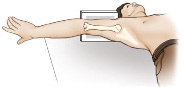
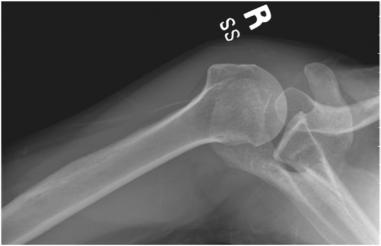
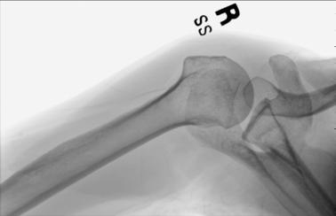
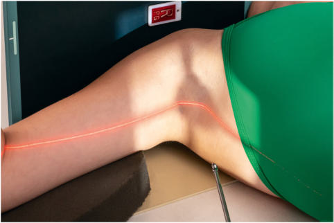

# Rx umăr (NONtraumatism acut) — incidență axială inferosuperioară (METODA LAWRENCE5)

  📷 Radiografie Convențională (Rx)
  <strong>Actualizat:</strong> 2026-09-15
  <strong>Autor:</strong> Departamentul de Radiologie / Referință Bontrager

---

-   __1. Rezumat Clinic & Indicații__

    ---

    === "Indicații Clinice"

        - Afecțiuni degenerative, inclusiv osteoporoză și artroză/modificări degenerative articulare
        - Defect Hill-Sachs cu rotație exagerată a membrului afectat

    === "Ghid Național IRIS"

        !!! info "Referință Primară: Ghidul Național IRIS (Ordinul MS 1342/2012)"
            - **Capitol Ghid IRIS:** *Aparat locomotor & Membru superior*
            - **Grad de Recomandare:** **Grad A**
            - **Nivel de Iradiere Estimată:** `Clasa 1 (Minimă < 0.05 mSv)`

            [:octicons-search-16: Deschide Ghidul IRIS](../../iris.md){ .md-button .md-button--primary } [:material-open-in-new: Aplicația Oficială PWA](https://radiologie-pediatrica.ro/iris/){ .md-button target="_blank" rel="noopener" }

-   __2. Poziționare & Centrare Fascicul__

    ---

    - **Poziție Pacient:** Pacient: poziția pacientului în decubit dorsal, cu umărul ridicat aproximativ 2 țoli (5 cm) de la masa radiologică, prin plasarea unui suport sub braț și umăr, pentru a poziționa partea corpului în apropierea centrului receptorului de imagine (Fig. 5.46).; Regiune anatomică: Se deplasează pacientul spre marginea anterioară a mesei radiologice și se plasează un cărucior sau un alt suport pentru braț împotriva marginii anterioare a mesei, pentru susținerea brațului în abducție. Se rotește capul spre partea opusă, se plasează caseta vertical pe masă, cât mai aproape posibil de gât, și se susține cu săculeți cu nisip. Se abduce brațul la 90° față de corp, dacă este posibil; se menține în rotație externă, cu palma în sus, cu suport sub braț și mână.
    - **Punct de Centrare Fascicul:** Unghiul medial trebuie, de asemenea, redus la 15° la 20°. Cu cât abducția brațului este mai mare, cu atât este mai mare unghiul razei centrale.
    - **Distanță Focar-Film (DFF / SID):** 100 cm
    - **Comandă Respiratorie:** Apnee pe durata expunerii. Poziția alternativă este rotația externă exagerată4 (Fig. 5.47). Luxația/subluxația articulară anterioară a capului humeral poate duce la compresia suprafeței articulare a capului humeral, cu suspiciune de fractură, numită defect Hill-Sachs. Această patologie este evidențiată cel mai bine prin rotație externă exagerată, în care policele este orientat în jos și posterior, la aproximativ 45°.

-   __3. Parametri Tehnici Expunere__

    ---

    | Parametru Tehnic | Valoare Configurare Generator / Tub |
    |:-----------------|:-------------------------------------|
    | **Tensiune Tub (kV)** | 70-85 kV |
    | **Sarcină / Produs Curent-Timp (mAs)** | DE CONFIGURAT PE APARAT |
    | **Distanță Focar-Film (DFF / SID)** | 100 cm |
    | **Grilă Antidifuzoare (Bucky)** | Fără grilă (expunere directă) |
    | **Dimensiune Focar** | Focar Mic (0.6 mm) |
    | **Camere de Ionizare AEC** | DE CONFIGURAT PE APARAT |
    | **Colimare Fascicul** | Dimensiunea câmpului: Se colimează strâns la aria de interes diagnostic. |
    | **Filtrare Tub** | Totală ≥ 2.5 mm Al echivalent |

-   __4. Criterii de Calitate & Reușită Imagine__

    ---

    - Incidența de profil a humerusului proximal în relație cu cavitatea scapulohumerală
    - Procesul coracoid al omoplatului (scapulei) și mica tuberozitate humerală (trohinul) a humerusului sunt vizibile în profil.
    - Spina omoplatului (scapulei) este vizibilă pe margine, sub articulația scapulohumerală (Fig. 5.48 și 5.49). Poziție:
    - brațul este vizibil în abducție la aproximativ 90° față de corp.
    - Marginile superioară și inferioară ale cavității glenoide trebuie să fie direct suprapuse, indicând un unghi corect al razei centrale.
    - Dimensiunea câmpului de colimare până la aria de interes diagnostic. Expunere:
    - Expunerea și contrastul optime ale receptorului de imagine, fără mișcare, evidențiază clar contururile osoase și traveele trabeculare fine, fără artefacte de mișcare.
    - Marginile osoase ale acromionului și claviculei distale sunt vizibile prin capul humeral. Fig. 5.46 Incidență axială inferosuperioară (metoda Lawrence). Fig. 5.47 Poziție alternativă — rotație exagerată. Fig. 5.48 Incidență axială inferosuperioară. Mica tuberozitate humerală (trohinul); colul chirurgical al humerusului; acromionul; procesul coracoid; capul humerusului; cavitatea glenoidă; spina omoplatului (scapulei). Fig. 5.49 Incidență axială inferosuperioară. Umăr (nontraumatism acut) — SPECIAL
    - Axială inferosuperioară (metoda Lawrence)

-   __5. Protecție Radiologică (ALARA)__

    ---

    - Ecranare gonadică și a organelor radiosensibile conform procedurilor locale de radioprotecție ALARA.
    - Colimare strictă la aria de interes pentru limitarea radiației difuze.
    - Verificarea posibilității unei sarcini la pacientele de vârstă fertilă înainte de expunere.

### 🖼️ Imagini

<figure class="protocol-image-card" markdown>

<figcaption><strong>Fig. 5.46 Incidență axială inferosuperioară (metoda Lawrence).</strong> — Poziționarea pacientului conform Ghidului Bontrager (Fig. 5.46 Incidență axială inferosuperioară (metoda Lawrence).)</figcaption>

</figure>

<figure class="protocol-image-card" markdown>

<figcaption><strong>Fig. 5.47 Poziție alternativă — rotație exagerată.</strong> — Aspect radiografic de referință conform Ghidului Bontrager (Fig. 5.47 Poziție alternativă—rotație accentuată.)</figcaption>

</figure>

<figure class="protocol-image-card" markdown>

<figcaption><strong>Fig. 5.48 Incidență axială inferosuperioară.</strong> — Aspect radiografic de referință conform Ghidului Bontrager (Fig. 5.48 Incidență axială inferosuperioară.)</figcaption>

</figure>

<figure class="protocol-image-card" markdown>

<figcaption><strong>Fig. 5.49 Incidență axială inferosuperioară.</strong> — Aspect radiografic de referință conform Ghidului Bontrager (Fig. 5.49 Incidență axială inferosuperioară.)</figcaption>

</figure>

=== "Ghid Rapid de Execuție"

    1. **Identificarea și verificarea pacientului:** verificare identitate, zonă de examinat, consimțământ conform procedurii și evaluarea posibilității unei sarcini, când este relevantă.
    2. **Pregătire:** îndepărtarea oricăror obiecte radiopace (bijuterii, agrafe, fermoare, proteze, pansamente dense).
    3. **Poziționare precisă:** alinierea receptorului de imagine și a tubului la distanța prescrisă (100 cm).
    4. **Colimare strictă:** adaptarea fasciculului strict la regiunea de diagnostic pentru scăderea iradierii și reducerea radiației difuze.
    5. **Radioprotecție:** verificarea [politicii RX](../radioprotectie.md), cu măsuri distincte pentru pacient, personal și însoțitor.

## Surse de documentare

- [Bontrager's Textbook of Radiographic Positioning (Ed. 9/10), Pagina 205](https://www.elsevier.com/books/textbook-of-radiographic-positioning-and-related-anatomy/lampignano/978-0-323-65367-1)
