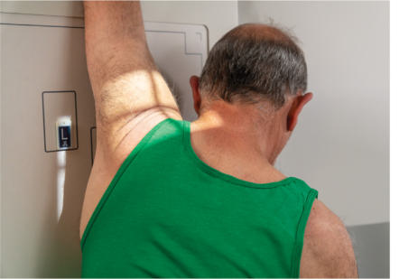
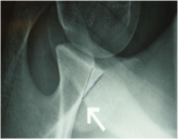
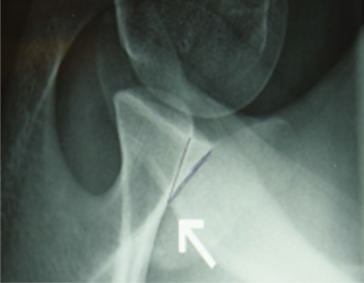

# Rx Umăr (NONtraumatism acut) PA AXIAL TRANSAXILLARY Incidență (MODIFIED BERNAGEAU METHOD)

  📷 Radiografie Convențională (Rx)
  <strong>Actualizat:</strong> 2026-09-15
  <strong>Autor:</strong> Departamentul de Radiologie / Referință Bontrager

---

-   __1. Rezumat Clinic & Indicații__

    ---

    === "Indicații Clinice"

        - suspiciune de fractură sau luxație / subluxație articulară de proximal Humerus
        - Bursitis, Umăr impingement, osteoporosis, artroză / modificări degenerative articulare, și tendonitis

    === "Ghid Național IRIS"

        !!! info "Referință Primară: Ghidul Național IRIS (Ordinul MS 1342/2012)"
            - **Capitol Ghid IRIS:** *Ghidul Național IRIS*
            - **Grad de Recomandare:** **De verificat pe indicație; fără grad atribuit automat**
            - **Nivel de Iradiere Estimată:** `De verificat pentru examinarea și populația selectate`

            [:octicons-search-16: Deschide Ghidul IRIS](../../iris.md){ .md-button .md-button--primary } [:material-open-in-new: Aplicația Oficială PWA](https://radiologie-pediatrica.ro/iris/){ .md-button target="_blank" rel="noopener" }
-   __2. Poziționare & Centrare Fascicul__

    ---

    - **Poziție Pacient:** Pacient: Take radiografie cu pacientul în Ortostatism (Fig. 5.52) sau Decubit poziție. pacientul este poziționat 70° de la PA, rotating spre partea afectată.6; Regiune anatomică: braț este raised superiorly la 160° la 180° flexion.6 capul este turned away de la brațul afectat.
    - **Punct de Centrare Fascicul:** este orientat 30° caudally și centrat la nivelul level de scapular coloană vertebrală la pass through scapulohumeral articulație.7
    - **Distanță Focar-Film (DFF / SID):** 100 cm
    - **Comandă Respiratorie:** Apnee pe durata expunerii. Umăr (Nontraumatism acut) SPECIAL PA transaxillary (modified Bernageau method) 30° Fig. 5.52 Ortostatism PA axial transaxillary incidență (modified Bernageau).

-   __3. Parametri Tehnici Expunere__

    ---

    | Parametru Tehnic | Valoare Configurare Generator / Tub |
    |:-----------------|:-------------------------------------|
    | **Tensiune Tub (kV)** | 70-85 kV |
    | **Sarcină / Produs Curent-Timp (mAs)** | DE CONFIGURAT PE APARAT |
    | **Distanță Focar-Film (DFF / SID)** | 100 cm |
    | **Grilă Antidifuzoare (Bucky)** | Fără grilă (expunere directă) |
    | **Dimensiune Focar** | Focar Mic (0.6 mm) |
    | **Camere de Ionizare AEC** | DE CONFIGURAT PE APARAT |
    | **Colimare Fascicul** | Field Size Collimate closely la aria de interes diagnostic. |
    | **Filtrare Tub** | Totală ≥ 2.5 mm Al echivalent |

-   __4. Criterii de Calitate & Reușită Imagine__

    ---

    - lateral incidență de proximal Humerus în relationship la scapulohumeral (glenohumeral) articulation este visualized.
    - proces coracoid de Omoplat (Scapulă) este seen pe end (Figs. 5.53 și 5.54). poziție:
    - braț este seen la fie raised superiorly above corp.
    - Collimation field size la aria de interes diagnostic. expunere:
    - optim receptorul de imagine expunere și contrast cu fără mișcare evidențiază clear, Contururi osoase și travee trabeculare nete, fără artefacte de mișcare și pertinent părți moi anatomy.
    - Bony margins de acromion și proces coracoid sunt vizibil through cap humeral. Fig. 5.53 PA axial transaxillary incidență (modified Bernageau). (de la Pansard E, Klouche S, Billot N, et al. Reliability și validity assessment de glenoid bone loss measurement using Bernageau profile incidență în chronic anterior Umăr instability. J Umăr Cot Surg 22(9):1193–1198, 2013.) cap humeral cavitate glenoidă Scapular coloană vertebrală distal Claviculă Neck de Omoplat (Scapulă) Fig. 5.54 PA axial transaxillary incidență (modified Bernageau). (de la Pansard E, et al. Reliability și validity assessment de glenoid bone loss measurement using Bernageau profile incidență în chronic anterior Umăr instability. J Umăr Cot Surg. 22[9]:1193–1198, 2013.)

-   __5. Protecție Radiologică (ALARA)__

    ---

    - Ecranare gonadică și a organelor radiosensibile conform procedurilor locale de radioprotecție ALARA.
    - Colimare strictă la aria de interes pentru limitarea radiației difuze.
    - Verificarea posibilității unei sarcini la pacientele de vârstă fertilă înainte de expunere.

### 🖼️ Imagini

<figure class="protocol-image-card" markdown>

<figcaption><strong>Fig. 5.52 Ortostatism PA axial transaxillary incidență (modified Bernageau).</strong> — Poziționare pacient conform Ghidului Bontrager (Fig. 5.52 în ortostatism PA axial transaxillary incidență (modified Bernageau).)</figcaption>

</figure>

<figure class="protocol-image-card" markdown>

<figcaption><strong>Fig. 5.53 PA axial transaxillary incidență (modified Bernageau).</strong> — Aspect radiografic de referință conform Ghidului Bontrager (Fig. 5.53 PA axial transaxillary incidență (modified Bernageau).)</figcaption>

</figure>

<figure class="protocol-image-card" markdown>

<figcaption><strong>Fig. 5.54 PA axial transaxillary incidență (modified Bernageau).</strong> — Aspect radiografic de referință conform Ghidului Bontrager (Fig. 5.54 PA axial transaxillary incidență (modified Bernageau).)</figcaption>

</figure>

=== "Ghid Rapid de Execuție"

    1. **Identificarea și verificarea pacientului:** verificare identitate, zonă de examinat, consimțământ conform procedurii și evaluarea posibilității unei sarcini, când este relevantă.
    2. **Pregătire:** îndepărtarea oricăror obiecte radiopace (bijuterii, agrafe, fermoare, proteze, pansamente dense).
    3. **Poziționare precisă:** alinierea receptorului de imagine și a tubului la distanța prescrisă (100 cm).
    4. **Colimare strictă:** adaptarea fasciculului strict la regiunea de diagnostic pentru scăderea iradierii și reducerea radiației difuze.
    5. **Radioprotecție:** verificarea [politicii RX](../radioprotectie.md), cu măsuri distincte pentru pacient, personal și însoțitor.

## Surse de documentare

- [Bontrager's Textbook of Radiographic Positioning (Ed. 9/10), Pagina 207](https://www.elsevier.com/books/textbook-of-radiographic-positioning-and-related-anatomy/lampignano/978-0-323-65367-1)
