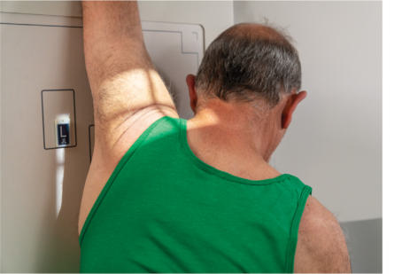
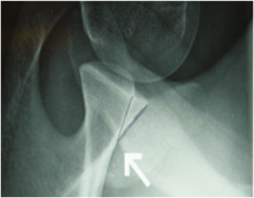
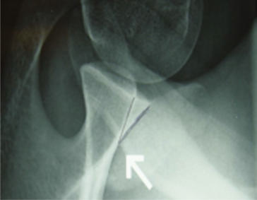

# Rx Umăr (Nontraumatism acut) Incidență PA axială transaxilară (METODA BERNAGEAU MODIFICATĂ)

  📷 Radiografie Convențională (Rx)
  <strong>Actualizat:</strong> 2026-09-15
  <strong>Autor:</strong> Departamentul de Radiologie / Referință Bontrager

---

-   __1. Rezumat Clinic & Indicații__

    ---

    === "Indicații Clinice"

        - Suspiciune de fractură sau luxație / subluxație articulară a humerusului proximal
        - Bursită, sindrom de impingement al umărului, osteoporoză, artroză/modificări degenerative articulare și tendinită

    === "Ghid Național IRIS"

        !!! info "Referință Primară: Ghidul Național IRIS (Ordinul MS 1342/2012)"
            - **Capitol Ghid IRIS:** *Aparat locomotor & Membru superior*
            - **Grad de Recomandare:** **Grad A**
            - **Nivel de Iradiere Estimată:** `Clasa 1 (Minimă < 0.05 mSv)`

            [:octicons-search-16: Deschide Ghidul IRIS](../../iris.md){ .md-button .md-button--primary } [:material-open-in-new: Aplicația Oficială PWA](https://radiologie-pediatrica.ro/iris/){ .md-button target="_blank" rel="noopener" }

-   __2. Poziționare & Centrare Fascicul__

    ---

    - **Poziție Pacient:** Pacient: Se efectuează radiografia cu pacientul în ortostatism (Fig. 5.52) sau în decubit. Pacientul este poziționat la 70° față de PA, rotit spre partea afectată.6; Regiune anatomică: Brațul este ridicat superior, la 160° până la 180° de flexie.6 Capul este întors în partea opusă brațului afectat.
    - **Punct de Centrare Fascicul:** Este orientată la 30° caudal și centrată la nivelul coloanei vertebrale a scapulei, trecând prin articulația scapulohumerală.7
    - **Distanță Focar-Film (DFF / SID):** 100 cm
    - **Comandă Respiratorie:** Apnee pe durata expunerii. Umăr (Nontraumatism acut) SPECIAL PA axială transaxilară (metoda Bernageau modificată) 30° Fig. 5.52 Incidență PA axială transaxilară în ortostatism (Bernageau modificată).

-   __3. Parametri Tehnici Expunere__

    ---

    | Parametru Tehnic | Valoare Configurare Generator / Tub |
    |:-----------------|:-------------------------------------|
    | **Tensiune Tub (kV)** | 70-85 kV |
    | **Sarcină / Produs Curent-Timp (mAs)** | DE CONFIGURAT PE APARAT |
    | **Distanță Focar-Film (DFF / SID)** | 100 cm |
    | **Grilă Antidifuzoare (Bucky)** | Fără grilă (expunere directă) |
    | **Dimensiune Focar** | Focar Mic (0.6 mm) |
    | **Camere de Ionizare AEC** | DE CONFIGURAT PE APARAT |
    | **Colimare Fascicul** | Dimensiunea câmpului: Se colimează strâns la aria de interes diagnostic. |
    | **Filtrare Tub** | Totală ≥ 2.5 mm Al echivalent |

-   __4. Criterii de Calitate & Reușită Imagine__

    ---

    - Incidența de profil a humerusului proximal în raport cu articulația scapulohumerală (glenohumerală) este vizualizată.
    - Procesul coracoid al omoplatului (scapulei) este vizualizat de profil (Figs. 5.53 și 5.54). Poziție:
    - Brațul este vizualizat ridicat superior, deasupra corpului.
    - Dimensiunea câmpului de colimare până la aria de interes diagnostic. Expunere:
    - Expunerea și contrastul optime ale receptorului de imagine, fără mișcare, evidențiază clar contururile osoase și traveele trabeculare fine, fără artefacte de mișcare, precum și anatomia relevantă a părților moi.
    - Marginile osoase ale acromionului și procesului coracoid sunt vizibile prin capul humeral. Fig. 5.53 Incidență PA axială transaxilară (Bernageau modificată). (După Pansard E, Klouche S, Billot N, et al. Evaluarea fiabilității și validității măsurării pierderii osoase glenoidiene utilizând incidența de profil Bernageau în instabilitatea anterioară cronică a umărului. J Umăr Cot Surg 22(9):1193–1198, 2013.) Cap humeral Cavitate glenoidă Coloană vertebrală a scapulei Distal Claviculă Colul omoplatului (scapulei) Fig. 5.54 Incidență PA axială transaxilară (Bernageau modificată). (După Pansard E, et al. Evaluarea fiabilității și validității măsurării pierderii osoase glenoidiene utilizând incidența de profil Bernageau în instabilitatea anterioară cronică a umărului. J Umăr Cot Surg. 22[9]:1193–1198, 2013.)

-   __5. Protecție Radiologică (ALARA)__

    ---

    - Ecranare gonadică și a organelor radiosensibile conform procedurilor locale de radioprotecție ALARA.
    - Colimare strictă la aria de interes pentru limitarea radiației difuze.
    - Verificarea posibilității unei sarcini la pacientele de vârstă fertilă înainte de expunere.

### 🖼️ Imagini

<figure class="protocol-image-card" markdown>

<figcaption><strong>Fig. 5.52 Incidență PA axială transaxilară în ortostatism (Bernageau modificată).</strong> — Poziționarea pacientului conform Ghidului Bontrager (Fig. 5.52 în ortostatism, incidență PA axială transaxilară (Bernageau modificată).)</figcaption>

</figure>

<figure class="protocol-image-card" markdown>

<figcaption><strong>Fig. 5.53 Incidență PA axială transaxilară (Bernageau modificată).</strong> — Aspect radiografic de referință conform Ghidului Bontrager (Fig. 5.53 Incidență PA axială transaxilară (Bernageau modificată).)</figcaption>

</figure>

<figure class="protocol-image-card" markdown>

<figcaption><strong>Fig. 5.54 Incidență PA axială transaxilară (Bernageau modificată).</strong> — Aspect radiografic de referință conform Ghidului Bontrager (Fig. 5.54 Incidență PA axială transaxilară (Bernageau modificată).)</figcaption>

</figure>

=== "Ghid Rapid de Execuție"

    1. **Identificarea și verificarea pacientului:** verificare identitate, zonă de examinat, consimțământ conform procedurii și evaluarea posibilității unei sarcini, când este relevantă.
    2. **Pregătire:** îndepărtarea oricăror obiecte radiopace (bijuterii, agrafe, fermoare, proteze, pansamente dense).
    3. **Poziționare precisă:** alinierea receptorului de imagine și a tubului la distanța prescrisă (100 cm).
    4. **Colimare strictă:** adaptarea fasciculului strict la regiunea de diagnostic pentru scăderea iradierii și reducerea radiației difuze.
    5. **Radioprotecție:** verificarea [politicii RX](../radioprotectie.md), cu măsuri distincte pentru pacient, personal și însoțitor.

## Surse de documentare

- [Bontrager's Textbook of Radiographic Positioning (Ed. 9/10), Pagina 207](https://www.elsevier.com/books/textbook-of-radiographic-positioning-and-related-anatomy/lampignano/978-0-323-65367-1)
