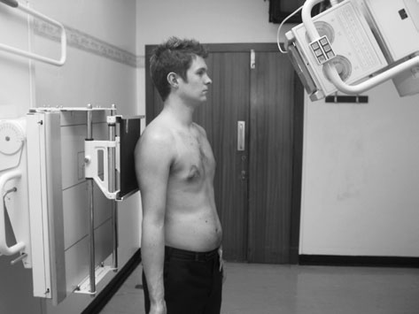
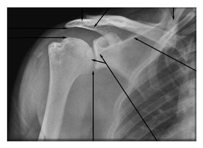
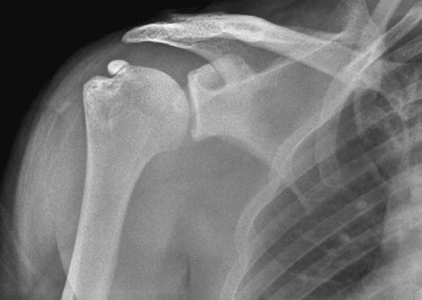
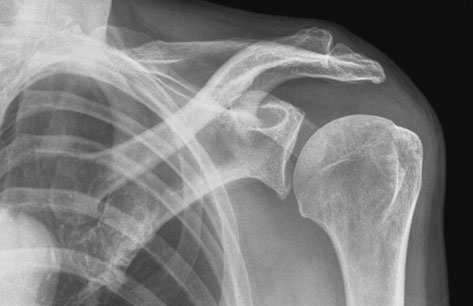

# Rx Umăr - Outlet Antero-Posterior (AP) (Incidență Outlet (Subacromială Neer))

  📷 Radiografie Convențională (Rx)
  <strong>Actualizat:</strong> 2026-09-16
  <strong>Autor:</strong> Departamentul de Radiologie / Referință Clark (Ed. 12)

---

-   __1. Rezumat Clinic & Indicații__

    ---

    === "Indicații Clinice"

        - 83 3 Incidență Outlet (Subacromială Neer) în cases de suspected Umăr impingement syndrome, it este important la visualize anterior portion de acromion. Routine incidențe described above sunt frequently unsatisfactory because anterior portion de acromion este superimposed pe corp de acromion. If Antero-posterior (AP) incidență este undertaken cu X-ray fascicul înclinat 30 grade caudally, anterior part de acromion este projected inferiorly la corp de acromion și este visualized more clearly. modified Profil (lateral) incidență (outlet incidență) cu 10-grade caudal angulation poate also fie undertaken. Antero-posterior (AP) (Incidență Outlet (Subacromială Neer))

    === "Ghid Național IRIS"

        !!! info "Referință Primară: Ghidul Național IRIS (Ordinul MS 1342/2012)"
            - **Capitol Ghid IRIS:** *Ghidul Național IRIS*
            - **Grad de Recomandare:** **De verificat pe indicație; fără grad atribuit automat**
            - **Nivel de Iradiere Estimată:** `De verificat pentru examinarea și populația selectate`

            [:octicons-search-16: Deschide Ghidul IRIS](../../iris.md){ .md-button .md-button--primary } [:material-open-in-new: Aplicația Oficială PWA](https://radiologie-pediatrica.ro/iris/){ .md-button target="_blank" rel="noopener" }
-   __2. Poziționare & Centrare Fascicul__

    ---

    - **Poziție Pacient:** pentru Antero-posterior (AP) survey imagine)
• pacientul stă în ortostatism cu affected Umăr against casetă și este rotit 15 grade la bring plane de Omoplat (Scapulă) paralel cu casetă.
• braț este în supinație și slightly în abducție away de la corp. medial și Profil (lateral) epicondyles de distal Humerus trebuie să fie paralel cu casetă.
• caseta este poziționat so that its upper margine este la least 5 cm above Umăr la ensure that Oblică rays do nu project Umăr off caseta.
    - **Punct de Centrare Fascicul:** • raza centrală orizontală centrală este orientat 30 grade caudally și centred la palpable Proces Coracoid de Omoplat (Scapulă).
• An 18  24-cm casetă este used cu fascicul collimated la glenohumeral articulație.
    - **Distanță Focar-Film (DFF / SID):** 100 cm
    - **Comandă Respiratorie:** Apnee pe durata expunerii (apnee în inspir pentru torace; expir pentru Abdomen/bazin).

-   __3. Parametri Tehnici Expunere__

    ---

    | Parametru Tehnic | Valoare Configurare Generator / Tub |
    |:-----------------|:-------------------------------------|
    | **Tensiune Tub (kV)** | DE CONFIGURAT PE APARAT |
    | **Sarcină / Produs Curent-Timp (mAs)** | Conform AEC / grosime anatomică |
    | **Distanță Focar-Film (DFF / SID)** | 100 cm |
    | **Grilă Antidifuzoare (Bucky)** | Conform grosimii anatomice (> 10-12 cm cu grilă) |
    | **Dimensiune Focar** | Focar Mic (0.6 mm) |
    | **Camere de Ionizare AEC** | DE CONFIGURAT PE APARAT |
    | **Colimare Fascicul** | Colimare strictă adaptată pe receptor 18 x 24 cm |
    | **Filtrare Tub** | Totală ≥ 2.5 mm Al echivalent (conform Clark: 3.0 mm Al eq.) |

-   __4. Criterii de Calitate & Reușită Imagine__

    ---

    - imagine trebuie să evidențiază anterior part de acromion projected inferiorly la corp la visualize presence de bony spurs sau abnormally long acromion.
    - subacromial spații articulare trebuie să fie vizualizat above cap humeral. Undersurface de acromion superior surface de Humerus Proces Coracoid Glenohumeral articulație coloană vertebrală de Omoplat (Scapulă) inferior surface de Claviculă medial margine de Omoplat (Scapulă) A-C articulație Antero-posterior (AP) radiografie de Umăr outlet evidențiind normal undersurface de acromion (incidental calcificări patologice de supraspinatus tendon) Antero-posterior (AP) incidență de Umăr evidențiind bony spur pe Profil (lateral) undersurface de acromion

-   __5. Protecție Radiologică (ALARA)__

    ---

    - Ecranare gonadică cu șorț plumbat dacă gonadele sunt în apropierea fasciculului util (regula ALARA).
    - Colimare precisă la dimensiunea anatomică strict necesară pentru reducerea dozei și a radiației difuze.
    - Verificarea posibilității unei sarcini la pacientele de vârstă fertilă înainte de expunere.

!!! note "Observații Clinice & Tehnice"
    Pregătirea pacientului prin îndepărtarea tuturor accesoriilor radio-opace.

### 🖼️ Imagini

<figure class="protocol-image-card" markdown>

<figcaption><strong>ence de bony spurs sau abnormally long acromion.</strong> — Poziționare pacient și centrare fascicul conform Clark (Ed. 12)</figcaption>

</figure>

<figure class="protocol-image-card" markdown>

<figcaption><strong>• subacromial spații articulare trebuie să fie vizualizat above the</strong> — Aspect radiografic / ghid de poziționare conform tratatului Clark (Ed. 12)</figcaption>

</figure>

<figure class="protocol-image-card" markdown>

<figcaption><strong>Antero-posterior (AP) radiografie de Umăr outlet evidențiind normal undersurface</strong> — Aspect radiografic / ghid de poziționare conform tratatului Clark (Ed. 12)</figcaption>

</figure>

<figure class="protocol-image-card" markdown>

<figcaption><strong>de acromion (incidental calcificări patologice de supraspinatus tendon)</strong> — Aspect radiografic / ghid de poziționare conform tratatului Clark (Ed. 12)</figcaption>

</figure>

=== "Ghid Rapid de Execuție"

    1. **Identificarea și verificarea pacientului:** verificare identitate, zonă de examinat, consimțământ conform procedurii și evaluarea posibilității unei sarcini, când este relevantă.
    2. **Pregătire:** îndepărtarea oricăror obiecte radiopace (bijuterii, agrafe, fermoare, proteze, pansamente dense).
    3. **Poziționare precisă:** alinierea receptorului de imagine și a tubului la distanța prescrisă (100 cm).
    4. **Colimare strictă:** adaptarea fasciculului strict la regiunea de diagnostic pentru scăderea iradierii și reducerea radiației difuze.
    5. **Radioprotecție:** verificarea [politicii RX](../radioprotectie.md), cu măsuri distincte pentru pacient, personal și însoțitor.

## Surse de documentare

- [Clark's Positioning in Radiography (Ed. 12), Pagina 98](../../assets/protocols/sources/Clark___Positioning_in_Radiography__12th_edition.pdf#page=98)
