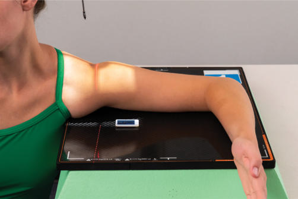
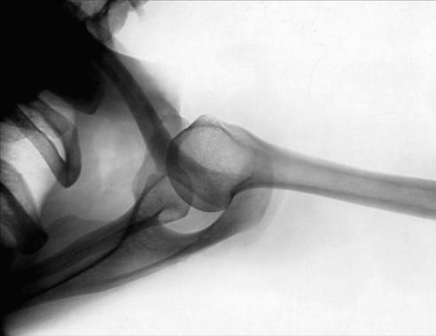
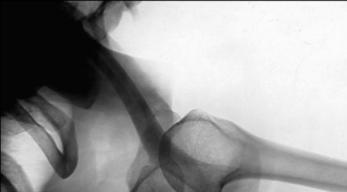
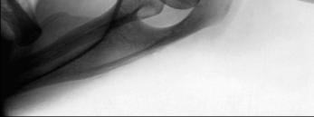

# Rx Umăr SUPEROINFERIOR TRANSAXILLARY PROJECTION ((NONtraumatism acut)8)

  📷 Radiografie Convențională (Rx)
  <strong>Actualizat:</strong> 2026-09-15
  <strong>Autor:</strong> Departamentul de Radiologie / Referință Bontrager

---

-   __1. Rezumat Clinic & Indicații__

    ---

    === "Indicații Clinice"

        - suspiciune de fractură or luxație / subluxație articulară of the proximal Humerus
        - Bursitis, Umăr impingement, osteoporosis, artroză / modificări degenerative articulare, and tendonitis

    === "Ghid Național IRIS"

        !!! info "Referință Primară: Ghidul Național IRIS (Ordinul MS 1342/2012)"
            - **Capitol Ghid IRIS:** *Ghidul Național IRIS*
            - **Grad de Recomandare:** **De verificat pe indicație; fără grad atribuit automat**
            - **Nivel de Iradiere Estimată:** `De verificat pentru examinarea și populația selectate`

            [:octicons-search-16: Deschide Ghidul IRIS](../../iris.md){ .md-button .md-button--primary } [:material-open-in-new: Aplicația Oficială PWA](https://radiologie-pediatrica.ro/iris/){ .md-button target="_blank" rel="noopener" }
-   __2. Poziționare & Centrare Fascicul__

    ---

    - **Poziție Pacient:** Pacient: Take the radiograph with the patient sitting at the end of the table, affected side toward the table and the patient leaning laterally over the table (Fig. 5.55). Ensure the spine is straight and the patient does not lean forwards or backwards.; Regiune anatomică: The Cot is flexed to 90° and the palm of the Mână pronated. The patient leans laterally over the IR, abducting their Humerus much as possible. A sponge can be used to rotate the glenoid cavity away from the Torace wall and into a more vertical position. Tilt the patient’s head away from the affected Umăr.
    - **Punct de Centrare Fascicul:** is directed perpendicular to the glenoid fossa, which is perpendicular to the line between the AC joint and the superior angle of the Omoplat (Scapulă), approximately 5–15° toward the Cot
    - **Distanță Focar-Film (DFF / SID):** 100 cm
    - **Comandă Respiratorie:** Suspend respiration during exposure. Fig. 5.55 Superoinferior transaxillary.

-   __3. Parametri Tehnici Expunere__

    ---

    | Parametru Tehnic | Valoare Configurare Generator / Tub |
    |:-----------------|:-------------------------------------|
    | **Tensiune Tub (kV)** | 70-85 kV |
    | **Sarcină / Produs Curent-Timp (mAs)** | DE CONFIGURAT PE APARAT |
    | **Distanță Focar-Film (DFF / SID)** | 100 cm |
    | **Grilă Antidifuzoare (Bucky)** | Fără grilă (expunere directă) |
    | **Dimensiune Focar** | Focar Mic (0.6 mm) |
    | **Camere de Ionizare AEC** | DE CONFIGURAT PE APARAT |
    | **Colimare Fascicul** | Field Size Collimate closely to area of interest. |
    | **Filtrare Tub** | Totală ≥ 2.5 mm Al echivalent |

-   __4. Criterii de Calitate & Reușită Imagine__

    ---

    - Lateral view of proximal Humerus in relationship to scapulohumeral (glenohumeral) articulation is visualized.
    - Coracoid process of Omoplat (Scapulă) is seen on end (Figs. 5.56 and 5.57). Position:
    - Arm is abducted from the body.
    - Relationship of the humeral head and glenoid cavity should be evident.
    - Collimation field size to area of interest. Exposure:
    - Optimal image receptor exposure and contrast with no motion demonstrate clear, Contururi osoase și travee trabeculare nete, fără artefacte de mișcare and pertinent soft tissue anatomy.
    - Bony margins of the acromion and coracoid process are visible through the humeral head. Umăr (Nontraumatism acut) SPECIAL
    - Superoinferior transaxillary L Fig. 5.56 Superoinferior transaxillary. Lesser tubercle Humerus Coracoid process Claviculă Acromion L Fig. 5.57 Superoinferior transaxillary.

-   __5. Protecție Radiologică (ALARA)__

    ---

    - Ecranare gonadică și a organelor radiosensibile conform procedurilor locale de radioprotecție ALARA.
    - Colimare strictă la aria de interes pentru limitarea radiației difuze.
    - Verificarea posibilității unei sarcini la pacientele de vârstă fertilă înainte de expunere.

### 🖼️ Imagini

<figure class="protocol-image-card" markdown>

<figcaption><strong>Fig. 5.55 Superoinferior transaxillary.</strong> — Poziționare pacient conform Ghidului Bontrager (Fig. 5.55 Superoinferior transaxillary.)</figcaption>

</figure>

<figure class="protocol-image-card" markdown>

<figcaption><strong>Fig. 5.56 Superoinferior transaxillary.</strong> — Aspect radiografic de referință conform Ghidului Bontrager (Fig. 5.56 Superoinferior transaxillary.)</figcaption>

</figure>

<figure class="protocol-image-card" markdown>

<figcaption><strong>Fig. 5.57 Superoinferior transaxillary.</strong> — Aspect radiografic de referință conform Ghidului Bontrager (Fig. 5.57 Superoinferior transaxillary.)</figcaption>

</figure>

<figure class="protocol-image-card" markdown>

<figcaption><strong>Figura 4</strong> — Aspect radiografic de referință conform Ghidului Bontrager (Figura 4)</figcaption>

</figure>

=== "Ghid Rapid de Execuție"

    1. **Identificarea și verificarea pacientului:** verificare identitate, zonă de examinat, consimțământ conform procedurii și evaluarea posibilității unei sarcini, când este relevantă.
    2. **Pregătire:** îndepărtarea oricăror obiecte radiopace (bijuterii, agrafe, fermoare, proteze, pansamente dense).
    3. **Poziționare precisă:** alinierea receptorului de imagine și a tubului la distanța prescrisă (100 cm).
    4. **Colimare strictă:** adaptarea fasciculului strict la regiunea de diagnostic pentru scăderea iradierii și reducerea radiației difuze.
    5. **Radioprotecție:** verificarea [politicii RX](../radioprotectie.md), cu măsuri distincte pentru pacient, personal și însoțitor.

## Surse de documentare

- [Bontrager's Textbook of Radiographic Positioning (Ed. 9/10), Pagina 208](https://www.elsevier.com/books/textbook-of-radiographic-positioning-and-related-anatomy/lampignano/978-0-323-65367-1)
