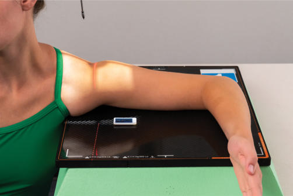
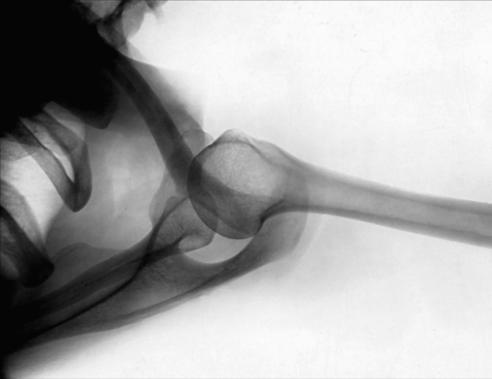
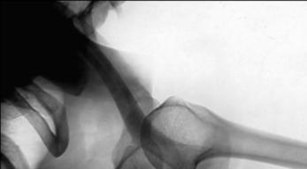
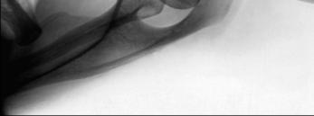

# Rx Umăr Incidență transaxilară superoinferioară ((Nontraumatism acut)8)

  📷 Radiografie Convențională (Rx)
  <strong>Actualizat:</strong> 2026-09-15
  <strong>Autor:</strong> Departamentul de Radiologie / Referință Bontrager

---

-   __1. Rezumat Clinic & Indicații__

    ---

    === "Indicații Clinice"

        - Suspiciune de fractură sau luxație / subluxație articulară a humerusului proximal
        - Bursită, sindrom de impingement al umărului, osteoporoză, artroză/modificări degenerative articulare și tendinită

    === "Ghid Național IRIS"

        !!! info "Referință Primară: Ghidul Național IRIS (Ordinul MS 1342/2012)"
            - **Capitol Ghid IRIS:** *Aparat locomotor & Membru superior*
            - **Grad de Recomandare:** **Grad A**
            - **Nivel de Iradiere Estimată:** `Clasa 1 (Minimă < 0.05 mSv)`

            [:octicons-search-16: Deschide Ghidul IRIS](../../iris.md){ .md-button .md-button--primary } [:material-open-in-new: Aplicația Oficială PWA](https://radiologie-pediatrica.ro/iris/){ .md-button target="_blank" rel="noopener" }

-   __2. Poziționare & Centrare Fascicul__

    ---

    - **Poziție Pacient:** Pacient: Se efectuează radiografia cu pacientul așezat la capătul mesei de examinare, cu partea afectată spre masă, iar pacientul se înclină lateral peste masă (Fig. 5.55). Se asigură că coloana vertebrală este dreaptă și că pacientul nu se înclină anterior sau posterior.; Regiune anatomică: Cotul este flectat la 90°, iar palma mâinii este în pronație. Pacientul se înclină lateral peste receptorul de imagine, abductând humerusul cât mai mult posibil. Se poate utiliza un burete pentru a roti cavitatea glenoidă în sens opus peretelui toracic și a o aduce într-o poziție mai verticală. Se înclină capul pacientului în partea opusă umărului afectat.
    - **Punct de Centrare Fascicul:** Este orientată perpendicular pe cavitatea glenoidă, care este perpendiculară pe linia dintre articulațiile acromioclaviculare și unghiul superior al omoplatului (scapulei), la aproximativ 5–15° spre cot.
    - **Distanță Focar-Film (DFF / SID):** 100 cm
    - **Comandă Respiratorie:** Apnee pe durata expunerii. Fig. 5.55 Incidență transaxilară superoinferioară.

-   __3. Parametri Tehnici Expunere__

    ---

    | Parametru Tehnic | Valoare Configurare Generator / Tub |
    |:-----------------|:-------------------------------------|
    | **Tensiune Tub (kV)** | 70-85 kV |
    | **Sarcină / Produs Curent-Timp (mAs)** | DE CONFIGURAT PE APARAT |
    | **Distanță Focar-Film (DFF / SID)** | 100 cm |
    | **Grilă Antidifuzoare (Bucky)** | Fără grilă (expunere directă) |
    | **Dimensiune Focar** | Focar Mic (0.6 mm) |
    | **Camere de Ionizare AEC** | DE CONFIGURAT PE APARAT |
    | **Colimare Fascicul** | Dimensiunea câmpului: Se colimează strâns la aria de interes diagnostic. |
    | **Filtrare Tub** | Totală ≥ 2.5 mm Al echivalent |

-   __4. Criterii de Calitate & Reușită Imagine__

    ---

    - Incidența de profil a humerusului proximal în raport cu articulația scapulohumerală (glenohumerală) este vizualizată.
    - Procesul coracoid al omoplatului (scapulei) este vizualizat de profil (Figs. 5.56 și 5.57). Poziție:
    - Brațul este în abducție față de corp.
    - Raportul dintre capul humeral și cavitatea glenoidă trebuie să fie evident.
    - Dimensiunea câmpului de colimare până la aria de interes diagnostic. Expunere:
    - Expunerea și contrastul optime ale receptorului de imagine, fără mișcare, evidențiază clar contururile osoase și traveele trabeculare fine, fără artefacte de mișcare, precum și anatomia relevantă a părților moi.
    - Marginile osoase ale acromionului și procesului coracoid sunt vizibile prin capul humeral. Umăr (Nontraumatism acut) SPECIAL
    - Transaxilară superoinferioară L Fig. 5.56 Incidență transaxilară superoinferioară. Mică tuberozitate humerală (trohin) Humerus Proces coracoid Claviculă Acromion L Fig. 5.57 Incidență transaxilară superoinferioară.

-   __5. Protecție Radiologică (ALARA)__

    ---

    - Ecranare gonadică și a organelor radiosensibile conform procedurilor locale de radioprotecție ALARA.
    - Colimare strictă la aria de interes pentru limitarea radiației difuze.
    - Verificarea posibilității unei sarcini la pacientele de vârstă fertilă înainte de expunere.

### 🖼️ Imagini

<figure class="protocol-image-card" markdown>

<figcaption><strong>Fig. 5.55 Incidență transaxilară superoinferioară.</strong> — Poziționarea pacientului conform Ghidului Bontrager (Fig. 5.55 Incidență transaxilară superoinferioară.)</figcaption>

</figure>

<figure class="protocol-image-card" markdown>

<figcaption><strong>Fig. 5.56 Incidență transaxilară superoinferioară.</strong> — Aspect radiografic de referință conform Ghidului Bontrager (Fig. 5.56 Incidență transaxilară superoinferioară.)</figcaption>

</figure>

<figure class="protocol-image-card" markdown>

<figcaption><strong>Fig. 5.57 Incidență transaxilară superoinferioară.</strong> — Aspect radiografic de referință conform Ghidului Bontrager (Fig. 5.57 Incidență transaxilară superoinferioară.)</figcaption>

</figure>

<figure class="protocol-image-card" markdown>

<figcaption><strong>Figura 4</strong> — Aspect radiografic de referință conform Ghidului Bontrager (Figura 4)</figcaption>

</figure>

=== "Ghid Rapid de Execuție"

    1. **Identificarea și verificarea pacientului:** verificare identitate, zonă de examinat, consimțământ conform procedurii și evaluarea posibilității unei sarcini, când este relevantă.
    2. **Pregătire:** îndepărtarea oricăror obiecte radiopace (bijuterii, agrafe, fermoare, proteze, pansamente dense).
    3. **Poziționare precisă:** alinierea receptorului de imagine și a tubului la distanța prescrisă (100 cm).
    4. **Colimare strictă:** adaptarea fasciculului strict la regiunea de diagnostic pentru scăderea iradierii și reducerea radiației difuze.
    5. **Radioprotecție:** verificarea [politicii RX](../radioprotectie.md), cu măsuri distincte pentru pacient, personal și însoțitor.

## Surse de documentare

- [Bontrager's Textbook of Radiographic Positioning (Ed. 9/10), Pagina 208](https://www.elsevier.com/books/textbook-of-radiographic-positioning-and-related-anatomy/lampignano/978-0-323-65367-1)
