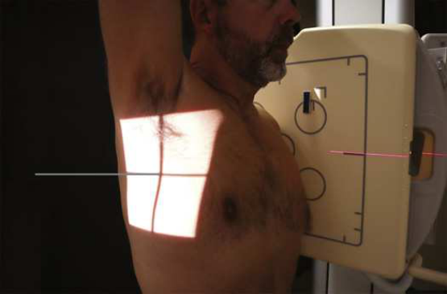
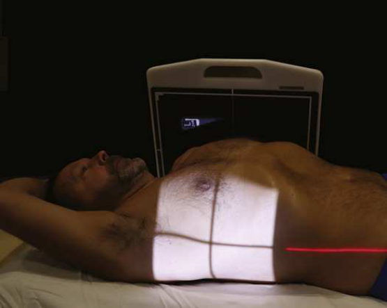
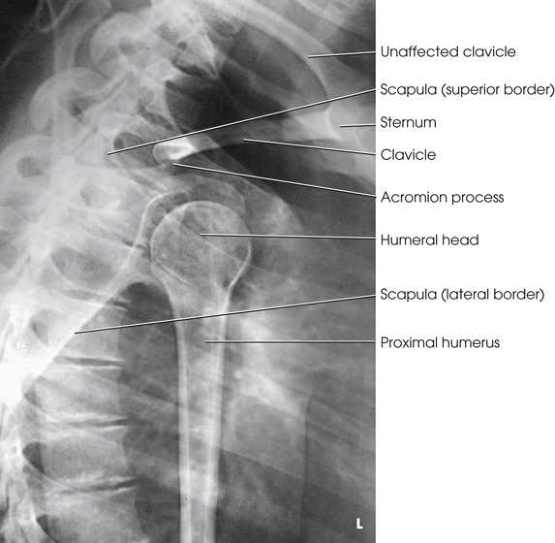

# Rx Umăr — Transthoracic Incidență de Profil (Lateral) — Metoda Lawrence Profil (Drept sau Stâng) (Merrill)

  📷 Radiografie Convențională (Rx)
  <strong>Actualizat:</strong> 2026-09-16
  <strong>Autor:</strong> Referință Merrill

---

-   __1. Rezumat Clinic & Indicații__

    ---

    === "Indicații Clinice"

        - Conform reperelor anatomice standard din tratat

    === "Ghid Național IRIS"

        !!! info "Referință Primară: Ghidul Național IRIS (Ordinul MS 1342/2012)"
            - **Capitol Ghid IRIS:** *Ghidul Național IRIS*
            - **Grad de Recomandare:** **De verificat pe indicație; fără grad atribuit automat**
            - **Nivel de Iradiere Estimată:** `De verificat pentru examinarea și populația selectate`

            [:octicons-search-16: Deschide Ghidul IRIS](../../iris.md){ .md-button .md-button--primary } [:material-open-in-new: Aplicația Oficială PWA](https://radiologie-pediatrica.ro/iris/){ .md-button target="_blank" rel="noopener" }
-   __2. Poziționare & Centrare Fascicul__

    ---

    - **Poziție Pacient:** Although this incidență poate fie carried out cu pacientul în ortostatism sau Decubit dorsal poziție. ortostatism poate fie less painful pentru Traumatism / Regim Urgență pacient, și it also allows easier adjustment de Umăr. pentru în ortostatism positioning, seat sau stand pacientul în Incidență de Profil (lateral) before stativ vertical Bucky (Fig. 6.23). If ortostatism este impossible, se așază pacientul în Incidență Decubit dorsal pe masa de examinare cu radiolucent pads elevating capul și umeri (Fig. 6.24).; Se instruiește pacientul să raise noninjured braț, rest Antebraț pe capul, și elevate Umăr ca much ca possible (see Fig. 6.23). Elevation de noninjured Umăr drops injured side, separating umerii la prevent superimposition. Ensure that planul mediocoronal este perpendicular pe receptorul de imagine (RI). fără attempt trebuie să fie made la rotate sau otherwise la move injured braț. se centrează receptorul de imagine la surgical neck area de afected Humerus. se efectuează ecranarea gonadelor cu șorț plumbat.
    - **Punct de Centrare Fascicul:** perpendicular pe receptorul de imagine (RI), entering planul mediocoronal la nivelul surgical neck If pacientul cannot elevate unafected Umăr, angle raza centrală 10 la 15 grade cranial la obtain comparable radiografie.
    - **Distanță Focar-Film (DFF / SID):** Nespecificat în fragmentul extras; de verificat în sursă
    - **Comandă Respiratorie:** Inspir profund complet. Having plămânii full de air improves contrast și decreases expunere necessary la penetrate corp. If pacientul poate fie suficiently imobilizat la prevent voluntary mișcare, Tehnică de estompare prin respirație superficială (respirație technique) poate fie used la blur pulmonary vasculature. în this case, Se instruiește pacientul să practice slow, deep respirație. minimum expunere time de 3 seconds (4 la 5 seconds este desirable) gives excellent results when low milliamperage este used.

-   __3. Parametri Tehnici Expunere__

    ---

    | Parametru Tehnic | Valoare Configurare Generator / Tub |
    |:-----------------|:-------------------------------------|
    | **Tensiune Tub (kV)** | DE CONFIGURAT PE APARAT |
    | **Sarcină / Produs Curent-Timp (mAs)** | DE CONFIGURAT PE APARAT |
    | **Distanță Focar-Film (DFF / SID)** | Nespecificat în fragmentul extras; de verificat în sursă |
    | **Grilă Antidifuzoare (Bucky)** | DE CONFIGURAT PE APARAT |
    | **Dimensiune Focar** | DE CONFIGURAT PE APARAT |
    | **Camere de Ionizare AEC** | DE CONFIGURAT PE APARAT |
    | **Colimare Fascicul** | Se ajustează câmpul de iradiere la formatul 24 × 30 cm pe colimator. field de light pe skin appears smaller because de distance de la receptorul de imagine. Do nu collimate larger than stated size. Se plasează markerul de lateralitate în câmpul colimat. |
    | **Filtrare Tub** | DE CONFIGURAT PE APARAT |

-   __4. Criterii de Calitate & Reușită Imagine__

    ---

    - Criterii radiologice de calitate imaginii:
    - Colimare adecvată vizibilă și prezența markerului de lateralitate (D/S) plasat clear de anatomy de interest
    - Omoplat (Scapulă), Claviculă, și proximal Humerus seen through câmpuri pulmonare
    - Omoplat (Scapulă) superimposed over Coloană Toracală
    - Unafected Claviculă și Humerus projected above Umăr cel mai apropiat de receptorul de imagine

-   __5. Protecție Radiologică (ALARA)__

    ---

    - Nespecificat în fragmentul extras; de verificat în sursă

!!! note "Observații Clinice & Tehnice"
    Conform reperelor anatomice standard din tratat

### 🖼️ Imagini

<figure class="protocol-image-card" markdown>

<figcaption><strong>Merrill — pagina PDF 389, imaginea 1</strong> — Imagine din fragmentul sursă; asocierea necesită revizie.</figcaption>

</figure>

<figure class="protocol-image-card" markdown>

<figcaption><strong>Merrill — pagina PDF 389, imaginea 2</strong> — Imagine din fragmentul sursă; asocierea necesită revizie.</figcaption>

</figure>

<figure class="protocol-image-card" markdown>

<figcaption><strong>Merrill — pagina PDF 390, imaginea 3</strong> — Imagine din fragmentul sursă; asocierea necesită revizie.</figcaption>

</figure>

=== "Ghid Rapid de Execuție"

    1. **Identificarea și verificarea pacientului:** verificare identitate, zonă de examinat, consimțământ conform procedurii și evaluarea posibilității unei sarcini, când este relevantă.
    2. **Pregătire:** îndepărtarea oricăror obiecte radiopace (bijuterii, agrafe, fermoare, proteze, pansamente dense).
    3. **Poziționare precisă:** alinierea receptorului de imagine și a tubului la distanța prescrisă (Nespecificat în fragmentul extras; de verificat în sursă).
    4. **Colimare strictă:** adaptarea fasciculului strict la regiunea de diagnostic pentru scăderea iradierii și reducerea radiației difuze.
    5. **Radioprotecție:** verificarea [politicii RX](../radioprotectie.md), cu măsuri distincte pentru pacient, personal și însoțitor.

## Surse de documentare

- [Merrill’s Atlas, 6. Shoulder Girdle, pagini PDF 388–390](../../assets/protocols/sources/a56d45c16829_Merrills_Atlas_of_Radiographic_Positioning__Procedures_3Vol_Set.pdf#page=388)

## Fragmente sursă traduse (referință tehnică)

### anatomy

lateral imagine de umăr și proximal humerus este projected through thorax (Figs. 6.25 și 6.26).

### collimation

• Se ajustează câmpul de iradiere la formatul 24 × 30 cm pe colimator. field de light pe skin appears smaller because de distance de la receptorul de imagine. Do nu collimate larger than stated size. Se plasează markerul de lateralitate în câmpul colimat.

### cr

• perpendicular pe receptorul de imagine (RI), entering planul mediocoronal la nivelul surgical neck
• If pacientul cannot elevate unafected umăr, angle raza centrală 10 la 15 grade cranial la obtain comparable radiografie.

### criteria

Criterii radiologice de calitate imaginii:
• Colimare adecvată vizibilă și prezența markerului de lateralitate (D/S) plasat clear de anatomy de interest
• Scapula, clavicle, și proximal humerus seen through câmpuri pulmonare
• Scapula superimposed over thoracic coloană vertebrală
• Unafected clavicle și humerus projected above umăr cel mai apropiat de receptorul de imagine

### part_pos

• Se instruiește pacientul să raise noninjured braț, rest forearm pe capul, și elevate umăr ca much ca possible (see Fig. 6.23).
Elevation de noninjured umăr drops injured side, separating umerii la prevent superimposition. Ensure that plan mediocoronal este perpendicular pe receptorul de imagine (RI).
• fără attempt trebuie să fie made la rotate sau otherwise la move injured braț.
• se centrează receptorul de imagine la surgical neck area de afected humerus.
• se efectuează ecranarea gonadelor cu șorț plumbat.

### patient_pos

• Although this incidență poate fie carried out cu pacientul în ortostatism sau decubit dorsal. ortostatism poate fie less painful
pentru trauma pacient, și it also allows easier adjustment de umăr.
• pentru în ortostatism positioning, seat sau stand pacientul în poziție de profil (lateral) before stativ vertical Bucky (Fig. 6.23).
• If ortostatism este impossible, se așază pacientul în dorsal decubit poziție pe masa de examinare cu radiolucent pads elevating cap și umeri (Fig. 6.24).

### respiration

Inspir profund complet. Having plămânii full de air improves contrast și decreases expunere necessary la penetrate corp.
• If pacientul poate fie suficiently imobilizat la prevent voluntary mișcare, Tehnică de estompare prin respirație superficială (respirație technique) poate fie used la blur pulmonary
vasculature. în this case, Se instruiește pacientul să practice slow, deep respirație. minimum expunere time de 3 seconds (4 la 5 seconds
este desirable) gives excellent results when low milliamperage este used.

### tech

poziționat prin manufacturer sau department protocol pentru corect anatomy display orientation; raza centrală plate: 10 × 12 inches (24
× 30 cm) longitudinal.

