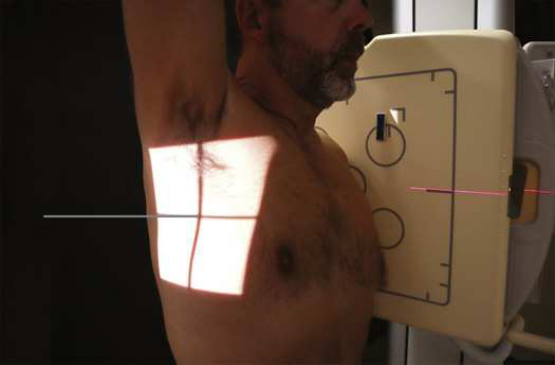
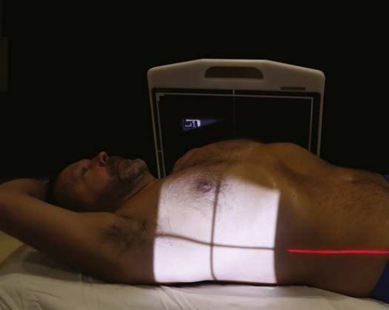
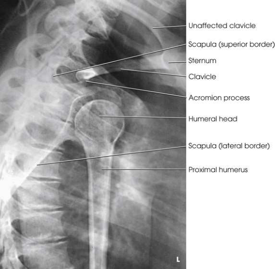

# Rx umăr — incidență de profil transtoracică (laterală) — metoda Lawrence, profil (drept sau stâng) (Merrill)

  📷 Radiografie Convențională (Rx)
  <strong>Actualizat:</strong> 2026-09-16
  <strong>Autor:</strong> Referință Merrill

---

-   __1. Rezumat Clinic & Indicații__

    ---

    === "Indicații Clinice"

        - Conform reperelor anatomice standard din tratat

    === "Ghid Național IRIS"

        !!! info "Referință Primară: Ghidul Național IRIS (Ordinul MS 1342/2012)"
            - **Capitol Ghid IRIS:** *Aparat locomotor & Membru superior*
            - **Grad de Recomandare:** **Grad A**
            - **Nivel de Iradiere Estimată:** `Clasa 1 (Minimă < 0.05 mSv)`

            [:octicons-search-16: Deschide Ghidul IRIS](../../iris.md){ .md-button .md-button--primary } [:material-open-in-new: Aplicația Oficială PWA](https://radiologie-pediatrica.ro/iris/){ .md-button target="_blank" rel="noopener" }

-   __2. Poziționare & Centrare Fascicul__

    ---

    - **Poziție Pacient:** Deși această incidență poate fi efectuată cu pacientul în ortostatism sau în decubit dorsal. Ortostatismul poate fi mai puțin dureros pentru pacientul traumatizat/de urgență și permite, de asemenea, ajustarea mai ușoară a umărului. Pentru poziționarea în ortostatism, pacientul este așezat sau stă în incidență de profil (lateral), în fața stativului vertical Bucky (Fig. 6.23). Dacă ortostatismul este imposibil, pacientul este așezat în decubit dorsal pe masa de examinare, cu tampoane radiotransparente care ridică capul și umerii (Fig. 6.24). Pacientului i se indică să ridice brațul neafectat, să sprijine antebrațul pe cap și să ridice umărul cât mai mult posibil (vezi Fig. 6.23). Ridicarea umărului neafectat coboară partea afectată, separând umerii pentru a preveni suprapunerea. Se asigură că planul mediocoronal este perpendicular pe receptorul de imagine (RI). Nu se încearcă rotirea sau deplasarea în alt mod a brațului afectat. Receptorul de imagine se centrează la nivelul regiunii colului chirurgical al humerusului afectat. Se efectuează ecranarea gonadelor cu șorț plumbat.
    - **Punct de Centrare Fascicul:** Perpendiculară pe receptorul de imagine (RI), intrând în planul mediocoronal la nivelul colului chirurgical. Dacă pacientul nu poate ridica umărul neafectat, se angulează raza centrală cu 10 până la 15 grade cranial pentru a obține o radiografie comparabilă.
    - **Distanță Focar-Film (DFF / SID):** Nespecificat în fragmentul extras; de verificat în sursă
    - **Comandă Respiratorie:** Inspir profund complet. Plămânii plini cu aer îmbunătățesc contrastul și reduc expunerea necesară pentru a traversa corpul. Dacă pacientul poate fi imobilizat suficient pentru a preveni mișcarea voluntară, se poate utiliza tehnica de estompare prin respirație superficială (tehnica respirației) pentru a estompa vascularizația pulmonară. În acest caz, pacientului i se indică să practice o respirație lentă și profundă. Un timp minim de expunere de 3 secunde (4 până la 5 secunde este de dorit) oferă rezultate excelente atunci când se utilizează un miliamperaj scăzut.

-   __3. Parametri Tehnici Expunere__

    ---

    | Parametru Tehnic | Valoare Configurare Generator / Tub |
    |:-----------------|:-------------------------------------|
    | **Tensiune Tub (kV)** | DE CONFIGURAT PE APARAT |
    | **Sarcină / Produs Curent-Timp (mAs)** | DE CONFIGURAT PE APARAT |
    | **Distanță Focar-Film (DFF / SID)** | Nespecificat în fragmentul extras; de verificat în sursă |
    | **Grilă Antidifuzoare (Bucky)** | DE CONFIGURAT PE APARAT |
    | **Dimensiune Focar** | DE CONFIGURAT PE APARAT |
    | **Camere de Ionizare AEC** | DE CONFIGURAT PE APARAT |
    | **Colimare Fascicul** | Se ajustează câmpul de iradiere la formatul 24 × 30 cm pe colimator. Câmpul luminos de pe piele pare mai mic din cauza distanței față de receptorul de imagine. Nu se colimează la o dimensiune mai mare decât cea menționată. Se plasează markerul de lateralitate în câmpul colimat. |
    | **Filtrare Tub** | DE CONFIGURAT PE APARAT |

-   __4. Criterii de Calitate & Reușită Imagine__

    ---

    - Criterii radiologice de calitate a imaginii:
    - Colimare adecvată vizibilă și prezența markerului de lateralitate (D/S) plasat în afara structurilor anatomice de interes
    - Omoplatul (scapula), clavicula și humerusul proximal vizualizate prin câmpurile pulmonare
    - Omoplatul (scapula) suprapus peste coloana toracică
    - Clavicula și humerusul neafectate proiectate deasupra umărului cel mai apropiat de receptorul de imagine

-   __5. Protecție Radiologică (ALARA)__

    ---

    - Nespecificat în fragmentul extras; de verificat în sursă

!!! note "Observații Clinice & Tehnice"
    Conform reperelor anatomice standard din tratat

### 🖼️ Imagini

<figure class="protocol-image-card" markdown>

<figcaption><strong>Merrill — pagina 389, imaginea 1</strong> — Imagine din fragmentul sursă; asocierea necesită revizie.</figcaption>

</figure>

<figure class="protocol-image-card" markdown>

<figcaption><strong>Merrill — pagina 389, imaginea 2</strong> — Imagine din fragmentul sursă; asocierea necesită revizie.</figcaption>

</figure>

<figure class="protocol-image-card" markdown>

<figcaption><strong>Merrill — pagina 390, imaginea 3</strong> — Imagine din fragmentul sursă; asocierea necesită revizie.</figcaption>

</figure>

=== "Ghid Rapid de Execuție"

    1. **Identificarea și verificarea pacientului:** verificare identitate, zonă de examinat, consimțământ conform procedurii și evaluarea posibilității unei sarcini, când este relevantă.
    2. **Pregătire:** îndepărtarea oricăror obiecte radiopace (bijuterii, agrafe, fermoare, proteze, pansamente dense).
    3. **Poziționare precisă:** alinierea receptorului de imagine și a tubului la distanța prescrisă (Nespecificat în fragmentul extras; de verificat în sursă).
    4. **Colimare strictă:** adaptarea fasciculului strict la regiunea de diagnostic pentru scăderea iradierii și reducerea radiației difuze.
    5. **Radioprotecție:** verificarea [politicii RX](../radioprotectie.md), cu măsuri distincte pentru pacient, personal și însoțitor.

## Surse de documentare

- [Merrill’s Atlas, 6. Shoulder Girdle, pagini 388–390](https://books.google.com/books/about/Merrill_s_Atlas_of_Radiographic_Position.html?id=BM0lEQAAQBAJ)
