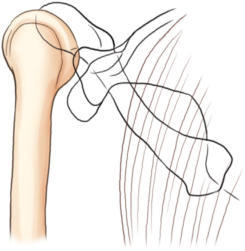
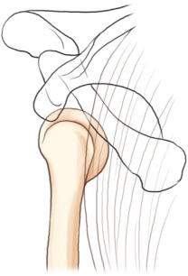
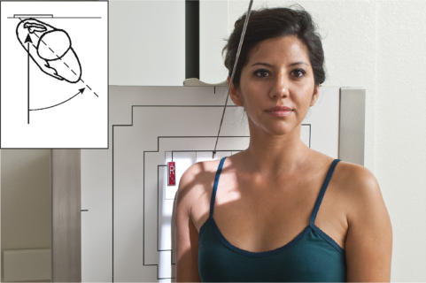
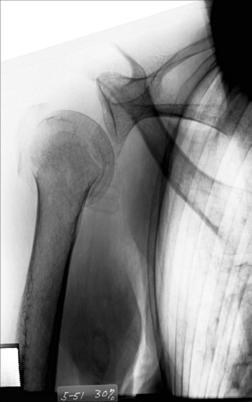
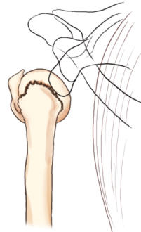

# Rx Umăr (traumatism acuttism / Regim Urgență) AP APICAL OBLIQUE AXIAL Incidență (GARTH METHOD)

  📷 Radiografie Convențională (Rx)
  <strong>Actualizat:</strong> 2026-09-15
  <strong>Autor:</strong> Departamentul de Radiologie / Referință Bontrager

---

-   __1. Rezumat Clinic & Indicații__

    ---

    === "Indicații Clinice"

        - optim traumatism acuttism / Regim Urgență incidență pentru possible scapulohumeral luxație / subluxație articulară (especially posterior luxație / subluxație articulară) (Figs. 5.83 și 5.84)
        - Glenoid process suspiciune de fractură, HillSachs lesions, și părți moi calcifications13,14

    === "Ghid Național IRIS"

        !!! info "Referință Primară: Ghidul Național IRIS (Ordinul MS 1342/2012)"
            - **Capitol Ghid IRIS:** *Ghidul Național IRIS*
            - **Grad de Recomandare:** **De verificat pe indicație; fără grad atribuit automat**
            - **Nivel de Iradiere Estimată:** `De verificat pentru examinarea și populația selectate`

            [:octicons-search-16: Deschide Ghidul IRIS](../../iris.md){ .md-button .md-button--primary } [:material-open-in-new: Aplicația Oficială PWA](https://radiologie-pediatrica.ro/iris/){ .md-button target="_blank" rel="noopener" }
-   __2. Poziționare & Centrare Fascicul__

    ---

    - **Poziție Pacient:** Pacient: Perform radiografie cu pacient în Ortostatism sau Decubit dorsal poziție. (Ortostatism poziție este usually less painful, if pacient’s condition allows.) Rotate corp 45° spre affected side (posterior surface de affected Umăr against receptorul de imagine) (Fig. 5.85).; Regiune anatomică: Center scapulohumeral articulație la raza centrală și midIR. Adjust receptorul de imagine so that 45° raza centrală projects scapulohumeral articulație la center de receptorul de imagine. Flex Cot și place braț across Torace, sau cu traumatism acuttism / Regim Urgență, place braț la side ca este.
    - **Punct de Centrare Fascicul:** 45° caudal.
    - **Distanță Focar-Film (DFF / SID):** 100 cm
    - **Comandă Respiratorie:** Apnee pe durata expunerii. Fig. 5.83 Appearance de Humerus when luxație / subluxație articulară has occurred. anterior luxație / subluxație articulară (most common), Humerus projected inferiorly. Fig. 5.84 posterior luxație / subluxație articulară, Humerus projected superiorly. Umăr (traumatism acuttism / Regim Urgență) SPECIAL Supraspinatus outlet (Metoda Neer) AP apical oblic axial (Garth method)

-   __3. Parametri Tehnici Expunere__

    ---

    | Parametru Tehnic | Valoare Configurare Generator / Tub |
    |:-----------------|:-------------------------------------|
    | **Tensiune Tub (kV)** | 70-85 kV |
    | **Sarcină / Produs Curent-Timp (mAs)** | DE CONFIGURAT PE APARAT |
    | **Distanță Focar-Film (DFF / SID)** | 100 cm |
    | **Grilă Antidifuzoare (Bucky)** | Cu grilă antidifuzoare Bucky |
    | **Dimensiune Focar** | Focar Mic (0.6 mm) |
    | **Camere de Ionizare AEC** | Camerele laterale (sau camera centrală funcție de regiune) |
    | **Colimare Fascicul** | Field Size Collimate closely la aria de interes diagnostic. |
    | **Filtrare Tub** | Totală ≥ 2.5 mm Al echivalent |

-   __4. Criterii de Calitate & Reușită Imagine__

    ---

    - cap humeral, cavitate glenoidă, și neck și cap de Omoplat (Scapulă) sunt well evidențiat liber de superimposition. poziție:
    - proces coracoid este projected over part de cap humeral, which appears elongated.
    - acromion și articulații acromioclaviculare sunt projected superior la cap humeral (Figs. 5.86 și 5.87).
    - Collimation field size la aria de interes diagnostic. expunere:
    - optim receptorul de imagine expunere și contrast cu fără mișcare evidențiază clear, Contururi osoase și travee trabeculare nete, fără artefacte de mișcare și părți moi detail pentru possible calcifications. R Fig. 5.86 AP apical Incidență Oblică. (Note impacted suspiciune de fractură de cap humeral but fără major scapulohumeral luxație / subluxație articulară.) suspiciune de fractură la anatomical neck Scapular cap (lateral angle) Scapular neck acromion cavitate glenoidă proces coracoid Claviculă Fig. 5.87 AP apical Incidență Oblică (Garth method). (Note impacted suspiciune de fractură de cap humeral but fără major scapulohumeral luxație / subluxație articulară.)

-   __5. Protecție Radiologică (ALARA)__

    ---

    - Ecranare gonadică și a organelor radiosensibile conform procedurilor locale de radioprotecție ALARA.
    - Colimare strictă la aria de interes pentru limitarea radiației difuze.
    - Verificarea posibilității unei sarcini la pacientele de vârstă fertilă înainte de expunere.

### 🖼️ Imagini

<figure class="protocol-image-card" markdown>

<figcaption><strong>Fig. 5.83 Appearance de</strong> — Poziționare pacient conform Ghidului Bontrager (Fig. 5.83 Appearance de)</figcaption>

</figure>

<figure class="protocol-image-card" markdown>

<figcaption><strong>Fig. 5.84 posterior luxație / subluxație articulară,</strong> — Aspect radiografic de referință conform Ghidului Bontrager (Fig. 5.84 posterior luxație articulară,)</figcaption>

</figure>

<figure class="protocol-image-card" markdown>

<figcaption><strong>Fig. 5.85 Ortostatism apical oblic axial incidență—45° posterior oblic,</strong> — Aspect radiografic de referință conform Ghidului Bontrager (Fig. 5.85 în ortostatism apical oblic axial incidență—45° posterior oblic,)</figcaption>

</figure>

<figure class="protocol-image-card" markdown>

<figcaption><strong>Fig. 5.86 AP apical oblic</strong> — Aspect radiografic de referință conform Ghidului Bontrager (Fig. 5.86 AP apical oblic)</figcaption>

</figure>

<figure class="protocol-image-card" markdown>

<figcaption><strong>Fig. 5.87 AP apical oblic</strong> — Aspect radiografic de referință conform Ghidului Bontrager (Fig. 5.87 AP apical oblic)</figcaption>

</figure>

=== "Ghid Rapid de Execuție"

    1. **Identificarea și verificarea pacientului:** verificare identitate, zonă de examinat, consimțământ conform procedurii și evaluarea posibilității unei sarcini, când este relevantă.
    2. **Pregătire:** îndepărtarea oricăror obiecte radiopace (bijuterii, agrafe, fermoare, proteze, pansamente dense).
    3. **Poziționare precisă:** alinierea receptorului de imagine și a tubului la distanța prescrisă (100 cm).
    4. **Colimare strictă:** adaptarea fasciculului strict la regiunea de diagnostic pentru scăderea iradierii și reducerea radiației difuze.
    5. **Radioprotecție:** verificarea [politicii RX](../radioprotectie.md), cu măsuri distincte pentru pacient, personal și însoțitor.

## Surse de documentare

- [Bontrager's Textbook of Radiographic Positioning (Ed. 9/10), Pagina 216](https://www.elsevier.com/books/textbook-of-radiographic-positioning-and-related-anatomy/lampignano/978-0-323-65367-1)
