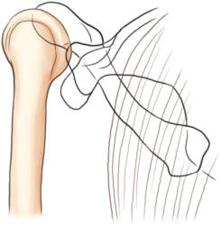
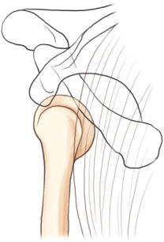
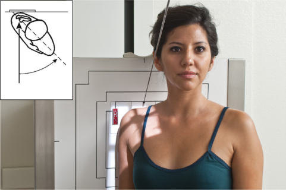
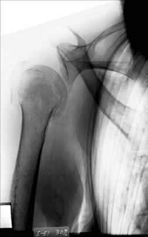
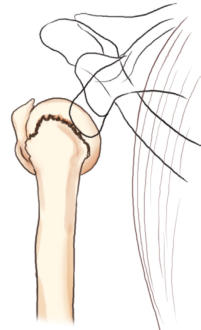

# Rx umăr (traumatism acut / regim de urgență) incidență AP apicală oblică axială (metoda Garth)

  📷 Radiografie Convențională (Rx)
  <strong>Actualizat:</strong> 2026-09-15
  <strong>Autor:</strong> Departamentul de Radiologie / Referință Bontrager

---

-   __1. Rezumat Clinic & Indicații__

    ---

    === "Indicații Clinice"

        - Incidența optimă în traumatism acut / regim de urgență pentru o posibilă luxație / subluxație articulară scapulohumerală (în special luxație / subluxație articulară posterioară) (Fig. 5.83 și 5.84)
        - Suspiciune de fractură a procesului glenoidian, leziuni Hill-Sachs și calcificări ale părților moi13,14

    === "Ghid Național IRIS"

        !!! info "Referință Primară: Ghidul Național IRIS (Ordinul MS 1342/2012)"
            - **Capitol Ghid IRIS:** *Aparat locomotor & Membru superior*
            - **Grad de Recomandare:** **Grad A**
            - **Nivel de Iradiere Estimată:** `Clasa 1 (Minimă < 0.05 mSv)`

            [:octicons-search-16: Deschide Ghidul IRIS](../../iris.md){ .md-button .md-button--primary } [:material-open-in-new: Aplicația Oficială PWA](https://radiologie-pediatrica.ro/iris/){ .md-button target="_blank" rel="noopener" }

-   __2. Poziționare & Centrare Fascicul__

    ---

    - **Poziție Pacient:** Pacient: Se efectuează radiografia cu pacientul în ortostatism sau în decubit dorsal. (Poziția în ortostatism este de obicei mai puțin dureroasă, dacă starea pacientului permite.) Se rotește corpul la 45° spre partea afectată (suprafața posterioară a umărului afectat lipită de receptorul de imagine) (Fig. 5.85).; Regiune anatomică: Se centrează articulația scapulohumerală la nivelul razei centrale și al centrului RI. Se ajustează receptorul de imagine astfel încât raza centrală la 45° să proiecteze articulația scapulohumerală în centrul receptorului de imagine. Se flectează cotul și se așază brațul peste torace sau, în caz de traumatism acut / regim de urgență, se așază brațul pe lângă corp, în poziția în care se află.
    - **Punct de Centrare Fascicul:** 45° caudal.
    - **Distanță Focar-Film (DFF / SID):** 100 cm
    - **Comandă Respiratorie:** Apnee pe durata expunerii. Fig. 5.83 Aspectul humerusului atunci când a survenit o luxație / subluxație articulară. Luxație / subluxație articulară anterioară (cea mai frecventă): humerusul este proiectat inferior. Fig. 5.84 Luxație / subluxație articulară posterioară: humerusul este proiectat superior. Umăr (traumatism acut / regim de urgență) SPECIAL Incidență pentru orificiul de evacuare al supraspinosului (metoda Neer) Incidență AP apicală oblică axială (metoda Garth)

-   __3. Parametri Tehnici Expunere__

    ---

    | Parametru Tehnic | Valoare Configurare Generator / Tub |
    |:-----------------|:-------------------------------------|
    | **Tensiune Tub (kV)** | 70-85 kV |
    | **Sarcină / Produs Curent-Timp (mAs)** | DE CONFIGURAT PE APARAT |
    | **Distanță Focar-Film (DFF / SID)** | 100 cm |
    | **Grilă Antidifuzoare (Bucky)** | Cu grilă antidifuzoare Bucky |
    | **Dimensiune Focar** | Focar Mic (0.6 mm) |
    | **Camere de Ionizare AEC** | Camerele laterale (sau camera centrală, în funcție de regiune) |
    | **Colimare Fascicul** | Dimensiunea câmpului: Se colimează strâns la aria de interes diagnostic. |
    | **Filtrare Tub** | Totală ≥ 2.5 mm Al echivalent |

-   __4. Criterii de Calitate & Reușită Imagine__

    ---

    - Capul humeral, cavitatea glenoidă și colul și capul scapulei sunt bine evidențiate, fără suprapunere. Poziție:
    - Procesul coracoid este proiectat peste o parte a capului humeral, care apare alungit.
    - Acromionul și articulațiile acromioclaviculare sunt proiectate superior față de capul humeral (Fig. 5.86 și 5.87).
    - Dimensiunea câmpului de colimare până la aria de interes diagnostic. Expunere:
    - Expunerea și contrastul optime ale receptorului de imagine, fără mișcare, evidențiază contururi osoase și travee trabeculare clare, fără artefacte de mișcare, precum și detaliile părților moi pentru posibile calcificări. R Fig. 5.86 Incidență AP apicală oblică. (Se observă suspiciunea de fractură impactată a capului humeral, dar fără luxație / subluxație articulară scapulohumerală majoră.) Suspiciune de fractură la nivelul colului anatomic Capul scapular (unghiul lateral) Colul scapulei Acromion Cavitatea glenoidă Procesul coracoid Clavicula Fig. 5.87 Incidență AP apicală oblică (metoda Garth). (Se observă suspiciunea de fractură impactată a capului humeral, dar fără luxație / subluxație articulară scapulohumerală majoră.)

-   __5. Protecție Radiologică (ALARA)__

    ---

    - Ecranare gonadică și a organelor radiosensibile conform procedurilor locale de radioprotecție ALARA.
    - Colimare strictă la aria de interes pentru limitarea radiației difuze.
    - Verificarea posibilității unei sarcini la pacientele de vârstă fertilă înainte de expunere.

### 🖼️ Imagini

<figure class="protocol-image-card" markdown>

<figcaption><strong>Fig. 5.83 Aspectul</strong> — Poziționarea pacientului conform Ghidului Bontrager (Fig. 5.83 Aspectul)</figcaption>

</figure>

<figure class="protocol-image-card" markdown>

<figcaption><strong>Fig. 5.84 Luxație / subluxație articulară posterioară,</strong> — Aspect radiografic de referință conform Ghidului Bontrager (Fig. 5.84 luxație articulară posterioară,)</figcaption>

</figure>

<figure class="protocol-image-card" markdown>

<figcaption><strong>Fig. 5.85 Incidență apicală oblică axială în ortostatism — 45° oblic posterior,</strong> — Aspect radiografic de referință conform Ghidului Bontrager (Fig. 5.85 incidență apicală oblică axială în ortostatism — 45° oblic posterior,)</figcaption>

</figure>

<figure class="protocol-image-card" markdown>

<figcaption><strong>Fig. 5.86 AP apical oblic</strong> — Aspect radiografic de referință conform Ghidului Bontrager (Fig. 5.86 AP apical oblic)</figcaption>

</figure>

<figure class="protocol-image-card" markdown>

<figcaption><strong>Fig. 5.87 AP apical oblic</strong> — Aspect radiografic de referință conform Ghidului Bontrager (Fig. 5.87 AP apical oblic)</figcaption>

</figure>

=== "Ghid Rapid de Execuție"

    1. **Identificarea și verificarea pacientului:** verificare identitate, zonă de examinat, consimțământ conform procedurii și evaluarea posibilității unei sarcini, când este relevantă.
    2. **Pregătire:** îndepărtarea oricăror obiecte radiopace (bijuterii, agrafe, fermoare, proteze, pansamente dense).
    3. **Poziționare precisă:** alinierea receptorului de imagine și a tubului la distanța prescrisă (100 cm).
    4. **Colimare strictă:** adaptarea fasciculului strict la regiunea de diagnostic pentru scăderea iradierii și reducerea radiației difuze.
    5. **Radioprotecție:** verificarea [politicii RX](../radioprotectie.md), cu măsuri distincte pentru pacient, personal și însoțitor.

## Surse de documentare

- [Bontrager's Textbook of Radiographic Positioning (Ed. 9/10), Pagina 216](https://www.elsevier.com/books/textbook-of-radiographic-positioning-and-related-anatomy/lampignano/978-0-323-65367-1)
