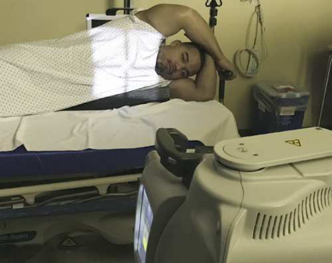

# Rx Mobile Radiography — AP or Incidență Postero-Anterioară (PA) c — Right or left Incidență Decubit Lateral (Merrill)

  📷 Radiografie Convențională (Rx)
  <strong>Actualizat:</strong> 2026-09-16
  <strong>Autor:</strong> Referință Merrill

---

-   __1. Rezumat Clinic & Indicații__

    ---

    === "Indicații Clinice"

        - Conform reperelor anatomice standard din tratat

    === "Ghid Național IRIS"

        !!! info "Referință Primară: Ghidul Național IRIS (Ordinul MS 1342/2012)"
            - **Capitol Ghid IRIS:** *Ghidul Național IRIS*
            - **Grad de Recomandare:** **De verificat pe indicație; fără grad atribuit automat**
            - **Nivel de Iradiere Estimată:** `De verificat pentru examinarea și populația selectate`

            [:octicons-search-16: Deschide Ghidul IRIS](../../iris.md){ .md-button .md-button--primary } [:material-open-in-new: Aplicația Oficială PWA](https://radiologie-pediatrica.ro/iris/){ .md-button target="_blank" rel="noopener" }
-   __2. Poziționare & Centrare Fascicul__

    ---

    - **Poziție Pacient:** se așază pacientul în lateral Decubit poziție. se flectează pacient’s genunchi la provide stabilization, if possible. Place firm support under pacientul la elevate corp 2 la 3 inches (5 la 7.6 cm) și prevent pacientul de la sinking into mattress. Raise ambele de pacientul’s brațe up și away de la Torace region, preferably above capul. braț culcat pe pacientul’s side poate imitate region de aer liber. Make sure pacientul cannot roll de bed.; se poziționează pacientul pentru Incidență Antero-Posterioară (AP) whenever possible. It este much easier la poziție ill pacient (particularly brațele) pentru AP. se ajustează pacient la ensure Incidență de Profil (lateral). plan coronal passing through umerii și hips trebuie să fie vertical. Place receptorul de imagine behind pacientul și below support astfel încât lower margin de Torace este vizibil. se ajustează grilă so that it extends approximately 2 inches (5 cm) above umerii. în order la avoid distortion, receptorul de imagine trebuie să fie sprijinit în poziție și nu leaning pe / sprijinit de pacient (Fig. 20.12). se efectuează ecranarea gonadelor cu șorț plumbat.
    - **Punct de Centrare Fascicul:** orizontal și perpendicular pe centrul receptorului de imagine, entering pacientul la level de 3 inches (7.6 cm) below incizură jugulară (furculiță sternală) pentru AP și T7 pentru PA.
    - **Distanță Focar-Film (DFF / SID):** Nespecificat în fragmentul extras; de verificat în sursă
    - **Comandă Respiratorie:** Inspiration unless otherwise requested.

-   __3. Parametri Tehnici Expunere__

    ---

    | Parametru Tehnic | Valoare Configurare Generator / Tub |
    |:-----------------|:-------------------------------------|
    | **Tensiune Tub (kV)** | DE CONFIGURAT PE APARAT |
    | **Sarcină / Produs Curent-Timp (mAs)** | DE CONFIGURAT PE APARAT |
    | **Distanță Focar-Film (DFF / SID)** | Nespecificat în fragmentul extras; de verificat în sursă |
    | **Grilă Antidifuzoare (Bucky)** | DE CONFIGURAT PE APARAT |
    | **Dimensiune Focar** | DE CONFIGURAT PE APARAT |
    | **Camere de Ionizare AEC** | DE CONFIGURAT PE APARAT |
    | **Colimare Fascicul** | Adjust la 14 × 17 inches (35 × 43 cm) pe collimator. |
    | **Filtrare Tub** | DE CONFIGURAT PE APARAT |

-   __4. Criterii de Calitate & Reușită Imagine__

    ---

    - Conform reperelor anatomice standard din tratat

-   __5. Protecție Radiologică (ALARA)__

    ---

    - Nespecificat în fragmentul extras; de verificat în sursă

!!! note "Observații Clinice & Tehnice"
    Conform reperelor anatomice standard din tratat

### 🖼️ Imagini

<figure class="protocol-image-card" markdown>

<figcaption><strong>Merrill — pagina PDF 1486, imaginea 1</strong> — Imagine din fragmentul sursă; asocierea necesită revizie.</figcaption>

</figure>

=== "Ghid Rapid de Execuție"

    1. **Identificarea și verificarea pacientului:** verificare identitate, zonă de examinat, consimțământ conform procedurii și evaluarea posibilității unei sarcini, când este relevantă.
    2. **Pregătire:** îndepărtarea oricăror obiecte radiopace (bijuterii, agrafe, fermoare, proteze, pansamente dense).
    3. **Poziționare precisă:** alinierea receptorului de imagine și a tubului la distanța prescrisă (Nespecificat în fragmentul extras; de verificat în sursă).
    4. **Colimare strictă:** adaptarea fasciculului strict la regiunea de diagnostic pentru scăderea iradierii și reducerea radiației difuze.
    5. **Radioprotecție:** verificarea [politicii RX](../radioprotectie.md), cu măsuri distincte pentru pacient, personal și însoțitor.

## Surse de documentare

- [Merrill’s Atlas, 20. Mobile Radiography, pagini PDF 1485–1486](../../assets/protocols/sources/a56d45c16829_Merrills_Atlas_of_Radiographic_Positioning__Procedures_3Vol_Set.pdf#page=1485)

## Fragmente sursă traduse (referință tehnică)

### anatomy

This incidență shows anatomy de thorax, including entire câmpuri pulmonare și orice air sau nivele hidroaerice that poate fie present (Fig. 20.13).

### collimation

• Adjust la 14 × 17 inches (35 × 43 cm) pe collimator.

### cr

• orizontal și perpendicular pe centrul receptorului de imagine, entering pacientul la level de 3 inches (7.6 cm) below incizură jugulară (furculiță sternală) pentru AP
și T7 pentru PA.

### part_pos

• se poziționează pacientul pentru AP incidență whenever possible. It este much easier la poziție ill pacient (particularly brațele) pentru AP.
• se ajustează pacient la ensure poziție de profil (lateral). plan coronal passing through umerii și hips trebuie să fie vertical.
• Place receptorul de imagine behind pacientul și below support astfel încât lower margin de toracele este vizibil.
• se ajustează grilă so that it extends approximately 2 inches (5 cm) above umerii. în order la avoid distortion, receptorul de imagine trebuie să fie
sprijinit în poziție și nu leaning pe / sprijinit de pacient (Fig. 20.12).
• se efectuează ecranarea gonadelor cu șorț plumbat.

### patient_pos

• se așază pacientul în lateral recumbent poziție.
• se flectează pacient’s genunchi la provide stabilization, if possible.
• Place firm support under pacientul la elevate corp 2 la 3 inches (5 la 7.6 cm) și prevent pacientul de la sinking into mattress.
• Raise ambele de pacientul’s brațe up și away de la toracele region, preferably above capul. braț culcat pe pacientul’s side poate
imitate region de aer liber.
• Make sure pacientul cannot roll de bed.

### respiration

Inspiration unless otherwise requested.

### tech

receptorul de imagine trebuie să fie 14 × 17 inches (35 × 43 cm) cu longitudinal grilă.

