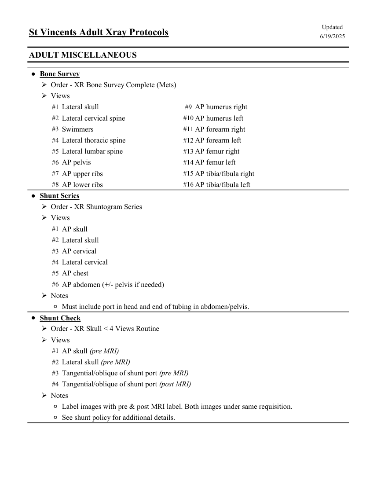

# RX — Adult: examinări diverse (MCB)

## Documentul original MCB — Adult: examinări diverse

**Colecție de protocoale · 1 pagini · consultat la 2026-09-27.**

[Descarcă PDF-ul integral](../../assets/mcb-modalities/rx-adult-examinari-diverse-mcb/document.pdf) · [Sursa MCB](https://ref.mcbradiology.com/Protocols,%20Policies,%20Worksheets%20&%20Forms/Xray/Adult%20Protocols/9%20Adult%20Miscellaneous.pdf) · [Catalogul MCB pentru această modalitate](../mcb/index.md)

Instrucțiunile, valorile și ilustrațiile din documentul original sunt păstrate în **engleză**. Titlul și navigarea sunt în română.

### Pagina 1

{ loading=lazy }

## Textul documentului original

??? abstract "Pagina 1 — text în engleză"

    
Updated
    St Vincents Adult Xray Protocols
    6/19/2025
    ADULT MISCELLANEOUS
    ●Bone Survey
    Order - XR Bone Survey Complete (Mets)
    Views
    #1 Lateral skull
    #9 AP humerus right
    #2 Lateral cervical spine
    #10 AP humerus left
    #3 Swimmers
    #11 AP forearm right
    #4 Lateral thoracic spine
    #12 AP forearm left
    #5 Lateral lumbar spine
    #13 AP femur right
    #6 AP pelvis
    #14 AP femur left
    #7 AP upper ribs
    #15 AP tibia/fibula right
    #8 AP lower ribs
    #16 AP tibia/fibula left
    ●Shunt Series
    Order - XR Shuntogram Series
    Views
    #1 AP skull
    #2 Lateral skull
    #3 AP cervical
    #4 Lateral cervical
    #5 AP chest
    #6 AP abdomen (+/- pelvis if needed)
    Notes
    ◦Must include port in head and end of tubing in abdomen/pelvis.
    ●Shunt Check
    Order - XR Skull &lt; 4 Views Routine
    Views
    #1 AP skull (pre MRI)
    #2 Lateral skull (pre MRI)
    #3 Tangential/oblique of shunt port (pre MRI)
    #4 Tangential/oblique of shunt port (post MRI)
    Notes
    ◦Label images with pre &amp; post MRI label. Both images under same requisition. 
    ◦See shunt policy for additional details.
    

