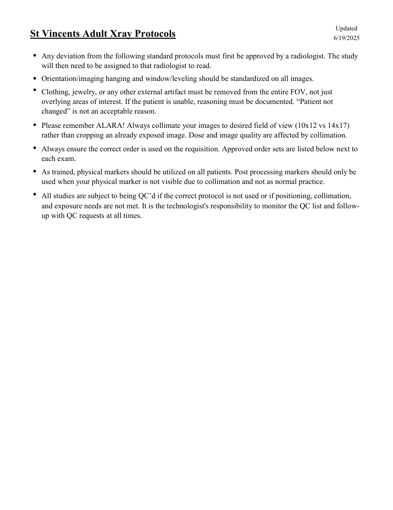

# RX — Adult: reguli generale (MCB)

## Documentul original MCB — Adult: reguli generale

**Colecție de protocoale · 1 pagini · consultat la 2026-09-27.**

[Descarcă PDF-ul integral](../../assets/mcb-modalities/rx-adult-reguli-generale-mcb/document.pdf) · [Sursa MCB](https://ref.mcbradiology.com/Protocols,%20Policies,%20Worksheets%20&%20Forms/Xray/Adult%20Protocols/1%20Adult%20General.pdf) · [Catalogul MCB pentru această modalitate](../mcb/index.md)

Instrucțiunile, valorile și ilustrațiile din documentul original sunt păstrate în **engleză**. Titlul și navigarea sunt în română.

### Pagina 1

{ loading=lazy }

## Textul documentului original

??? abstract "Pagina 1 — text în engleză"

    
Updated
    St Vincents Adult Xray Protocols
    6/19/2025
    ●
    Any deviation from the following standard protocols must first be approved by a radiologist. The study 
    will then need to be assigned to that radiologist to read.
    ●Orientation/imaging hanging and window/leveling should be standardized on all images.
    ●
    Clothing, jewelry, or any other external artifact must be removed from the entire FOV, not just 
    overlying areas of interest. If the patient is unable, reasoning must be documented. “Patient not 
    changed” is not an acceptable reason.
    ●
    Please remember ALARA! Always collimate your images to desired field of view (10x12 vs 14x17) 
    rather than cropping an already exposed image. Dose and image quality are affected by collimation.
    ●
    Always ensure the correct order is used on the requisition. Approved order sets are listed below next to 
    each exam.
    ●
    As trained, physical markers should be utilized on all patients. Post processing markers should only be 
    used when your physical marker is not visible due to collimation and not as normal practice.
    ●
    All studies are subject to being QC’d if the correct protocol is not used or if positioning, collimation, 
    and exposure needs are not met. It is the technologist&#x27;s responsibility to monitor the QC list and follow-
    up with QC requests at all times.
    

