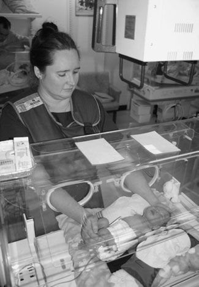
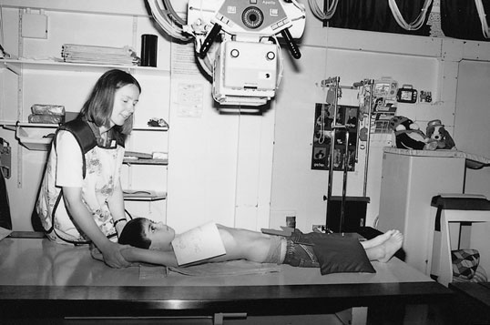
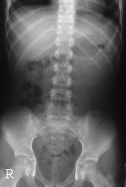
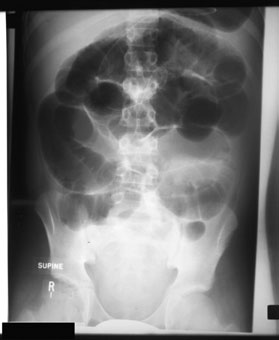
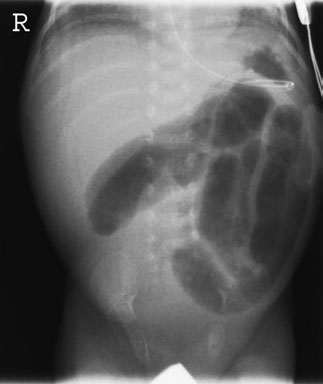
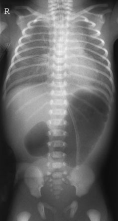
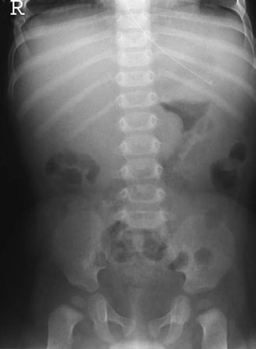

# Rx Abdomen Antero-Posterior (AP)

  📷 Radiografie Convențională (Rx)
  <strong>Actualizat:</strong> 2026-09-16
  <strong>Autor:</strong> Departamentul de Radiologie / Referință Clark (Ed. 12)

---

-   __1. Rezumat Clinic & Indicații__

    ---

    === "Indicații Clinice"

        - Unlike adults, Ortostatism imagini sunt rarely required sau justified.
        - stâng Profil (lateral) decubit imagini poate fie required în cases de suspected necrotizing enterocolitis. în this incidență, cu pacientul culcat pe stâng side, pneumoperitoneu (aer liber subdiafragmatic) will rise, la fie located între Profil (lateral) margin de ficat și drept abdominal perete.
        - Profil (lateral) incidențe poate evidențiază Hirschprung’s disease sau retroperitoneal proces proliferativ tumoral în some rare cases.
        - Abdominal ultrasound has replaced radiografie în many conditions.
        - în non-specific abdominal pain, radiographic abnormality este unlikely la fie evidențiat în absence de one de following: loin pain, haematuria, diarrhoea, palpable mass, abdominal distension sau suspected inflammatory bowel disease. imagine de Antero-posterior (AP) Abdomen de male neonate evidențiind ocluzie intestinală (nivele hidroaerice) due la intestin subțire atresia imagine de Antero-posterior (AP) chest și Abdomen în female neonate cu duodenal atresia imagine de Antero-posterior (AP) Abdomen de female infant cu intussusception în transverse intestin gros (colon) (arrow)

    === "Ghid Național IRIS"

        !!! info "Referință Primară: Ghidul Național IRIS (Ordinul MS 1342/2012)"
            - **Capitol Ghid IRIS:** *Ghidul Național IRIS*
            - **Grad de Recomandare:** **De verificat pe indicație; fără grad atribuit automat**
            - **Nivel de Iradiere Estimată:** `De verificat pentru examinarea și populația selectate`

            [:octicons-search-16: Deschide Ghidul IRIS](../../iris.md){ .md-button .md-button--primary } [:material-open-in-new: Aplicația Oficială PWA](https://radiologie-pediatrica.ro/iris/){ .md-button target="_blank" rel="noopener" }
-   __2. Poziționare & Centrare Fascicul__

    ---

    - **Poziție Pacient:** • child lies Decubit dorsal pe masa radiologică sau, în case de neonate, în incubator, cu planul mediosagital de trunk la drept-angles la middle de caseta.
• la ensure that child este nu rotit, anterior superior iliac spines trebuie să fie echidistant față de caseta.
• caseta trebuie să fie large enough pentru include simfiză pubiană și cupole diafragmatice.
    - **Punct de Centrare Fascicul:** • raza centrală verticală centrală este orientat la centre de caseta.
    - **Distanță Focar-Film (DFF / SID):** 100 cm
    - **Comandă Respiratorie:** Apnee pe durata expunerii (apnee în inspir pentru torace; expir pentru Abdomen/bazin).

-   __3. Parametri Tehnici Expunere__

    ---

    | Parametru Tehnic | Valoare Configurare Generator / Tub |
    |:-----------------|:-------------------------------------|
    | **Tensiune Tub (kV)** | DE CONFIGURAT PE APARAT |
    | **Sarcină / Produs Curent-Timp (mAs)** | Conform AEC / grosime anatomică |
    | **Distanță Focar-Film (DFF / SID)** | 100 cm |
    | **Grilă Antidifuzoare (Bucky)** | Conform grosimii anatomice (> 10-12 cm cu grilă) |
    | **Dimensiune Focar** | Focar Mic (0.6 mm) |
    | **Camere de Ionizare AEC** | DE CONFIGURAT PE APARAT |
    | **Colimare Fascicul** | Colimare strictă la aria anatomică de interes diagnostic |
    | **Filtrare Tub** | Totală ≥ 2.5 mm Al echivalent (conform Clark: 3.0 mm Al eq.) |

-   __4. Criterii de Calitate & Reușită Imagine__

    ---

    - Antero-posterior (AP) incidență pentru whole Abdomen:
    - Abdomen la include cupole diafragmatice, Profil (lateral) abdominal pereți și tuberozități ischiatice.
    - Bazin (bazin (pelvis)) și coloană vertebrală trebuie să fie straight, cu Absența rotației anatomice (simetrie bilaterală perfectă).
    - Reproduction de properitoneal fat lines consistent cu age.
    - Visualization de rinichi și psoas outlines consistent cu age și bowel content.
    - Visually Contururi osoase nete, fără estompare cinetică.
    - Erori de evitat / remedii: Usually inadequate coning but occasionally too tight coning excludes cupole diafragmatice.
    - Erori de evitat / remedii: Male gonads nu protected.
    - Erori de evitat / remedii: Careful technique este needed la address these problems.

-   __5. Protecție Radiologică (ALARA)__

    ---

    - Optimization of abdominal radiographs includes using a lowerdose technique, e.g. no grid and a very fast image acquisition system, in the assessment of examinations such as chronic constipation and swallowed corp străin radiopac is recommended. Serial images in the latter are not necessary.
    - All boys should have testicular protection.
    - Radiographs of the renal tract can be more collimated laterally (Cook et al. 1998).
    - Although it has been demonstrated that a Postero-Anterior (PA) abdominal technique results in a lower dose (Marshall et al. 1994), a Decubit Dorsal technique with male gonad protection is preferred in children.
    - In Decubit Dorsal neonates who cannot be moved, a Fascicul Orizontal Profil (Lateral) should be taken from the left to reduce the dose to the liver (see below).
    - Ecranare gonadică cu șorț plumbat dacă gonadele sunt în apropierea fasciculului util (regula ALARA).
    - Colimare precisă la dimensiunea anatomică strict necesară pentru reducerea dozei și a radiației difuze.
    - Verificarea posibilității unei sarcini la pacientele de vârstă fertilă înainte de expunere.

!!! note "Observații Clinice & Tehnice"
    • toate acute abdominal radiografii trebuie să include cupole diafragmatice și lung bases. Lower-lobe pneumonie / infiltrate pulmonare poate often masquerade ca acute abdominal pain.
• radiografii pentru renal tract poate have more Profil (lateral) coning, și fizzy drink poate fie used la distend stomach cu air, thus displacing residue în transverse intestin gros (colon) și better evidențiind renal areas.
• Collimation este ca pentru adults, but babies’ și infants’ abdomens tend la fie rounder; therefore, slightly wider Profil (lateral) cones sunt required.
398 Basic Antero-superior – Decubit dorsal Alternative Postero-anterior (PA) – Decubit ventral Supplementary Profil (lateral) Postero-anterior (PA) – stâng Profil (lateral) decubit Antero-posterior (AP) – Ortostatism Baby poziționat în incubator pentru Antero-posterior (AP) Abdomen Older child poziționat pe imaging table pentru Antero-posterior (AP) Abdomen imagine de normal Antero-posterior (AP) Abdomen în older child. Note inclusion de cupole diafragmatice imagine de Antero-posterior (AP) Abdomen de older child cu Ocluzie intestinală pe intestinul subțire (nivele hidroaerice centrale). Note use de male gonad protection

### 🖼️ Imagini

<figure class="protocol-image-card" markdown>

<figcaption><strong>Abdominal radiografie de abdomenul acut în children este</strong> — Poziționare pacient și centrare fascicul conform Clark (Ed. 12)</figcaption>

</figure>

<figure class="protocol-image-card" markdown>

<figcaption><strong>normally performed în conjunction cu abdominal ultrasound.</strong> — Aspect radiografic / ghid de poziționare conform tratatului Clark (Ed. 12)</figcaption>

</figure>

<figure class="protocol-image-card" markdown>

<figcaption><strong>radiographic abnormality este unlikely la fie evidențiat în the</strong> — Aspect radiografic / ghid de poziționare conform tratatului Clark (Ed. 12)</figcaption>

</figure>

<figure class="protocol-image-card" markdown>

<figcaption><strong>More specific referral criteria de abdominal radiografii sunt given</strong> — Aspect radiografic / ghid de poziționare conform tratatului Clark (Ed. 12)</figcaption>

</figure>

<figure class="protocol-image-card" markdown>

<figcaption><strong>• Optimization de abdominal radiografii includes using lower-</strong> — Aspect radiografic / ghid de poziționare conform tratatului Clark (Ed. 12)</figcaption>

</figure>

<figure class="protocol-image-card" markdown>

<figcaption><strong>• radiografii de renal tract poate fie more collimated</strong> — Aspect radiografic / ghid de poziționare conform tratatului Clark (Ed. 12)</figcaption>

</figure>

<figure class="protocol-image-card" markdown>

<figcaption><strong>• Abdominal ultrasound has replaced radiografie în many</strong> — Aspect radiografic / ghid de poziționare conform tratatului Clark (Ed. 12)</figcaption>

</figure>

=== "Ghid Rapid de Execuție"

    1. **Identificarea și verificarea pacientului:** verificare identitate, zonă de examinat, consimțământ conform procedurii și evaluarea posibilității unei sarcini, când este relevantă.
    2. **Pregătire:** îndepărtarea oricăror obiecte radiopace (bijuterii, agrafe, fermoare, proteze, pansamente dense).
    3. **Poziționare precisă:** alinierea receptorului de imagine și a tubului la distanța prescrisă (100 cm).
    4. **Colimare strictă:** adaptarea fasciculului strict la regiunea de diagnostic pentru scăderea iradierii și reducerea radiației difuze.
    5. **Radioprotecție:** verificarea [politicii RX](../radioprotectie.md), cu măsuri distincte pentru pacient, personal și însoțitor.

## Surse de documentare

- [Clark's Positioning in Radiography (Ed. 12), Pagina 413](../../assets/protocols/sources/Clark___Positioning_in_Radiography__12th_edition.pdf#page=413)
