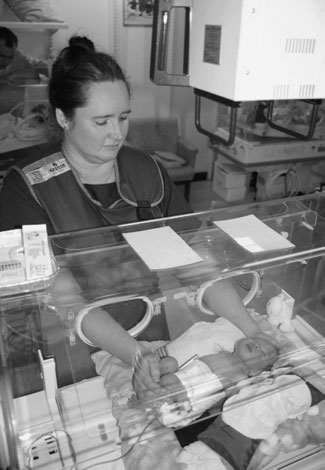
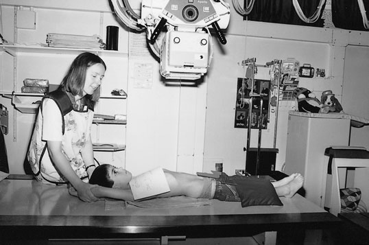
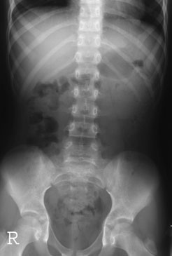
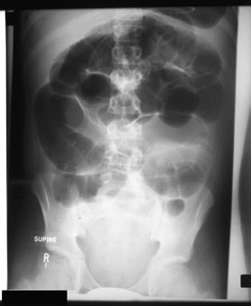
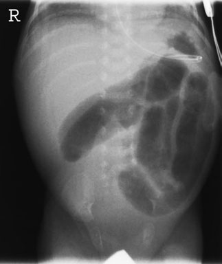
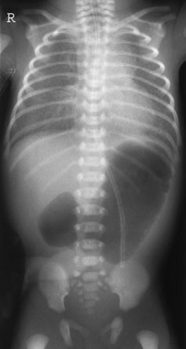
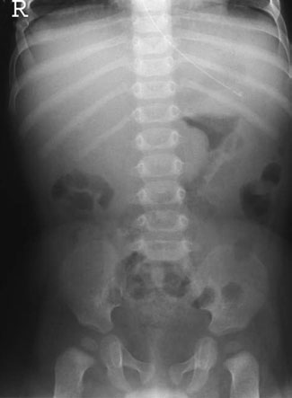

# Rx abdomen anteroposterior (AP)

  📷 Radiografie Convențională (Rx)
  <strong>Actualizat:</strong> 2026-09-16
  <strong>Autor:</strong> Departamentul de Radiologie / Referință Clark (Ed. 12)

---

-   __1. Rezumat Clinic & Indicații__

    ---

    === "Indicații Clinice"

        - Spre deosebire de adulți, imaginile în ortostatism sunt rareori necesare sau justificate.
        - Imaginile în decubit lateral stâng de profil pot fi necesare în cazurile de enterocolită necrozantă suspectată. În această incidență, cu pacientul culcat pe partea stângă, pneumoperitoneul (aerul liber subdiafragmatic) se va ridica pentru a fi localizat între marginea de profil a ficatului și peretele abdominal drept.
        - Incidențele de profil pot evidenția boala Hirschsprung sau un proces proliferativ tumoral retroperitoneal în unele cazuri rare.
        - Ecografia abdominală a înlocuit radiografia în multe afecțiuni.
        - În durerea abdominală nespecifică, o anomalie radiografică este improbabil să fie evidențiată în absența uneia dintre următoarele: durere lombară, hematurie, diaree, masă palpabilă, distensie abdominală sau suspiciune de boală inflamatorie intestinală. Imagine AP a abdomenului unui nou-născut de sex masculin, evidențiind ocluzie intestinală (niveluri hidroaerice) datorată atreziei intestinului subțire. Imagine AP a toracelui și abdomenului unui nou-născut de sex feminin cu atrezie duodenală. Imagine AP a abdomenului unui sugar de sex feminin cu invaginație intestinală în colonul transvers (săgeată).

    === "Ghid Național IRIS"

        !!! info "Referință Primară: Ghidul Național IRIS (Ordinul MS 1342/2012)"
            - **Capitol Ghid IRIS:** *Pediatrie — Aparat digestiv*
            - **Grad de Recomandare:** **Grad B**
            - **Nivel de Iradiere Estimată:** `Clasa 1 (Minimă < 0.05 mSv)`

            [:octicons-search-16: Deschide Ghidul IRIS](../../iris.md){ .md-button .md-button--primary } [:material-open-in-new: Aplicația Oficială PWA](https://radiologie-pediatrica.ro/iris/){ .md-button target="_blank" rel="noopener" }

-   __2. Poziționare & Centrare Fascicul__

    ---

    - **Poziție Pacient:**
        - copilul este așezat în decubit dorsal pe masa radiologică sau, în cazul nou-născuților, în incubator, cu planul mediosagital al trunchiului perpendicular pe mijlocul casetei.
        - pentru a vă asigura că sugarul nu este rotit, spinele iliace anterosuperioare trebuie să fie echidistante față de casetă.
        - caseta trebuie să fie suficient de mare pentru a include simfiza pubiană și cupolele diafragmatice.
    - **Punct de Centrare Fascicul:** • Raza centrală verticală este orientată spre centrul casetei.
    - **Distanță Focar-Film (DFF / SID):** 100 cm
    - **Comandă Respiratorie:** Apnee pe durata expunerii (apnee în inspir pentru torace; expir pentru Abdomen/bazin).

-   __3. Parametri Tehnici Expunere__

    ---

    | Parametru Tehnic | Valoare Configurare Generator / Tub |
    |:-----------------|:-------------------------------------|
    | **Tensiune Tub (kV)** | DE CONFIGURAT PE APARAT |
    | **Sarcină / Produs Curent-Timp (mAs)** | Conform AEC / grosimii anatomice |
    | **Distanță Focar-Film (DFF / SID)** | 100 cm |
    | **Grilă Antidifuzoare (Bucky)** | Conform grosimii anatomice (> 10-12 cm cu grilă) |
    | **Dimensiune Focar** | Focar Mic (0.6 mm) |
    | **Camere de Ionizare AEC** | DE CONFIGURAT PE APARAT |
    | **Colimare Fascicul** | Colimare strictă la aria anatomică de interes diagnostic |
    | **Filtrare Tub** | Totală ≥ 2.5 mm Al echivalent (conform Clark: 3.0 mm Al echivalent) |

-   __4. Criterii de Calitate & Reușită Imagine__

    ---

    - Incidență anteroposterioară (AP) pentru întregul abdomen:
    - Abdomenul trebuie să includă cupolele diafragmatice, pereții abdominali de profil și tuberozitățile ischiatice.
    - Bazinul și coloana vertebrală trebuie să fie drepte, cu absența rotației anatomice (simetrie bilaterală perfectă).
    - Reprezentarea liniilor grăsimii preperitoneale, în concordanță cu vârsta.
    - Vizualizarea rinichilor și a contururilor mușchilor psoas, în concordanță cu vârsta și conținutul intestinal.
    - Contururi osoase nete, fără estompare cinetică vizibilă.
    - Erori de evitat / remedii: de obicei, colimare insuficientă, dar uneori colimarea prea strânsă exclude cupolele diafragmatice.
    - Erori de evitat / remedii: gonadele masculine nu sunt protejate.
    - Erori de evitat / remedii: este necesară o tehnică atentă pentru rezolvarea acestor probleme.

-   __5. Protecție Radiologică (ALARA)__

    ---

    - Optimizarea radiografiilor abdominale include utilizarea unei tehnici cu doză mai mică, de exemplu fără grilă și cu un sistem de achiziție a imaginilor foarte rapid; în evaluarea unor examinări precum constipația cronică și ingestia unui corp străin radiopac, această abordare este recomandată. În cazul celui din urmă, imaginile seriate nu sunt necesare.
    - Toți băieții trebuie să beneficieze de protecție testiculară.
    - Radiografiile tractului renal pot fi colimate mai mult lateral (Cook et al. 1998).
    - Deși s-a demonstrat că o tehnică abdominală postero-anterioară (PA) determină o doză mai mică (Marshall et al. 1994), la copii este preferată tehnica în decubit dorsal, cu protecția gonadelor masculine.
    - La nou-născuții în decubit dorsal care nu pot fi mobilizați, trebuie efectuată o incidență de profil cu fascicul orizontal, din partea stângă, pentru a reduce doza la nivelul ficatului (vezi mai jos).
    - Ecranare gonadică cu șorț plumbat dacă gonadele sunt în apropierea fasciculului util (regula ALARA).
    - Colimare precisă la dimensiunea anatomică strict necesară pentru reducerea dozei și a radiației difuze.
    - Verificarea posibilității unei sarcini la pacientele de vârstă fertilă înainte de expunere.

!!! note "Observații Clinice & Tehnice"
    - Toate radiografiile abdominale acute trebuie să includă cupolele diafragmatice și bazele pulmonare. Pneumonia / infiltratele pulmonare ale lobilor inferiori pot mima adesea durerea abdominală acută.
    - Radiografiile tractului renal pot avea o colimare mai îngustă de profil, iar o băutură carbogazoasă poate fi utilizată pentru a destinde stomacul cu aer, deplasând astfel reziduul în colonul transvers și evidențiind mai bine regiunile renale.
    - Colimarea este similară celei pentru adulți, dar abdomenul bebelușilor și sugarilor tinde să fie mai rotund; prin urmare, sunt necesare conuri de profil puțin mai largi. 398 De bază Antero-superior – Decubit dorsal Alternativă Postero-anterioară (PA) – Decubit ventral Suplimentară Profil (lateral) Postero-anterioară (PA) – Decubit lateral stâng Antero-posterioară (AP) – Ortostatism Bebeluș poziționat în incubator pentru Antero-posterioară (AP) Abdomen Copil mai mare poziționat pe masa de imagistică pentru Antero-posterioară (AP) Abdomen Imagine a abdomenului normal în Antero-posterioară (AP) la copilul mai mare. Se observă includerea cupolelor diafragmatice. Imagine Antero-posterioară (AP) a abdomenului unui copil mai mare cu ocluzie intestinală a intestinului subțire (niveluri hidroaerice centrale). Se observă utilizarea protecției gonadale la sexul masculin.

### 🖼️ Imagini

<figure class="protocol-image-card" markdown>

<figcaption><strong>Radiografia abdominală pentru abdomenul acut la copii este</strong> — Poziționarea pacientului și centrarea fasciculului conform Clark (Ed. 12)</figcaption>

</figure>

<figure class="protocol-image-card" markdown>

<figcaption><strong>efectuată de obicei împreună cu ecografia abdominală.</strong> — Aspect radiografic / ghid de poziționare conform tratatului Clark (Ed. 12)</figcaption>

</figure>

<figure class="protocol-image-card" markdown>

<figcaption><strong>este puțin probabil ca anomalia radiografică să fie evidențiată în</strong> — Aspect radiografic / ghid de poziționare conform tratatului Clark (Ed. 12)</figcaption>

</figure>

<figure class="protocol-image-card" markdown>

<figcaption><strong>sunt prezentate criterii de trimitere mai specifice pentru radiografiile abdominale</strong> — Aspect radiografic / ghid de poziționare conform tratatului Clark (Ed. 12)</figcaption>

</figure>

<figure class="protocol-image-card" markdown>

<figcaption><strong>• Optimizarea radiografiilor abdominale include utilizarea unei tehnici cu doză mai mică, de exemplu fără</strong> — Aspect radiografic / ghid de poziționare conform tratatului Clark (Ed. 12)</figcaption>

</figure>

<figure class="protocol-image-card" markdown>

<figcaption><strong>• radiografiile tractului renal pot fi colimate mai mult</strong> — Aspect radiografic / ghid de poziționare conform tratatului Clark (Ed. 12)</figcaption>

</figure>

<figure class="protocol-image-card" markdown>

<figcaption><strong>• Ecografia abdominală a înlocuit radiografia în multe</strong> — Aspect radiografic / ghid de poziționare conform tratatului Clark (Ed. 12)</figcaption>

</figure>

=== "Ghid Rapid de Execuție"

    1. **Identificarea și verificarea pacientului:** verificare identitate, zonă de examinat, consimțământ conform procedurii și evaluarea posibilității unei sarcini, când este relevantă.
    2. **Pregătire:** îndepărtarea oricăror obiecte radiopace (bijuterii, agrafe, fermoare, proteze, pansamente dense).
    3. **Poziționare precisă:** alinierea receptorului de imagine și a tubului la distanța prescrisă (100 cm).
    4. **Colimare strictă:** adaptarea fasciculului strict la regiunea de diagnostic pentru scăderea iradierii și reducerea radiației difuze.
    5. **Radioprotecție:** verificarea [politicii RX](../radioprotectie.md), cu măsuri distincte pentru pacient, personal și însoțitor.

## Surse de documentare

- [Clark's Positioning in Radiography (Ed. 12), Pagina 413](https://books.google.com/books/about/Clark_s_Positioning_in_Radiography.html?id=Xxu6MwEACAAJ)
