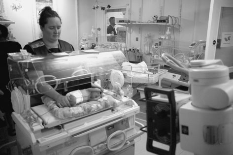
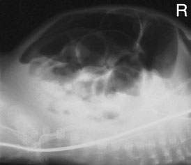
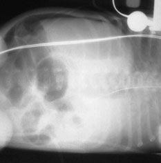
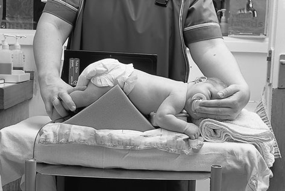
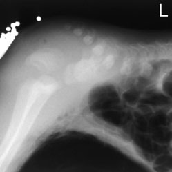
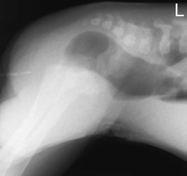

# Rx Abdomen Imperforate anus (Decubit Ventral invertogram)

  📷 Radiografie Convențională (Rx)
  <strong>Actualizat:</strong> 2026-09-16
  <strong>Autor:</strong> Departamentul de Radiologie / Referință Clark (Ed. 12)

---

-   __1. Rezumat Clinic & Indicații__

    ---

    === "Indicații Clinice"

        - ca Craniu X-rays involve moderately high dose în terms de plain radiografii, often including series de radiografii, justification este essential. Good clinico-radiological cooperation, agreed referral criteria și audit sunt essential în keeping number de unnecessary radiografii la minimum (Cook et al. 1998). Some studies suggest that over third de requests following trauma sunt unnecessary (Boulis et al. 1978), și many have reported that absence de suspiciune de fractură does nu alter management (Garniak et al. 1986, Lloyd et al. 1997, Masters et al. 1987).

    === "Ghid Național IRIS"

        !!! info "Referință Primară: Ghidul Național IRIS (Ordinul MS 1342/2012)"
            - **Capitol Ghid IRIS:** *Ghidul Național IRIS*
            - **Grad de Recomandare:** **De verificat pe indicație; fără grad atribuit automat**
            - **Nivel de Iradiere Estimată:** `De verificat pentru examinarea și populația selectate`

            [:octicons-search-16: Deschide Ghidul IRIS](../../iris.md){ .md-button .md-button--primary } [:material-open-in-new: Aplicația Oficială PWA](https://radiologie-pediatrica.ro/iris/){ .md-button target="_blank" rel="noopener" }
-   __2. Poziționare & Centrare Fascicul__

    ---

    - **Poziție Pacient:** • infant trebuie să fie plasat în Decubit ventral poziție, cu Bazin (bazin (pelvis)) și buttocks raised pe triangular covered foam pad sau rolled-up nappy.
• infant trebuie să fie kept în this poziție pentru approximately 10–15 minutes.
• caseta este sprijinit vertically pe / sprijinit de Profil (lateral) aspect de infant’s Bazin (bazin (pelvis)), și ajustat paralel cu plan mediosagital.
    - **Punct de Centrare Fascicul:** • Raza centrală orizontală este orientată perpendicular pe centrul casetei.
    - **Distanță Focar-Film (DFF / SID):** 100 cm
    - **Comandă Respiratorie:** Apnee pe durata expunerii (apnee în inspir pentru torace; expir pentru Abdomen/bazin).

-   __3. Parametri Tehnici Expunere__

    ---

    | Parametru Tehnic | Valoare Configurare Generator / Tub |
    |:-----------------|:-------------------------------------|
    | **Tensiune Tub (kV)** | DE CONFIGURAT PE APARAT |
    | **Sarcină / Produs Curent-Timp (mAs)** | Conform AEC / grosime anatomică |
    | **Distanță Focar-Film (DFF / SID)** | 100 cm |
    | **Grilă Antidifuzoare (Bucky)** | Conform grosimii anatomice (> 10-12 cm cu grilă) |
    | **Dimensiune Focar** | Focar Mic (0.6 mm) |
    | **Camere de Ionizare AEC** | DE CONFIGURAT PE APARAT |
    | **Colimare Fascicul** | Colimare strictă la aria anatomică de interes diagnostic |
    | **Filtrare Tub** | Totală ≥ 2.5 mm Al echivalent (conform Clark: 3.0 mm Al eq.) |

-   __4. Criterii de Calitate & Reușită Imagine__

    ---

    - Vizualizarea clară întregii arii anatomice (Abdomen).
    - Absența artefactelor de mișcare; trabeculație osoasă și contururi nete.
    - Densitate optică și contrast adecvate pentru diferențierea țesuturilor moi de structurile osoase.

-   __5. Protecție Radiologică (ALARA)__

    ---

    - Justification, optimization and careful technique are the best ways of conforming to radiation protection guidelines.
    - Avoidance of the use of a grid in children under the age of one year is an important dose-saving measure.
    - A short exposure time is particularly important in performing Craniu radiography to avoid movement unsharpness. The maximum exposure time should be less than 40ms.
    - Children’s skulls are almost fully grown by the age of seven years; therefore, children over this age need almost as much exposure as an adult.
    - The hands of the person holding the child should not be visible on the radiograph.
    - Tight collimation with circular cones of variable size is best suited for the shape of the Craniu. In this way, unnecessary thyroid radiation can also be avoided in non-trauma cases. The collimation can be inserted above the diamentor chamber (see p. 388).
    - Occipito-frontal projections, where possible, will reduce the dose to the eyes (Rosenbaum and Arnold 1978). Basic
    - Occipito-frontal
    - Fronto-occipital – 30 degrees caudad
    - Profil (Lateral) Alternative
    - Fronto-occipital Condition Projections If not knocked
    - Occipito-frontal/ unconscious and fronto-occipital specific frontal injury
    - Profil (Lateral) of affected side If not knocked
    - Fronto-occipital – unconscious and 30 degrees caudad specific occipital injury
    - Profil (Lateral) of affected side If knocked unconscious
    - Occipito-frontal/ or showing signs of fronto-occipital suspiciune de fractură
    - Fronto-occipital – 30 degrees caudad
    - Profil (Lateral) of affected side
    - Ecranare gonadică cu șorț plumbat dacă gonadele sunt în apropierea fasciculului util (regula ALARA).
    - Colimare precisă la dimensiunea anatomică strict necesară pentru reducerea dozei și a radiației difuze.
    - Verificarea posibilității unei sarcini la pacientele de vârstă fertilă înainte de expunere.

!!! note "Observații Clinice & Tehnice"
    lead marker este taped la skin în anatomical area where anus would normally fie sited. distance între this și most distal air-filled bowel poate then fie measured.
Photograph de neonate în stâng Profil (lateral) decubit poziție. pentru minimal handling, dorsal decubit este alternative imagine de Antero-posterior (AP) Abdomen, stâng Profil (lateral) decubit cu aer liber around ficat și dorsal decubit cu aer liber anteriorly Photograph de poziție de baby pentru Profil (lateral) Abdomen ventral decubit imagini de Profil (lateral) Abdomen, ventral decubit în imperforate anus. Lower limit de air-filled bowel este evidențiat în relation la pubococcygeal line. stâng:
high obstruction cu lead pellets la anatomical poziție de anus; drept: low obstruction cu barium-filled tube tip la level de anus

### 🖼️ Imagini

<figure class="protocol-image-card" markdown>

<figcaption><strong>• Antero-posterior (AP) Decubit dorsal abdominal radiografie este</strong> — Poziționare pacient și centrare fascicul conform Clark (Ed. 12)</figcaption>

</figure>

<figure class="protocol-image-card" markdown>

<figcaption><strong>that described pentru neonatal chest radiografie în non-</strong> — Aspect radiografic / ghid de poziționare conform tratatului Clark (Ed. 12)</figcaption>

</figure>

<figure class="protocol-image-card" markdown>

<figcaption><strong>• abdomenul este normally distended în these cases. Care trebuie să</strong> — Aspect radiografic / ghid de poziționare conform tratatului Clark (Ed. 12)</figcaption>

</figure>

<figure class="protocol-image-card" markdown>

<figcaption><strong>this poziție pentru few minutes before radiografie este taken</strong> — Aspect radiografic / ghid de poziționare conform tratatului Clark (Ed. 12)</figcaption>

</figure>

<figure class="protocol-image-card" markdown>

<figcaption><strong>combined Antero-posterior (AP) chest și Abdomen radiografie este</strong> — Aspect radiografic / ghid de poziționare conform tratatului Clark (Ed. 12)</figcaption>

</figure>

<figure class="protocol-image-card" markdown>

<figcaption><strong>distal bowel la assess level de atresia. radiografie trebuie să</strong> — Aspect radiografic / ghid de poziționare conform tratatului Clark (Ed. 12)</figcaption>

</figure>

=== "Ghid Rapid de Execuție"

    1. **Identificarea și verificarea pacientului:** verificare identitate, zonă de examinat, consimțământ conform procedurii și evaluarea posibilității unei sarcini, când este relevantă.
    2. **Pregătire:** îndepărtarea oricăror obiecte radiopace (bijuterii, agrafe, fermoare, proteze, pansamente dense).
    3. **Poziționare precisă:** alinierea receptorului de imagine și a tubului la distanța prescrisă (100 cm).
    4. **Colimare strictă:** adaptarea fasciculului strict la regiunea de diagnostic pentru scăderea iradierii și reducerea radiației difuze.
    5. **Radioprotecție:** verificarea [politicii RX](../radioprotectie.md), cu măsuri distincte pentru pacient, personal și însoțitor.

## Surse de documentare

- [Clark's Positioning in Radiography (Ed. 12), Pagina 416](../../assets/protocols/sources/Clark___Positioning_in_Radiography__12th_edition.pdf#page=416)
