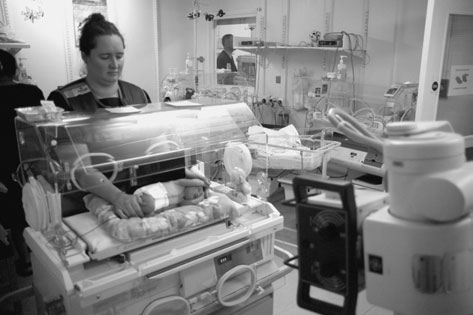
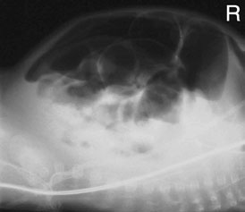
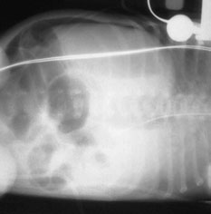
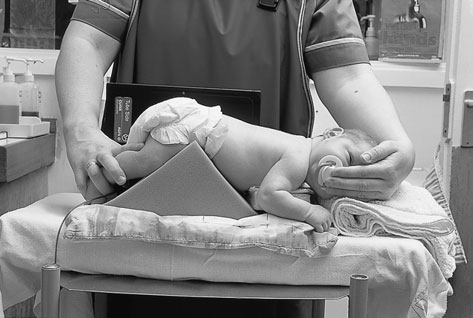
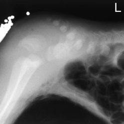
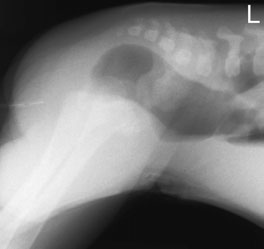

# Rx abdomen — anus imperforat (invertogramă în decubit ventral)

  📷 Radiografie Convențională (Rx)
  <strong>Actualizat:</strong> 2026-09-16
  <strong>Autor:</strong> Departamentul de Radiologie / Referință Clark (Ed. 12)

---

-   __1. Rezumat Clinic & Indicații__

    ---

    === "Indicații Clinice"

        - Deoarece radiografiile craniene implică o doză moderat de mare în comparație cu radiografiile simple, incluzând adesea serii de radiografii, justificarea este esențială. O bună colaborare clinico-radiologică, criterii de trimitere convenite și auditul sunt esențiale pentru menținerea la minimum a numărului de radiografii inutile (Cook et al. 1998). Unele studii sugerează că peste o treime dintre solicitările efectuate după traumatisme sunt inutile (Boulis et al. 1978), iar multe au raportat că absența suspiciunii de fractură nu modifică tratamentul (Garniak et al. 1986, Lloyd et al. 1997, Masters et al. 1987).

    === "Ghid Național IRIS"

        !!! info "Referință Primară: Ghidul Național IRIS (Ordinul MS 1342/2012)"
            - **Capitol Ghid IRIS:** *Pediatrie — Aparat digestiv*
            - **Grad de Recomandare:** **Grad B**
            - **Nivel de Iradiere Estimată:** `Clasa 1 (Minimă < 0.05 mSv)`

            [:octicons-search-16: Deschide Ghidul IRIS](../../iris.md){ .md-button .md-button--primary } [:material-open-in-new: Aplicația Oficială PWA](https://radiologie-pediatrica.ro/iris/){ .md-button target="_blank" rel="noopener" }

-   __2. Poziționare & Centrare Fascicul__

    ---

    - **Poziție Pacient:**
        - sugarul trebuie plasat în decubit ventral, cu bazinul și fesele ridicate pe o pernă triunghiulară din spumă, acoperită, sau pe un scutec rulat.
        - sugarul trebuie menținut în această poziție aproximativ 10–15 minute.
        - caseta este sprijinită vertical pe aspectul de profil al bazinului sugarului și ajustată paralel cu planul mediosagital.
    - **Punct de Centrare Fascicul:** • Raza centrală orizontală este orientată perpendicular pe centrul casetei.
    - **Distanță Focar-Film (DFF / SID):** 100 cm
    - **Comandă Respiratorie:** Apnee pe durata expunerii (apnee în inspir pentru torace; expir pentru Abdomen/bazin).

-   __3. Parametri Tehnici Expunere__

    ---

    | Parametru Tehnic | Valoare Configurare Generator / Tub |
    |:-----------------|:-------------------------------------|
    | **Tensiune Tub (kV)** | DE CONFIGURAT PE APARAT |
    | **Sarcină / Produs Curent-Timp (mAs)** | Conform AEC / grosimii anatomice |
    | **Distanță Focar-Film (DFF / SID)** | 100 cm |
    | **Grilă Antidifuzoare (Bucky)** | Conform grosimii anatomice (> 10-12 cm cu grilă) |
    | **Dimensiune Focar** | Focar Mic (0.6 mm) |
    | **Camere de Ionizare AEC** | DE CONFIGURAT PE APARAT |
    | **Colimare Fascicul** | Colimare strictă la aria anatomică de interes diagnostic |
    | **Filtrare Tub** | Totală ≥ 2.5 mm Al echivalent (conform Clark: 3.0 mm Al echivalent) |

-   __4. Criterii de Calitate & Reușită Imagine__

    ---

    - Vizualizarea clară a întregii arii anatomice (Abdomen).
    - Absența artefactelor de mișcare; trabeculație osoasă și contururi nete.
    - Densitate optică și contrast adecvate pentru diferențierea țesuturilor moi de structurile osoase.

-   __5. Protecție Radiologică (ALARA)__

    ---

    - Justificarea, optimizarea și tehnica atentă reprezintă cele mai bune modalități de respectare a ghidurilor de radioprotecție.
    - Evitarea utilizării unei grile la copiii cu vârsta sub un an este o măsură importantă pentru reducerea dozei.
    - Un timp scurt de expunere este deosebit de important la efectuarea radiografiei craniene, pentru a evita neclaritatea datorată mișcării. Timpul maxim de expunere trebuie să fie mai mic de 40ms.
    - Craniile copiilor sunt aproape complet dezvoltate până la vârsta de șapte ani; prin urmare, copiii cu vârsta peste aceasta necesită aproape aceeași expunere ca un adult.
    - Mâinile persoanei care ține copilul nu trebuie să fie vizibile pe radiografie.
    - Colimarea strânsă cu conuri circulare de dimensiuni variabile este cea mai potrivită pentru forma craniului. În acest fel, poate fi evitată și iradierea inutilă a tiroidei în cazurile fără traumatism. Colimarea poate fi introdusă deasupra camerei diamentor (vezi p. 388).
    - Incidențele occipitofrontale, atunci când este posibil, vor reduce doza la nivelul ochilor (Rosenbaum și Arnold 1978). De bază
    - Occipitofrontală
    - Frontoccipitală – 30 de grade caudal
    - Profil – alternativă
    - Incidențe frontoccipitale, dacă nu este inconștient
    - Occipitofrontală/frontoccipitală – inconștient și traumatism frontal specific
    - Profil pe partea afectată, dacă nu este inconștient
    - Frontoccipitală – inconștient și 30 de grade caudal, traumatism occipital specific
    - Profil pe partea afectată, dacă este inconștient
    - Occipitofrontală sau frontoccipitală, dacă prezintă semne de suspiciune de fractură
    - Frontoccipitală – 30 de grade caudal
    - Profil pe partea afectată
    - Ecranare gonadică cu șorț plumbat dacă gonadele sunt în apropierea fasciculului util (regula ALARA).
    - Colimare precisă la dimensiunea anatomică strict necesară pentru reducerea dozei și a radiației difuze.
    - Verificarea posibilității unei sarcini la pacientele de vârstă fertilă înainte de expunere.

!!! note "Observații Clinice & Tehnice"
    Un marker radioopac este fixat cu bandă adezivă pe piele, în regiunea anatomică în care s-ar afla în mod normal anusul. Distanța dintre acesta și cea mai distală ansă intestinală umplută cu aer poate fi apoi măsurată. Fotografie a unui nou-născut în decubit lateral stâng. Pentru manipulare minimă, decubitul dorsal reprezintă alternativa; imagine AP a abdomenului, decubit lateral stâng cu aer liber în jurul ficatului și decubit dorsal cu aer liber anterior. Fotografie a poziționării copilului pentru imaginile de profil ale abdomenului în decubit ventral, în cazul anusului imperforat. Limita inferioară a intestinului umplut cu aer este evidențiată în raport cu linia pubococcigiană. Stânga: obstrucție înaltă, cu granule radioopace la nivelul poziției anatomice a anusului; dreapta: obstrucție joasă, cu vârful tubului umplut cu bariu la nivelul anusului.

### 🖼️ Imagini

<figure class="protocol-image-card" markdown>

<figcaption><strong>• Radiografia abdominală anteroposterioară (AP) în decubit dorsal este</strong> — Poziționarea pacientului și centrarea fasciculului conform Clark (Ed. 12)</figcaption>

</figure>

<figure class="protocol-image-card" markdown>

<figcaption><strong>cea descrisă pentru radiografia toracică neonatală în non-</strong> — Aspect radiografic / ghid de poziționare conform tratatului Clark (Ed. 12)</figcaption>

</figure>

<figure class="protocol-image-card" markdown>

<figcaption><strong>• abdomenul este de obicei destins în aceste cazuri. Copilul trebuie să</strong> — Aspect radiografic / ghid de poziționare conform tratatului Clark (Ed. 12)</figcaption>

</figure>

<figure class="protocol-image-card" markdown>

<figcaption><strong>rămână în această poziție câteva minute înainte de efectuarea radiografiei</strong> — Aspect radiografic / ghid de poziționare conform tratatului Clark (Ed. 12)</figcaption>

</figure>

<figure class="protocol-image-card" markdown>

<figcaption><strong>radiografia combinată anteroposterioară (AP) a toracelui și abdomenului este</strong> — Aspect radiografic / ghid de poziționare conform tratatului Clark (Ed. 12)</figcaption>

</figure>

<figure class="protocol-image-card" markdown>

<figcaption><strong>intestinul distal pentru a evalua nivelul atreziei. Radiografia trebuie să</strong> — Aspect radiografic / ghid de poziționare conform tratatului Clark (Ed. 12)</figcaption>

</figure>

=== "Ghid Rapid de Execuție"

    1. **Identificarea și verificarea pacientului:** verificare identitate, zonă de examinat, consimțământ conform procedurii și evaluarea posibilității unei sarcini, când este relevantă.
    2. **Pregătire:** îndepărtarea oricăror obiecte radiopace (bijuterii, agrafe, fermoare, proteze, pansamente dense).
    3. **Poziționare precisă:** alinierea receptorului de imagine și a tubului la distanța prescrisă (100 cm).
    4. **Colimare strictă:** adaptarea fasciculului strict la regiunea de diagnostic pentru scăderea iradierii și reducerea radiației difuze.
    5. **Radioprotecție:** verificarea [politicii RX](../radioprotectie.md), cu măsuri distincte pentru pacient, personal și însoțitor.

## Surse de documentare

- [Clark's Positioning in Radiography (Ed. 12), Pagina 416](https://books.google.com/books/about/Clark_s_Positioning_in_Radiography.html?id=Xxu6MwEACAAJ)
