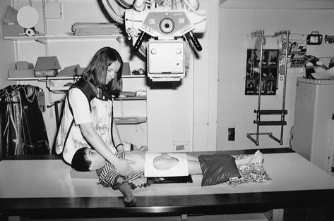
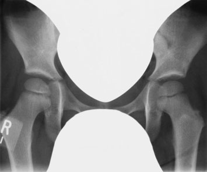
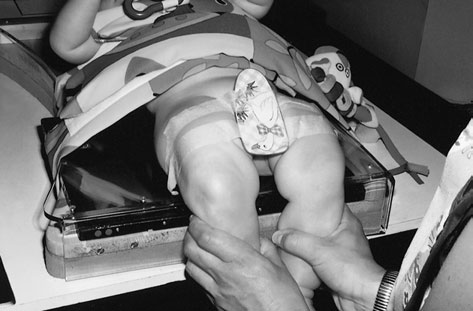
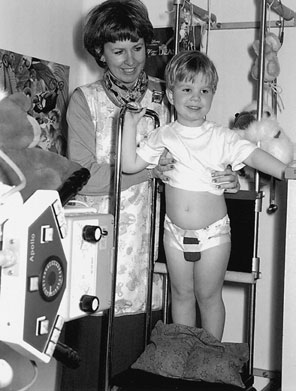
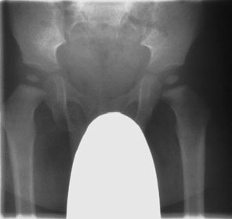
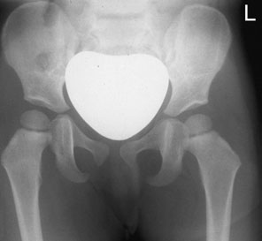
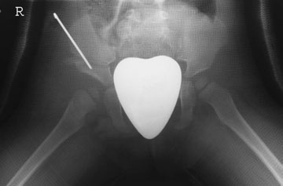

# Rx Bazin (Pelvis)/hips Antero-Posterior (AP)

  📷 Radiografie Convențională (Rx)
  <strong>Actualizat:</strong> 2026-09-16
  <strong>Autor:</strong> Departamentul de Radiologie / Referință Clark (Ed. 12)

---

-   __1. Rezumat Clinic & Indicații__

    ---

    === "Indicații Clinice"

        - Șold radiografii sunt common request în children, but initial ultrasound examination trebuie să always fie considered.
        - line drawn de la mid-Sacru through triradiate cartilage trebuie să pass through medial aspect de femoral metaphysis la exclude luxație articulară. Similarly, Shenton’s line (along superior găuri obturatoare și col femural) trebuie să fie uninterrupted. AP Ortostatism Photograph și imagine de male follow-up Antero-posterior (AP) Bazin (bazin (pelvis)) Ortostatism cu gonad protection imagine de female Antero-posterior (AP) Bazin (bazin (pelvis)) - Ortostatism cu Cord și Siluetă Cardiovasculară shaped gonad protection imagine de child în plaster cast following drept acetabuloplasty

    === "Ghid Național IRIS"

        !!! info "Referință Primară: Ghidul Național IRIS (Ordinul MS 1342/2012)"
            - **Capitol Ghid IRIS:** *Ghidul Național IRIS*
            - **Grad de Recomandare:** **De verificat pe indicație; fără grad atribuit automat**
            - **Nivel de Iradiere Estimată:** `De verificat pentru examinarea și populația selectate`

            [:octicons-search-16: Deschide Ghidul IRIS](../../iris.md){ .md-button .md-button--primary } [:material-open-in-new: Aplicația Oficială PWA](https://radiologie-pediatrica.ro/iris/){ .md-button target="_blank" rel="noopener" }
-   __2. Poziționare & Centrare Fascicul__

    ---

    - **Poziție Pacient:** • child lies Decubit dorsal pe masa radiologică, pe top de caseta sau specially designed casetă holder, which este plasat la end de masa de examinare, cu planul mediosagital de trunk la drept-angles la middle de caseta.
• la maintain this poziție, săculeți cu nisip este plasat pe either side de baby’s trunk, cu child’s brațe stâng unrestrained.
• baby’s membre inferioare sunt held straight, cu holder’s mâini poziționat firmly around fiecare membru inferior, holder’s Degete Mână under baby’s calves și holder’s thumbs pe genunchii.
• If using caseta holder la end de masa de examinare, genunchii trebuie să fie held together și flectat.
408
• pentru older child, positioning este similar la that described pentru adult (see p. 148).
    - **Punct de Centrare Fascicul:** • raza centrală verticală centrală este orientat la centre de caseta.
    - **Distanță Focar-Film (DFF / SID):** 100 cm
    - **Comandă Respiratorie:** Apnee pe durata expunerii (apnee în inspir pentru torace; expir pentru Abdomen/bazin).

-   __3. Parametri Tehnici Expunere__

    ---

    | Parametru Tehnic | Valoare Configurare Generator / Tub |
    |:-----------------|:-------------------------------------|
    | **Tensiune Tub (kV)** | DE CONFIGURAT PE APARAT |
    | **Sarcină / Produs Curent-Timp (mAs)** | Conform AEC / grosime anatomică |
    | **Distanță Focar-Film (DFF / SID)** | 100 cm |
    | **Grilă Antidifuzoare (Bucky)** | Conform grosimii anatomice (> 10-12 cm cu grilă) |
    | **Dimensiune Focar** | Focar Mic (0.6 mm) |
    | **Camere de Ionizare AEC** | DE CONFIGURAT PE APARAT |
    | **Colimare Fascicul** | Colimare strictă la aria anatomică de interes diagnostic |
    | **Filtrare Tub** | Totală ≥ 2.5 mm Al echivalent (conform Clark: 3.0 mm Al eq.) |

-   __4. Criterii de Calitate & Reușită Imagine__

    ---

    - Whole Bazin (bazin (pelvis)), Sacru și subtrochanteric regions de ambele femora. (creste iliace poate fie excluded în specific Șold pathology, e.g. Perthes’ disease.)
    - simetric, cu iliac wings și pubic rami de equal length. Femoral necks trebuie să nu fie foreshortened.
    - Visualization de Sacru și intervertebral foramina depending pe bowel content și presence de female protection. Reproduction de Articulații Sacroiliace according la age, cu reproduction de femoral necks.
    - Reproduction de spongiosa și cortex.
    - Visualization de trochanters consistent cu age.
    - Visualization de părți moi planes.
    - Erori de evitat / remedii: rotit pacient cu respect la caseta needs careful observation de Decubit dorsal pacient și menținerea technique.
    - Erori de evitat / remedii: Gonad protection missing, inadequate, too large sau slipped over region de interest. Gonad protection este most necessary during Șold radiografie. very careful technique este required. wide range de sizes și types sunt required. Experience este essential.

-   __5. Protecție Radiologică (ALARA)__

    ---

    - Gonad protection is not used for the initial examination.
    - Subsequent examinations require the use of gonad protection. If Ortostatism position is required, then gonad protection can be taped into position. Alternatively, a window-shaped coning device can be inserted beneath the light beam diaphragm.
    - Ecranare gonadică cu șorț plumbat dacă gonadele sunt în apropierea fasciculului util (regula ALARA).
    - Colimare precisă la dimensiunea anatomică strict necesară pentru reducerea dozei și a radiației difuze.
    - Verificarea posibilității unei sarcini la pacientele de vârstă fertilă înainte de expunere.

!!! note "Observații Clinice & Tehnice"
    Following surgery, low-dose CT poate fie used la evidențiază poziție de cap femural în pacienți treated cu use de long-term plaster cast.
Male child poziționat pentru Antero-posterior (AP) Decubit dorsal incidență de hips cu window protection imagine de Antero-posterior (AP) Bazin (bazin (pelvis)) evidențiind window gonad protection cu additional female protection over gonads Four-month-old baby boy poziționat pentru hips în imobilizare device cu shaped lead protection
• DDH/CDH
• Antero-posterior (AP) – Decubit dorsal
• Antero-posterior (AP) – Ortostatism
• Irritable hips
• Antero-posterior (AP)
• Profil (lateral) – frog incidență
• Post op pentru slipped epiphysis
• Antero-posterior (AP) – Decubit dorsal
• Turned Profil (lateral)
• Trauma
• Antero-posterior (AP) – Decubit dorsal
• Profil (lateral) – Fascicul Orizontal

### 🖼️ Imagini

<figure class="protocol-image-card" markdown>

<figcaption><strong>Initial pelvic și Șold radiografie este normally performed în con-</strong> — Poziționare pacient și centrare fascicul conform Clark (Ed. 12)</figcaption>

</figure>

<figure class="protocol-image-card" markdown>

<figcaption><strong>radiografie poate fie performed before sau during treatment,</strong> — Aspect radiografic / ghid de poziționare conform tratatului Clark (Ed. 12)</figcaption>

</figure>

<figure class="protocol-image-card" markdown>

<figcaption><strong>imagine de Antero-posterior (AP) Bazin (bazin (pelvis)) evidențiind window gonad protection cu</strong> — Aspect radiografic / ghid de poziționare conform tratatului Clark (Ed. 12)</figcaption>

</figure>

<figure class="protocol-image-card" markdown>

<figcaption><strong>Șold radiografie. very careful technique este required. wide</strong> — Aspect radiografic / ghid de poziționare conform tratatului Clark (Ed. 12)</figcaption>

</figure>

<figure class="protocol-image-card" markdown>

<figcaption><strong>• Șold radiografii sunt common request în children, but initial</strong> — Aspect radiografic / ghid de poziționare conform tratatului Clark (Ed. 12)</figcaption>

</figure>

<figure class="protocol-image-card" markdown>

<figcaption><strong>Figura 6: Aspect radiografic / Poziționare (Clark Ed. 12)</strong> — Aspect radiografic / ghid de poziționare conform tratatului Clark (Ed. 12)</figcaption>

</figure>

<figure class="protocol-image-card" markdown>

<figcaption><strong>Figura 7: Aspect radiografic / Poziționare (Clark Ed. 12)</strong> — Aspect radiografic / ghid de poziționare conform tratatului Clark (Ed. 12)</figcaption>

</figure>

=== "Ghid Rapid de Execuție"

    1. **Identificarea și verificarea pacientului:** verificare identitate, zonă de examinat, consimțământ conform procedurii și evaluarea posibilității unei sarcini, când este relevantă.
    2. **Pregătire:** îndepărtarea oricăror obiecte radiopace (bijuterii, agrafe, fermoare, proteze, pansamente dense).
    3. **Poziționare precisă:** alinierea receptorului de imagine și a tubului la distanța prescrisă (100 cm).
    4. **Colimare strictă:** adaptarea fasciculului strict la regiunea de diagnostic pentru scăderea iradierii și reducerea radiației difuze.
    5. **Radioprotecție:** verificarea [politicii RX](../radioprotectie.md), cu măsuri distincte pentru pacient, personal și însoțitor.

## Surse de documentare

- [Clark's Positioning in Radiography (Ed. 12), Pagina 423](../../assets/protocols/sources/Clark___Positioning_in_Radiography__12th_edition.pdf#page=423)
