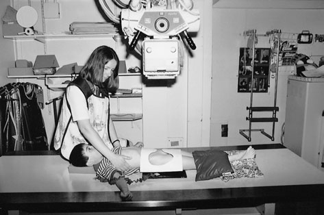
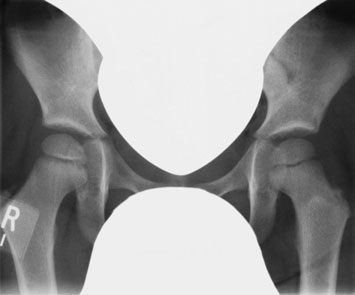
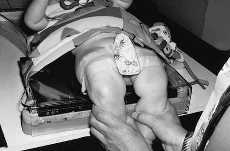
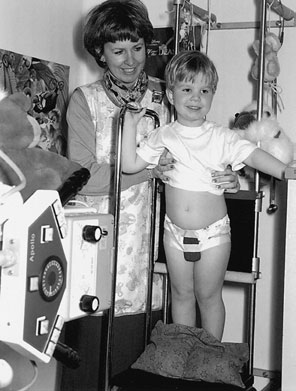
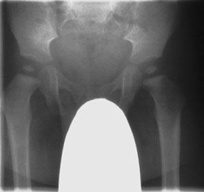
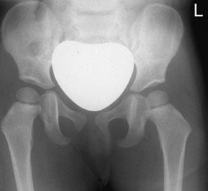
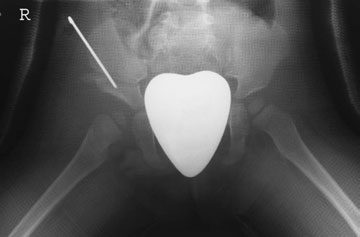

# Rx bazin/șolduri AP

  📷 Radiografie Convențională (Rx)
  <strong>Actualizat:</strong> 2026-09-16
  <strong>Autor:</strong> Departamentul de Radiologie / Referință Clark (Ed. 12)

---

-   __1. Rezumat Clinic & Indicații__

    ---

    === "Indicații Clinice"

        - Radiografiile de șold reprezintă o solicitare frecventă la copii, dar examinarea ecografică inițială trebuie întotdeauna luată în considerare.
        - Linia trasată de la mijlocul sacrului prin cartilajul triradiat trebuie să treacă prin aspectul medial al metafizei femurale pentru a exclude luxația articulară. În mod similar, linia lui Shenton (de-a lungul marginilor superioare ale găurilor obturatoare și colului femural) trebuie să fie neîntreruptă. Fotografie AP în ortostatism și imagine de control AP de bazin la pacient de sex masculin, în ortostatism, cu protecție gonadică; imagine AP de bazin la pacientă, în ortostatism, cu protecție gonadică în formă de inimă și siluetă cardiovasculară; imagine de copil în aparat gipsat după acetabuloplastie dreaptă

    === "Ghid Național IRIS"

        !!! info "Referință Primară: Ghidul Național IRIS (Ordinul MS 1342/2012)"
            - **Capitol Ghid IRIS:** *Pediatrie — Aparat locomotor*
            - **Grad de Recomandare:** **Grad A**
            - **Nivel de Iradiere Estimată:** `Clasa 1 (Minimă < 0.01 mSv)`

            [:octicons-search-16: Deschide Ghidul IRIS](../../iris.md){ .md-button .md-button--primary } [:material-open-in-new: Aplicația Oficială PWA](https://radiologie-pediatrica.ro/iris/){ .md-button target="_blank" rel="noopener" }

-   __2. Poziționare & Centrare Fascicul__

    ---

    - **Poziție Pacient:**
        - copilul se află în decubit dorsal pe masa radiologică, deasupra casetei sau a unui suport de casetă special conceput, care este plasat la capătul mesei de examinare, cu planul mediosagital al trunchiului perpendicular pe mijlocul casetei.
        - Pentru menținerea acestei poziții, pe fiecare parte a trunchiului copilului se plasează săculeți cu nisip, brațele copilului rămânând neimobilizate.
        - Membrele inferioare ale copilului sunt menținute întinse, mâinile persoanei care îl ține fiind poziționate ferm în jurul fiecărui membru inferior, degetele sub gambele copilului și policele pe genunchi.
        - Dacă se utilizează un suport de casetă la capătul mesei de examinare, genunchii trebuie menținuți împreună și flectați. 408
        - Pentru copilul mai mare, poziționarea este similară celei descrise pentru adult (vezi p. 148).
    - **Punct de Centrare Fascicul:** • Raza centrală verticală este orientată spre centrul casetei.
    - **Distanță Focar-Film (DFF / SID):** 100 cm
    - **Comandă Respiratorie:** Apnee pe durata expunerii (apnee în inspir pentru torace; expir pentru Abdomen/bazin).

-   __3. Parametri Tehnici Expunere__

    ---

    | Parametru Tehnic | Valoare Configurare Generator / Tub |
    |:-----------------|:-------------------------------------|
    | **Tensiune Tub (kV)** | DE CONFIGURAT PE APARAT |
    | **Sarcină / Produs Curent-Timp (mAs)** | Conform AEC / grosimii anatomice |
    | **Distanță Focar-Film (DFF / SID)** | 100 cm |
    | **Grilă Antidifuzoare (Bucky)** | Conform grosimii anatomice (> 10-12 cm cu grilă) |
    | **Dimensiune Focar** | Focar Mic (0.6 mm) |
    | **Camere de Ionizare AEC** | DE CONFIGURAT PE APARAT |
    | **Colimare Fascicul** | Colimare strictă la aria anatomică de interes diagnostic |
    | **Filtrare Tub** | Totală ≥ 2.5 mm Al echivalent (conform Clark: 3.0 mm Al echivalent) |

-   __4. Criterii de Calitate & Reușită Imagine__

    ---

    - Întregul bazin, sacrul și regiunile subtrohanteriene ale ambelor femure. (Crestele iliace pot fi excluse în patologia specifică a șoldului, de exemplu boala Perthes.)
    - Simetric, cu aripile iliace și ramurile pubiene de lungime egală. Colurile femurale nu trebuie să fie scurtate prin proiecție.
    - Vizualizarea sacrului și a găurilor intervertebrale depinde de conținutul intestinal și de prezența protecției feminine. Reproducerea articulațiilor sacroiliace în funcție de vârstă, cu reproducerea colurilor femurale.
    - Reproducerea spongioasei și a corticalei.
    - Vizualizarea trohanterilor în concordanță cu vârsta.
    - Vizualizarea planurilor de țesuturi moi.
    - Erori de evitat / remedii: rotirea pacientului în raport cu caseta necesită observarea atentă a pacientului în decubit dorsal și menținerea tehnicii.
    - Erori de evitat / remedii: protecție gonadică absentă, inadecvată, prea mare sau deplasată peste regiunea de interes. Protecția gonadică este deosebit de necesară în timpul radiografiei de șold. Este necesară o tehnică foarte atentă. Sunt necesare numeroase dimensiuni și tipuri. Experiența este esențială.

-   __5. Protecție Radiologică (ALARA)__

    ---

    - Protecția gonadică nu se utilizează la examinarea inițială.
    - Examinările ulterioare necesită utilizarea protecției gonadice. Dacă este necesară poziția în ortostatism, protecția gonadică poate fi fixată cu bandă adezivă. Alternativ, un dispozitiv de colimare în formă de fereastră poate fi introdus sub diafragma fasciculului luminos.
    - Ecranare gonadică cu șorț plumbat dacă gonadele sunt în apropierea fasciculului util (regula ALARA).
    - Colimare precisă la dimensiunea anatomică strict necesară pentru reducerea dozei și a radiației difuze.
    - Verificarea posibilității unei sarcini la pacientele de vârstă fertilă înainte de expunere.

!!! note "Observații Clinice & Tehnice"
    După intervenția chirurgicală, CT-ul cu doză redusă poate fi utilizat pentru evidențierea poziției capului femural la pacienții tratați prin utilizarea unui aparat gipsat de lungă durată.

    Copil de sex masculin poziționat pentru incidența AP de șolduri, în decubit dorsal, cu protecție fenestrată; imagine AP de bazin evidențiind protecția gonadică fenestrată, cu protecție feminină suplimentară peste gonade; băiețel de patru luni poziționat pentru radiografia șoldurilor într-un dispozitiv de imobilizare, cu protecție din plumb în formă de inimă

    - DDH/CDH
    - AP – decubit dorsal
    - AP – ortostatism
    - Șolduri iritabile
    - AP
    - Profil – incidență în poziție „broască”
    - Postoperator pentru epifizioliză
    - AP – decubit dorsal
    - Profil rotat
    - Traumă
    - AP – decubit dorsal
    - Profil – fascicul orizontal

### 🖼️ Imagini

<figure class="protocol-image-card" markdown>

<figcaption><strong>Radiografia inițială a bazinului și șoldului este efectuată de obicei în con-</strong> — Poziționarea pacientului și centrarea fasciculului conform Clark (Ed. 12)</figcaption>

</figure>

<figure class="protocol-image-card" markdown>

<figcaption><strong>Radiografia poate fi efectuată înaintea sau în timpul tratamentului,</strong> — Aspect radiografic / ghid de poziționare conform tratatului Clark (Ed. 12)</figcaption>

</figure>

<figure class="protocol-image-card" markdown>

<figcaption><strong>imagine AP de bazin evidențiind protecția gonadică fenestrată cu</strong> — Aspect radiografic / ghid de poziționare conform tratatului Clark (Ed. 12)</figcaption>

</figure>

<figure class="protocol-image-card" markdown>

<figcaption><strong>Radiografie de șold. Este necesară o tehnică foarte atentă. Este necesară o gamă largă</strong> — Aspect radiografic / ghid de poziționare conform tratatului Clark (Ed. 12)</figcaption>

</figure>

<figure class="protocol-image-card" markdown>

<figcaption><strong>• Radiografiile de șold reprezintă o solicitare frecventă la copii, dar examinarea inițială</strong> — Aspect radiografic / ghid de poziționare conform tratatului Clark (Ed. 12)</figcaption>

</figure>

<figure class="protocol-image-card" markdown>

<figcaption><strong>Figura 6: Aspect radiografic / Poziționare (Clark Ed. 12)</strong> — Aspect radiografic / ghid de poziționare conform tratatului Clark (Ed. 12)</figcaption>

</figure>

<figure class="protocol-image-card" markdown>

<figcaption><strong>Figura 7: Aspect radiografic / Poziționare (Clark Ed. 12)</strong> — Aspect radiografic / ghid de poziționare conform tratatului Clark (Ed. 12)</figcaption>

</figure>

=== "Ghid Rapid de Execuție"

    1. **Identificarea și verificarea pacientului:** verificare identitate, zonă de examinat, consimțământ conform procedurii și evaluarea posibilității unei sarcini, când este relevantă.
    2. **Pregătire:** îndepărtarea oricăror obiecte radiopace (bijuterii, agrafe, fermoare, proteze, pansamente dense).
    3. **Poziționare precisă:** alinierea receptorului de imagine și a tubului la distanța prescrisă (100 cm).
    4. **Colimare strictă:** adaptarea fasciculului strict la regiunea de diagnostic pentru scăderea iradierii și reducerea radiației difuze.
    5. **Radioprotecție:** verificarea [politicii RX](../radioprotectie.md), cu măsuri distincte pentru pacient, personal și însoțitor.

## Surse de documentare

- [Clark's Positioning in Radiography (Ed. 12), Pagina 423](https://books.google.com/books/about/Clark_s_Positioning_in_Radiography.html?id=Xxu6MwEACAAJ)
