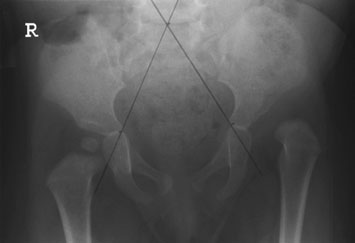
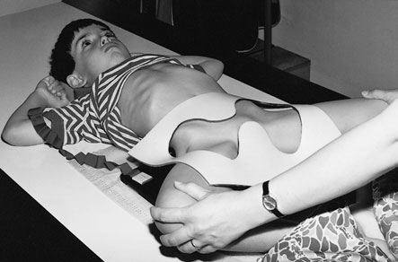
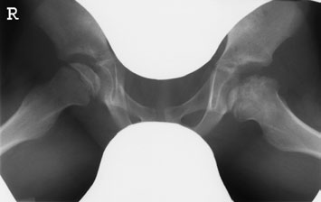
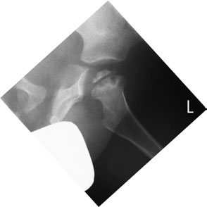
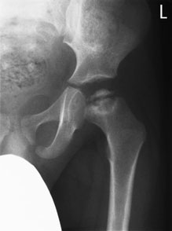
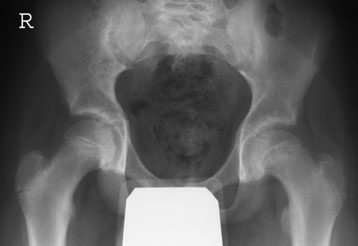

# Rx Bazin (Pelvis)/hips Incidența Von Rosen (Displazie Șold)

  📷 Radiografie Convențională (Rx)
  <strong>Actualizat:</strong> 2026-09-16
  <strong>Autor:</strong> Departamentul de Radiologie / Referință Clark (Ed. 12)

---

-   __1. Rezumat Clinic & Indicații__

    ---

    === "Indicații Clinice"

        - ossification centre de cap femural tends la fie little eccentric și Profil (lateral), particularly following treatment pentru DDH. This poate give false impression de decentring. grade de luxație articulară și decentring este best assessed prin drawing line through mid-Sacru și triradiate cartilage. This line trebuie să pass through medial aspect de femoral metaphysis. use de this line în straight Antero-posterior (AP) radiografie de șoldurile este preferred la Incidența Von Rosen (Displazie Șold). Profil (lateral) – ambele hips (frog incidență) This incidență poate fie employed la supplement anteroposterior incidență în investigation de irritable hips.

    === "Ghid Național IRIS"

        !!! info "Referință Primară: Ghidul Național IRIS (Ordinul MS 1342/2012)"
            - **Capitol Ghid IRIS:** *Ghidul Național IRIS*
            - **Grad de Recomandare:** **De verificat pe indicație; fără grad atribuit automat**
            - **Nivel de Iradiere Estimată:** `De verificat pentru examinarea și populația selectate`

            [:octicons-search-16: Deschide Ghidul IRIS](../../iris.md){ .md-button .md-button--primary } [:material-open-in-new: Aplicația Oficială PWA](https://radiologie-pediatrica.ro/iris/){ .md-button target="_blank" rel="noopener" }
-   __2. Poziționare & Centrare Fascicul__

    ---

    - **Poziție Pacient:** • child lies Decubit dorsal pe masa radiologică, pe top de caseta, cu planul mediosagital de trunk la rightangles la middle de caseta.
• la maintain this poziție when examining baby, săculeți cu nisip este plasat either side de baby’s trunk, cu brațele stâng unrestrained.
• anterior superior iliac spines trebuie să fie echidistant față de couch top la ensure that Bazin (bazin (pelvis)) este nu rotit.
• șoldurile și genunchi sunt flectat.
• limbs sunt then rotit laterally through approximately 60 grade, cu genunchii separated și plantar aspects de picioarele plasat în contact cu fiecare other.
• child poate fie sprijinit în this poziție cu non-opaque pads.
• caseta este centred la nivelul femoral pulse și trebuie să include ambele hips.
    - **Punct de Centrare Fascicul:** • raza centrală verticală centrală este orientat în linia mediană la nivelul femoral pulse.
410 Bazin (bazin (pelvis)) de infant cu line drawn de la mid Sacru through triradiate cartilage which trebuie să cross medial upper femoral metaphysis evidențiind obvious stâng luxație articulară Child poziționat pentru frog incidență de hips cu window protection imagine de male pacient pentru frog incidență de hips cu window protection evidențiind bilateral Perthes’ disease imagine de Antero-posterior (AP) și turned Profil (lateral) de stâng Șold evidențiind stâng cap femural Perthes’ disease. Note: gonadal protection pentru toate follow-up imagini imagine de Antero-posterior (AP) hips cu SUFE pe stâng
    - **Distanță Focar-Film (DFF / SID):** 100 cm
    - **Comandă Respiratorie:** Apnee pe durata expunerii (apnee în inspir pentru torace; expir pentru Abdomen/bazin).

-   __3. Parametri Tehnici Expunere__

    ---

    | Parametru Tehnic | Valoare Configurare Generator / Tub |
    |:-----------------|:-------------------------------------|
    | **Tensiune Tub (kV)** | DE CONFIGURAT PE APARAT |
    | **Sarcină / Produs Curent-Timp (mAs)** | Conform AEC / grosime anatomică |
    | **Distanță Focar-Film (DFF / SID)** | 100 cm |
    | **Grilă Antidifuzoare (Bucky)** | Conform grosimii anatomice (> 10-12 cm cu grilă) |
    | **Dimensiune Focar** | Focar Mic (0.6 mm) |
    | **Camere de Ionizare AEC** | DE CONFIGURAT PE APARAT |
    | **Colimare Fascicul** | Colimare strictă la aria anatomică de interes diagnostic |
    | **Filtrare Tub** | Totală ≥ 2.5 mm Al echivalent (conform Clark: 3.0 mm Al eq.) |

-   __4. Criterii de Calitate & Reușită Imagine__

    ---

    - Vizualizarea clară întregii arii anatomice (Bazin (bazin (pelvis))/hips).
    - Absența artefactelor de mișcare; trabeculație osoasă și contururi nete.
    - Densitate optică și contrast adecvate pentru diferențierea țesuturilor moi de structurile osoase.

-   __5. Protecție Radiologică (ALARA)__

    ---

    - Ecranare gonadică cu șorț plumbat dacă gonadele sunt în apropierea fasciculului util (regula ALARA).
    - Colimare precisă la dimensiunea anatomică strict necesară pentru reducerea dozei și a radiației difuze.
    - Verificarea posibilității unei sarcini la pacientele de vârstă fertilă înainte de expunere.

!!! note "Observații Clinice & Tehnice"
    Pregătirea pacientului prin îndepărtarea tuturor accesoriilor radio-opace.

### 🖼️ Imagini

<figure class="protocol-image-card" markdown>

<figcaption><strong>use de this line în straight Antero-posterior (AP) radiografie de the</strong> — Poziționare pacient și centrare fascicul conform Clark (Ed. 12)</figcaption>

</figure>

<figure class="protocol-image-card" markdown>

<figcaption><strong>evidențiind obvious stâng luxație articulară</strong> — Aspect radiografic / ghid de poziționare conform tratatului Clark (Ed. 12)</figcaption>

</figure>

<figure class="protocol-image-card" markdown>

<figcaption><strong>imagine de Antero-posterior (AP) și turned Profil (lateral) de stâng Șold evidențiind stâng femoral</strong> — Aspect radiografic / ghid de poziționare conform tratatului Clark (Ed. 12)</figcaption>

</figure>

<figure class="protocol-image-card" markdown>

<figcaption><strong>Figura 4: Aspect radiografic / Poziționare (Clark Ed. 12)</strong> — Aspect radiografic / ghid de poziționare conform tratatului Clark (Ed. 12)</figcaption>

</figure>

<figure class="protocol-image-card" markdown>

<figcaption><strong>Figura 5: Aspect radiografic / Poziționare (Clark Ed. 12)</strong> — Aspect radiografic / ghid de poziționare conform tratatului Clark (Ed. 12)</figcaption>

</figure>

<figure class="protocol-image-card" markdown>

<figcaption><strong>Figura 6: Aspect radiografic / Poziționare (Clark Ed. 12)</strong> — Aspect radiografic / ghid de poziționare conform tratatului Clark (Ed. 12)</figcaption>

</figure>

=== "Ghid Rapid de Execuție"

    1. **Identificarea și verificarea pacientului:** verificare identitate, zonă de examinat, consimțământ conform procedurii și evaluarea posibilității unei sarcini, când este relevantă.
    2. **Pregătire:** îndepărtarea oricăror obiecte radiopace (bijuterii, agrafe, fermoare, proteze, pansamente dense).
    3. **Poziționare precisă:** alinierea receptorului de imagine și a tubului la distanța prescrisă (100 cm).
    4. **Colimare strictă:** adaptarea fasciculului strict la regiunea de diagnostic pentru scăderea iradierii și reducerea radiației difuze.
    5. **Radioprotecție:** verificarea [politicii RX](../radioprotectie.md), cu măsuri distincte pentru pacient, personal și însoțitor.

## Surse de documentare

- [Clark's Positioning in Radiography (Ed. 12), Pagina 425](../../assets/protocols/sources/Clark___Positioning_in_Radiography__12th_edition.pdf#page=425)
