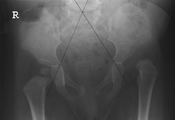
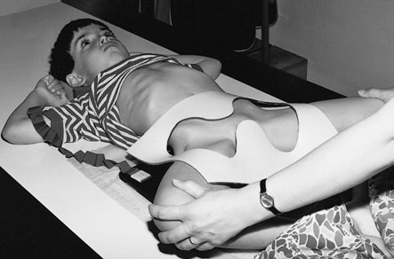
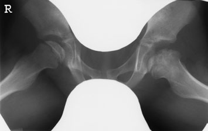
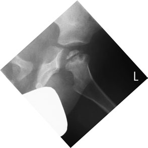
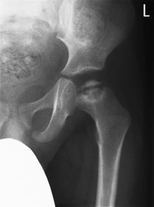
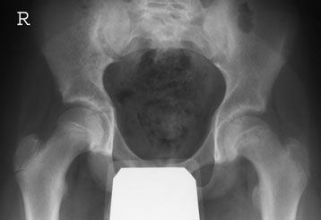

# Rx bazin/șolduri — incidența Von Rosen (displazia de șold)

  📷 Radiografie Convențională (Rx)
  <strong>Actualizat:</strong> 2026-09-16
  <strong>Autor:</strong> Departamentul de Radiologie / Referință Clark (Ed. 12)

---

-   __1. Rezumat Clinic & Indicații__

    ---

    === "Indicații Clinice"

        - Centrul de osificare al capului femural tinde să fie ușor excentric și de profil, în special după tratamentul pentru DDH. Acest lucru poate da impresia falsă de decentrare. Gradul luxației articulare și al decentării este cel mai bine evaluat prin trasarea unei linii prin mijlocul sacrului și cartilajul triradiat. Această linie trebuie să treacă prin aspectul medial al metafizei femurale. Utilizarea acestei linii în radiografia AP directă a șoldurilor este preferată incidenței Von Rosen (displazia de șold). Profil – ambele șolduri (incidență în poziție „broască”). Această incidență poate fi utilizată pentru completarea incidenței anteroposterioare în investigarea șoldurilor iritabile.

    === "Ghid Național IRIS"

        !!! info "Referință Primară: Ghidul Național IRIS (Ordinul MS 1342/2012)"
            - **Capitol Ghid IRIS:** *Pediatrie — Aparat locomotor*
            - **Grad de Recomandare:** **Grad A**
            - **Nivel de Iradiere Estimată:** `Clasa 1 (Minimă < 0.01 mSv)`

            [:octicons-search-16: Deschide Ghidul IRIS](../../iris.md){ .md-button .md-button--primary } [:material-open-in-new: Aplicația Oficială PWA](https://radiologie-pediatrica.ro/iris/){ .md-button target="_blank" rel="noopener" }

-   __2. Poziționare & Centrare Fascicul__

    ---

    - **Poziție Pacient:**
        - Copilul se află în decubit dorsal pe masa radiologică, deasupra casetei, cu planul mediosagital al trunchiului perpendicular pe mijlocul casetei.
        - Pentru menținerea acestei poziții la examinarea sugarului, se plasează săculeți cu nisip de fiecare parte a trunchiului sugarului, brațele rămânând neimobilizate.
        - Spinele iliace anterosuperioare trebuie să fie echidistante față de suprafața mesei, pentru a asigura că bazinul nu este rotit.
        - Șoldurile și genunchii sunt flectați.
        - Membrele sunt apoi rotite lateral aproximativ 60 de grade, cu genunchii depărtați și fețele plantare ale picioarelor plasate în contact una cu cealaltă.
        - Copilul poate fi susținut în această poziție cu suporturi radiotransparente.
        - Caseta este centrată la nivelul pulsului femural și trebuie să includă ambele șolduri.
    - **Punct de Centrare Fascicul:**
        - Raza centrală verticală este utilizată, iar fasciculul este colimat și centrat pe casetă pentru a include întreaga coloană vertebrală. 410 Bazin de sugar cu linie trasată de la mijlocul sacrului prin cartilajul triradiat, care trebuie să intersecteze porțiunea medială a metafizei femurale superioare, evidențiind o luxație articulară stângă evidentă; copil poziționat pentru incidența în poziție „broască” a șoldurilor, cu protecție fenestrată; imagine de pacient de sex masculin pentru incidența în poziție „broască” a șoldurilor, cu protecție fenestrată, evidențiind boala Perthes bilaterală; imagine AP și de profil rotat a șoldului stâng, evidențiind boala Perthes a capului femural stâng. Notă: protecție gonadică pentru toate imaginile de control; imagine AP a șoldurilor cu SUFE pe stânga
    - **Distanță Focar-Film (DFF / SID):** 100 cm
    - **Comandă Respiratorie:** Apnee pe durata expunerii (apnee în inspir pentru torace; expir pentru Abdomen/bazin).

-   __3. Parametri Tehnici Expunere__

    ---

    | Parametru Tehnic | Valoare Configurare Generator / Tub |
    |:-----------------|:-------------------------------------|
    | **Tensiune Tub (kV)** | DE CONFIGURAT PE APARAT |
    | **Sarcină / Produs Curent-Timp (mAs)** | Conform AEC / grosimii anatomice |
    | **Distanță Focar-Film (DFF / SID)** | 100 cm |
    | **Grilă Antidifuzoare (Bucky)** | Conform grosimii anatomice (> 10-12 cm cu grilă) |
    | **Dimensiune Focar** | Focar Mic (0.6 mm) |
    | **Camere de Ionizare AEC** | DE CONFIGURAT PE APARAT |
    | **Colimare Fascicul** | Colimare strictă la aria anatomică de interes diagnostic |
    | **Filtrare Tub** | Totală ≥ 2.5 mm Al echivalent (conform Clark: 3.0 mm Al echivalent) |

-   __4. Criterii de Calitate & Reușită Imagine__

    ---

    - Vizualizarea clară a întregii arii anatomice (bazin/șolduri).
    - Absența artefactelor de mișcare; trabeculație osoasă și contururi nete.
    - Densitate optică și contrast adecvate pentru diferențierea țesuturilor moi de structurile osoase.

-   __5. Protecție Radiologică (ALARA)__

    ---

    - Ecranare gonadică cu șorț plumbat dacă gonadele sunt în apropierea fasciculului util (regula ALARA).
    - Colimare precisă la dimensiunea anatomică strict necesară pentru reducerea dozei și a radiației difuze.
    - Verificarea posibilității unei sarcini la pacientele de vârstă fertilă înainte de expunere.

!!! note "Observații Clinice & Tehnice"
    Pregătirea pacientului prin îndepărtarea tuturor accesoriilor radio-opace.

### 🖼️ Imagini

<figure class="protocol-image-card" markdown>

<figcaption><strong>Utilizarea acestei linii în radiografia AP directă a</strong> — Poziționarea pacientului și centrarea fasciculului conform Clark (Ed. 12)</figcaption>

</figure>

<figure class="protocol-image-card" markdown>

<figcaption><strong>evidențiind o luxație articulară stângă evidentă</strong> — Aspect radiografic / ghid de poziționare conform tratatului Clark (Ed. 12)</figcaption>

</figure>

<figure class="protocol-image-card" markdown>

<figcaption><strong>imagine AP și de profil rotat a șoldului stâng, evidențiind capul femural stâng</strong> — Aspect radiografic / ghid de poziționare conform tratatului Clark (Ed. 12)</figcaption>

</figure>

<figure class="protocol-image-card" markdown>

<figcaption><strong>Figura 4: Aspect radiografic / Poziționare (Clark Ed. 12)</strong> — Aspect radiografic / ghid de poziționare conform tratatului Clark (Ed. 12)</figcaption>

</figure>

<figure class="protocol-image-card" markdown>

<figcaption><strong>Figura 5: Aspect radiografic / Poziționare (Clark Ed. 12)</strong> — Aspect radiografic / ghid de poziționare conform tratatului Clark (Ed. 12)</figcaption>

</figure>

<figure class="protocol-image-card" markdown>

<figcaption><strong>Figura 6: Aspect radiografic / Poziționare (Clark Ed. 12)</strong> — Aspect radiografic / ghid de poziționare conform tratatului Clark (Ed. 12)</figcaption>

</figure>

=== "Ghid Rapid de Execuție"

    1. **Identificarea și verificarea pacientului:** verificare identitate, zonă de examinat, consimțământ conform procedurii și evaluarea posibilității unei sarcini, când este relevantă.
    2. **Pregătire:** îndepărtarea oricăror obiecte radiopace (bijuterii, agrafe, fermoare, proteze, pansamente dense).
    3. **Poziționare precisă:** alinierea receptorului de imagine și a tubului la distanța prescrisă (100 cm).
    4. **Colimare strictă:** adaptarea fasciculului strict la regiunea de diagnostic pentru scăderea iradierii și reducerea radiației difuze.
    5. **Radioprotecție:** verificarea [politicii RX](../radioprotectie.md), cu măsuri distincte pentru pacient, personal și însoțitor.

## Surse de documentare

- [Clark's Positioning in Radiography (Ed. 12), Pagina 425](https://books.google.com/books/about/Clark_s_Positioning_in_Radiography.html?id=Xxu6MwEACAAJ)
