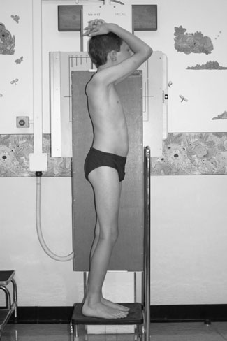
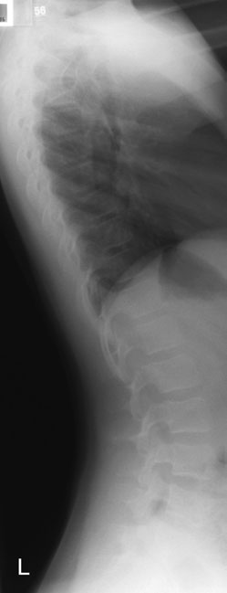
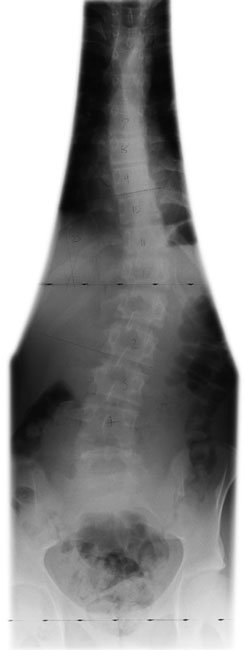
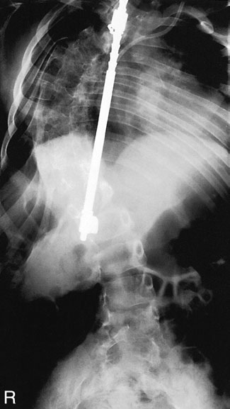
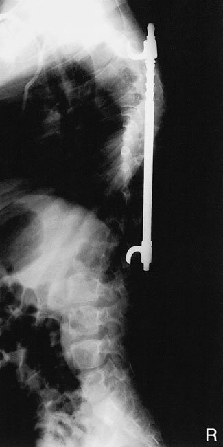

# Rx Coloană Vertebrală (Bilanț Scolioză) Profil (Lateral)

  📷 Radiografie Convențională (Rx)
  <strong>Actualizat:</strong> 2026-09-16
  <strong>Autor:</strong> Departamentul de Radiologie / Referință Clark (Ed. 12)

---

-   __1. Rezumat Clinic & Indicații__

    ---

    === "Indicații Clinice"

        - most common referral pentru scoliosis este now idiopathic scoliosis. Affected children sunt otherwise completely normal, cu normal life expectancy. Multiple radiografii pentru monitoring sunt required, și therefore dose-saving measures sunt important.
        - Scoliosis este described ca being de early onset (before five years) și late onset. Those who develop large curves early have higher risk de developing cardiovascular complications.
        - Secondary spinal scoliosis este now less common în most centres. main causes being: congenital (including hemivertebrae), neuromuscular disorders și neurofibromatosis. Tuberculosis este uncommon și polio este now rare. However, it este still extremely important la exclude underlying disease și MRI sau scintigraphy este advised în toate pacienți cu atypical ‘idiopathic’ scoliosis sau painful scoliosis (latter typically being due la osteoid osteoma). MRI trebuie să also fie considered preoperatively la exclude lesions such ca syringomyelia.
        - When secondary scoliosis este suspected due la abnormalities seen pe first thoraco-lumbar coloană vertebrală imagine, coned incidențe, cervical coloană vertebrală și pelvic radiografii poate fie considered pentru additional assessment.
        - Profil (lateral) curvature de idiopathic scoliosis este usually convex la drept giving drept-sided hump și este accompanied prin rotație de vertebre pe vertical axis. This thrusts Coaste (Grilaj Costal) backwards în thoracic area și increases ugliness de deformity. rotary component makes disease more complex than cosmetic deformity și rotație de Torace poate lead la compression de Cord și Siluetă Cardiovasculară și Torace (Câmpuri Pulmonare), whereas lumbar curves poate predispose la later degenerative changes.
        - goal de therapy este la keep primary curve less than 40 grade la end de growth; small curves de less than 15 grade sunt usually nu treated. Curves de 20–40 grade sunt managed în corp brace, și curves de more than 40 grade usually have spinal fusion (e.g. metal Harrington rod). Follow-up imagini de pacienți cu Harrington rod will need la show orice breakage de rods sau surrounding Luque wiring.
        - assessment de skeletal age este required so that appropriate treatment poate fie planned. development de iliac apophyses (Risser’s sign) correlates well cu skeletal maturity, ca determined prin assessing bone age la Mână și Pumn (Articulație Radiocarpiană) (Dhar et al. 1993). iliac apophyses first appear laterally și anteriorly pe crest de ilium. Growth develops posteriorly și medially, followed prin fusion la crestele iliace. Increasing ossification correlates cu decreased progression. Postero-anterior (PA) Ortostatism imagine evidențiind Harrington rod Profil (lateral) Ortostatism imagine evidențiind Harrington rod

    === "Ghid Național IRIS"

        !!! info "Referință Primară: Ghidul Național IRIS (Ordinul MS 1342/2012)"
            - **Capitol Ghid IRIS:** *Ghidul Național IRIS*
            - **Grad de Recomandare:** **De verificat pe indicație; fără grad atribuit automat**
            - **Nivel de Iradiere Estimată:** `De verificat pentru examinarea și populația selectate`

            [:octicons-search-16: Deschide Ghidul IRIS](../../iris.md){ .md-button .md-button--primary } [:material-open-in-new: Aplicația Oficială PWA](https://radiologie-pediatrica.ro/iris/){ .md-button target="_blank" rel="noopener" }
-   __2. Poziționare & Centrare Fascicul__

    ---

    - **Poziție Pacient:** • pacientul stă în ortostatism cu their bare picioare slightly apart, cu side de convexity de primary curve pe / sprijinit de stativ vertical Bucky.
• Care este taken la ensure that pacientul does nu lean spre caseta.
• lower edge de caseta este plasat 1.5 cm below crestele iliace.
• mid-axillary line este centred la caseta. plan coronal trebuie să fie la drept-angles la caseta.
• latter poate fie assessed prin palpating anterior iliac spines și rotating pacientul so that line joining two sides este la drept-angles la caseta.
• Similarly, line joining Profil (lateral) end de clavicles trebuie să fie la drept-angles la caseta.
• brațele sunt folded over capul.
    - **Punct de Centrare Fascicul:** • orizontal raza centrală este employed, și fascicul este collimated și centred la caseta pentru include whole spinal column.
• lower collimation margine este poziționat la nivelul anterior superior iliac spines, thus ensuring inclusion de first sacral segment.
• upper margine trebuie să fie la nivelul spinous process de C7.
• increased FFD este used la ensure correct, whole anatomical area este covered (180–200 cm).
    - **Distanță Focar-Film (DFF / SID):** 100 cm
    - **Comandă Respiratorie:** Apnee pe durata expunerii (apnee în inspir pentru torace; expir pentru Abdomen/bazin).

-   __3. Parametri Tehnici Expunere__

    ---

    | Parametru Tehnic | Valoare Configurare Generator / Tub |
    |:-----------------|:-------------------------------------|
    | **Tensiune Tub (kV)** | DE CONFIGURAT PE APARAT |
    | **Sarcină / Produs Curent-Timp (mAs)** | Conform AEC / grosime anatomică |
    | **Distanță Focar-Film (DFF / SID)** | 100 cm |
    | **Grilă Antidifuzoare (Bucky)** | Cu grilă antidifuzoare Bucky |
    | **Dimensiune Focar** | Focar Mic (0.6 mm) |
    | **Camere de Ionizare AEC** | Camerele laterale (sau camera centrală funcție de regiune) |
    | **Colimare Fascicul** | Colimare strictă adaptată pe receptor 35 x 43 cm |
    | **Filtrare Tub** | Totală ≥ 2.5 mm Al echivalent (conform Clark: 3.0 mm Al eq.) |

-   __4. Criterii de Calitate & Reușită Imagine__

    ---

    - Vizualizarea clară întregii arii anatomice (Coloană Vertebrală (Bilanț Scolioză)).
    - Absența artefactelor de mișcare; trabeculație osoasă și contururi nete.
    - Densitate optică și contrast adecvate pentru diferențierea țesuturilor moi de structurile osoase.

-   __5. Protecție Radiologică (ALARA)__

    ---

    - Ecranare gonadică cu șorț plumbat dacă gonadele sunt în apropierea fasciculului util (regula ALARA).
    - Colimare precisă la dimensiunea anatomică strict necesară pentru reducerea dozei și a radiației difuze.
    - Verificarea posibilității unei sarcini la pacientele de vârstă fertilă înainte de expunere.

!!! note "Observații Clinice & Tehnice"
    • Care trebuie să fie taken la ensure that fascicul este well collimated la exclude Sân (Mamografie) tissues, especially în follow-up radiografii.
• Additional incidențe, fluoroscopy, CT sau MRI poate fie required la reveal complete extent de 3-dimensional nature de some severe deformities.
414 pacient poziționat pentru Profil (lateral) incidență de coloană vertebrală imagine de Profil (lateral) whole coloană vertebrală using grilă și cones collimated la coloană vertebrală L imagine de Postero-anterior (PA) whole coloană vertebrală scoliosis și uncorrected pelvic tilt using long casetă

### 🖼️ Imagini

<figure class="protocol-image-card" markdown>

<figcaption><strong>Figura 1: Aspect radiografic / Poziționare (Clark Ed. 12)</strong> — Poziționare pacient și centrare fascicul conform Clark (Ed. 12)</figcaption>

</figure>

<figure class="protocol-image-card" markdown>

<figcaption><strong>Figura 2: Aspect radiografic / Poziționare (Clark Ed. 12)</strong> — Aspect radiografic / ghid de poziționare conform tratatului Clark (Ed. 12)</figcaption>

</figure>

<figure class="protocol-image-card" markdown>

<figcaption><strong>Figura 3: Aspect radiografic / Poziționare (Clark Ed. 12)</strong> — Aspect radiografic / ghid de poziționare conform tratatului Clark (Ed. 12)</figcaption>

</figure>

<figure class="protocol-image-card" markdown>

<figcaption><strong>scoliosis. Affected children sunt otherwise completely normal,</strong> — Aspect radiografic / ghid de poziționare conform tratatului Clark (Ed. 12)</figcaption>

</figure>

<figure class="protocol-image-card" markdown>

<figcaption><strong>cu normal life expectancy. Multiple radiografii pentru moni-</strong> — Aspect radiografic / ghid de poziționare conform tratatului Clark (Ed. 12)</figcaption>

</figure>

=== "Ghid Rapid de Execuție"

    1. **Identificarea și verificarea pacientului:** verificare identitate, zonă de examinat, consimțământ conform procedurii și evaluarea posibilității unei sarcini, când este relevantă.
    2. **Pregătire:** îndepărtarea oricăror obiecte radiopace (bijuterii, agrafe, fermoare, proteze, pansamente dense).
    3. **Poziționare precisă:** alinierea receptorului de imagine și a tubului la distanța prescrisă (100 cm).
    4. **Colimare strictă:** adaptarea fasciculului strict la regiunea de diagnostic pentru scăderea iradierii și reducerea radiației difuze.
    5. **Radioprotecție:** verificarea [politicii RX](../radioprotectie.md), cu măsuri distincte pentru pacient, personal și însoțitor.

## Surse de documentare

- [Clark's Positioning in Radiography (Ed. 12), Pagina 429](../../assets/protocols/sources/Clark___Positioning_in_Radiography__12th_edition.pdf#page=429)
