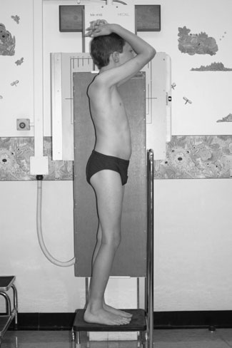
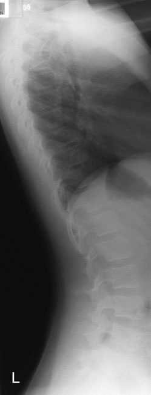
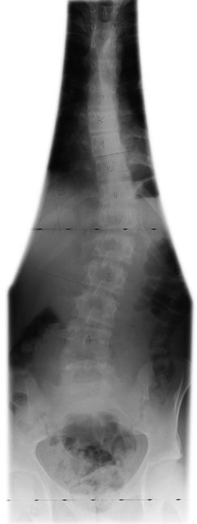
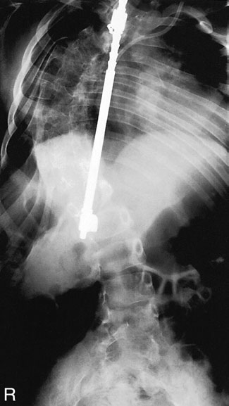
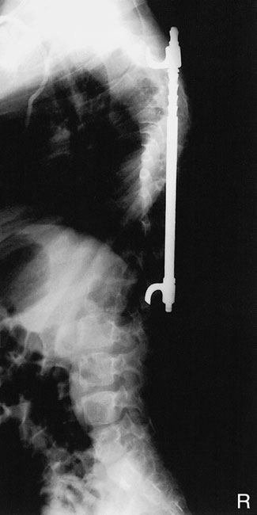

# Rx coloană vertebrală (bilanț scolioză) profil (lateral)

  📷 Radiografie Convențională (Rx)
  <strong>Actualizat:</strong> 2026-09-16
  <strong>Autor:</strong> Departamentul de Radiologie / Referință Clark (Ed. 12)

---

-   __1. Rezumat Clinic & Indicații__

    ---

    === "Indicații Clinice"

        - Cea mai frecventă indicație pentru scolioză este în prezent scolioza idiopatică. Copiii afectați sunt altfel complet normali, cu o speranță de viață normală. Sunt necesare radiografii multiple pentru monitorizare și, prin urmare, măsurile de reducere a dozei sunt importante.
        - Scolioza este descrisă ca având debut precoce (înainte de cinci ani) și debut tardiv. Cei la care se dezvoltă precoce curburi mari prezintă un risc mai mare de apariție a complicațiilor cardiovasculare.
        - Scolioza spinală secundară este în prezent mai puțin frecventă în majoritatea centrelor. Principalele cauze sunt: congenitale (inclusiv hemivertebre), afecțiuni neuromusculare și neurofibromatoză. Tuberculoza este neobișnuită, iar poliomielita este în prezent rară. Totuși, este în continuare extrem de important să se excludă o boală subiacentă, iar RMN-ul sau scintigrafia sunt recomandate la toți pacienții cu scolioză „idiopatică” atipică sau scolioză dureroasă (aceasta din urmă fiind de obicei cauzată de osteom osteoid). RMN-ul trebuie, de asemenea, luat în considerare preoperator pentru a exclude leziuni precum siringomielia.
        - Când se suspectează o scolioză secundară din cauza anomaliilor observate pe prima imagine a coloanei vertebrale toracolombare, pot fi luate în considerare incidențe conate, radiografii ale coloanei cervicale și radiografii pelvine pentru evaluare suplimentară.
        - Curbura de profil a scoliozei idiopatice este de obicei convexă spre dreapta, determinând o gibozitate pe partea dreaptă, și este însoțită de rotația vertebrelor în jurul axului vertical. Aceasta deplasează coastele posterior în regiunea toracică și accentuează aspectul inestetic al deformării. Componenta rotatorie face ca afecțiunea să fie mai complexă decât o deformare cosmetică, iar rotația toracelui poate duce la compresia cordului și a siluetei cardiovasculare și a toracelui (câmpurilor pulmonare), în timp ce curburile lombare pot predispune la modificări degenerative ulterioare.
        - Scopul tratamentului este menținerea curburii primare sub 40 de grade la sfârșitul creșterii; curburile mici, sub 15 grade, nu sunt de obicei tratate. Curburile de 20–40 de grade sunt tratate cu corset pentru trunchi, iar curburile de peste 40 de grade necesită de obicei fuziune vertebrală (de exemplu, tijă metalică Harrington). Imaginile de urmărire ale pacienților cu tijă Harrington trebuie să evidențieze orice rupere a tijelor sau a firelor Luque din jur.
        - Este necesară evaluarea vârstei osoase, astfel încât tratamentul adecvat să poată fi planificat. Dezvoltarea apofizelor iliace (semnul Risser) se corelează bine cu maturitatea scheletică, determinată prin evaluarea vârstei osoase la mână și pumn (articulația radiocarpiană) (Dhar et al. 1993). Apofizele iliace apar mai întâi lateral și anterior pe creasta iliacă. Creșterea se dezvoltă posterior și medial, urmată de fuziunea la nivelul crestelor iliace. Osificarea progresivă se corelează cu scăderea progresiei. Imagine postero-anterioară (PA) în ortostatism, evidențiind tija Harrington. Imagine de profil în ortostatism, evidențiind tija Harrington.

    === "Ghid Național IRIS"

        !!! info "Referință Primară: Ghidul Național IRIS (Ordinul MS 1342/2012)"
            - **Capitol Ghid IRIS:** *Pediatrie — Aparat locomotor*
            - **Grad de Recomandare:** **Grad A**
            - **Nivel de Iradiere Estimată:** `Clasa 1 (Minimă < 0.01 mSv)`

            [:octicons-search-16: Deschide Ghidul IRIS](../../iris.md){ .md-button .md-button--primary } [:material-open-in-new: Aplicația Oficială PWA](https://radiologie-pediatrica.ro/iris/){ .md-button target="_blank" rel="noopener" }

-   __2. Poziționare & Centrare Fascicul__

    ---

    - **Poziție Pacient:**
        - Pacientul stă în ortostatism, cu picioarele goale ușor depărtate, cu partea convexă a curburii primare sprijinită de stativul vertical Bucky.
        - Trebuie avut grijă ca pacientul să nu se aplece spre casetă.
        - Marginea inferioară a casetei este plasată la 1.5 cm sub crestele iliace.
        - Linia medioaxilară este centrată pe casetă. Planul coronal trebuie să fie perpendicular pe casetă.
        - Acesta poate fi evaluat prin palparea spinelor iliace anterioare și rotirea pacientului astfel încât linia care unește cele două părți să fie perpendiculară pe casetă.
        - În mod similar, linia care unește extremitățile de profil ale claviculelor trebuie să fie perpendiculară pe casetă.
        - Brațele sunt îndoite peste cap.
    - **Punct de Centrare Fascicul:**
        - Se utilizează o rază centrală orizontală, iar fasciculul este colimat și centrat pe casetă pentru a include întreaga coloană vertebrală.
        - Marginea inferioară a colimării este poziționată la nivelul spinelor iliace anterosuperioare, asigurând astfel includerea primului segment sacral.
        - Marginea superioară trebuie să fie la nivelul procesului spinos al C7.
        - Se utilizează o DFF mărită pentru a asigura acoperirea corectă a întregii arii anatomice (180–200 cm).
    - **Distanță Focar-Film (DFF / SID):** 100 cm
    - **Comandă Respiratorie:** Apnee pe durata expunerii (apnee în inspir pentru torace; expir pentru Abdomen/bazin).

-   __3. Parametri Tehnici Expunere__

    ---

    | Parametru Tehnic | Valoare Configurare Generator / Tub |
    |:-----------------|:-------------------------------------|
    | **Tensiune Tub (kV)** | DE CONFIGURAT PE APARAT |
    | **Sarcină / Produs Curent-Timp (mAs)** | Conform AEC / grosimii anatomice |
    | **Distanță Focar-Film (DFF / SID)** | 100 cm |
    | **Grilă Antidifuzoare (Bucky)** | Cu grilă antidifuzoare Bucky |
    | **Dimensiune Focar** | Focar Mic (0.6 mm) |
    | **Camere de Ionizare AEC** | Camerele laterale (sau camera centrală, în funcție de regiune) |
    | **Colimare Fascicul** | Colimare strictă adaptată pe receptor 35 x 43 cm |
    | **Filtrare Tub** | Totală ≥ 2.5 mm Al echivalent (conform Clark: 3.0 mm Al echivalent) |

-   __4. Criterii de Calitate & Reușită Imagine__

    ---

    - Vizualizarea clară a întregii arii anatomice (coloana vertebrală (bilanț scolioză)).
    - Absența artefactelor de mișcare; trabeculație osoasă și contururi nete.
    - Densitate optică și contrast adecvate pentru diferențierea țesuturilor moi de structurile osoase.

-   __5. Protecție Radiologică (ALARA)__

    ---

    - Ecranare gonadică cu șorț plumbat dacă gonadele sunt în apropierea fasciculului util (regula ALARA).
    - Colimare precisă la dimensiunea anatomică strict necesară pentru reducerea dozei și a radiației difuze.
    - Verificarea posibilității unei sarcini la pacientele de vârstă fertilă înainte de expunere.

!!! note "Observații Clinice & Tehnice"
    - Trebuie avut grijă ca fasciculul să fie bine colimat, pentru a exclude țesuturile mamare, în special la radiografiile de control.
    - Pot fi necesare incidențe suplimentare, fluoroscopie, CT sau MRI pentru a evidenția amploarea completă a caracterului 3-dimensional al unor deformări severe. 414 Pacient poziționat pentru incidența de profil a coloanei vertebrale. Imagine de profil a întregii coloane vertebrale, utilizând grilă și conuri colimate la nivelul coloanei vertebrale. L Imagine postero-anterioară (PA) a întregii coloane vertebrale, cu scolioză și înclinare pelviană necorectată, utilizând o casetă lungă.

### 🖼️ Imagini

<figure class="protocol-image-card" markdown>

<figcaption><strong>Figura 1: Aspect radiografic / Poziționare (Clark Ed. 12)</strong> — Poziționarea pacientului și centrarea fasciculului conform Clark (Ed. 12)</figcaption>

</figure>

<figure class="protocol-image-card" markdown>

<figcaption><strong>Figura 2: Aspect radiografic / Poziționare (Clark Ed. 12)</strong> — Aspect radiografic / ghid de poziționare conform tratatului Clark (Ed. 12)</figcaption>

</figure>

<figure class="protocol-image-card" markdown>

<figcaption><strong>Figura 3: Aspect radiografic / Poziționare (Clark Ed. 12)</strong> — Aspect radiografic / ghid de poziționare conform tratatului Clark (Ed. 12)</figcaption>

</figure>

<figure class="protocol-image-card" markdown>

<figcaption><strong>Scolioză. Copiii afectați sunt altfel complet normali,</strong> — Aspect radiografic / ghid de poziționare conform tratatului Clark (Ed. 12)</figcaption>

</figure>

<figure class="protocol-image-card" markdown>

<figcaption><strong>cu speranță de viață normală. Radiografii multiple pentru moni-</strong> — Aspect radiografic / ghid de poziționare conform tratatului Clark (Ed. 12)</figcaption>

</figure>

=== "Ghid Rapid de Execuție"

    1. **Identificarea și verificarea pacientului:** verificare identitate, zonă de examinat, consimțământ conform procedurii și evaluarea posibilității unei sarcini, când este relevantă.
    2. **Pregătire:** îndepărtarea oricăror obiecte radiopace (bijuterii, agrafe, fermoare, proteze, pansamente dense).
    3. **Poziționare precisă:** alinierea receptorului de imagine și a tubului la distanța prescrisă (100 cm).
    4. **Colimare strictă:** adaptarea fasciculului strict la regiunea de diagnostic pentru scăderea iradierii și reducerea radiației difuze.
    5. **Radioprotecție:** verificarea [politicii RX](../radioprotectie.md), cu măsuri distincte pentru pacient, personal și însoțitor.

## Surse de documentare

- [Clark's Positioning in Radiography (Ed. 12), Pagina 429](https://books.google.com/books/about/Clark_s_Positioning_in_Radiography.html?id=Xxu6MwEACAAJ)
