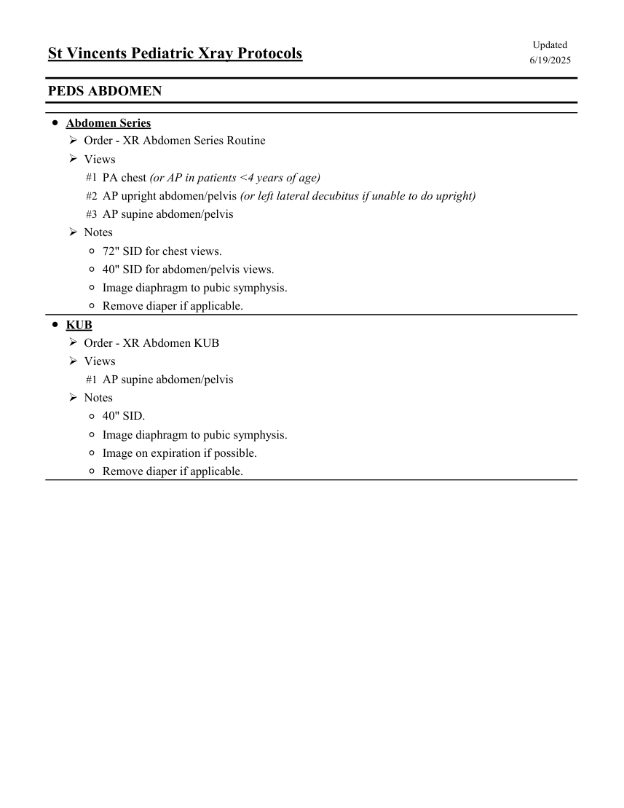

# RX — Copil: abdomen (MCB)

## Documentul original MCB — Copil: abdomen

**Colecție de protocoale · 1 pagini · consultat la 2026-09-27.**

[Descarcă PDF-ul integral](../../assets/mcb-modalities/rx-copil-abdomen-mcb/document.pdf) · [Sursa MCB](https://ref.mcbradiology.com/Protocols,%20Policies,%20Worksheets%20&%20Forms/Xray/Peds%20Protocols/2%20Peds%20Abdomen.pdf) · [Catalogul MCB pentru această modalitate](../mcb/index.md)

Instrucțiunile, valorile și ilustrațiile din documentul original sunt păstrate în **engleză**. Titlul și navigarea sunt în română.

### Pagina 1

{ loading=lazy }

## Textul documentului original

??? abstract "Pagina 1 — text în engleză"

    
Updated
    St Vincents Pediatric Xray Protocols
    6/19/2025
    PEDS ABDOMEN
    ●Abdomen Series
    Order - XR Abdomen Series Routine
    Views
    #1 PA chest (or AP in patients &lt;4 years of age)
    #2 AP upright abdomen/pelvis (or left lateral decubitus if unable to do upright)
    #3 AP supine abdomen/pelvis
    Notes
    ◦72&quot; SID for chest views.
    ◦40&quot; SID for abdomen/pelvis views.
    ◦Image diaphragm to pubic symphysis.
    ◦Remove diaper if applicable.
    ●KUB
    Order - XR Abdomen KUB
    Views
    #1 AP supine abdomen/pelvis
    Notes
    ◦40&quot; SID.
    ◦Image diaphragm to pubic symphysis.
    ◦Image on expiration if possible. 
    ◦Remove diaper if applicable.
    

