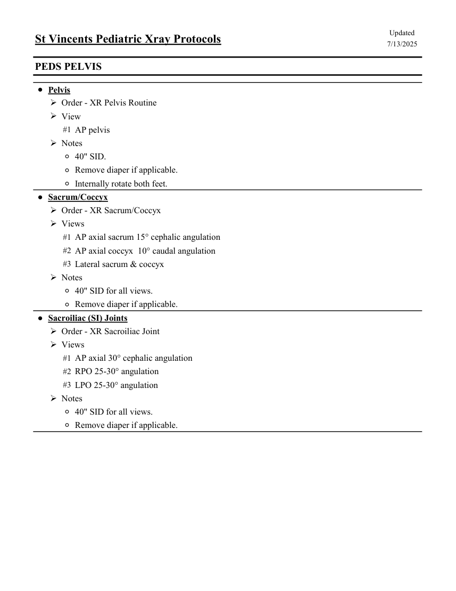

# RX — Copil: bazin osos (MCB)

## Documentul original MCB — Copil: bazin osos

**Colecție de protocoale · 1 pagini · consultat la 2026-09-27.**

[Descarcă PDF-ul integral](../../assets/mcb-modalities/rx-copil-bazin-osos-mcb/document.pdf) · [Sursa MCB](https://ref.mcbradiology.com/Protocols,%20Policies,%20Worksheets%20&%20Forms/Xray/Peds%20Protocols/4%20Peds%20Bony%20Pelvis.pdf) · [Catalogul MCB pentru această modalitate](../mcb/index.md)

Instrucțiunile, valorile și ilustrațiile din documentul original sunt păstrate în **engleză**. Titlul și navigarea sunt în română.

### Pagina 1

{ loading=lazy }

## Textul documentului original

??? abstract "Pagina 1 — text în engleză"

    
Updated
    St Vincents Pediatric Xray Protocols
    7/13/2025
    PEDS PELVIS
    ●Pelvis
    Order - XR Pelvis Routine
    View
    #1 AP pelvis
    Notes
    ◦40&quot; SID.
    ◦Remove diaper if applicable.
    ◦Internally rotate both feet.
    ●Sacrum/Coccyx
    Order - XR Sacrum/Coccyx
    Views
    #1 AP axial sacrum 15° cephalic angulation
    #2 AP axial coccyx  10° caudal angulation
    #3 Lateral sacrum &amp; coccyx
    Notes
    ◦40&quot; SID for all views.
    ◦Remove diaper if applicable.
    ●Sacroiliac (SI) Joints
    Order - XR Sacroiliac Joint
    Views
    #1 AP axial 30° cephalic angulation
    #2 RPO 25-30° angulation
    #3 LPO 25-30° angulation
    Notes
    ◦40&quot; SID for all views.
    ◦Remove diaper if applicable.
    

