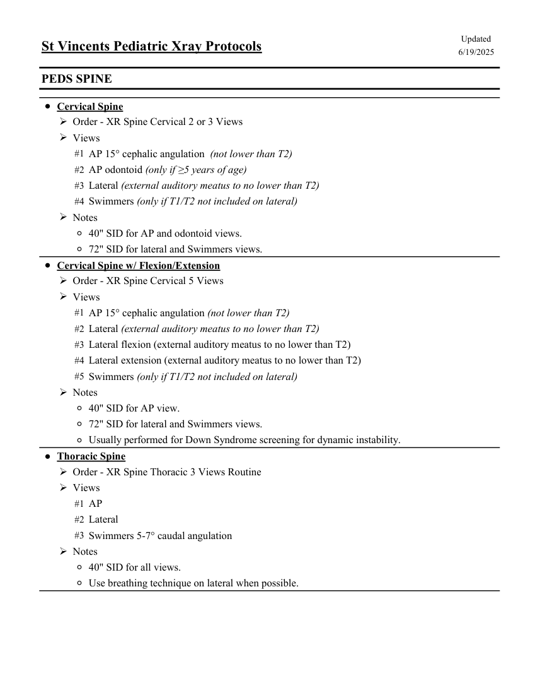
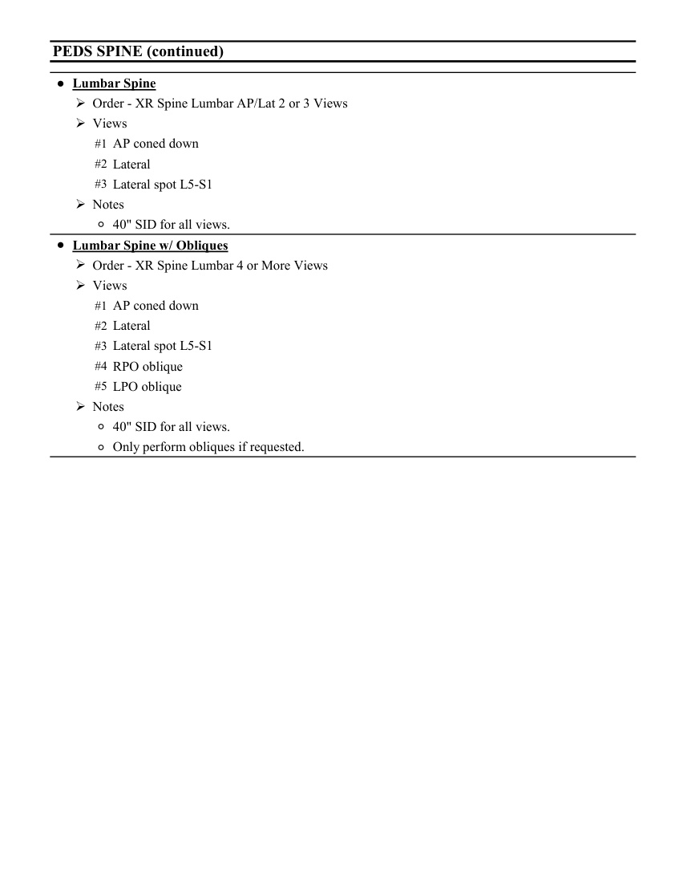

# RX — Copil: coloană vertebrală (MCB)

## Documentul original MCB — Copil: coloană vertebrală

**Colecție de protocoale · 2 pagini · consultat la 2026-09-27.**

[Descarcă PDF-ul integral](../../assets/mcb-modalities/rx-copil-coloana-vertebrala-mcb/document.pdf) · [Sursa MCB](https://ref.mcbradiology.com/Protocols,%20Policies,%20Worksheets%20&%20Forms/Xray/Peds%20Protocols/6%20Peds%20Spine.pdf) · [Catalogul MCB pentru această modalitate](../mcb/index.md)

Instrucțiunile, valorile și ilustrațiile din documentul original sunt păstrate în **engleză**. Titlul și navigarea sunt în română.

### Pagina 1

{ loading=lazy }

### Pagina 2

{ loading=lazy }

## Textul documentului original

??? abstract "Pagina 1 — text în engleză"

    
Updated
    St Vincents Pediatric Xray Protocols
    6/19/2025
    PEDS SPINE
    ●Cervical Spine
    Order - XR Spine Cervical 2 or 3 Views
    Views
    #1 AP 15° cephalic angulation  (not lower than T2)
    #2 AP odontoid (only if ≥5 years of age)
    #3 Lateral (external auditory meatus to no lower than T2)
    #4 Swimmers (only if T1/T2 not included on lateral)
    Notes
    ◦40&quot; SID for AP and odontoid views.
    ◦72&quot; SID for lateral and Swimmers views.
    ●Cervical Spine w/ Flexion/Extension
    Order - XR Spine Cervical 5 Views
    Views
    #1 AP 15° cephalic angulation (not lower than T2)
    #2 Lateral (external auditory meatus to no lower than T2)
    #3 Lateral flexion (external auditory meatus to no lower than T2)
    #4 Lateral extension (external auditory meatus to no lower than T2)
    #5 Swimmers (only if T1/T2 not included on lateral)
    Notes
    ◦40&quot; SID for AP view.
    ◦72&quot; SID for lateral and Swimmers views.
    ◦Usually performed for Down Syndrome screening for dynamic instability.
    ●Thoracic Spine
    Order - XR Spine Thoracic 3 Views Routine
    Views
    #1 AP
    #2 Lateral
    #3 Swimmers 5-7° caudal angulation
    Notes
    ◦40&quot; SID for all views.
    ◦Use breathing technique on lateral when possible.
    

??? abstract "Pagina 2 — text în engleză"

    
PEDS SPINE (continued)
    ●Lumbar Spine
    Order - XR Spine Lumbar AP/Lat 2 or 3 Views
    Views
    #1 AP coned down
    #2 Lateral
    #3 Lateral spot L5-S1
    Notes
    ◦40&quot; SID for all views.
    ●Lumbar Spine w/ Obliques
    Order - XR Spine Lumbar 4 or More Views
    Views
    #1 AP coned down
    #2 Lateral
    #3 Lateral spot L5-S1
    #4 RPO oblique
    #5 LPO oblique
    Notes
    ◦40&quot; SID for all views.
    ◦Only perform obliques if requested.
    

