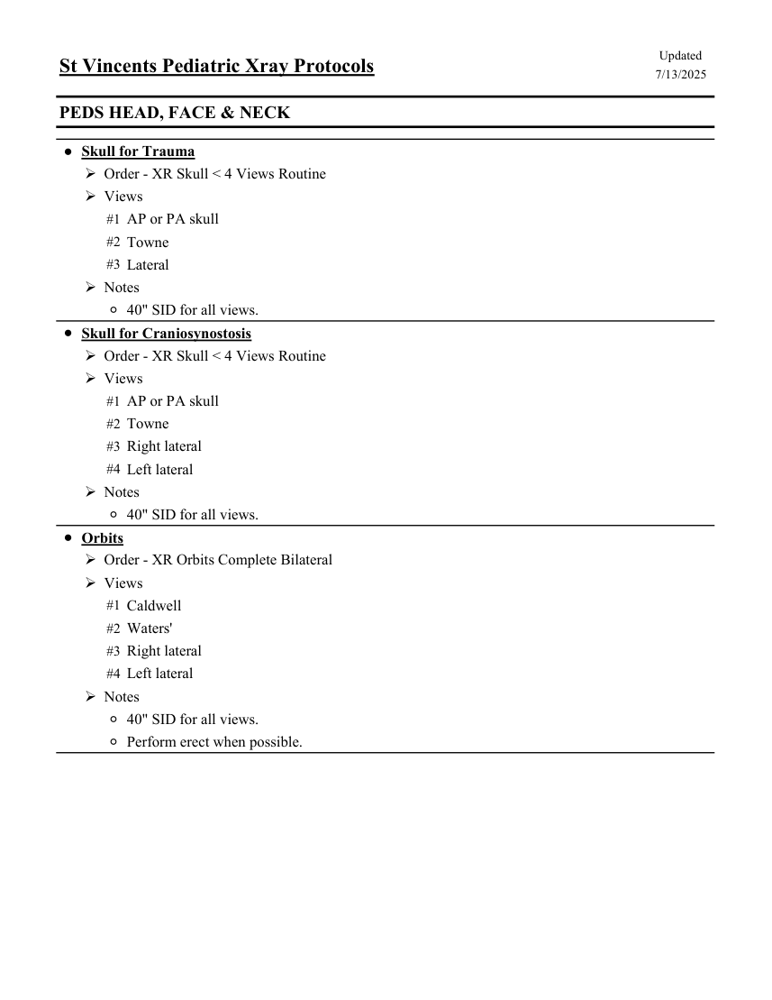
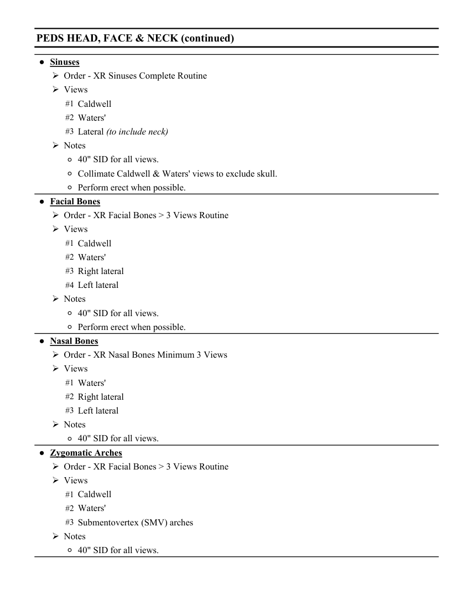
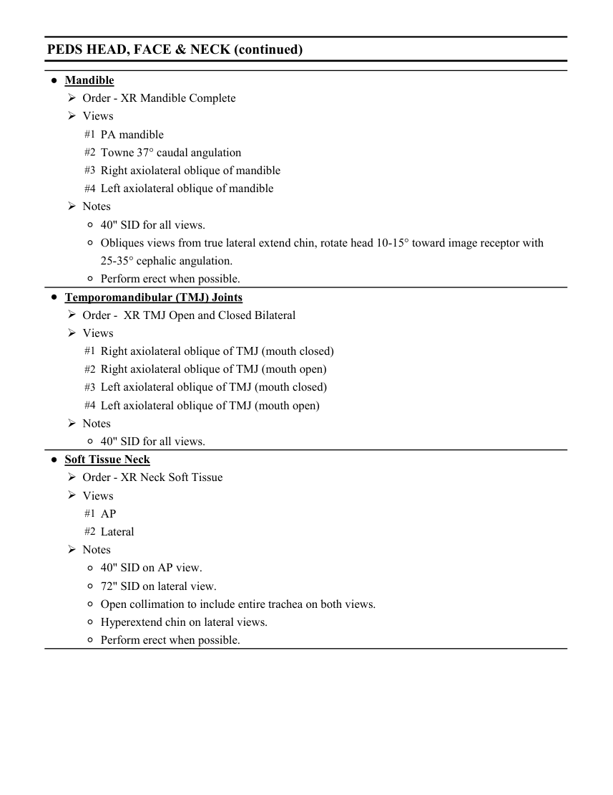

# RX — Copil: craniu, față și gât (MCB)

## Documentul original MCB — Copil: craniu, față și gât

**Colecție de protocoale · 3 pagini · consultat la 2026-09-27.**

[Descarcă PDF-ul integral](../../assets/mcb-modalities/rx-copil-craniu-fata-si-gat-mcb/document.pdf) · [Sursa MCB](https://ref.mcbradiology.com/Protocols,%20Policies,%20Worksheets%20&%20Forms/Xray/Peds%20Protocols/7%20Peds%20Head.pdf) · [Catalogul MCB pentru această modalitate](../mcb/index.md)

Instrucțiunile, valorile și ilustrațiile din documentul original sunt păstrate în **engleză**. Titlul și navigarea sunt în română.

### Pagina 1

{ loading=lazy }

### Pagina 2

{ loading=lazy }

### Pagina 3

{ loading=lazy }

## Textul documentului original

??? abstract "Pagina 1 — text în engleză"

    
Updated
    St Vincents Pediatric Xray Protocols
    7/13/2025
    PEDS HEAD, FACE &amp; NECK
    ●Skull for Trauma
    Order - XR Skull &lt; 4 Views Routine
    Views
    #1 AP or PA skull
    #2 Towne
    #3 Lateral
    Notes
    ◦40&quot; SID for all views.
    ●Skull for Craniosynostosis
    Order - XR Skull &lt; 4 Views Routine
    Views
    #1 AP or PA skull
    #2 Towne
    #3 Right lateral
    #4 Left lateral
    Notes
    ◦40&quot; SID for all views.
    ●Orbits
    Order - XR Orbits Complete Bilateral
    Views
    #1 Caldwell
    #2 Waters&#x27;
    #3 Right lateral
    #4 Left lateral
    Notes
    ◦40&quot; SID for all views.
    ◦Perform erect when possible.
    

??? abstract "Pagina 2 — text în engleză"

    
PEDS HEAD, FACE &amp; NECK (continued)
    ●Sinuses
    Order - XR Sinuses Complete Routine
    Views
    #1 Caldwell
    #2 Waters&#x27;
    #3 Lateral (to include neck)
    Notes
    ◦40&quot; SID for all views.
    ◦Collimate Caldwell &amp; Waters&#x27; views to exclude skull.
    ◦Perform erect when possible.
    ●Facial Bones
    Order - XR Facial Bones &gt; 3 Views Routine
    Views
    #1 Caldwell
    #2 Waters&#x27;
    #3 Right lateral
    #4 Left lateral
    Notes
    ◦40&quot; SID for all views.
    ◦Perform erect when possible.
    ●Nasal Bones
    Order - XR Nasal Bones Minimum 3 Views
    Views
    #1 Waters&#x27;
    #2 Right lateral
    #3 Left lateral
    Notes
    ◦40&quot; SID for all views.
    ●Zygomatic Arches
    Order - XR Facial Bones &gt; 3 Views Routine
    Views
    #1 Caldwell
    #2 Waters&#x27;
    #3 Submentovertex (SMV) arches
    Notes
    ◦40&quot; SID for all views.
    

??? abstract "Pagina 3 — text în engleză"

    
PEDS HEAD, FACE &amp; NECK (continued)
    ●Mandible
    Order - XR Mandible Complete
    Views
    #1 PA mandible
    #2 Towne 37° caudal angulation
    #3 Right axiolateral oblique of mandible
    #4 Left axiolateral oblique of mandible
    Notes
    ◦40&quot; SID for all views.
    ◦Obliques views from true lateral extend chin, rotate head 10-15° toward image receptor with 
    25-35° cephalic angulation.
    ◦Perform erect when possible.
    ●Temporomandibular (TMJ) Joints
    Order -  XR TMJ Open and Closed Bilateral
    Views
    #1 Right axiolateral oblique of TMJ (mouth closed)
    #2 Right axiolateral oblique of TMJ (mouth open)
    #3 Left axiolateral oblique of TMJ (mouth closed)
    #4 Left axiolateral oblique of TMJ (mouth open)
    Notes
    ◦40&quot; SID for all views.
    ●Soft Tissue Neck
    Order - XR Neck Soft Tissue
    Views
    #1 AP
    #2 Lateral
    Notes
    ◦40&quot; SID on AP view.
    ◦72&quot; SID on lateral view.
    ◦Open collimation to include entire trachea on both views.
    ◦Hyperextend chin on lateral views.
    ◦Perform erect when possible.
    

