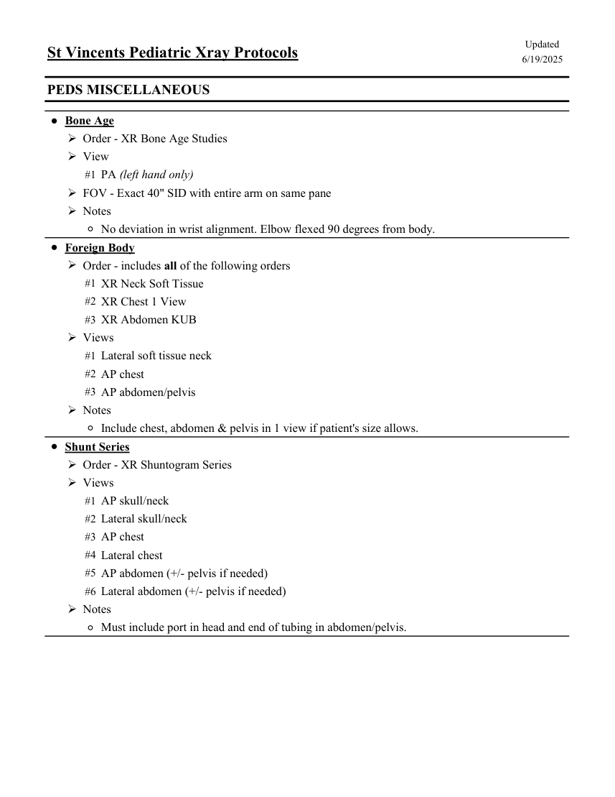
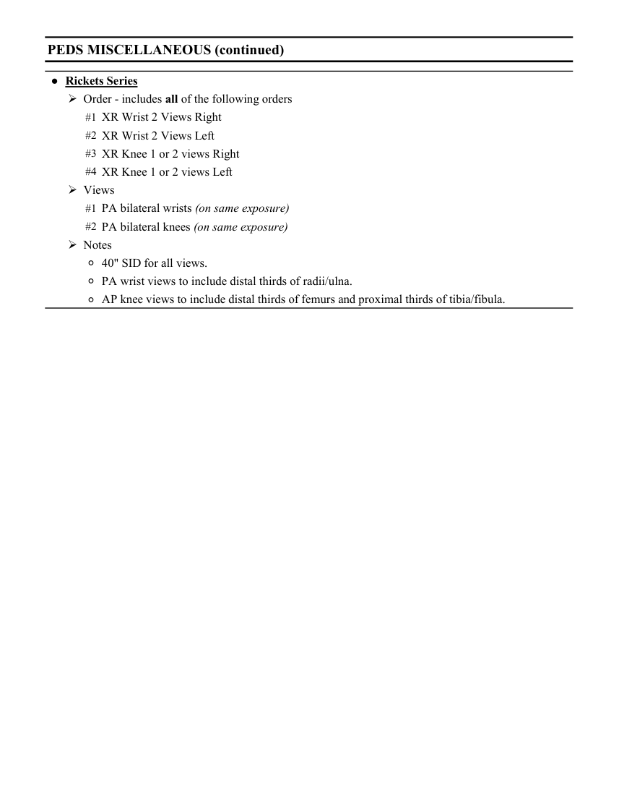
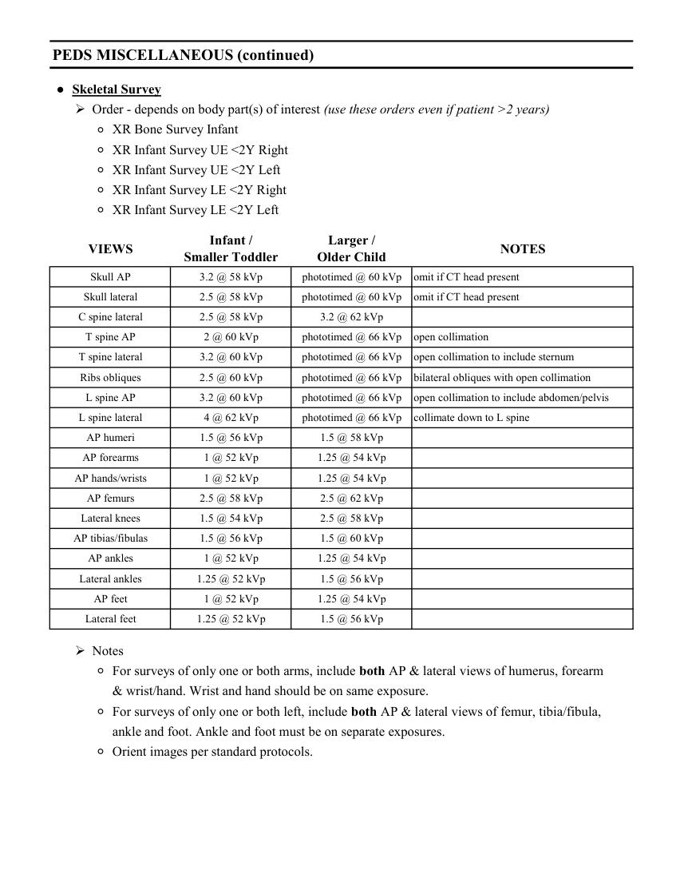

# RX — Copil: examinări diverse (MCB)

## Documentul original MCB — Copil: examinări diverse

**Colecție de protocoale · 3 pagini · consultat la 2026-09-27.**

[Descarcă PDF-ul integral](../../assets/mcb-modalities/rx-copil-examinari-diverse-mcb/document.pdf) · [Sursa MCB](https://ref.mcbradiology.com/Protocols,%20Policies,%20Worksheets%20&%20Forms/Xray/Peds%20Protocols/8%20Peds%20Miscellaneous.pdf) · [Catalogul MCB pentru această modalitate](../mcb/index.md)

Instrucțiunile, valorile și ilustrațiile din documentul original sunt păstrate în **engleză**. Titlul și navigarea sunt în română.

### Pagina 1

{ loading=lazy }

### Pagina 2

{ loading=lazy }

### Pagina 3

{ loading=lazy }

## Textul documentului original

??? abstract "Pagina 1 — text în engleză"

    
Updated
    St Vincents Pediatric Xray Protocols
    6/19/2025
    PEDS MISCELLANEOUS
    ●Bone Age
    Order - XR Bone Age Studies
    View
    #1 PA (left hand only)
    FOV - Exact 40&quot; SID with entire arm on same pane
    Notes
    ◦No deviation in wrist alignment. Elbow flexed 90 degrees from body.
    ●Foreign Body
    Order - includes all of the following orders
    #1 XR Neck Soft Tissue
    #2 XR Chest 1 View
    #3 XR Abdomen KUB
    Views
    #1 Lateral soft tissue neck
    #2 AP chest
    #3 AP abdomen/pelvis
    Notes
    ◦Include chest, abdomen &amp; pelvis in 1 view if patient&#x27;s size allows.
    ●Shunt Series
    Order - XR Shuntogram Series
    Views
    #1 AP skull/neck
    #2 Lateral skull/neck
    #3 AP chest
    #4 Lateral chest
    #5 AP abdomen (+/- pelvis if needed)
    #6 Lateral abdomen (+/- pelvis if needed)
    Notes
    ◦Must include port in head and end of tubing in abdomen/pelvis.
    

??? abstract "Pagina 2 — text în engleză"

    
PEDS MISCELLANEOUS (continued)
    ●Rickets Series
    Order - includes all of the following orders
    #1 XR Wrist 2 Views Right
    #2 XR Wrist 2 Views Left
    #3 XR Knee 1 or 2 views Right
    #4 XR Knee 1 or 2 views Left
    Views
    #1 PA bilateral wrists (on same exposure)
    #2 PA bilateral knees (on same exposure)
    Notes
    ◦40&quot; SID for all views.
    ◦PA wrist views to include distal thirds of radii/ulna.
    ◦AP knee views to include distal thirds of femurs and proximal thirds of tibia/fibula.
    

??? abstract "Pagina 3 — text în engleză"

    
PEDS MISCELLANEOUS (continued)
    ●Skeletal Survey
    Order - depends on body part(s) of interest (use these orders even if patient &gt;2 years)
    ◦XR Bone Survey Infant
    ◦XR Infant Survey UE &lt;2Y Right
    ◦XR Infant Survey UE &lt;2Y Left
    ◦XR Infant Survey LE &lt;2Y Right
    ◦XR Infant Survey LE &lt;2Y Left
    Larger /                                                          
    VIEWS
    Infant /                                                          
    Smaller Toddler
    Older Child
    NOTES
    Skull AP
    3.2 @ 58 kVp
    phototimed @ 60 kVp
    omit if CT head present
    Skull lateral
    2.5 @ 58 kVp
    phototimed @ 60 kVp
    omit if CT head present
    C spine lateral
    2.5 @ 58 kVp
    3.2 @ 62 kVp
    T spine AP
    2 @ 60 kVp
    phototimed @ 66 kVp
    open collimation
    T spine lateral
    3.2 @ 60 kVp
    phototimed @ 66 kVp
    open collimation to include sternum
    Ribs obliques
    2.5 @ 60 kVp
    phototimed @ 66 kVp
    bilateral obliques with open collimation
    L spine AP
    3.2 @ 60 kVp
    phototimed @ 66 kVp
    open collimation to include abdomen/pelvis
    L spine lateral
    4 @ 62 kVp
    phototimed @ 66 kVp
    collimate down to L spine
    AP humeri
    1.5 @ 56 kVp
    1.5 @ 58 kVp
    AP forearms
    1 @ 52 kVp
    1.25 @ 54 kVp
    AP hands/wrists
    1 @ 52 kVp
    1.25 @ 54 kVp
    AP femurs
    2.5 @ 58 kVp
    2.5 @ 62 kVp
    Lateral knees
    1.5 @ 54 kVp
    2.5 @ 58 kVp
    AP tibias/fibulas
    1.5 @ 56 kVp
    1.5 @ 60 kVp
    AP ankles
    1 @ 52 kVp
    1.25 @ 54 kVp
    Lateral ankles
    1.25 @ 52 kVp
    1.5 @ 56 kVp
    AP feet
    1 @ 52 kVp
    1.25 @ 54 kVp
    Lateral feet
    1.25 @ 52 kVp
    1.5 @ 56 kVp
    Notes
    ◦For surveys of only one or both arms, include both AP &amp; lateral views of humerus, forearm 
    &amp; wrist/hand. Wrist and hand should be on same exposure.
    ◦For surveys of only one or both left, include both AP &amp; lateral views of femur, tibia/fibula, 
    ankle and foot. Ankle and foot must be on separate exposures.
    ◦Orient images per standard protocols.
    

