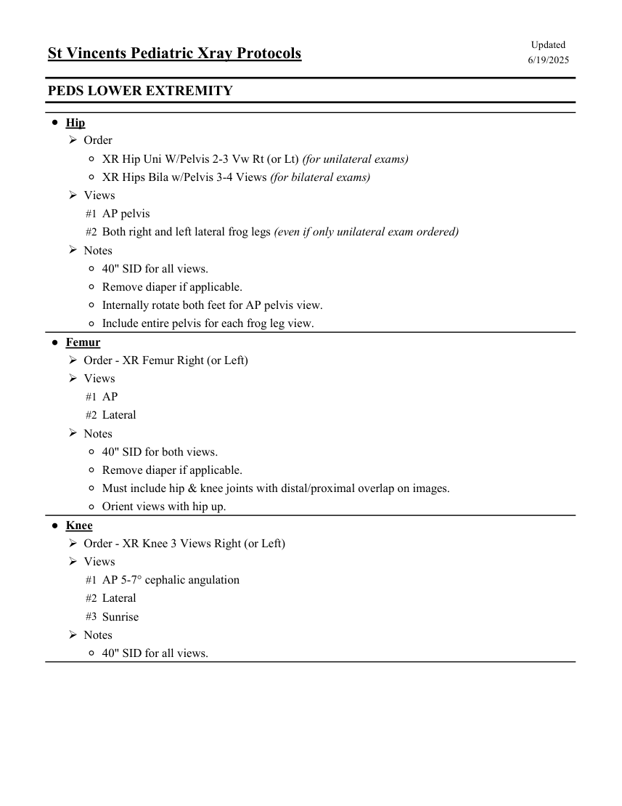
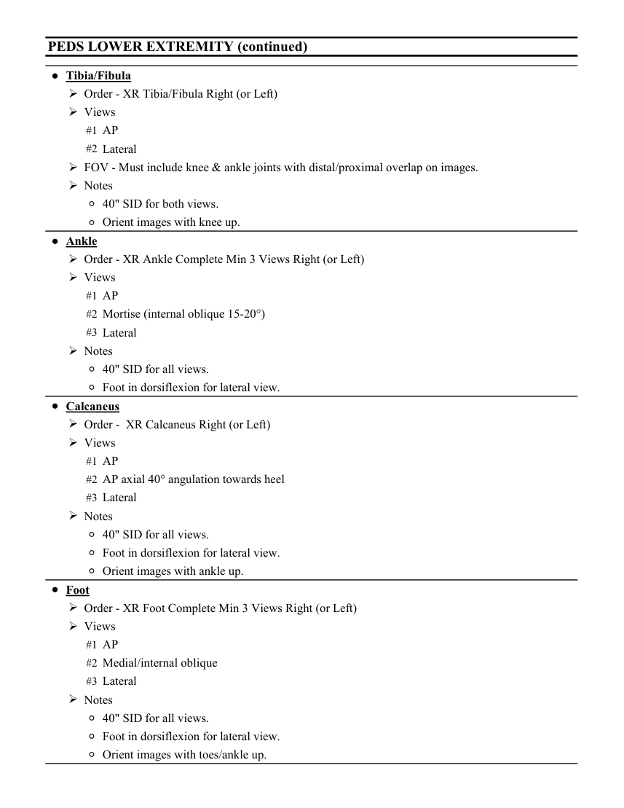
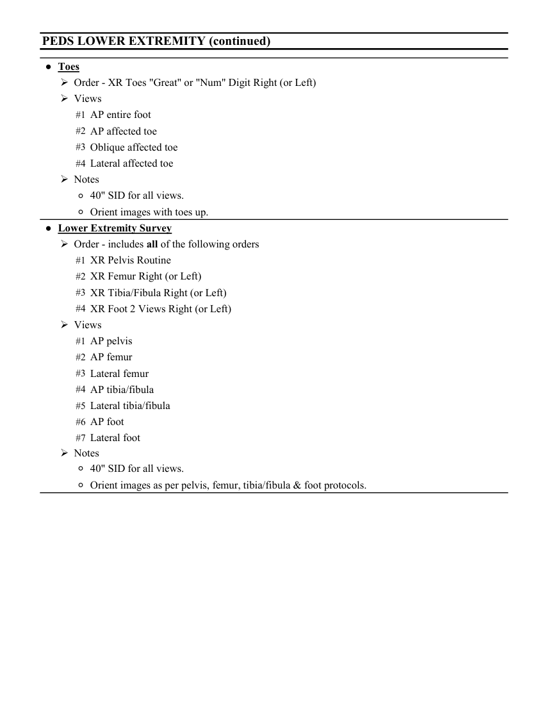

# RX — Copil: membru inferior (MCB)

## Documentul original MCB — Copil: membru inferior

**Colecție de protocoale · 3 pagini · consultat la 2026-09-27.**

[Descarcă PDF-ul integral](../../assets/mcb-modalities/rx-copil-membru-inferior-mcb/document.pdf) · [Sursa MCB](https://ref.mcbradiology.com/Protocols,%20Policies,%20Worksheets%20&%20Forms/Xray/Peds%20Protocols/5%20Peds%20Leg.pdf) · [Catalogul MCB pentru această modalitate](../mcb/index.md)

Instrucțiunile, valorile și ilustrațiile din documentul original sunt păstrate în **engleză**. Titlul și navigarea sunt în română.

### Pagina 1

{ loading=lazy }

### Pagina 2

{ loading=lazy }

### Pagina 3

{ loading=lazy }

## Textul documentului original

??? abstract "Pagina 1 — text în engleză"

    
Updated
    St Vincents Pediatric Xray Protocols
    6/19/2025
    PEDS LOWER EXTREMITY
    ●Hip
    Order
    ◦XR Hip Uni W/Pelvis 2-3 Vw Rt (or Lt) (for unilateral exams)
    ◦XR Hips Bila w/Pelvis 3-4 Views (for bilateral exams)
    Views
    #1 AP pelvis
    #2 Both right and left lateral frog legs (even if only unilateral exam ordered)
    Notes
    ◦40&quot; SID for all views.
    ◦Remove diaper if applicable.
    ◦Internally rotate both feet for AP pelvis view.
    ◦Include entire pelvis for each frog leg view.
    ●Femur
    Order - XR Femur Right (or Left)
    Views
    #1 AP
    #2 Lateral
    Notes
    ◦40&quot; SID for both views.
    ◦Remove diaper if applicable.
    ◦Must include hip &amp; knee joints with distal/proximal overlap on images.
    ◦Orient views with hip up.
    ●Knee
    Order - XR Knee 3 Views Right (or Left)
    Views
    #1 AP 5-7° cephalic angulation
    #2 Lateral
    #3 Sunrise
    Notes
    ◦40&quot; SID for all views.
    

??? abstract "Pagina 2 — text în engleză"

    
PEDS LOWER EXTREMITY (continued)
    ●Tibia/Fibula
    Order - XR Tibia/Fibula Right (or Left)
    Views
    #1 AP
    #2 Lateral
    FOV - Must include knee &amp; ankle joints with distal/proximal overlap on images.
    Notes
    ◦40&quot; SID for both views.
    ◦Orient images with knee up.
    ●Ankle
    Order - XR Ankle Complete Min 3 Views Right (or Left)
    Views
    #1 AP
    #2 Mortise (internal oblique 15-20°)
    #3 Lateral
    Notes
    ◦40&quot; SID for all views.
    ◦Foot in dorsiflexion for lateral view.
    ●Calcaneus
    Order -  XR Calcaneus Right (or Left)
    Views
    #1 AP
    #2 AP axial 40° angulation towards heel
    #3 Lateral
    Notes
    ◦40&quot; SID for all views.
    ◦Foot in dorsiflexion for lateral view.
    ◦Orient images with ankle up.
    ●Foot
    Order - XR Foot Complete Min 3 Views Right (or Left)
    Views
    #1 AP
    #2 Medial/internal oblique
    #3 Lateral
    Notes
    ◦40&quot; SID for all views.
    ◦Foot in dorsiflexion for lateral view.
    ◦Orient images with toes/ankle up.
    

??? abstract "Pagina 3 — text în engleză"

    
PEDS LOWER EXTREMITY (continued)
    ●Toes
    Order - XR Toes &quot;Great&quot; or &quot;Num&quot; Digit Right (or Left)
    Views
    #1 AP entire foot
    #2 AP affected toe
    #3 Oblique affected toe
    #4 Lateral affected toe
    Notes
    ◦40&quot; SID for all views.
    ◦Orient images with toes up.
    ●Lower Extremity Survey
    Order - includes all of the following orders
    #1 XR Pelvis Routine
    #2 XR Femur Right (or Left)
    #3 XR Tibia/Fibula Right (or Left)
    #4 XR Foot 2 Views Right (or Left)
    Views
    #1 AP pelvis
    #2 AP femur
    #3 Lateral femur
    #4 AP tibia/fibula
    #5 Lateral tibia/fibula
    #6 AP foot
    #7 Lateral foot
    Notes
    ◦40&quot; SID for all views.
    ◦Orient images as per pelvis, femur, tibia/fibula &amp; foot protocols.
    

