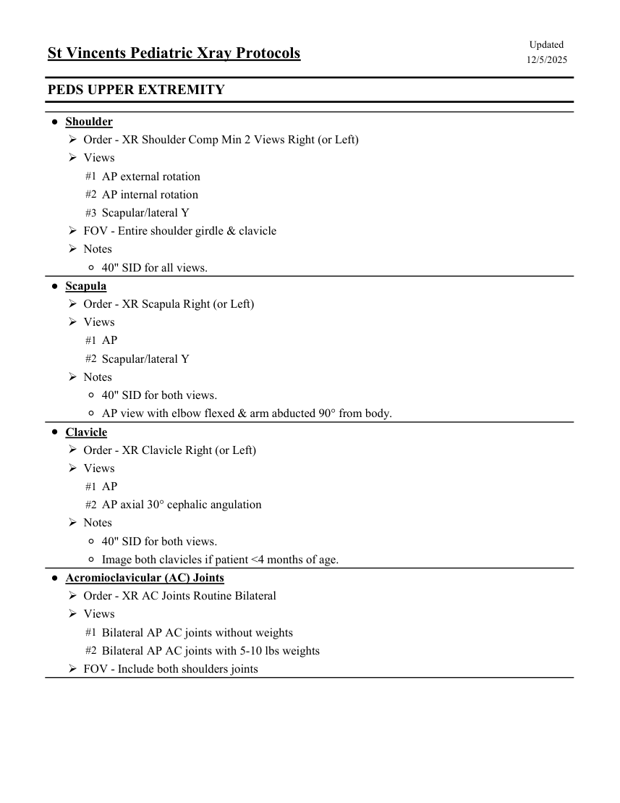
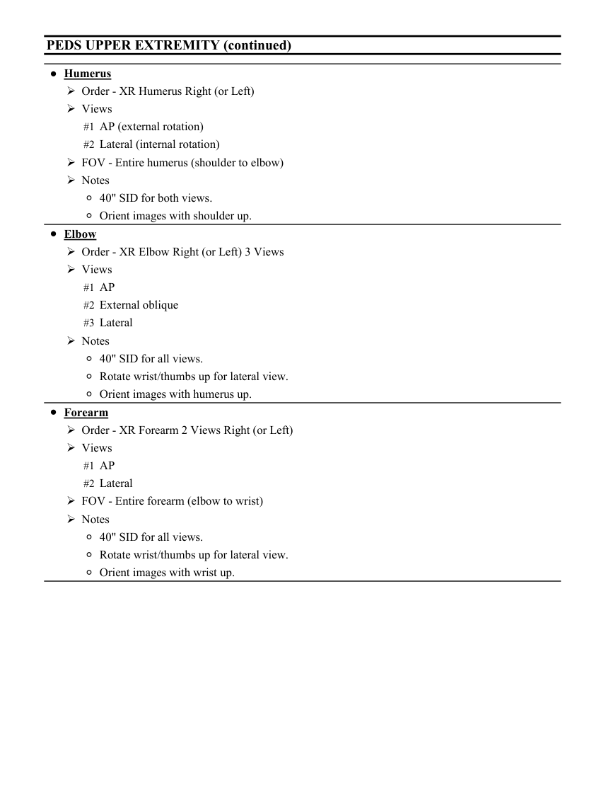
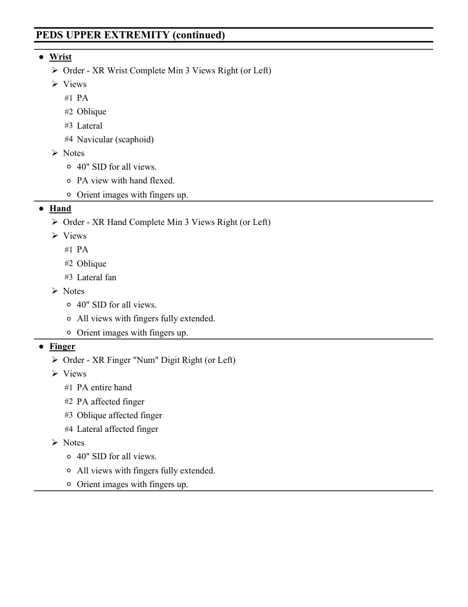
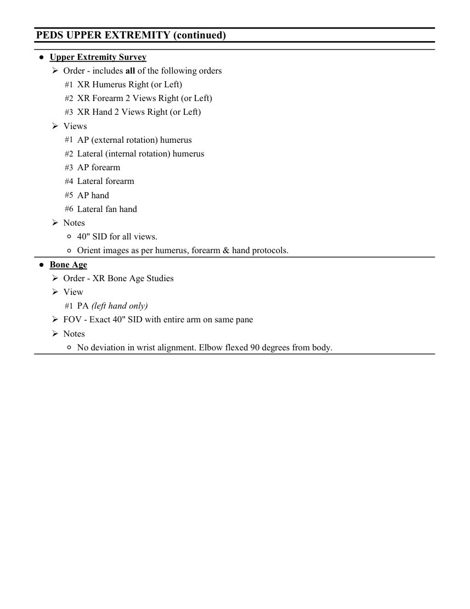

# RX — Copil: membru superior (MCB)

## Documentul original MCB — Copil: membru superior

**Colecție de protocoale · 4 pagini · consultat la 2026-09-27.**

[Descarcă PDF-ul integral](../../assets/mcb-modalities/rx-copil-membru-superior-mcb/document.pdf) · [Sursa MCB](https://ref.mcbradiology.com/Protocols,%20Policies,%20Worksheets%20&%20Forms/Xray/Peds%20Protocols/3%20Peds%20Arm.pdf) · [Catalogul MCB pentru această modalitate](../mcb/index.md)

Instrucțiunile, valorile și ilustrațiile din documentul original sunt păstrate în **engleză**. Titlul și navigarea sunt în română.

### Pagina 1

{ loading=lazy }

### Pagina 2

{ loading=lazy }

### Pagina 3

{ loading=lazy }

### Pagina 4

{ loading=lazy }

## Textul documentului original

??? abstract "Pagina 1 — text în engleză"

    
Updated
    St Vincents Pediatric Xray Protocols
    12/5/2025
    PEDS UPPER EXTREMITY
    ●Shoulder
    Order - XR Shoulder Comp Min 2 Views Right (or Left)
    Views
    #1 AP external rotation
    #2 AP internal rotation
    #3 Scapular/lateral Y
    FOV - Entire shoulder girdle &amp; clavicle
    Notes
    ◦40&quot; SID for all views.
    ●Scapula
    Order - XR Scapula Right (or Left)
    Views
    #1 AP
    #2 Scapular/lateral Y
    Notes
    ◦40&quot; SID for both views.
    ◦AP view with elbow flexed &amp; arm abducted 90° from body.
    ●Clavicle
    Order - XR Clavicle Right (or Left)
    Views
    #1 AP
    #2 AP axial 30° cephalic angulation
    Notes
    ◦40&quot; SID for both views.
    ◦Image both clavicles if patient &lt;4 months of age.
    ●Acromioclavicular (AC) Joints
    Order - XR AC Joints Routine Bilateral
    Views
    #1 Bilateral AP AC joints without weights
    #2 Bilateral AP AC joints with 5-10 lbs weights
    FOV - Include both shoulders joints
    

??? abstract "Pagina 2 — text în engleză"

    
PEDS UPPER EXTREMITY (continued)
    ●Humerus
    Order - XR Humerus Right (or Left)
    Views
    #1 AP (external rotation)
    #2 Lateral (internal rotation)
    FOV - Entire humerus (shoulder to elbow)
    Notes
    ◦40&quot; SID for both views.
    ◦Orient images with shoulder up.
    ●Elbow
    Order - XR Elbow Right (or Left) 3 Views
    Views
    #1 AP
    #2 External oblique
    #3 Lateral
    Notes
    ◦40&quot; SID for all views.
    ◦Rotate wrist/thumbs up for lateral view.
    ◦Orient images with humerus up.
    ●Forearm
    Order - XR Forearm 2 Views Right (or Left)
    Views
    #1 AP
    #2 Lateral
    FOV - Entire forearm (elbow to wrist)
    Notes
    ◦40&quot; SID for all views.
    ◦Rotate wrist/thumbs up for lateral view.
    ◦Orient images with wrist up.
    

??? abstract "Pagina 3 — text în engleză"

    
PEDS UPPER EXTREMITY (continued)
    ●Wrist
    Order - XR Wrist Complete Min 3 Views Right (or Left)
    Views
    #1 PA
    #2 Oblique
    #3 Lateral
    #4 Navicular (scaphoid)
    Notes
    ◦40&quot; SID for all views.
    ◦PA view with hand flexed.
    ◦Orient images with fingers up.
    ●Hand
    Order - XR Hand Complete Min 3 Views Right (or Left)
    Views
    #1 PA
    #2 Oblique
    #3 Lateral fan
    Notes
    ◦40&quot; SID for all views.
    ◦All views with fingers fully extended.
    ◦Orient images with fingers up.
    ●Finger
    Order - XR Finger &quot;Num&quot; Digit Right (or Left)
    Views
    #1 PA entire hand 
    #2 PA affected finger
    #3 Oblique affected finger
    #4 Lateral affected finger
    Notes
    ◦40&quot; SID for all views.
    ◦All views with fingers fully extended. 
    ◦Orient images with fingers up.
    

??? abstract "Pagina 4 — text în engleză"

    
PEDS UPPER EXTREMITY (continued)
    ●Upper Extremity Survey
    Order - includes all of the following orders
    #1 XR Humerus Right (or Left)
    #2 XR Forearm 2 Views Right (or Left)
    #3 XR Hand 2 Views Right (or Left)
    Views
    #1 AP (external rotation) humerus
    #2 Lateral (internal rotation) humerus
    #3 AP forearm
    #4 Lateral forearm
    #5 AP hand
    #6 Lateral fan hand
    Notes
    ◦40&quot; SID for all views.
    ◦Orient images as per humerus, forearm &amp; hand protocols.
    ●Bone Age
    Order - XR Bone Age Studies
    View
    #1 PA (left hand only)
    FOV - Exact 40&quot; SID with entire arm on same pane
    Notes
    ◦No deviation in wrist alignment. Elbow flexed 90 degrees from body.
    

