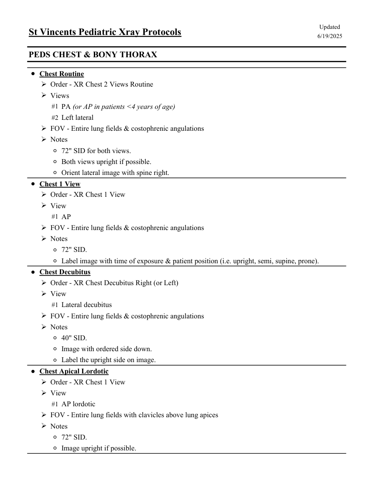
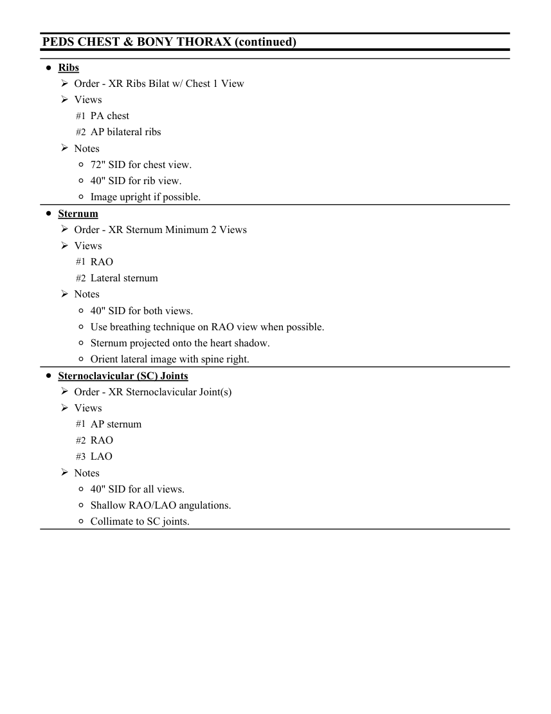

# RX — Copil: torace și grilaj costal (MCB)

## Documentul original MCB — Copil: torace și grilaj costal

**Colecție de protocoale · 2 pagini · consultat la 2026-09-27.**

[Descarcă PDF-ul integral](../../assets/mcb-modalities/rx-copil-torace-si-grilaj-costal-mcb/document.pdf) · [Sursa MCB](https://ref.mcbradiology.com/Protocols,%20Policies,%20Worksheets%20&%20Forms/Xray/Peds%20Protocols/1%20Peds%20Chest.pdf) · [Catalogul MCB pentru această modalitate](../mcb/index.md)

Instrucțiunile, valorile și ilustrațiile din documentul original sunt păstrate în **engleză**. Titlul și navigarea sunt în română.

### Pagina 1

{ loading=lazy }

### Pagina 2

{ loading=lazy }

## Textul documentului original

??? abstract "Pagina 1 — text în engleză"

    
Updated
    St Vincents Pediatric Xray Protocols
    6/19/2025
    PEDS CHEST &amp; BONY THORAX
    ●Chest Routine
    Order - XR Chest 2 Views Routine
    Views
    #1 PA (or AP in patients &lt;4 years of age)
    #2 Left lateral
    FOV - Entire lung fields &amp; costophrenic angulations
    Notes
    ◦72&quot; SID for both views.
    ◦Both views upright if possible.
    ◦Orient lateral image with spine right.
    ●Chest 1 View
    Order - XR Chest 1 View
    View
    #1 AP
    FOV - Entire lung fields &amp; costophrenic angulations
    Notes
    ◦72&quot; SID.
    ◦Label image with time of exposure &amp; patient position (i.e. upright, semi, supine, prone).
    ●Chest Decubitus
    Order - XR Chest Decubitus Right (or Left)
    View
    #1 Lateral decubitus
    FOV - Entire lung fields &amp; costophrenic angulations
    Notes
    ◦40&quot; SID.
    ◦Image with ordered side down.
    ◦Label the upright side on image.
    ●Chest Apical Lordotic
    Order - XR Chest 1 View
    View
    #1 AP lordotic
    FOV - Entire lung fields with clavicles above lung apices
    Notes
    ◦72&quot; SID.
    ◦Image upright if possible.
    

??? abstract "Pagina 2 — text în engleză"

    
PEDS CHEST &amp; BONY THORAX (continued)
    ●Ribs
    Order - XR Ribs Bilat w/ Chest 1 View
    Views
    #1 PA chest
    #2 AP bilateral ribs
    Notes
    ◦72&quot; SID for chest view.
    ◦40&quot; SID for rib view.
    ◦Image upright if possible.
    ●Sternum
    Order - XR Sternum Minimum 2 Views
    Views
    #1 RAO
    #2 Lateral sternum
    Notes
    ◦40&quot; SID for both views.
    ◦Use breathing technique on RAO view when possible.
    ◦Sternum projected onto the heart shadow.
    ◦Orient lateral image with spine right.
    ●Sternoclavicular (SC) Joints
    Order - XR Sternoclavicular Joint(s)
    Views
    #1 AP sternum
    #2 RAO
    #3 LAO
    Notes
    ◦40&quot; SID for all views.
    ◦Shallow RAO/LAO angulations.
    ◦Collimate to SC joints.
    

