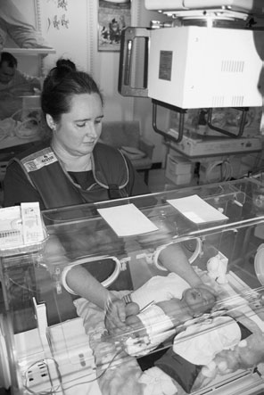
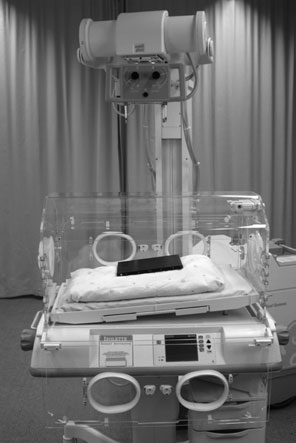
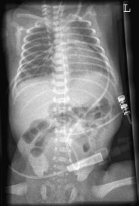
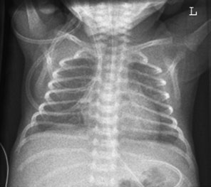

# Rx torace neonatal (cord și siluetă cardiovasculară și torace (câmpuri pulmonare)) — terapie intensivă (ATI/SCBU)

  📷 Radiografie Convențională (Rx)
  <strong>Actualizat:</strong> 2026-09-16
  <strong>Autor:</strong> Departamentul de Radiologie / Referință Clark (Ed. 12)

---

-   __1. Rezumat Clinic & Indicații__

    ---

    === "Indicații Clinice"

        - 365 12 Cord și siluetă cardiovasculară și torace (câmpuri pulmonare) – unitatea de terapie intensivă neonatală. Nou-născuții care suferă de sindrom de detresă respiratorie sunt examinați la scurt timp după naștere pentru a evidenția toracele (câmpurile pulmonare), care sunt imature și incapabile să efectueze respirația normală. Sugarul va fi îngrijit într-un incubator și poate fi conectat la un ventilator. Fasciculul primar este orientat prin partea superioară a incubatorului, având grijă să se evite ca orice opacitate sau decupaj din partea superioară a incubatorului să se proiecteze în fasciculul de radiații. Sunt disponibile numeroase modele de incubatoare, multe necesitând plasarea casetei în interiorul incubatorului. Cu toate acestea, unele sunt proiectate pentru a facilita poziționarea casetei pe o tavă specială, imediat sub carcasa incubatorului și în afara acesteia. Antero-posterior (AP)
        - Se selectează o casetă de 18 × 24 cm adusă la temperatura corpului. Între sugar și casetă trebuie utilizate cearșafuri de unică folosință.

    === "Ghid Național IRIS"

        !!! info "Referință Primară: Ghidul Național IRIS (Ordinul MS 1342/2012)"
            - **Capitol Ghid IRIS:** *Pediatrie — Torace, pulmon, cord*
            - **Grad de Recomandare:** **Grad A**
            - **Nivel de Iradiere Estimată:** `Clasa 1 (Minimă < 0.02 mSv)`

            [:octicons-search-16: Deschide Ghidul IRIS](../../iris.md){ .md-button .md-button--primary } [:material-open-in-new: Aplicația Oficială PWA](https://radiologie-pediatrica.ro/iris/){ .md-button target="_blank" rel="noopener" }

-   __2. Poziționare & Centrare Fascicul__

    ---

    - **Poziție Pacient:**
        - Sugarul este poziționat în decubit dorsal pe casetă, cu planul mediosagital ajustat perpendicular pe mijlocul casetei, asigurându-se că capul și toracele sunt drepte, iar umerii și șoldurile sunt la același nivel. Când se utilizează tava pentru casetă a incubatorului, extremitatea cefalică este ridicată cu five până la ten grade pentru a evita un torace „lordotic” sau, alternativ, se utilizează o pernă în pană pentru ridicarea umerilor.
        - Capul poate necesita menținere cu bărbia ridicată pentru a evita suprapunerea bărbiei peste vârfurile pulmonare, sau poate fi sprijinit utilizând săculeți mici acoperiți cu nisip. Brațele trebuie să fie de o parte și de alta, ușor îndepărtate de trunchi, pentru a evita includerea lor în câmpul de iradiere și pentru a evita artefactele reprezentate de pliurile cutanate, care pot mima pneumotoraxul. Brațele pot fi imobilizate cu benzi Velcro și/sau săculeți cu nisip.
    - **Punct de Centrare Fascicul:**
        - Nu se recomandă un singur punct de centrare.
        - Centrați fasciculul pe dimensiunea corectă a toracelui.
        - Raza centrală este orientată vertical sau înclinată cu five până la 10 grade caudal dacă sugarul este complet întins, dar, dacă se procedează astfel, trebuie avut grijă ca bărbia să nu fie proiectată peste vârfurile pulmonare (apexuri).
        - Trebuie utilizată constant distanța maximă focar–receptor (FFD).
    - **Distanță Focar-Film (DFF / SID):** 100 cm
    - **Comandă Respiratorie:** Apnee pe durata expunerii (apnee în inspir pentru torace; expir pentru Abdomen/bazin).

-   __3. Parametri Tehnici Expunere__

    ---

    | Parametru Tehnic | Valoare Configurare Generator / Tub |
    |:-----------------|:-------------------------------------|
    | **Tensiune Tub (kV)** | DE CONFIGURAT PE APARAT |
    | **Sarcină / Produs Curent-Timp (mAs)** | Conform AEC / grosimii anatomice |
    | **Distanță Focar-Film (DFF / SID)** | 100 cm |
    | **Grilă Antidifuzoare (Bucky)** | Conform grosimii anatomice (> 10-12 cm cu grilă) |
    | **Dimensiune Focar** | Focar Mic (0.6 mm) |
    | **Camere de Ionizare AEC** | DE CONFIGURAT PE APARAT |
    | **Colimare Fascicul** | Colimare strictă adaptată pe receptor 18 x 24 cm |
    | **Filtrare Tub** | Totală ≥ 2.5 mm Al echivalent (conform Clark: 3.0 mm Al echivalent) |

-   __4. Criterii de Calitate & Reușită Imagine__

    ---

    - Vizualizarea clară a întregii arii anatomice (cord și siluetă cardiovasculară și torace (câmpuri pulmonare)).
    - Absența artefactelor de mișcare; trabeculație osoasă și contururi nete.
    - Densitate optică și contrast adecvate pentru diferențierea țesuturilor moi de structurile osoase.

-   __5. Protecție Radiologică (ALARA)__

    ---

    - Ecranare gonadică cu șorț plumbat dacă gonadele sunt în apropierea fasciculului util (regula ALARA).
    - Colimare precisă la dimensiunea anatomică strict necesară pentru reducerea dozei și a radiației difuze.
    - Verificarea posibilității unei sarcini la pacientele de vârstă fertilă înainte de expunere.

!!! note "Observații Clinice & Tehnice"
    - Pentru aceste proceduri sunt necesari timpi de expunere foarte scurți. Generatorul de înaltă frecvență va furniza valori foarte mici ale mAs și o expunere extrem de scurtă, în intervalul milisecundelor.
    - Pe partea superioară a incubatorului trebuie plasate forme din cauciuc plumbat pentru protejarea gonadelor și a glandei tiroide.
    - Detaliile factorilor de expunere trebuie înregistrate pentru imagistica ulterioară, iar comparațiile imaginilor cu legendele de poziționare trebuie consemnate pe imagine. Sugar poziționat pentru torace antero-posterior (AP) și abdomen antero-posterior (AP). Imagine antero-posterioară (AP), în decubit dorsal, a toracelui unui nou-născut la 28 de săptămâni de gestație. Imagine antero-posterioară (AP), în decubit dorsal, a toracelui și abdomenului, evidențiind poziția unei linii arteriale, care a fost accentuată utilizând substanță de contrast.

### 🖼️ Imagini

<figure class="protocol-image-card" markdown>

<figcaption><strong>Imature și incapabile să efectueze respirația normală. Sugarul</strong> — Poziționarea pacientului și centrarea fasciculului conform Clark (Ed. 12)</figcaption>

</figure>

<figure class="protocol-image-card" markdown>

<figcaption><strong>Descrierea completă a radiografiei neonatale este prezentată în Secțiunea 14.</strong> — Aspect radiografic / ghid de poziționare conform tratatului Clark (Ed. 12)</figcaption>

</figure>

<figure class="protocol-image-card" markdown>

<figcaption><strong>Toracele și abdomenul, evidențiind</strong> — Aspect radiografic / ghid de poziționare conform tratatului Clark (Ed. 12)</figcaption>

</figure>

<figure class="protocol-image-card" markdown>

<figcaption><strong>Figura 4: Aspect radiografic / Poziționare (Clark Ed. 12)</strong> — Aspect radiografic / ghid de poziționare conform tratatului Clark (Ed. 12)</figcaption>

</figure>

=== "Ghid Rapid de Execuție"

    1. **Identificarea și verificarea pacientului:** verificare identitate, zonă de examinat, consimțământ conform procedurii și evaluarea posibilității unei sarcini, când este relevantă.
    2. **Pregătire:** îndepărtarea oricăror obiecte radiopace (bijuterii, agrafe, fermoare, proteze, pansamente dense).
    3. **Poziționare precisă:** alinierea receptorului de imagine și a tubului la distanța prescrisă (100 cm).
    4. **Colimare strictă:** adaptarea fasciculului strict la regiunea de diagnostic pentru scăderea iradierii și reducerea radiației difuze.
    5. **Radioprotecție:** verificarea [politicii RX](../radioprotectie.md), cu măsuri distincte pentru pacient, personal și însoțitor.

## Surse de documentare

- [Clark's Positioning in Radiography (Ed. 12), Pagina 380](https://books.google.com/books/about/Clark_s_Positioning_in_Radiography.html?id=Xxu6MwEACAAJ)
