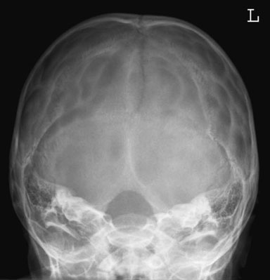
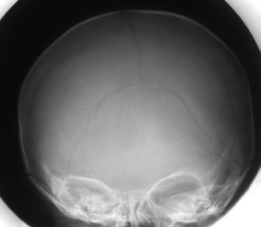

# Rx Craniu Fronto - occipital - 30 degrees

  📷 Radiografie Convențională (Rx)
  <strong>Actualizat:</strong> 2026-09-16
  <strong>Autor:</strong> Departamentul de Radiologie / Referință Clark (Ed. 12)

---

-   __1. Rezumat Clinic & Indicații__

    ---

    === "Indicații Clinice"

        - Evaluare radiografică regiunii Craniu (Fronto - occipital - 30 grade).
        - Suspiciune de leziuni traumatice (fracturi, luxații sau diastazis articular).
        - Bilanț osteoarticular / visceral conform recomandării medicale de trimitere.

    === "Ghid Național IRIS"

        !!! info "Referință Primară: Ghidul Național IRIS (Ordinul MS 1342/2012)"
            - **Capitol Ghid IRIS:** *Ghidul Național IRIS*
            - **Grad de Recomandare:** **De verificat pe indicație; fără grad atribuit automat**
            - **Nivel de Iradiere Estimată:** `De verificat pentru examinarea și populația selectate`

            [:octicons-search-16: Deschide Ghidul IRIS](../../iris.md){ .md-button .md-button--primary } [:material-open-in-new: Aplicația Oficială PWA](https://radiologie-pediatrica.ro/iris/){ .md-button target="_blank" rel="noopener" }
-   __2. Poziționare & Centrare Fascicul__

    ---

    - **Poziție Pacient:** • child este poziționat în similar way la that described pentru fronto-occipital poziție. However, bărbia este coborât astfel încât linie orbitomeatală (LOM) este la drept-angles la masa de examinare.
• carer immobilizes capul using foam pads poziționat gently but firmly either side de capul.
• caseta este poziționat longitudinally pe tabletop, cu its upper edge la nivelul vertex de Craniu.
    - **Punct de Centrare Fascicul:** • raza centrală este înclinat caudally so that it makes angle de 30 grade la orbito-meatal plane.
• la avoid irradiating eyes, collimation field este set astfel încât lower margine este coincident cu upper orbital margin și upper margine includes Craniu vertex.
Laterally, skin margins trebuie să also fie included within field (Denton 1998).
• If child’s chin cannot fie sufficiently coborât la bring linie orbitomeatală (LOM) la drept-angles la masa de examinare, it will fie necessary la angle raza centrală more than 30 grade la vertical so that it makes necessary angle de 30 grade la orbito-meatal plane.
    - **Distanță Focar-Film (DFF / SID):** 100 cm
    - **Comandă Respiratorie:** Apnee pe durata expunerii (apnee în inspir pentru torace; expir pentru Abdomen/bazin).

-   __3. Parametri Tehnici Expunere__

    ---

    | Parametru Tehnic | Valoare Configurare Generator / Tub |
    |:-----------------|:-------------------------------------|
    | **Tensiune Tub (kV)** | DE CONFIGURAT PE APARAT |
    | **Sarcină / Produs Curent-Timp (mAs)** | Conform AEC / grosime anatomică |
    | **Distanță Focar-Film (DFF / SID)** | 100 cm |
    | **Grilă Antidifuzoare (Bucky)** | Conform grosimii anatomice (> 10-12 cm cu grilă) |
    | **Dimensiune Focar** | Focar Mic (0.6 mm) |
    | **Camere de Ionizare AEC** | DE CONFIGURAT PE APARAT |
    | **Colimare Fascicul** | Colimare strictă la aria anatomică de interes diagnostic |
    | **Filtrare Tub** | Totală ≥ 2.5 mm Al echivalent (conform Clark: 3.0 mm Al eq.) |

-   __4. Criterii de Calitate & Reușită Imagine__

    ---

    - arch de atlas trebuie să fie projected through gaură occipitală mare (foramen magnum).
    - Lambdoid și coronal sutures trebuie să fie simetric.
    - Inner și outer table, soft tissues și sutures ca above. 404 imagine de under-tilted fronto-occipital Craniu radiografie using a 15-grade pad under Craniu cu a 10-grade caudal tube angle pentru optim demonstration de coronal și lambdoid sutures pe single imagine 25° Line diagram evidențiind Denton fascicul-limiting technique Frontal diagram de Craniu evidențiind light fascicul collimation imagine de correctly poziționat fronto-occipital 25 grade caudal radiografie de Craniu ca în Denton technique (Denton 1998)

-   __5. Protecție Radiologică (ALARA)__

    ---

    - Ecranare gonadică cu șorț plumbat dacă gonadele sunt în apropierea fasciculului util (regula ALARA).
    - Colimare precisă la dimensiunea anatomică strict necesară pentru reducerea dozei și a radiației difuze.
    - Verificarea posibilității unei sarcini la pacientele de vârstă fertilă înainte de expunere.

!!! note "Observații Clinice & Tehnice"
    Pregătirea pacientului prin îndepărtarea tuturor accesoriilor radio-opace.

### 🖼️ Imagini

<figure class="protocol-image-card" markdown>

<figcaption><strong>imagine de under-tilted fronto-occipital Craniu radiografie using a 15-grade pad</strong> — Poziționare pacient și centrare fascicul conform Clark (Ed. 12)</figcaption>

</figure>

<figure class="protocol-image-card" markdown>

<figcaption><strong>Frontal diagram de Craniu evidențiind light fascicul collimation</strong> — Aspect radiografic / ghid de poziționare conform tratatului Clark (Ed. 12)</figcaption>

</figure>

=== "Ghid Rapid de Execuție"

    1. **Identificarea și verificarea pacientului:** verificare identitate, zonă de examinat, consimțământ conform procedurii și evaluarea posibilității unei sarcini, când este relevantă.
    2. **Pregătire:** îndepărtarea oricăror obiecte radiopace (bijuterii, agrafe, fermoare, proteze, pansamente dense).
    3. **Poziționare precisă:** alinierea receptorului de imagine și a tubului la distanța prescrisă (100 cm).
    4. **Colimare strictă:** adaptarea fasciculului strict la regiunea de diagnostic pentru scăderea iradierii și reducerea radiației difuze.
    5. **Radioprotecție:** verificarea [politicii RX](../radioprotectie.md), cu măsuri distincte pentru pacient, personal și însoțitor.

## Surse de documentare

- [Clark's Positioning in Radiography (Ed. 12), Pagina 419](../../assets/protocols/sources/Clark___Positioning_in_Radiography__12th_edition.pdf#page=419)
