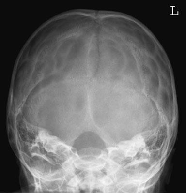
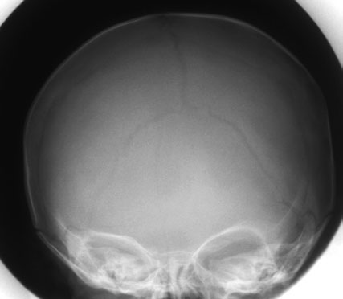

# Rx craniu fronto-occipital – 30 de grade

  📷 Radiografie Convențională (Rx)
  <strong>Actualizat:</strong> 2026-09-16
  <strong>Autor:</strong> Departamentul de Radiologie / Referință Clark (Ed. 12)

---

-   __1. Rezumat Clinic & Indicații__

    ---

    === "Indicații Clinice"

        - Evaluare radiografică a regiunii craniului (fronto-occipitală – 30 de grade).
        - Suspiciune de leziuni traumatice (fracturi, luxații sau diastazis articular).
        - Bilanț osteoarticular / visceral conform recomandării medicale de trimitere.

    === "Ghid Național IRIS"

        !!! info "Referință Primară: Ghidul Național IRIS (Ordinul MS 1342/2012)"
            - **Capitol Ghid IRIS:** *Pediatrie — Aparat locomotor*
            - **Grad de Recomandare:** **Grad A**
            - **Nivel de Iradiere Estimată:** `Clasa 1 (Minimă < 0.01 mSv)`

            [:octicons-search-16: Deschide Ghidul IRIS](../../iris.md){ .md-button .md-button--primary } [:material-open-in-new: Aplicația Oficială PWA](https://radiologie-pediatrica.ro/iris/){ .md-button target="_blank" rel="noopener" }

-   __2. Poziționare & Centrare Fascicul__

    ---

    - **Poziție Pacient:**
        - Copilul este poziționat într-un mod similar celui descris pentru poziția fronto-occipitală. Totuși, bărbia este coborâtă astfel încât linia orbitomeatală (LOM) să fie perpendiculară pe masa de examinare.
        - Însoțitorul imobilizează capul utilizând pernițe din spumă, poziționate delicat, dar ferm, de o parte și de alta a capului.
        - Caseta este poziționată longitudinal pe masa radiologică, cu marginea superioară la nivelul vertexului craniului.
    - **Punct de Centrare Fascicul:**
        - Raza centrală este înclinată caudal astfel încât să formeze un unghi de 30 de grade cu planul orbitomeatal.
        - Pentru a evita iradierea ochilor, câmpul de colimare este stabilit astfel încât marginea inferioară să coincidă cu marginea orbitală superioară, iar marginea superioară să includă vertexul craniului. Lateral, marginile cutanate trebuie, de asemenea, incluse în câmp (Denton 1998).
        - Dacă bărbia copilului nu poate fi coborâtă suficient pentru a aduce linia orbitomeatală (LOM) perpendiculară pe masa de examinare, va fi necesară înclinarea razei centrale cu mai mult de 30 de grade față de verticală, astfel încât aceasta să formeze unghiul necesar de 30 de grade cu planul orbitomeatal.
    - **Distanță Focar-Film (DFF / SID):** 100 cm
    - **Comandă Respiratorie:** Apnee pe durata expunerii (apnee în inspir pentru torace; expir pentru Abdomen/bazin).

-   __3. Parametri Tehnici Expunere__

    ---

    | Parametru Tehnic | Valoare Configurare Generator / Tub |
    |:-----------------|:-------------------------------------|
    | **Tensiune Tub (kV)** | DE CONFIGURAT PE APARAT |
    | **Sarcină / Produs Curent-Timp (mAs)** | Conform AEC / grosimii anatomice |
    | **Distanță Focar-Film (DFF / SID)** | 100 cm |
    | **Grilă Antidifuzoare (Bucky)** | Conform grosimii anatomice (> 10-12 cm cu grilă) |
    | **Dimensiune Focar** | Focar Mic (0.6 mm) |
    | **Camere de Ionizare AEC** | DE CONFIGURAT PE APARAT |
    | **Colimare Fascicul** | Colimare strictă la aria anatomică de interes diagnostic |
    | **Filtrare Tub** | Totală ≥ 2.5 mm Al echivalent (conform Clark: 3.0 mm Al echivalent) |

-   __4. Criterii de Calitate & Reușită Imagine__

    ---

    - Arcul atlasului trebuie proiectat prin gaura occipitală mare (foramen magnum).
    - Suturile lambdoidă și coronală trebuie să fie simetrice.
    - Tăblia internă și externă, țesuturile moi și suturile, ca mai sus. 404 Imagine de radiografie craniană fronto-occipitală subînclinată, utilizând o pernă de 15 grade sub craniu, cu un unghi caudal al tubului de 10 grade, pentru demonstrarea optimă a suturilor coronale și lambdoide pe o singură imagine. 25° Diagramă liniară care evidențiază tehnica Denton de limitare a fasciculului. Diagramă frontală a craniului, evidențiind colimarea fasciculului luminos. Imagine de radiografie craniană fronto-occipitală poziționată corect, la 25 de grade caudal, conform tehnicii Denton (Denton 1998).

-   __5. Protecție Radiologică (ALARA)__

    ---

    - Ecranare gonadică cu șorț plumbat dacă gonadele sunt în apropierea fasciculului util (regula ALARA).
    - Colimare precisă la dimensiunea anatomică strict necesară pentru reducerea dozei și a radiației difuze.
    - Verificarea posibilității unei sarcini la pacientele de vârstă fertilă înainte de expunere.

!!! note "Observații Clinice & Tehnice"
    Pregătirea pacientului prin îndepărtarea tuturor accesoriilor radio-opace.

### 🖼️ Imagini

<figure class="protocol-image-card" markdown>

<figcaption><strong>Imagine de radiografie craniană fronto-occipitală subînclinată, utilizând o pernă de 15 grade</strong> — Poziționarea pacientului și centrarea fasciculului conform Clark (Ed. 12)</figcaption>

</figure>

<figure class="protocol-image-card" markdown>

<figcaption><strong>Diagramă frontală a craniului, evidențiind colimarea fasciculului luminos</strong> — Aspect radiografic / ghid de poziționare conform tratatului Clark (Ed. 12)</figcaption>

</figure>

=== "Ghid Rapid de Execuție"

    1. **Identificarea și verificarea pacientului:** verificare identitate, zonă de examinat, consimțământ conform procedurii și evaluarea posibilității unei sarcini, când este relevantă.
    2. **Pregătire:** îndepărtarea oricăror obiecte radiopace (bijuterii, agrafe, fermoare, proteze, pansamente dense).
    3. **Poziționare precisă:** alinierea receptorului de imagine și a tubului la distanța prescrisă (100 cm).
    4. **Colimare strictă:** adaptarea fasciculului strict la regiunea de diagnostic pentru scăderea iradierii și reducerea radiației difuze.
    5. **Radioprotecție:** verificarea [politicii RX](../radioprotectie.md), cu măsuri distincte pentru pacient, personal și însoțitor.

## Surse de documentare

- [Clark's Positioning in Radiography (Ed. 12), Pagina 419](https://books.google.com/books/about/Clark_s_Positioning_in_Radiography.html?id=Xxu6MwEACAAJ)
