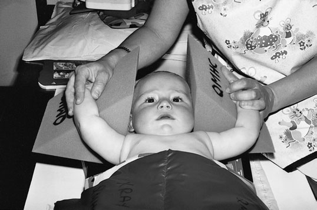
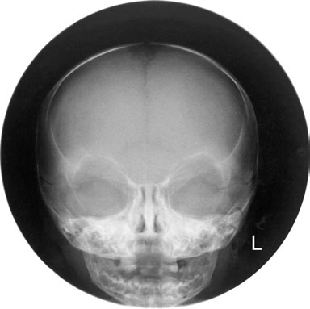
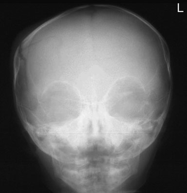

# Rx Craniu Fronto - occipital

  📷 Radiografie Convențională (Rx)
  <strong>Actualizat:</strong> 2026-09-16
  <strong>Autor:</strong> Departamentul de Radiologie / Referință Clark (Ed. 12)

---

-   __1. Rezumat Clinic & Indicații__

    ---

    === "Indicații Clinice"

        - 403 14 Craniu Fronto-occipital A 24  30-cm sau 18  24-cm casetă este selected, depending pe size de Craniu.

    === "Ghid Național IRIS"

        !!! info "Referință Primară: Ghidul Național IRIS (Ordinul MS 1342/2012)"
            - **Capitol Ghid IRIS:** *Ghidul Național IRIS*
            - **Grad de Recomandare:** **De verificat pe indicație; fără grad atribuit automat**
            - **Nivel de Iradiere Estimată:** `De verificat pentru examinarea și populația selectate`

            [:octicons-search-16: Deschide Ghidul IRIS](../../iris.md){ .md-button .md-button--primary } [:material-open-in-new: Aplicația Oficială PWA](https://radiologie-pediatrica.ro/iris/){ .md-button target="_blank" rel="noopener" }
-   __2. Poziționare & Centrare Fascicul__

    ---

    - **Poziție Pacient:** • child este poziționat carefully în Decubit dorsal poziție, cu capul resting pe pre-formed foam pad poziționat pe top de caseta. capul este ajustat la bring planul mediosagital la drept-angles la și în linia mediană casetă.
extern auditory meati trebuie să fie echidistant față de caseta.
• child este imobilizat în this poziție cu assistance de carer, who este asked la hold foam pads pe either side de Craniu during expunere. carer usually stands la capul end de imaging table la undertake this procedure.
Occasionally, second carer este required la assist în keeping child still.
    - **Punct de Centrare Fascicul:** • raza centrală este orientat la nazion la necessary angle la allow it la pass along orbito-meatal plane.
• If it este required that orbits sunt vizualizat clear de petrous bone, raza centrală trebuie să fie înclinat cranially so that it makes angle de 20 grade la orbito-meatal plane și centred la nazion.
    - **Distanță Focar-Film (DFF / SID):** 100 cm
    - **Comandă Respiratorie:** Apnee pe durata expunerii (apnee în inspir pentru torace; expir pentru Abdomen/bazin).

-   __3. Parametri Tehnici Expunere__

    ---

    | Parametru Tehnic | Valoare Configurare Generator / Tub |
    |:-----------------|:-------------------------------------|
    | **Tensiune Tub (kV)** | DE CONFIGURAT PE APARAT |
    | **Sarcină / Produs Curent-Timp (mAs)** | Conform AEC / grosime anatomică |
    | **Distanță Focar-Film (DFF / SID)** | 100 cm |
    | **Grilă Antidifuzoare (Bucky)** | Conform grosimii anatomice (> 10-12 cm cu grilă) |
    | **Dimensiune Focar** | Focar Mic (0.6 mm) |
    | **Camere de Ionizare AEC** | DE CONFIGURAT PE APARAT |
    | **Colimare Fascicul** | Colimare strictă adaptată pe receptor 24 x 30 cm |
    | **Filtrare Tub** | Totală ≥ 2.5 mm Al echivalent (conform Clark: 3.0 mm Al eq.) |

-   __4. Criterii de Calitate & Reușită Imagine__

    ---

    - Whole cranial vault, orbits și petrous bones trebuie să fie present pe radiografie și trebuie să fie simetric.
    - pentru occipito-frontal 20 grade, petrous bones trebuie să fie projected over lower orbital margins.
    - Lambdoid și coronal sutures trebuie să fie simetric.
    - Visually reproducere netă contururilor de outer și inner tables de cranial vault according la age.
    - Reproduction de Sinusuri Paranazale (SAF) și temporal bones consistent cu age.
    - Visualization de sutures consistent cu age.
    - Soft tissues de scalp trebuie să fie reproduced cu bright light.
    - Erori de evitat / remedii: Holder’s mâini around fața.
    - Erori de evitat / remedii: Wide cones.
    - Erori de evitat / remedii: rotit pacient cu respect la caseta.

-   __5. Protecție Radiologică (ALARA)__

    ---

    - Ecranare gonadică cu șorț plumbat dacă gonadele sunt în apropierea fasciculului util (regula ALARA).
    - Colimare precisă la dimensiunea anatomică strict necesară pentru reducerea dozei și a radiației difuze.
    - Verificarea posibilității unei sarcini la pacientele de vârstă fertilă înainte de expunere.

!!! note "Observații Clinice & Tehnice"
    Pregătirea pacientului prin îndepărtarea tuturor accesoriilor radio-opace.

### 🖼️ Imagini

<figure class="protocol-image-card" markdown>

<figcaption><strong>sent pe radiografie și trebuie să fie simetric.</strong> — Poziționare pacient și centrare fascicul conform Clark (Ed. 12)</figcaption>

</figure>

<figure class="protocol-image-card" markdown>

<figcaption><strong>imagine de normal fronto-occipital Craniu radiografie</strong> — Aspect radiografic / ghid de poziționare conform tratatului Clark (Ed. 12)</figcaption>

</figure>

<figure class="protocol-image-card" markdown>

<figcaption><strong>imagine de fronto-occipital Craniu radiografie de infant evidențiind drept</strong> — Aspect radiografic / ghid de poziționare conform tratatului Clark (Ed. 12)</figcaption>

</figure>

=== "Ghid Rapid de Execuție"

    1. **Identificarea și verificarea pacientului:** verificare identitate, zonă de examinat, consimțământ conform procedurii și evaluarea posibilității unei sarcini, când este relevantă.
    2. **Pregătire:** îndepărtarea oricăror obiecte radiopace (bijuterii, agrafe, fermoare, proteze, pansamente dense).
    3. **Poziționare precisă:** alinierea receptorului de imagine și a tubului la distanța prescrisă (100 cm).
    4. **Colimare strictă:** adaptarea fasciculului strict la regiunea de diagnostic pentru scăderea iradierii și reducerea radiației difuze.
    5. **Radioprotecție:** verificarea [politicii RX](../radioprotectie.md), cu măsuri distincte pentru pacient, personal și însoțitor.

## Surse de documentare

- [Clark's Positioning in Radiography (Ed. 12), Pagina 418](../../assets/protocols/sources/Clark___Positioning_in_Radiography__12th_edition.pdf#page=418)
