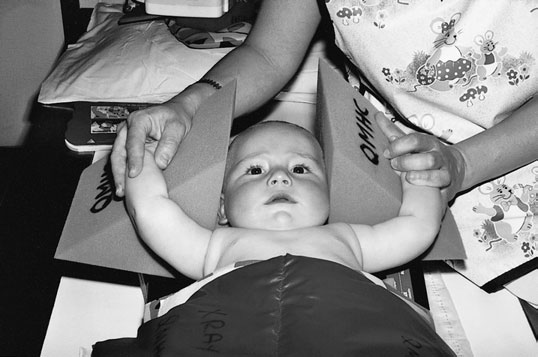
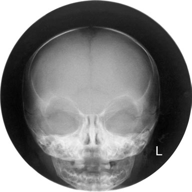
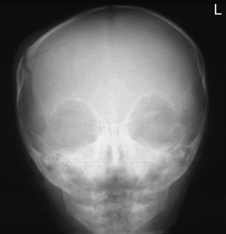

# Rx Craniu Fronto-occipital

  📷 Radiografie Convențională (Rx)
  <strong>Actualizat:</strong> 2026-09-16
  <strong>Autor:</strong> Departamentul de Radiologie / Referință Clark (Ed. 12)

---

-   __1. Rezumat Clinic & Indicații__

    ---

    === "Indicații Clinice"

        - 403 14 Craniu fronto-occipital. Se selectează o casetă de 24 × 30 cm sau de 18 × 24 cm, în funcție de dimensiunea craniului.

    === "Ghid Național IRIS"

        !!! info "Referință Primară: Ghidul Național IRIS (Ordinul MS 1342/2012)"
            - **Capitol Ghid IRIS:** *Pediatrie — Aparat locomotor*
            - **Grad de Recomandare:** **Grad A**
            - **Nivel de Iradiere Estimată:** `Clasa 1 (Minimă < 0.01 mSv)`

            [:octicons-search-16: Deschide Ghidul IRIS](../../iris.md){ .md-button .md-button--primary } [:material-open-in-new: Aplicația Oficială PWA](https://radiologie-pediatrica.ro/iris/){ .md-button target="_blank" rel="noopener" }

-   __2. Poziționare & Centrare Fascicul__

    ---

    - **Poziție Pacient:**
        - Copilul este poziționat cu grijă în decubit dorsal, cu capul sprijinit pe o pernă preformată din spumă, poziționată pe casetă. Capul este ajustat pentru a aduce planul mediosagital perpendicular pe și pe linia mediană a casetei. Meaturile acustice externe trebuie să fie echidistante față de casetă.
        - Copilul este imobilizat în această poziție cu ajutorul însoțitorului, căruia i se cere să țină pernițele din spumă de o parte și de alta a craniului în timpul expunerii. Însoțitorul stă de obicei la extremitatea cefalică a mesei radiologice pentru efectuarea acestei proceduri. Ocazional, este necesar un al doilea însoțitor pentru a ajuta la menținerea copilului nemișcat.
    - **Punct de Centrare Fascicul:**
        - Raza centrală este orientată spre nazion, la unghiul necesar pentru a-i permite trecerea de-a lungul planului orbitomeatal.
        - Dacă este necesar ca orbitele să fie vizualizate clar deasupra oaselor pietroase, raza centrală trebuie înclinată cranial astfel încât să formeze un unghi de 20 de grade cu planul orbitomeatal și să fie centrată pe nazion.
    - **Distanță Focar-Film (DFF / SID):** 100 cm
    - **Comandă Respiratorie:** Apnee pe durata expunerii (apnee în inspir pentru torace; expir pentru Abdomen/bazin).

-   __3. Parametri Tehnici Expunere__

    ---

    | Parametru Tehnic | Valoare Configurare Generator / Tub |
    |:-----------------|:-------------------------------------|
    | **Tensiune Tub (kV)** | DE CONFIGURAT PE APARAT |
    | **Sarcină / Produs Curent-Timp (mAs)** | Conform AEC / grosimii anatomice |
    | **Distanță Focar-Film (DFF / SID)** | 100 cm |
    | **Grilă Antidifuzoare (Bucky)** | Conform grosimii anatomice (> 10-12 cm cu grilă) |
    | **Dimensiune Focar** | Focar Mic (0.6 mm) |
    | **Camere de Ionizare AEC** | DE CONFIGURAT PE APARAT |
    | **Colimare Fascicul** | Colimare strictă adaptată pe receptor 24 x 30 cm |
    | **Filtrare Tub** | Totală ≥ 2.5 mm Al echivalent (conform Clark: 3.0 mm Al echivalent) |

-   __4. Criterii de Calitate & Reușită Imagine__

    ---

    - Întreaga boltă craniană, orbitele și oasele pietroase trebuie să fie prezente pe radiografie și trebuie să fie simetrice.
    - Pentru incidența occipito-frontală la 20 de grade, oasele pietroase trebuie să fie proiectate peste marginile orbitale inferioare.
    - Suturile lambdoidă și coronală trebuie să fie simetrice.
    - Reproducerea vizuală clară a contururilor tăbliilor externe și interne ale bolții craniene, în funcție de vârstă.
    - Reproducerea sinusurilor paranazale (SAF) și a oaselor temporale, în concordanță cu vârsta.
    - Vizualizarea suturilor, în concordanță cu vârsta.
    - Țesuturile moi ale scalpului trebuie reproduse cu o luminozitate intensă.
    - Erori de evitat / remedii: mâinile însoțitorului în jurul feței.
    - Erori de evitat / remedii: conuri largi.
    - Erori de evitat / remedii: pacient rotit în raport cu caseta.

-   __5. Protecție Radiologică (ALARA)__

    ---

    - Ecranare gonadică cu șorț plumbat dacă gonadele sunt în apropierea fasciculului util (regula ALARA).
    - Colimare precisă la dimensiunea anatomică strict necesară pentru reducerea dozei și a radiației difuze.
    - Verificarea posibilității unei sarcini la pacientele de vârstă fertilă înainte de expunere.

!!! note "Observații Clinice & Tehnice"
    Pregătirea pacientului prin îndepărtarea tuturor accesoriilor radio-opace.

### 🖼️ Imagini

<figure class="protocol-image-card" markdown>

<figcaption><strong>Prezente pe radiografie și trebuie să fie simetrice.</strong> — Poziționarea pacientului și centrarea fasciculului conform Clark (Ed. 12)</figcaption>

</figure>

<figure class="protocol-image-card" markdown>

<figcaption><strong>Imagine de radiografie craniană fronto-occipitală normală</strong> — Aspect radiografic / ghid de poziționare conform tratatului Clark (Ed. 12)</figcaption>

</figure>

<figure class="protocol-image-card" markdown>

<figcaption><strong>Imagine de radiografie craniană fronto-occipitală a unui sugar, evidențiind partea dreaptă</strong> — Aspect radiografic / ghid de poziționare conform tratatului Clark (Ed. 12)</figcaption>

</figure>

=== "Ghid Rapid de Execuție"

    1. **Identificarea și verificarea pacientului:** verificare identitate, zonă de examinat, consimțământ conform procedurii și evaluarea posibilității unei sarcini, când este relevantă.
    2. **Pregătire:** îndepărtarea oricăror obiecte radiopace (bijuterii, agrafe, fermoare, proteze, pansamente dense).
    3. **Poziționare precisă:** alinierea receptorului de imagine și a tubului la distanța prescrisă (100 cm).
    4. **Colimare strictă:** adaptarea fasciculului strict la regiunea de diagnostic pentru scăderea iradierii și reducerea radiației difuze.
    5. **Radioprotecție:** verificarea [politicii RX](../radioprotectie.md), cu măsuri distincte pentru pacient, personal și însoțitor.

## Surse de documentare

- [Clark's Positioning in Radiography (Ed. 12), Pagina 418](https://books.google.com/books/about/Clark_s_Positioning_in_Radiography.html?id=Xxu6MwEACAAJ)
