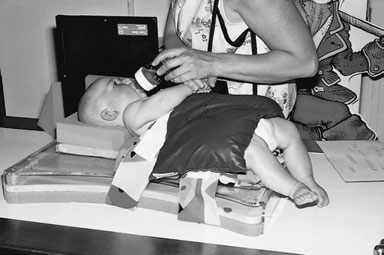
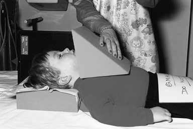
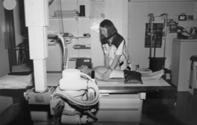
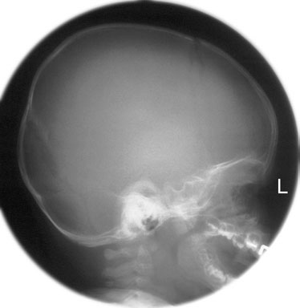

# Rx Craniu Profil (Lateral) - Decubit Dorsal

  📷 Radiografie Convențională (Rx)
  <strong>Actualizat:</strong> 2026-09-16
  <strong>Autor:</strong> Departamentul de Radiologie / Referință Clark (Ed. 12)

---

-   __1. Rezumat Clinic & Indicații__

    ---

    === "Indicații Clinice"

        - 405 14 Craniu Profil (lateral) – Decubit dorsal

    === "Ghid Național IRIS"

        !!! info "Referință Primară: Ghidul Național IRIS (Ordinul MS 1342/2012)"
            - **Capitol Ghid IRIS:** *Ghidul Național IRIS*
            - **Grad de Recomandare:** **De verificat pe indicație; fără grad atribuit automat**
            - **Nivel de Iradiere Estimată:** `De verificat pentru examinarea și populația selectate`

            [:octicons-search-16: Deschide Ghidul IRIS](../../iris.md){ .md-button .md-button--primary } [:material-open-in-new: Aplicația Oficială PWA](https://radiologie-pediatrica.ro/iris/){ .md-button target="_blank" rel="noopener" }
-   __2. Poziționare & Centrare Fascicul__

    ---

    - **Poziție Pacient:** • cu pacientul Decubit dorsal pe masa radiologică, pre-formed foam pad este plasat under capul astfel încât occiput este included pe imagine.
• pacientul’s cap este now ajustat la bring planul mediosagital de capul la drept-angles la masa de examinare prin ensuring that extern auditory meati sunt echidistant față de masa de examinare.
• capul este imobilizat cu aid de carer (see photographs opposite pentru technique according la age).
• casetă este sprijinit vertically pe / sprijinit de Profil (lateral) aspect de capul paralel cu plan mediosagital, cu its long edge 5cm above vertex de Craniu.
    - **Punct de Centrare Fascicul:** • raza centrală orizontală centrală este orientat paralel cu interorbital line so that it este la drept-angles la planul mediosagital și caseta.
• raza centrală este centred midway între glabelă și extern occipital protuberance.
    - **Distanță Focar-Film (DFF / SID):** 100 cm
    - **Comandă Respiratorie:** Apnee pe durata expunerii (apnee în inspir pentru torace; expir pentru Abdomen/bazin).

-   __3. Parametri Tehnici Expunere__

    ---

    | Parametru Tehnic | Valoare Configurare Generator / Tub |
    |:-----------------|:-------------------------------------|
    | **Tensiune Tub (kV)** | DE CONFIGURAT PE APARAT |
    | **Sarcină / Produs Curent-Timp (mAs)** | Conform AEC / grosime anatomică |
    | **Distanță Focar-Film (DFF / SID)** | 100 cm |
    | **Grilă Antidifuzoare (Bucky)** | Cu grilă antidifuzoare Bucky |
    | **Dimensiune Focar** | Focar Mic (0.6 mm) |
    | **Camere de Ionizare AEC** | Camerele laterale (sau camera centrală funcție de regiune) |
    | **Colimare Fascicul** | Colimare strictă la aria anatomică de interes diagnostic |
    | **Filtrare Tub** | Totală ≥ 2.5 mm Al echivalent (conform Clark: 3.0 mm Al eq.) |

-   __4. Criterii de Calitate & Reușită Imagine__

    ---

    - whole cranial vault și base de Craniu trebuie să fie present și simetric.
    - floor de pituitary fossa trebuie să fie single line.
    - floors de anterior cranial fossa trebuie să fie superimposed.
    - mandibular condyles trebuie să fie superimposed.
    - first three Coloană Cervicală trebuie să fie included pentru trauma și trebuie să fie Profil (lateral).
    - Visually reproducere netă contururilor de outer și inner tables și floor de sella consistent cu age.
    - Visually reproducere netă contururilor de vascular channels și trabecular structure consistent cu age.
    - Reproduction de sutures și fontanelles consistent cu age.
    - Reproduction de soft tissues și Oase Proprii Nazale (OPN), consistent cu age.
    - Reproduction de sinusuri sfenoidale (nu pneumatized below age de six years). poziție de six-month-old child pentru Profil (lateral) Craniu cu Fascicul Orizontal technique cu pacient Decubit dorsal evidențiind imobilizare și distraction cu feeding bottle poziție de a 3-year-old child poziționat pentru Profil (lateral) Craniu, pacient Decubit dorsal evidențiind use de foam pad la Se imobilizează capul pacientului poziție de 6-year-old child pentru Profil (lateral) Craniu, pacient Decubit dorsal evidențiind poziție de X-ray tube imagine de correctly poziționat Profil (lateral) radiografie de baby’s Craniu

-   __5. Protecție Radiologică (ALARA)__

    ---

    - Ecranare gonadică cu șorț plumbat dacă gonadele sunt în apropierea fasciculului util (regula ALARA).
    - Colimare precisă la dimensiunea anatomică strict necesară pentru reducerea dozei și a radiației difuze.
    - Verificarea posibilității unei sarcini la pacientele de vârstă fertilă înainte de expunere.

!!! note "Observații Clinice & Tehnice"
    Pregătirea pacientului prin îndepărtarea tuturor accesoriilor radio-opace.

### 🖼️ Imagini

<figure class="protocol-image-card" markdown>

<figcaption><strong>evidențiind use de foam pad la Se imobilizează capul pacientului</strong> — Poziționare pacient și centrare fascicul conform Clark (Ed. 12)</figcaption>

</figure>

<figure class="protocol-image-card" markdown>

<figcaption><strong>poziție de 6-year-old child pentru Profil (lateral) Craniu, pacient Decubit dorsal evidențiind poziție</strong> — Aspect radiografic / ghid de poziționare conform tratatului Clark (Ed. 12)</figcaption>

</figure>

<figure class="protocol-image-card" markdown>

<figcaption><strong>imagine de correctly poziționat Profil (lateral) radiografie de baby’s Craniu</strong> — Aspect radiografic / ghid de poziționare conform tratatului Clark (Ed. 12)</figcaption>

</figure>

<figure class="protocol-image-card" markdown>

<figcaption><strong>Figura 4: Aspect radiografic / Poziționare (Clark Ed. 12)</strong> — Aspect radiografic / ghid de poziționare conform tratatului Clark (Ed. 12)</figcaption>

</figure>

=== "Ghid Rapid de Execuție"

    1. **Identificarea și verificarea pacientului:** verificare identitate, zonă de examinat, consimțământ conform procedurii și evaluarea posibilității unei sarcini, când este relevantă.
    2. **Pregătire:** îndepărtarea oricăror obiecte radiopace (bijuterii, agrafe, fermoare, proteze, pansamente dense).
    3. **Poziționare precisă:** alinierea receptorului de imagine și a tubului la distanța prescrisă (100 cm).
    4. **Colimare strictă:** adaptarea fasciculului strict la regiunea de diagnostic pentru scăderea iradierii și reducerea radiației difuze.
    5. **Radioprotecție:** verificarea [politicii RX](../radioprotectie.md), cu măsuri distincte pentru pacient, personal și însoțitor.

## Surse de documentare

- [Clark's Positioning in Radiography (Ed. 12), Pagina 420](../../assets/protocols/sources/Clark___Positioning_in_Radiography__12th_edition.pdf#page=420)
