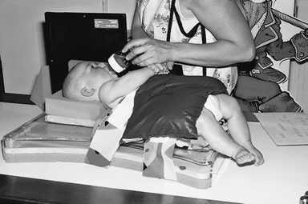
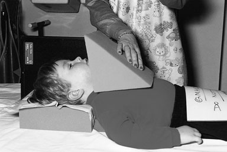
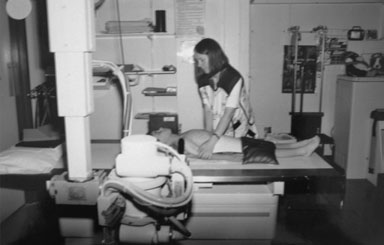
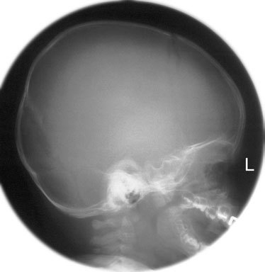

# Rx craniu profil (lateral) - decubit dorsal

  📷 Radiografie Convențională (Rx)
  <strong>Actualizat:</strong> 2026-09-16
  <strong>Autor:</strong> Departamentul de Radiologie / Referință Clark (Ed. 12)

---

-   __1. Rezumat Clinic & Indicații__

    ---

    === "Indicații Clinice"

        - 405 14 Craniu de profil – decubit dorsal

    === "Ghid Național IRIS"

        !!! info "Referință Primară: Ghidul Național IRIS (Ordinul MS 1342/2012)"
            - **Capitol Ghid IRIS:** *Pediatrie — Aparat locomotor*
            - **Grad de Recomandare:** **Grad A**
            - **Nivel de Iradiere Estimată:** `Clasa 1 (Minimă < 0.01 mSv)`

            [:octicons-search-16: Deschide Ghidul IRIS](../../iris.md){ .md-button .md-button--primary } [:material-open-in-new: Aplicația Oficială PWA](https://radiologie-pediatrica.ro/iris/){ .md-button target="_blank" rel="noopener" }

-   __2. Poziționare & Centrare Fascicul__

    ---

    - **Poziție Pacient:**
        - Cu pacientul în decubit dorsal pe masa radiologică, perna preformată din spumă este plasată sub cap astfel încât occiputul să fie inclus în imagine.
        - Capul pacientului este apoi ajustat pentru a aduce planul mediosagital al capului perpendicular pe masa de examinare, asigurându-se că meaturile acustice externe sunt echidistante față de masa de examinare.
        - Capul este imobilizat cu ajutorul însoțitorului (a se vedea fotografiile alăturate pentru tehnica în funcție de vârstă).
        - Caseta este sprijinită vertical pe aspectul de profil al capului, paralel cu planul mediosagital, cu marginea lungă la 5 cm deasupra vertexului craniului.
    - **Punct de Centrare Fascicul:**
        - Raza centrală orizontală este orientată paralel cu linia interorbitală, astfel încât să fie perpendiculară pe planul mediosagital și pe casetă.
        - Raza centrală este centrată la jumătatea distanței dintre glabelă și protuberanța occipitală externă.
    - **Distanță Focar-Film (DFF / SID):** 100 cm
    - **Comandă Respiratorie:** Apnee pe durata expunerii (apnee în inspir pentru torace; expir pentru Abdomen/bazin).

-   __3. Parametri Tehnici Expunere__

    ---

    | Parametru Tehnic | Valoare Configurare Generator / Tub |
    |:-----------------|:-------------------------------------|
    | **Tensiune Tub (kV)** | DE CONFIGURAT PE APARAT |
    | **Sarcină / Produs Curent-Timp (mAs)** | Conform AEC / grosimii anatomice |
    | **Distanță Focar-Film (DFF / SID)** | 100 cm |
    | **Grilă Antidifuzoare (Bucky)** | Cu grilă antidifuzoare Bucky |
    | **Dimensiune Focar** | Focar Mic (0.6 mm) |
    | **Camere de Ionizare AEC** | Camerele laterale (sau camera centrală, în funcție de regiune) |
    | **Colimare Fascicul** | Colimare strictă la aria anatomică de interes diagnostic |
    | **Filtrare Tub** | Totală ≥ 2.5 mm Al echivalent (conform Clark: 3.0 mm Al echivalent) |

-   __4. Criterii de Calitate & Reușită Imagine__

    ---

    - Întreaga boltă craniană și baza craniului trebuie să fie prezente și simetrice.
    - planșeul fosei hipofizare trebuie să fie o singură linie.
    - planșeele fosei craniene anterioare trebuie să fie suprapuse.
    - condilii mandibulari trebuie să fie suprapuși.
    - primele trei vertebre cervicale trebuie să fie incluse în cazul traumatismelor și trebuie să fie în profil (lateral).
    - Reproducere vizuală netă a contururilor tablelor externă și internă și a planșeului șeii, în concordanță cu vârsta.
    - Reproducere vizuală netă a contururilor canalelor vasculare și a structurii trabeculare, în concordanță cu vârsta.
    - Reproducerea suturilor și fontanelelor, în concordanță cu vârsta.
    - Reproducerea țesuturilor moi și a Oaselor Proprii Nazale (OPN), în concordanță cu vârsta.
    - Reprezentarea sinusurilor sfenoidale (nepneumatizate sub vârsta de șase ani). Poziționarea unui copil de șase luni pentru radiografia de profil a craniului cu fascicul orizontal, în decubit dorsal, evidențiind imobilizarea și distragerea atenției cu un biberon. Poziționarea unui copil de 3 ani pentru radiografia de profil a craniului, în decubit dorsal, evidențiind utilizarea unui suport din spumă pentru imobilizarea capului. Poziționarea unui copil de 6 ani pentru radiografia de profil a craniului, în decubit dorsal, evidențiind poziția tubului radiogen. Imagine radiografică de profil a craniului unui sugar poziționat corect.

-   __5. Protecție Radiologică (ALARA)__

    ---

    - Ecranare gonadică cu șorț plumbat dacă gonadele sunt în apropierea fasciculului util (regula ALARA).
    - Colimare precisă la dimensiunea anatomică strict necesară pentru reducerea dozei și a radiației difuze.
    - Verificarea posibilității unei sarcini la pacientele de vârstă fertilă înainte de expunere.

!!! note "Observații Clinice & Tehnice"
    Pregătirea pacientului prin îndepărtarea tuturor accesoriilor radio-opace.

### 🖼️ Imagini

<figure class="protocol-image-card" markdown>

<figcaption><strong>evidențiind utilizarea unei perne de spumă pentru imobilizarea capului pacientului</strong> — Poziționarea pacientului și centrarea fasciculului conform Clark (Ed. 12)</figcaption>

</figure>

<figure class="protocol-image-card" markdown>

<figcaption><strong>poziția unui copil de 6 ani pentru craniu în profil (lateral), pacientul în decubit dorsal, evidențiind poziția</strong> — Aspect radiografic / ghid de poziționare conform tratatului Clark (Ed. 12)</figcaption>

</figure>

<figure class="protocol-image-card" markdown>

<figcaption><strong>imagine a unei radiografii de craniu a unui sugar poziționat corect în profil (lateral)</strong> — Aspect radiografic / ghid de poziționare conform tratatului Clark (Ed. 12)</figcaption>

</figure>

<figure class="protocol-image-card" markdown>

<figcaption><strong>Figura 4: Aspect radiografic / Poziționare (Clark Ed. 12)</strong> — Aspect radiografic / ghid de poziționare conform tratatului Clark (Ed. 12)</figcaption>

</figure>

=== "Ghid Rapid de Execuție"

    1. **Identificarea și verificarea pacientului:** verificare identitate, zonă de examinat, consimțământ conform procedurii și evaluarea posibilității unei sarcini, când este relevantă.
    2. **Pregătire:** îndepărtarea oricăror obiecte radiopace (bijuterii, agrafe, fermoare, proteze, pansamente dense).
    3. **Poziționare precisă:** alinierea receptorului de imagine și a tubului la distanța prescrisă (100 cm).
    4. **Colimare strictă:** adaptarea fasciculului strict la regiunea de diagnostic pentru scăderea iradierii și reducerea radiației difuze.
    5. **Radioprotecție:** verificarea [politicii RX](../radioprotectie.md), cu măsuri distincte pentru pacient, personal și însoțitor.

## Surse de documentare

- [Clark's Positioning in Radiography (Ed. 12), Pagina 420](https://books.google.com/books/about/Clark_s_Positioning_in_Radiography.html?id=Xxu6MwEACAAJ)
