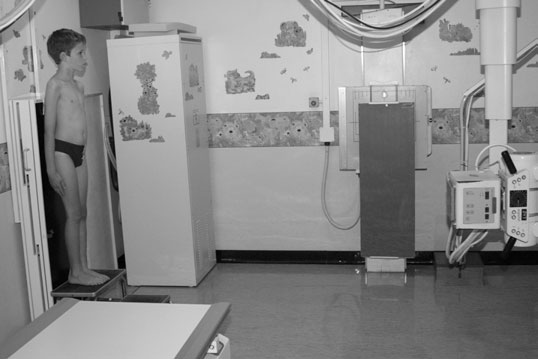
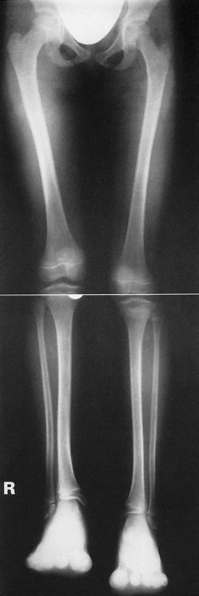

# Rx Măsurare Lungime Membre Inferioare (Telemetrie) Metoda Expunere Unică (Format Lung)

  📷 Radiografie Convențională (Rx)
  <strong>Actualizat:</strong> 2026-09-16
  <strong>Autor:</strong> Departamentul de Radiologie / Referință Clark (Ed. 12)

---

-   __1. Rezumat Clinic & Indicații__

    ---

    === "Indicații Clinice"

        - cu this technique, divergent fascicul will magnify limbs. However, inaccuracy de measurement de difference în length due la magnification will probably fie less than 5%, i.e. inaccuracy de less than 2.5 mm when difference în actual length este 50 mm. This grade de inaccuracy poate fie considered surgically insignificant. Alternatively, when examining baby sau small child, especially when they cannot stand și poate fie uncooperative, smaller casetă este selected la match length de limbs. If possible, child este examined pe imaging table provided large enough FFD poate fie obtained.

    === "Ghid Național IRIS"

        !!! info "Referință Primară: Ghidul Național IRIS (Ordinul MS 1342/2012)"
            - **Capitol Ghid IRIS:** *Ghidul Național IRIS*
            - **Grad de Recomandare:** **De verificat pe indicație; fără grad atribuit automat**
            - **Nivel de Iradiere Estimată:** `De verificat pentru examinarea și populația selectate`

            [:octicons-search-16: Deschide Ghidul IRIS](../../iris.md){ .md-button .md-button--primary } [:material-open-in-new: Aplicația Oficială PWA](https://radiologie-pediatrica.ro/iris/){ .md-button target="_blank" rel="noopener" }
-   __2. Poziționare & Centrare Fascicul__

    ---

    - **Poziție Pacient:** • pacientul stă în ortostatism cu posterior aspect de picioarele pe / sprijinit de long casetă și ideally cu brațele folded across Torace.
• anterior superior iliac spines trebuie să fie echidistant față de caseta și medial plan sagital trebuie să fie vertical și coincident cu central longitudinal axis de caseta.
• picioarele trebuie să fie, ca far ca possible, în similar relationship la Bazin (bazin (pelvis)), cu picioarele separated astfel încât distance între Gleznă (Articulație Talocrurală) articulații este similar la distance între Șold articulații, cu Rotulă (Patelă) de fiecare Genunchi facing forwards.
• Foam pads și săculeți cu nisip sunt used la stabilize picioarele și ensure that they sunt straight.
• If necessary, block este poziționat below shortened membru inferior la ensure that there este fără pelvic tilt și that limbs sunt aliniat adequately.
    - **Punct de Centrare Fascicul:** • raza centrală orizontală centrală este orientat spre point midway între Genunchi articulații.
• X-ray fascicul este collimated la include ambele lower limbs de la Șold articulații la Gleznă (Articulație Talocrurală) articulații.
    - **Distanță Focar-Film (DFF / SID):** 100 cm
    - **Comandă Respiratorie:** Apnee pe durata expunerii (apnee în inspir pentru torace; expir pentru Abdomen/bazin).

-   __3. Parametri Tehnici Expunere__

    ---

    | Parametru Tehnic | Valoare Configurare Generator / Tub |
    |:-----------------|:-------------------------------------|
    | **Tensiune Tub (kV)** | DE CONFIGURAT PE APARAT |
    | **Sarcină / Produs Curent-Timp (mAs)** | Conform AEC / grosime anatomică |
    | **Distanță Focar-Film (DFF / SID)** | 100 cm |
    | **Grilă Antidifuzoare (Bucky)** | Conform grosimii anatomice (> 10-12 cm cu grilă) |
    | **Dimensiune Focar** | Focar Mic (0.6 mm) |
    | **Camere de Ionizare AEC** | DE CONFIGURAT PE APARAT |
    | **Colimare Fascicul** | Colimare strictă adaptată pe receptor 35 x 105 cm |
    | **Filtrare Tub** | Totală ≥ 2.5 mm Al echivalent (conform Clark: 3.0 mm Al eq.) |

-   __4. Criterii de Calitate & Reușită Imagine__

    ---

    - Erori de evitat / remedii: Reduce magnification prin placing corp parts ca close ca possible la caseta și increasing FFD la maximum distance (180–200 cm). 418

-   __5. Protecție Radiologică (ALARA)__

    ---

    - Ecranare gonadică cu șorț plumbat dacă gonadele sunt în apropierea fasciculului util (regula ALARA).
    - Colimare precisă la dimensiunea anatomică strict necesară pentru reducerea dozei și a radiației difuze.
    - Verificarea posibilității unei sarcini la pacientele de vârstă fertilă înainte de expunere.

!!! note "Observații Clinice & Tehnice"
    • pentru raza centrală acquisition, three 35  43-cm casete, cu slight overlap, sunt held în adjustable vertical casetă holder.
• pentru Axa Membrelor Inferioare (Ortostatism) studies, picioarele de la hips la ankles trebuie să fie included și orice clinical defect trebuie să nu fie corrected.
Photograph de tube poziționat pentru Ortostatism membru inferior length single expunere technique imagine de ambele membre inferioare taken Ortostatism cu wooden block under drept Picior la correct pelvic tilt

### 🖼️ Imagini

<figure class="protocol-image-card" markdown>

<figcaption><strong>Figura 1: Aspect radiografic / Poziționare (Clark Ed. 12)</strong> — Poziționare pacient și centrare fascicul conform Clark (Ed. 12)</figcaption>

</figure>

<figure class="protocol-image-card" markdown>

<figcaption><strong>Figura 2: Aspect radiografic / Poziționare (Clark Ed. 12)</strong> — Aspect radiografic / ghid de poziționare conform tratatului Clark (Ed. 12)</figcaption>

</figure>

=== "Ghid Rapid de Execuție"

    1. **Identificarea și verificarea pacientului:** verificare identitate, zonă de examinat, consimțământ conform procedurii și evaluarea posibilității unei sarcini, când este relevantă.
    2. **Pregătire:** îndepărtarea oricăror obiecte radiopace (bijuterii, agrafe, fermoare, proteze, pansamente dense).
    3. **Poziționare precisă:** alinierea receptorului de imagine și a tubului la distanța prescrisă (100 cm).
    4. **Colimare strictă:** adaptarea fasciculului strict la regiunea de diagnostic pentru scăderea iradierii și reducerea radiației difuze.
    5. **Radioprotecție:** verificarea [politicii RX](../radioprotectie.md), cu măsuri distincte pentru pacient, personal și însoțitor.

## Surse de documentare

- [Clark's Positioning in Radiography (Ed. 12), Pagina 433](../../assets/protocols/sources/Clark___Positioning_in_Radiography__12th_edition.pdf#page=433)
