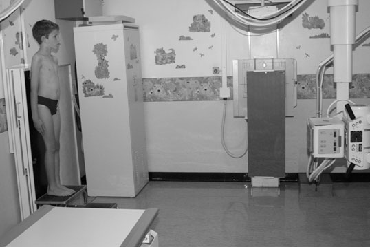
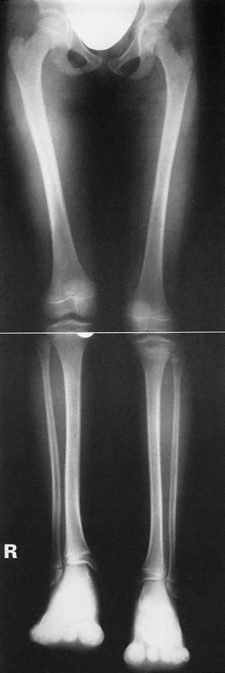

# Rx măsurarea lungimii membrelor inferioare (telemetrie) metoda expunerii unice (format lung)

  📷 Radiografie Convențională (Rx)
  <strong>Actualizat:</strong> 2026-09-16
  <strong>Autor:</strong> Departamentul de Radiologie / Referință Clark (Ed. 12)

---

-   __1. Rezumat Clinic & Indicații__

    ---

    === "Indicații Clinice"

        - Cu această tehnică, fasciculul divergent va mări membrele. Totuși, inexactitatea măsurării diferenței de lungime datorată măririi va fi probabil mai mică de 5%, adică o inexactitate mai mică de 2,5 mm atunci când diferența de lungime reală este de 50 mm. Acest grad de inexactitate poate fi considerat nesemnificativ din punct de vedere chirurgical. Ca alternativă, la examinarea unui sugar sau a unui copil mic, mai ales când acesta nu poate sta în picioare și poate fi necooperantă, se selectează o casetă mai mică, potrivită lungimii membrelor. Dacă este posibil, copilul este examinat pe o masă de radiologie suficient de mare pentru a obține o DFF.

    === "Ghid Național IRIS"

        !!! info "Referință Primară: Ghidul Național IRIS (Ordinul MS 1342/2012)"
            - **Capitol Ghid IRIS:** *Pediatrie — Aparat locomotor*
            - **Grad de Recomandare:** **Grad A**
            - **Nivel de Iradiere Estimată:** `Clasa 1 (Minimă < 0.01 mSv)`

            [:octicons-search-16: Deschide Ghidul IRIS](../../iris.md){ .md-button .md-button--primary } [:material-open-in-new: Aplicația Oficială PWA](https://radiologie-pediatrica.ro/iris/){ .md-button target="_blank" rel="noopener" }

-   __2. Poziționare & Centrare Fascicul__

    ---

    - **Poziție Pacient:**
        - Pacientul stă în ortostatism, cu fața posterioară a picioarelor pe / sprijinită de caseta lungă și, ideal, cu brațele încrucișate peste torace.
        - Spinele iliace antero-superioare trebuie să fie echidistante față de casetă, iar planul sagital median trebuie să fie vertical și coincident cu axa longitudinală centrală a casetei.
        - Picioarele trebuie să fie, pe cât posibil, într-o relație similară cu bazinul, cu picioarele depărtate astfel încât distanța dintre articulațiile gleznelor să fie similară cu distanța dintre articulațiile șoldurilor, cu rotula fiecărui genunchi orientată anterior.
        - Pernele de spumă și săculeții cu nisip sunt utilizați pentru stabilizarea picioarelor și pentru a asigura menținerea lor drepte.
        - Dacă este necesar, blocul este poziționat sub membrul inferior scurtat pentru a asigura absența înclinării bazinului și alinierea corespunzătoare a membrelor.
    - **Punct de Centrare Fascicul:**
        - raza centrală orizontală este orientată spre punctul situat la jumătatea distanței dintre articulațiile genunchilor.
        - Fasciculul de raze X este colimat pentru a include ambele membre inferioare, de la articulațiile șoldurilor la articulațiile gleznelor (articulațiile talocrurale).
    - **Distanță Focar-Film (DFF / SID):** 100 cm
    - **Comandă Respiratorie:** Apnee pe durata expunerii (apnee în inspir pentru torace; expir pentru Abdomen/bazin).

-   __3. Parametri Tehnici Expunere__

    ---

    | Parametru Tehnic | Valoare Configurare Generator / Tub |
    |:-----------------|:-------------------------------------|
    | **Tensiune Tub (kV)** | DE CONFIGURAT PE APARAT |
    | **Sarcină / Produs Curent-Timp (mAs)** | Conform AEC / grosimii anatomice |
    | **Distanță Focar-Film (DFF / SID)** | 100 cm |
    | **Grilă Antidifuzoare (Bucky)** | Conform grosimii anatomice (> 10-12 cm cu grilă) |
    | **Dimensiune Focar** | Focar Mic (0.6 mm) |
    | **Camere de Ionizare AEC** | DE CONFIGURAT PE APARAT |
    | **Colimare Fascicul** | Colimare strictă adaptată receptorului de 35 x 105 cm |
    | **Filtrare Tub** | Totală ≥ 2.5 mm Al echivalent (conform Clark: 3.0 mm Al echivalent) |

-   __4. Criterii de Calitate & Reușită Imagine__

    ---

    - Erori de evitat / remedii: Reduceți mărirea prin plasarea părților corpului cât mai aproape posibil de casetă și prin creșterea DFF la distanța maximă (180–200 cm). 418

-   __5. Protecție Radiologică (ALARA)__

    ---

    - Ecranare gonadică cu șorț plumbat dacă gonadele sunt în apropierea fasciculului util (regula ALARA).
    - Colimare precisă la dimensiunea anatomică strict necesară pentru reducerea dozei și a radiației difuze.
    - Verificarea posibilității unei sarcini la pacientele de vârstă fertilă înainte de expunere.

!!! note "Observații Clinice & Tehnice"
    - Pentru achiziția cu raza centrală, trei casete de 35 × 43 cm, cu o ușoară suprapunere, sunt susținute într-un suport vertical reglabil pentru casete.
    - Pentru examinările axei membrelor inferioare (în ortostatism), picioarele, de la șolduri la glezne, trebuie să fie incluse și orice defect clinic nu trebuie corectat. Fotografie a tubului poziționat pentru tehnica de măsurare a lungimii unui membru inferior în ortostatism, cu expunere unică; imagine a ambelor membre inferioare efectuată în ortostatism, cu un bloc de lemn sub piciorul drept pentru corectarea înclinării bazinului

### 🖼️ Imagini

<figure class="protocol-image-card" markdown>

<figcaption><strong>Figura 1: Aspect radiografic / Poziționare (Clark Ed. 12)</strong> — Poziționarea pacientului și centrarea fasciculului conform Clark (Ed. 12)</figcaption>

</figure>

<figure class="protocol-image-card" markdown>

<figcaption><strong>Figura 2: Aspect radiografic / Poziționare (Clark Ed. 12)</strong> — Aspect radiografic / ghid de poziționare conform tratatului Clark (Ed. 12)</figcaption>

</figure>

=== "Ghid Rapid de Execuție"

    1. **Identificarea și verificarea pacientului:** verificare identitate, zonă de examinat, consimțământ conform procedurii și evaluarea posibilității unei sarcini, când este relevantă.
    2. **Pregătire:** îndepărtarea oricăror obiecte radiopace (bijuterii, agrafe, fermoare, proteze, pansamente dense).
    3. **Poziționare precisă:** alinierea receptorului de imagine și a tubului la distanța prescrisă (100 cm).
    4. **Colimare strictă:** adaptarea fasciculului strict la regiunea de diagnostic pentru scăderea iradierii și reducerea radiației difuze.
    5. **Radioprotecție:** verificarea [politicii RX](../radioprotectie.md), cu măsuri distincte pentru pacient, personal și însoțitor.

## Surse de documentare

- [Clark's Positioning in Radiography (Ed. 12), Pagina 433](https://books.google.com/books/about/Clark_s_Positioning_in_Radiography.html?id=Xxu6MwEACAAJ)
