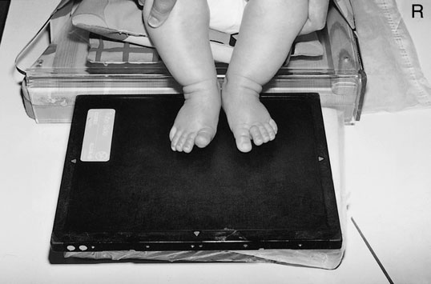
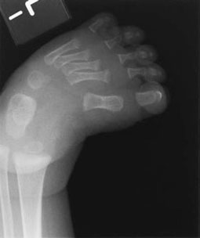
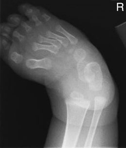
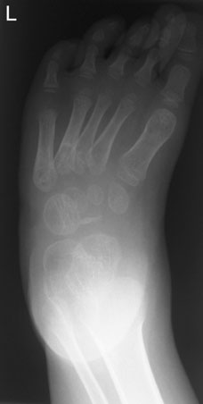
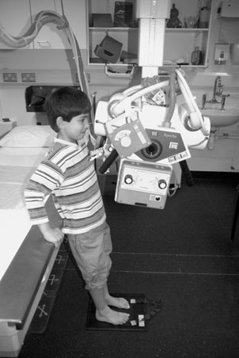
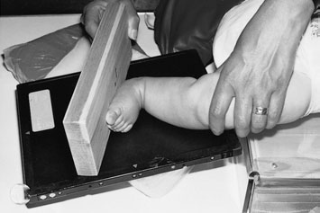
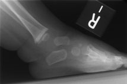
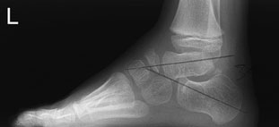
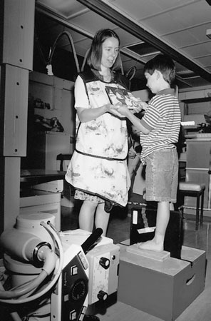
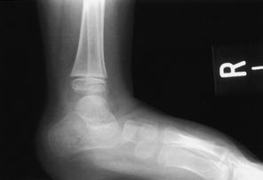

# Rx Picior În Încărcare (Ortostatism) Incidență

  📷 Radiografie Convențională (Rx)
  <strong>Actualizat:</strong> 2026-09-16
  <strong>Autor:</strong> Departamentul de Radiologie / Referință Clark (Ed. 12)

---

-   __1. Rezumat Clinic & Indicații__

    ---

    === "Indicații Clinice"

        - talipes (congenital Picior deformity present la birth);
        - painful flat Picior. Dorso-Plantară – În Încărcare (Ortostatism) casetă este selected that este large enough pentru include Picior. 425 14 picioare – sprijinit/ În Încărcare (Ortostatism) incidențe Profil (lateral) – În Încărcare (Ortostatism) casetă este selected that este large enough pentru include Picior.

    === "Ghid Național IRIS"

        !!! info "Referință Primară: Ghidul Național IRIS (Ordinul MS 1342/2012)"
            - **Capitol Ghid IRIS:** *Ghidul Național IRIS*
            - **Grad de Recomandare:** **De verificat pe indicație; fără grad atribuit automat**
            - **Nivel de Iradiere Estimată:** `De verificat pentru examinarea și populația selectate`

            [:octicons-search-16: Deschide Ghidul IRIS](../../iris.md){ .md-button .md-button--primary } [:material-open-in-new: Aplicația Oficială PWA](https://radiologie-pediatrica.ro/iris/){ .md-button target="_blank" rel="noopener" }
-   __2. Poziționare & Centrare Fascicul__

    ---

    - **Poziție Pacient:** Babies
• baby este sprijinit Decubit dorsal pe masa radiologică, și Genunchi de partea afectată este flectat astfel încât Picior rests pe casetă.
• Picior este ajustat astfel încât tibia este perpendicular pe casetă.
• Ambele Picioare poate fie examined together, cu genunchii held together.
• Pressure trebuie să fie applied la bent Genunchi la simulate În Încărcare (Ortostatism).
Toddlers
• toddler este așezat pe scaun în special seat, cu Ambele Picioare resting pe casetă în similar way ca that described above. sau, if child este old enough, they adopt în ortostatism poziție.
• Downward pressure este applied la Ambii Genunchi.
• fără attempt trebuie să fie made la correct alignment de forefeet.

Babies
• cu baby Decubit dorsal pe imaging couch, membrul inferior afectat este preferably internally rotit astfel încât inner margine de Picior este plasat sprijinit pe casetă cu Gleznă (Articulație Talocrurală) (nu forefoot) în true Profil (lateral) poziție. Alternatively, membru inferior este externally rotit, cu Profil (lateral) aspect de Picior sprijinit pe casetă.
• wooden block support este poziționat beneath sole de Picior, cu dorsiflexion pressure applied during expunere la evidențiază reducibility de orice equinus deformity la Gleznă (Articulație Talocrurală).
Toddlers
• child poate fie examined în ortostatism, cu casetă plasat în groove pe / sprijinit de inner Picior.
• la stop Picior de la being inverted, membru inferior trebuie să nu fie externally rotit.
• Forced dorsi-/plantarflexion incidențe poate also fie required.
    - **Punct de Centrare Fascicul:** • raza centrală verticală centrală este orientat midway între malleoli și la drept-angles la imaginary line joining malleoli.
• raza centrală poate fie înclinat five la 10 grade cephalic la avoid tibiae overlapping hind picioare.

• raza centrală este orientat la Profil (lateral)/maleolă medială (tibială) la drept-angles la axis de tibia. pentru toddlers, fascicul este Orientat orizontal.
    - **Distanță Focar-Film (DFF / SID):** 100 cm
    - **Comandă Respiratorie:** Apnee pe durata expunerii (apnee în inspir pentru torace; expir pentru Abdomen/bazin).

-   __3. Parametri Tehnici Expunere__

    ---

    | Parametru Tehnic | Valoare Configurare Generator / Tub |
    |:-----------------|:-------------------------------------|
    | **Tensiune Tub (kV)** | DE CONFIGURAT PE APARAT |
    | **Sarcină / Produs Curent-Timp (mAs)** | Conform AEC / grosime anatomică |
    | **Distanță Focar-Film (DFF / SID)** | 100 cm |
    | **Grilă Antidifuzoare (Bucky)** | Conform grosimii anatomice (> 10-12 cm cu grilă) |
    | **Dimensiune Focar** | Focar Mic (0.6 mm) |
    | **Camere de Ionizare AEC** | DE CONFIGURAT PE APARAT |
    | **Colimare Fascicul** | Colimare strictă la aria anatomică de interes diagnostic |
    | **Filtrare Tub** | Totală ≥ 2.5 mm Al echivalent (conform Clark: 3.0 mm Al eq.) |

-   __4. Criterii de Calitate & Reușită Imagine__

    ---

    - alignment de astragal (talus) și calcaneu de hind Picior trebuie să fie clearly vizibil, cu fără overlapping prin shins.
    - Visualization de bones de picioarele consistent cu age.
    - Visualization de părți moi planes.
    - Reproduction de spongiosa și cortex. 424 Basic Dorso-Plantară (Antero-posterior (AP)) – În Încărcare (Ortostatism) Profil (lateral) – În Încărcare (Ortostatism) Supplementary Profil (lateral) – cu forced dorsiflexion Dorso-Plantară Oblică Baby poziționat pentru Dorso-Plantară incidență de picioare cu picioare support imagine de Dorso-Plantară picioare în baby cu talipes equinovarus. Note calcaneu și astragal (talus) sunt paralel și superimposed stâng: older child poziționat pentru În Încărcare (Ortostatism), Dorso-Plantară incidență de picioare. Note slight posterior lean la avoid long bones overlying și obscuring hind picioare. drept: imagine de 4-year-old boy’s Picior cu corrected CTEV și residual varus de forefoot
    - alignment de astragal (talus) și calcaneu în true Profil (lateral) poziție trebuie să fie clearly vizibil.
    - sole de Picior trebuie să fie flat pe / sprijinit de block, cu fără elevation de heel.
    - See Dorso-Plantară incidență characteristics, above.
    - Erori de evitat / remedii: pentru Dorso-Plantară incidență, shins often obscure hind picioare. Angle fascicul 10 grade cranial la overcome this problem.
    - Erori de evitat / remedii: densitate optică de imagine (Dorso-Plantară) este correctly appropriate pentru forefeet but does nu evidențiază hind-Picior, which este more important. wedge poate fie used la avoid overpenetration de forefeet.
    - Erori de evitat / remedii: pentru Profil (lateral) incidență, care trebuie să fie taken la avoid Oblică incidență de Picior ca this could simulate valgus/varus poziție. Baby poziționat pentru Profil (lateral) incidență de Picior cu pressure applied prin wood block support în order la try și correct orice equinus deformity de Gleznă (Articulație Talocrurală) imagine de Profil (lateral) Picior în neonate și older child cu talipes equinovarus evidențiind astragal (talus) și calcaneu paralel în former și dorsal luxație articulară de navicular în corrected Picior de latter Phototograph de older child în ortostatism pentru Profil (lateral) incidență de Picior imagine de Profil (lateral) Picior de child hind Picior valgus și almost vertical astragal (talus) în pacient cu cerebral palsy

-   __5. Protecție Radiologică (ALARA)__

    ---

    - Ecranare gonadică cu șorț plumbat dacă gonadele sunt în apropierea fasciculului util (regula ALARA).
    - Colimare precisă la dimensiunea anatomică strict necesară pentru reducerea dozei și a radiației difuze.
    - Verificarea posibilității unei sarcini la pacientele de vârstă fertilă înainte de expunere.

!!! note "Observații Clinice & Tehnice"
    Pregătirea pacientului prin îndepărtarea tuturor accesoriilor radio-opace.

### 🖼️ Imagini

<figure class="protocol-image-card" markdown>

<figcaption><strong>examinare radiografică de picioarele, cu child în ortostatism</strong> — Poziționare pacient și centrare fascicul conform Clark (Ed. 12)</figcaption>

</figure>

<figure class="protocol-image-card" markdown>

<figcaption><strong>Figura 2: Aspect radiografic / Poziționare (Clark Ed. 12)</strong> — Aspect radiografic / ghid de poziționare conform tratatului Clark (Ed. 12)</figcaption>

</figure>

<figure class="protocol-image-card" markdown>

<figcaption><strong>Figura 3: Aspect radiografic / Poziționare (Clark Ed. 12)</strong> — Aspect radiografic / ghid de poziționare conform tratatului Clark (Ed. 12)</figcaption>

</figure>

<figure class="protocol-image-card" markdown>

<figcaption><strong>Figura 4: Aspect radiografic / Poziționare (Clark Ed. 12)</strong> — Aspect radiografic / ghid de poziționare conform tratatului Clark (Ed. 12)</figcaption>

</figure>

<figure class="protocol-image-card" markdown>

<figcaption><strong>Figura 5: Aspect radiografic / Poziționare (Clark Ed. 12)</strong> — Aspect radiografic / ghid de poziționare conform tratatului Clark (Ed. 12)</figcaption>

</figure>

<figure class="protocol-image-card" markdown>

<figcaption><strong>Figura 6: Aspect radiografic / Poziționare (Clark Ed. 12)</strong> — Aspect radiografic / ghid de poziționare conform tratatului Clark (Ed. 12)</figcaption>

</figure>

<figure class="protocol-image-card" markdown>

<figcaption><strong>Figura 7: Aspect radiografic / Poziționare (Clark Ed. 12)</strong> — Aspect radiografic / ghid de poziționare conform tratatului Clark (Ed. 12)</figcaption>

</figure>

<figure class="protocol-image-card" markdown>

<figcaption><strong>Figura 8: Aspect radiografic / Poziționare (Clark Ed. 12)</strong> — Aspect radiografic / ghid de poziționare conform tratatului Clark (Ed. 12)</figcaption>

</figure>

<figure class="protocol-image-card" markdown>

<figcaption><strong>Figura 9: Aspect radiografic / Poziționare (Clark Ed. 12)</strong> — Aspect radiografic / ghid de poziționare conform tratatului Clark (Ed. 12)</figcaption>

</figure>

<figure class="protocol-image-card" markdown>

<figcaption><strong>Figura 10: Aspect radiografic / Poziționare (Clark Ed. 12)</strong> — Aspect radiografic / ghid de poziționare conform tratatului Clark (Ed. 12)</figcaption>

</figure>

=== "Ghid Rapid de Execuție"

    1. **Identificarea și verificarea pacientului:** verificare identitate, zonă de examinat, consimțământ conform procedurii și evaluarea posibilității unei sarcini, când este relevantă.
    2. **Pregătire:** îndepărtarea oricăror obiecte radiopace (bijuterii, agrafe, fermoare, proteze, pansamente dense).
    3. **Poziționare precisă:** alinierea receptorului de imagine și a tubului la distanța prescrisă (100 cm).
    4. **Colimare strictă:** adaptarea fasciculului strict la regiunea de diagnostic pentru scăderea iradierii și reducerea radiației difuze.
    5. **Radioprotecție:** verificarea [politicii RX](../radioprotectie.md), cu măsuri distincte pentru pacient, personal și însoțitor.

## Surse de documentare

- [Clark's Positioning in Radiography (Ed. 12), Pagina 439](../../assets/protocols/sources/Clark___Positioning_in_Radiography__12th_edition.pdf#page=439)
