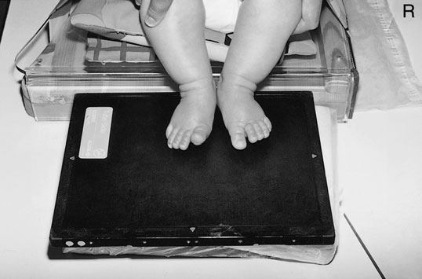
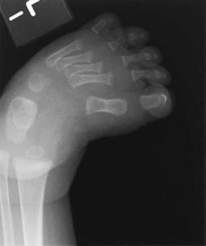
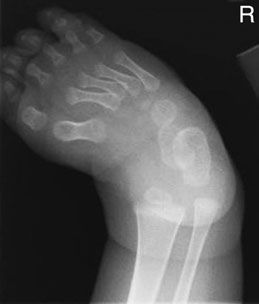
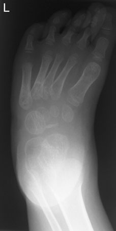
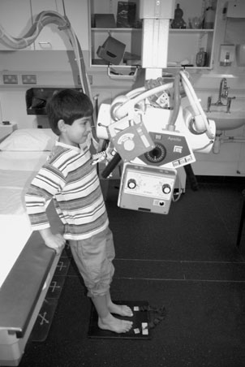
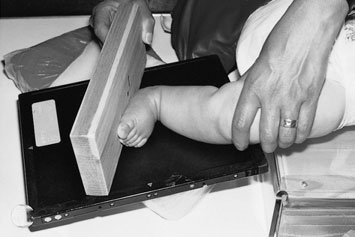
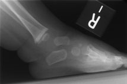
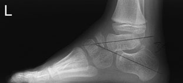
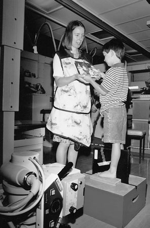
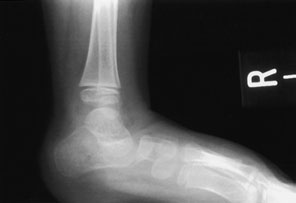

# Rx picior în încărcare (ortostatism) incidență

  📷 Radiografie Convențională (Rx)
  <strong>Actualizat:</strong> 2026-09-16
  <strong>Autor:</strong> Departamentul de Radiologie / Referință Clark (Ed. 12)

---

-   __1. Rezumat Clinic & Indicații__

    ---

    === "Indicații Clinice"

        - talipes (deformare congenitală a piciorului, prezentă la naștere);
        - picior plat dureros. Dorsoplantară – în încărcare (ortostatism); caseta este selectată astfel încât să fie suficient de mare pentru a include piciorul. 425 14 picioare – sprijinit / în încărcare (ortostatism); incidențe de profil (lateral) – în încărcare (ortostatism); caseta este selectată astfel încât să fie suficient de mare pentru a include piciorul.

    === "Ghid Național IRIS"

        !!! info "Referință Primară: Ghidul Național IRIS (Ordinul MS 1342/2012)"
            - **Capitol Ghid IRIS:** *Pediatrie — Aparat locomotor*
            - **Grad de Recomandare:** **Grad A**
            - **Nivel de Iradiere Estimată:** `Clasa 1 (Minimă < 0.01 mSv)`

            [:octicons-search-16: Deschide Ghidul IRIS](../../iris.md){ .md-button .md-button--primary } [:material-open-in-new: Aplicația Oficială PWA](https://radiologie-pediatrica.ro/iris/){ .md-button target="_blank" rel="noopener" }

-   __2. Poziționare & Centrare Fascicul__

    ---

    - **Poziție Pacient:**
        Sugari

        - Sugarul este susținut în decubit dorsal pe masa radiologică, iar genunchiul de partea afectată este flectat astfel încât piciorul să se sprijine pe casetă.
        - Piciorul este ajustat astfel încât tibia să fie perpendiculară pe casetă.
        - Ambele picioare pot fi examinate împreună, cu genunchii ținuți apropiați.
        - Se aplică presiune asupra genunchiului flectat pentru a simula încărcarea (ortostatismul). Copii mici
        - Copilul mic este așezat pe un scaun cu șezut special, cu ambele picioare sprijinite pe casetă în mod similar celui descris mai sus. Sau, dacă este suficient de mare, adoptă poziția în ortostatism.
        - Se aplică presiune în jos asupra ambilor genunchi.
        - Nu trebuie făcută nicio încercare de corectare a alinierii antepiciorului.
        Sugari

        - Cu sugarul în decubit dorsal pe masa de examinare, membrul inferior afectat este preferabil rotit intern, astfel încât marginea medială a piciorului să fie plasată și sprijinită pe casetă, cu glezna (nu antepiciorul) în poziție de profil (lateral) adevărat. Ca alternativă, membrul inferior este rotit extern, cu fața laterală a piciorului sprijinită pe casetă.
        - Un bloc de lemn este poziționat sub talpa piciorului, aplicându-se presiune de dorsiflexie în timpul expunerii pentru a evidenția reductibilitatea oricărei deformări în equinus la nivelul gleznei (articulației talocrurale). Copii mici
        - Copilul poate fi examinat în ortostatism, cu caseta plasată în șanțul de lângă / sprijinită de partea medială a piciorului.
        - Pentru a împiedica inversia piciorului, membrul inferior nu trebuie rotit extern.
        - Pot fi necesare și incidențe în dorsiflexie / flexie plantară forțată.
    - **Punct de Centrare Fascicul:**
        - Raza centrală verticală este orientată la jumătatea distanței dintre maleole și la unghi drept față de linia imaginară care unește maleolele.
        - Raza centrală poate fi înclinată cu cinci până la 10 grade cefalic, pentru a evita suprapunerea tibiei peste partea posterioară a piciorului.
        - Raza centrală este orientată spre profil (lateral) / maleola medială (tibială), la unghi drept față de axul tibiei. Pentru copiii mici, fasciculul este orientat orizontal.
    - **Distanță Focar-Film (DFF / SID):** 100 cm
    - **Comandă Respiratorie:** Apnee pe durata expunerii (apnee în inspir pentru torace; expir pentru Abdomen/bazin).

-   __3. Parametri Tehnici Expunere__

    ---

    | Parametru Tehnic | Valoare Configurare Generator / Tub |
    |:-----------------|:-------------------------------------|
    | **Tensiune Tub (kV)** | DE CONFIGURAT PE APARAT |
    | **Sarcină / Produs Curent-Timp (mAs)** | Conform AEC / grosimii anatomice |
    | **Distanță Focar-Film (DFF / SID)** | 100 cm |
    | **Grilă Antidifuzoare (Bucky)** | Conform grosimii anatomice (> 10-12 cm cu grilă) |
    | **Dimensiune Focar** | Focar Mic (0.6 mm) |
    | **Camere de Ionizare AEC** | DE CONFIGURAT PE APARAT |
    | **Colimare Fascicul** | Colimare strictă la aria anatomică de interes diagnostic |
    | **Filtrare Tub** | Totală ≥ 2.5 mm Al echivalent (conform Clark: 3.0 mm Al echivalent) |

-   __4. Criterii de Calitate & Reușită Imagine__

    ---

    - Alinierea astragalului (talusului) și calcaneului piciorului posterior trebuie să fie clar vizibilă, fără suprapunere prin gambe.
    - Vizualizarea oaselor picioarelor, în concordanță cu vârsta.
    - Vizualizarea planurilor de țesuturi moi.
    - Reproducerea spongioasei și corticalei. 424 Dorsoplantară de bază (antero-posterioară (AP)) – în încărcare (ortostatism); profil (lateral) – în încărcare (ortostatism); profil (lateral) suplimentar – cu dorsiflexie forțată; dorsoplantară oblică; sugar poziționat pentru incidența dorsoplantară a picioarelor, cu suport pentru picioare; imagine dorsoplantară a picioarelor la un sugar cu talipes equinovarus. Se observă că calcaneul și astragalul (talusul) sunt paralele și suprapuse. Stânga: copil mai mare poziționat în ortostatism pentru incidența dorsoplantară în încărcare a picioarelor. Se observă o ușoară înclinare posterioară pentru a evita suprapunerea și obscurarea oaselor lungi peste picioarele posterioare. Dreapta: imagine a piciorului unui băiat de 4 ani cu CTEV corectat și varus rezidual al antepiciorului
    - Alinierea astragalului (talusului) și calcaneului în poziție de profil (lateral) adevărat trebuie să fie clar vizibilă.
    - Talpa piciorului trebuie să fie plată pe / sprijinită de bloc, fără ridicarea călcâiului.
    - Consultați caracteristicile incidenței dorsoplantare de mai sus.
    - Erori de evitat / remedii: pentru incidența dorsoplantară, gambele obscurizează adesea picioarele posterioare. Înclinați fasciculul cu 10 grade cranial pentru a depăși această problemă.
    - Erori de evitat / remedii: densitatea optică a imaginii (dorsoplantară) este corect adecvată pentru antepicior, dar nu evidențiază piciorul posterior, care este mai important. Se poate utiliza o pană pentru a evita supraexpunerea antepiciorului.
    - Erori de evitat / remedii: pentru incidența de profil (lateral), aceasta trebuie efectuată pentru a evita o incidență oblică a piciorului, deoarece aceasta ar putea simula o poziție în valgus/varus. Sugar poziționat pentru incidența de profil (lateral) a piciorului, cu presiune aplicată prin suportul din lemn pentru a încerca să corecteze orice deformare în equinus a gleznei (articulației talocrurale); imagine de profil (lateral) a piciorului la un nou-născut și la un copil mai mare cu talipes equinovarus, evidențiind astragalul (talusul) și calcaneul paralele la primul și luxația dorsală a articulației naviculare la piciorul corectat al celui de-al doilea; fotografie a unui copil mai mare în ortostatism pentru incidența de profil (lateral) a piciorului; imagine de profil (lateral) a piciorului unui copil cu valgus al piciorului posterior și astragal (talus) aproape vertical la un pacient cu paralizie cerebrală

-   __5. Protecție Radiologică (ALARA)__

    ---

    - Ecranare gonadică cu șorț plumbat dacă gonadele sunt în apropierea fasciculului util (regula ALARA).
    - Colimare precisă la dimensiunea anatomică strict necesară pentru reducerea dozei și a radiației difuze.
    - Verificarea posibilității unei sarcini la pacientele de vârstă fertilă înainte de expunere.

!!! note "Observații Clinice & Tehnice"
    Pregătirea pacientului prin îndepărtarea tuturor accesoriilor radio-opace.

### 🖼️ Imagini

<figure class="protocol-image-card" markdown>

<figcaption><strong>examinare radiografică a picioarelor, cu copilul în ortostatism</strong> — Poziționarea pacientului și centrarea fasciculului conform Clark (Ed. 12)</figcaption>

</figure>

<figure class="protocol-image-card" markdown>

<figcaption><strong>Figura 2: Aspect radiografic / Poziționare (Clark Ed. 12)</strong> — Aspect radiografic / ghid de poziționare conform tratatului Clark (Ed. 12)</figcaption>

</figure>

<figure class="protocol-image-card" markdown>

<figcaption><strong>Figura 3: Aspect radiografic / Poziționare (Clark Ed. 12)</strong> — Aspect radiografic / ghid de poziționare conform tratatului Clark (Ed. 12)</figcaption>

</figure>

<figure class="protocol-image-card" markdown>

<figcaption><strong>Figura 4: Aspect radiografic / Poziționare (Clark Ed. 12)</strong> — Aspect radiografic / ghid de poziționare conform tratatului Clark (Ed. 12)</figcaption>

</figure>

<figure class="protocol-image-card" markdown>

<figcaption><strong>Figura 5: Aspect radiografic / Poziționare (Clark Ed. 12)</strong> — Aspect radiografic / ghid de poziționare conform tratatului Clark (Ed. 12)</figcaption>

</figure>

<figure class="protocol-image-card" markdown>

<figcaption><strong>Figura 6: Aspect radiografic / Poziționare (Clark Ed. 12)</strong> — Aspect radiografic / ghid de poziționare conform tratatului Clark (Ed. 12)</figcaption>

</figure>

<figure class="protocol-image-card" markdown>

<figcaption><strong>Figura 7: Aspect radiografic / Poziționare (Clark Ed. 12)</strong> — Aspect radiografic / ghid de poziționare conform tratatului Clark (Ed. 12)</figcaption>

</figure>

<figure class="protocol-image-card" markdown>

<figcaption><strong>Figura 8: Aspect radiografic / Poziționare (Clark Ed. 12)</strong> — Aspect radiografic / ghid de poziționare conform tratatului Clark (Ed. 12)</figcaption>

</figure>

<figure class="protocol-image-card" markdown>

<figcaption><strong>Figura 9: Aspect radiografic / Poziționare (Clark Ed. 12)</strong> — Aspect radiografic / ghid de poziționare conform tratatului Clark (Ed. 12)</figcaption>

</figure>

<figure class="protocol-image-card" markdown>

<figcaption><strong>Figura 10: Aspect radiografic / Poziționare (Clark Ed. 12)</strong> — Aspect radiografic / ghid de poziționare conform tratatului Clark (Ed. 12)</figcaption>

</figure>

=== "Ghid Rapid de Execuție"

    1. **Identificarea și verificarea pacientului:** verificare identitate, zonă de examinat, consimțământ conform procedurii și evaluarea posibilității unei sarcini, când este relevantă.
    2. **Pregătire:** îndepărtarea oricăror obiecte radiopace (bijuterii, agrafe, fermoare, proteze, pansamente dense).
    3. **Poziționare precisă:** alinierea receptorului de imagine și a tubului la distanța prescrisă (100 cm).
    4. **Colimare strictă:** adaptarea fasciculului strict la regiunea de diagnostic pentru scăderea iradierii și reducerea radiației difuze.
    5. **Radioprotecție:** verificarea [politicii RX](../radioprotectie.md), cu măsuri distincte pentru pacient, personal și însoțitor.

## Surse de documentare

- [Clark's Positioning in Radiography (Ed. 12), Pagina 439](https://books.google.com/books/about/Clark_s_Positioning_in_Radiography.html?id=Xxu6MwEACAAJ)
