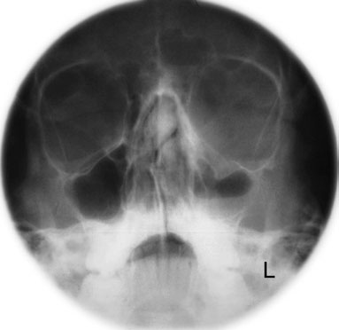
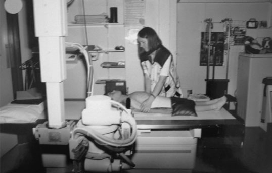
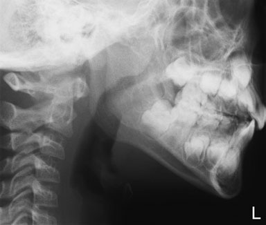

# Rx Sinusuri Paranazale (SAF) - Post-nasal space Profil (Lateral) - Decubit Dorsal

  📷 Radiografie Convențională (Rx)
  <strong>Actualizat:</strong> 2026-09-16
  <strong>Autor:</strong> Departamentul de Radiologie / Referință Clark (Ed. 12)

---

-   __1. Rezumat Clinic & Indicații__

    ---

    === "Indicații Clinice"

        - Evaluare radiografică regiunii Sinusuri Paranazale (SAF) - Post-nasal space (Profil (lateral) - Decubit dorsal).
        - Suspiciune de leziuni traumatice (fracturi, luxații sau diastazis articular).
        - Bilanț osteoarticular / visceral conform recomandării medicale de trimitere.

    === "Ghid Național IRIS"

        !!! info "Referință Primară: Ghidul Național IRIS (Ordinul MS 1342/2012)"
            - **Capitol Ghid IRIS:** *Ghidul Național IRIS*
            - **Grad de Recomandare:** **De verificat pe indicație; fără grad atribuit automat**
            - **Nivel de Iradiere Estimată:** `De verificat pentru examinarea și populația selectate`

            [:octicons-search-16: Deschide Ghidul IRIS](../../iris.md){ .md-button .md-button--primary } [:material-open-in-new: Aplicația Oficială PWA](https://radiologie-pediatrica.ro/iris/){ .md-button target="_blank" rel="noopener" }
-   __2. Poziționare & Centrare Fascicul__

    ---

    - **Poziție Pacient:** • child lies Decubit dorsal pe masa de examinare, cu Profil (lateral) aspect de capul în contact cu casetă sprijinit vertically. capul este ajustat la bring medial plan sagital paralel cu casetă.
• jaw este raised slightly astfel încât angles de Mandibulă sunt separated de la corpuri de upper cervical coloană vertebrală.
    - **Punct de Centrare Fascicul:** • Fascicul Orizontal este centred la ramus de Mandibulă, și coned pentru include maxillary Sinusuri Paranazale (SAF) la third Coloană Cervicală și posterior faringe.
    - **Distanță Focar-Film (DFF / SID):** 100 cm
    - **Comandă Respiratorie:** Apnee pe durata expunerii (apnee în inspir pentru torace; expir pentru Abdomen/bazin).

-   __3. Parametri Tehnici Expunere__

    ---

    | Parametru Tehnic | Valoare Configurare Generator / Tub |
    |:-----------------|:-------------------------------------|
    | **Tensiune Tub (kV)** | DE CONFIGURAT PE APARAT |
    | **Sarcină / Produs Curent-Timp (mAs)** | Conform AEC / grosime anatomică |
    | **Distanță Focar-Film (DFF / SID)** | 100 cm |
    | **Grilă Antidifuzoare (Bucky)** | Cu grilă antidifuzoare Bucky |
    | **Dimensiune Focar** | Focar Mic (0.6 mm) |
    | **Camere de Ionizare AEC** | Camerele laterale (sau camera centrală funcție de regiune) |
    | **Colimare Fascicul** | Colimare strictă la aria anatomică de interes diagnostic |
    | **Filtrare Tub** | Totală ≥ 2.5 mm Al echivalent (conform Clark: 3.0 mm Al eq.) |

-   __4. Criterii de Calitate & Reușită Imagine__

    ---

    - condyles de Mandibulă trebuie să fie superimposed.
    - Detaliile osoase și trabeculația trebuie să aibă o reproducere vizuală netă.
    - Țesutul moale al vegetațiilor adenoide (polipi) trebuie clar vizibil în rinofaringe. 406 imagine de occipito-mental incidență de Masiv Facial (Oase ale Feței) de a 13-year-old boy evidențiind blowout suspiciune de fractură de stâng inferior orbital margin cu nivele hidroaerice în stâng maxillary antrum și stâng sinusuri frontale Child poziționat pentru Profil (lateral) incidență de face pentru PNS imagine de Profil (lateral) incidență de PNS în a 6-year-old child

-   __5. Protecție Radiologică (ALARA)__

    ---

    - Ecranare gonadică cu șorț plumbat dacă gonadele sunt în apropierea fasciculului util (regula ALARA).
    - Colimare precisă la dimensiunea anatomică strict necesară pentru reducerea dozei și a radiației difuze.
    - Verificarea posibilității unei sarcini la pacientele de vârstă fertilă înainte de expunere.

!!! note "Observații Clinice & Tehnice"
    imagine trebuie să fie taken cu mouth closed. If PNS este obliterated, incidență trebuie să fie repeated cu child sniffing.

### 🖼️ Imagini

<figure class="protocol-image-card" markdown>

<figcaption><strong>PNS radiografie este usually performed pe children între four</strong> — Poziționare pacient și centrare fascicul conform Clark (Ed. 12)</figcaption>

</figure>

<figure class="protocol-image-card" markdown>

<figcaption><strong>PNS trebuie să fie air-filled la fie radiographically vizibil.</strong> — Aspect radiografic / ghid de poziționare conform tratatului Clark (Ed. 12)</figcaption>

</figure>

<figure class="protocol-image-card" markdown>

<figcaption><strong>evidențiind blowout suspiciune de fractură de stâng inferior orbital margin cu lichid</strong> — Aspect radiografic / ghid de poziționare conform tratatului Clark (Ed. 12)</figcaption>

</figure>

=== "Ghid Rapid de Execuție"

    1. **Identificarea și verificarea pacientului:** verificare identitate, zonă de examinat, consimțământ conform procedurii și evaluarea posibilității unei sarcini, când este relevantă.
    2. **Pregătire:** îndepărtarea oricăror obiecte radiopace (bijuterii, agrafe, fermoare, proteze, pansamente dense).
    3. **Poziționare precisă:** alinierea receptorului de imagine și a tubului la distanța prescrisă (100 cm).
    4. **Colimare strictă:** adaptarea fasciculului strict la regiunea de diagnostic pentru scăderea iradierii și reducerea radiației difuze.
    5. **Radioprotecție:** verificarea [politicii RX](../radioprotectie.md), cu măsuri distincte pentru pacient, personal și însoțitor.

## Surse de documentare

- [Clark's Positioning in Radiography (Ed. 12), Pagina 421](../../assets/protocols/sources/Clark___Positioning_in_Radiography__12th_edition.pdf#page=421)
