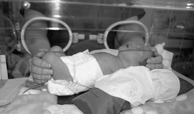
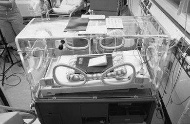
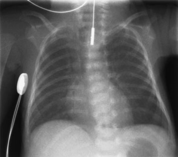
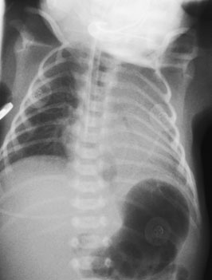

# Rx Torace Neonatal (Nou-Născut) Antero-Posterior (AP) - Decubit Dorsal

  📷 Radiografie Convențională (Rx)
  <strong>Actualizat:</strong> 2026-09-16
  <strong>Autor:</strong> Departamentul de Radiologie / Referință Clark (Ed. 12)

---

-   __1. Rezumat Clinic & Indicații__

    ---

    === "Indicații Clinice"

        - chest – neonatal;
        - chest – post-neonatal;
        - Craniu;
        - Sinusuri Paranazale (SAF) și post-nasal space (PNS);
        - dental;
        - Abdomen;
        - Bazin (bazin (pelvis)) și hips;
        - coloană vertebrală pentru scoliosis;
        - coloană vertebrală;
        - Măsurare Lungime Membre Inferioare (Telemetrie);
        - Cot;
        - bone age, Mână și genunchi;
        - picioare pentru talipes assessment;
        - skeletal survey pentru non-accidental injury;
        - skeletal survey pentru syndrome assessment. 390
        - localization de tubes sau catheters;
        - suspected diaphragmatic hernia;
        - suspected abdominal pathology causing respiratory difficulty. Antero-posterior (AP) – Decubit dorsal An 18  24-cm casetă that este la corp temperature este selected. Disposable sheets trebuie să fie used între baby și caseta. Modern incubators cu casetă trays poate fie used la avoid disturbance de very sick baby (see below). 391 14 Chest – neonatal Antero-posterior (AP) – Decubit dorsal

    === "Ghid Național IRIS"

        !!! info "Referință Primară: Ghidul Național IRIS (Ordinul MS 1342/2012)"
            - **Capitol Ghid IRIS:** *Ghidul Național IRIS*
            - **Grad de Recomandare:** **De verificat pe indicație; fără grad atribuit automat**
            - **Nivel de Iradiere Estimată:** `De verificat pentru examinarea și populația selectate`

            [:octicons-search-16: Deschide Ghidul IRIS](../../iris.md){ .md-button .md-button--primary } [:material-open-in-new: Aplicația Oficială PWA](https://radiologie-pediatrica.ro/iris/){ .md-button target="_blank" rel="noopener" }
-   __2. Poziționare & Centrare Fascicul__

    ---

    - **Poziție Pacient:** Sleeping baby
• baby este poziționat Decubit dorsal pe casetă, cu planul mediosagital ajustat perpendicular pe middle de caseta, ensuring that capul și chest sunt straight și umeri și hips sunt level.
• capul poate need covered săculeți cu nisip support pe either side.
A 10-grade foam pad trebuie să fie plasat under umerii la avoid Lordotică incidență și la lift bărbia și prevent it obscuring lung Vârfuri Pulmonare (Apexuri).
• brațe trebuie să fie pe either side, separated slightly de la trunk la avoid being included în câmp de iradiere și la avoid skin crease artefacts, which poate mimic pneumothoraces.
• brațe poate fie imobilizat cu Velcro bands și/sau săculeți cu nisip.
Baby requiring menținerea Positioning este similar la that described pentru sleeping baby și poate fie performed prin single assistant cu following adaptations:
• brațele trebuie să fie held flectat pe either side de capul.
• brațe trebuie să nu fie extins fully, ca this poate cause Lordotică imagini.
• When needed, membre inferioare trebuie să fie held together și flectat la genunchii.
    - **Punct de Centrare Fascicul:** • fără single centring point este advised.
• Centre fascicul la linia mediană casetă.
• raza centrală este Orientat vertical, sau înclinat five la 10 grade caudally if baby este completely flat, la avoid projecting bărbia over lung Vârfuri Pulmonare (Apexuri).
• Constant maximum FFD trebuie să fie used.
• Although some incubators have casetă trays, placing caseta under baby este recommended ca routine, la avoid magnification și change de parametri de expunere.
Basic Antero-posterior (AP) – Decubit dorsal Alternative Postero-anterior (PA) – Decubit ventral Supplementary Profil (lateral) Chest radiografii sunt most common requests pe SCBU/ NNU, cu infant nursed în special incubator.
toate requests trebuie să fie strictly justified. imagine acquisition just before insertion de lines sau catheters trebuie să fie avoided when post-line insertion film radiologic este adecvat. Good-quality technique este essential. range de diagnoses possible în neonatal chest radiografie este fairly limited, și differing pathologies poate look similar. Correlation cu good clinical information este essential.
Study de sequence de filme radiologice over period poate fie necessary pentru correct interpretation, și therefore precis recording și reproduction de most appropriate radiographic expunere sunt essential pentru comparisons la fie made.
Referral criteria
• respiratory difficulty;
• proces infecțios / inflamator;
• meconium aspiration;
• chronic lung disease;
• revărsat pleural (pleurezie)/pneumotorax;
• poziție de catheters/tubes;
• Cord și Siluetă Cardiovasculară murmur/cyanosis;
• oesophageal atresia;
• previous antenatal ultrasound abnormality suspected;
• thoracic cage anomaly;
• ca part de skeletal survey pentru syndrome/NAI;
• postoperative.
request pentru chest și Abdomen pe one radiografie, cu centring la toracele, este sometimes indicated în following cases:
Chest – neonatal
    - **Distanță Focar-Film (DFF / SID):** 100 cm
    - **Comandă Respiratorie:** Apnee pe durata expunerii (apnee în inspir pentru torace; expir pentru Abdomen/bazin).

-   __3. Parametri Tehnici Expunere__

    ---

    | Parametru Tehnic | Valoare Configurare Generator / Tub |
    |:-----------------|:-------------------------------------|
    | **Tensiune Tub (kV)** | DE CONFIGURAT PE APARAT |
    | **Sarcină / Produs Curent-Timp (mAs)** | Conform AEC / grosime anatomică |
    | **Distanță Focar-Film (DFF / SID)** | 100 cm |
    | **Grilă Antidifuzoare (Bucky)** | Conform grosimii anatomice (> 10-12 cm cu grilă) |
    | **Dimensiune Focar** | Focar Mic (0.6 mm) |
    | **Camere de Ionizare AEC** | DE CONFIGURAT PE APARAT |
    | **Colimare Fascicul** | Colimare strictă adaptată pe receptor 18 x 24 cm |
    | **Filtrare Tub** | Totală ≥ 2.5 mm Al echivalent (conform Clark: 3.0 mm Al eq.) |

-   __4. Criterii de Calitate & Reușită Imagine__

    ---

    - Peak inspiration la include eight la nine posterior Coaste (Grilaj Costal) (four la five anterior Coaste (Grilaj Costal)).
    - Absența rotației anatomice (simetrie bilaterală perfectă). medial ends de clavicles trebuie să overlap procese transverse de coloană vertebrală symmetrically, sau anterior rib ends trebuie să fie echidistant față de coloană vertebrală.
    - fără tilting sau lordosis. medial ends de clavicles trebuie să overlie lung Vârfuri Pulmonare (Apexuri).
    - superior/inferior coning trebuie să fie de la cervical trachea la T12/L1, including cupole diafragmatice.
    - Profil (lateral) coning trebuie să include ambele umeri și Coaste (Grilaj Costal) but nu beyond proximal third de humeri.
    - Reproduction de vascular pattern în central twothirds de Torace (Câmpuri Pulmonare).
    - Reproduction de trachea și major bronchi.
    - Visually reproducere netă contururilor de cupole diafragmatice și sinusuri costodiafragmatice.
    - Reproduction de coloană vertebrală și paraspinal structures.
    - Visualization de retrocardiac lung și mediastinum.
    - Visually reproducere netă contururilor de skeleton.
    - Erori de evitat / remedii: Classically, port hole de incubator trebuie să nu overlie toracele.
    - Erori de evitat / remedii: toate extraneous tubes și wires trebuie să fie repositioned away de la toracele area.
    - Erori de evitat / remedii: expunere trebuie să fie made în inspiration. Watching pentru full distension de baby’s Abdomen rather than toracele best assesses this. Expiratory imagini mimic parenchymal lung disease.

-   __5. Protecție Radiologică (ALARA)__

    ---

    - Ecranare gonadică cu șorț plumbat dacă gonadele sunt în apropierea fasciculului util (regula ALARA).
    - Colimare precisă la dimensiunea anatomică strict necesară pentru reducerea dozei și a radiației difuze.
    - Verificarea posibilității unei sarcini la pacientele de vârstă fertilă înainte de expunere.

!!! note "Observații Clinice & Tehnice"
    Pregătirea pacientului prin îndepărtarea tuturor accesoriilor radio-opace.

### 🖼️ Imagini

<figure class="protocol-image-card" markdown>

<figcaption><strong>• ca în toate radiografii, but particularly în neonatal work, where</strong> — Poziționare pacient și centrare fascicul conform Clark (Ed. 12)</figcaption>

</figure>

<figure class="protocol-image-card" markdown>

<figcaption><strong>• Taking radiografie when baby este crying trebuie să fie avoided,</strong> — Aspect radiografic / ghid de poziționare conform tratatului Clark (Ed. 12)</figcaption>

</figure>

<figure class="protocol-image-card" markdown>

<figcaption><strong>• Overexposure de neonatal chest radiografii results în loss de</strong> — Aspect radiografic / ghid de poziționare conform tratatului Clark (Ed. 12)</figcaption>

</figure>

<figure class="protocol-image-card" markdown>

<figcaption><strong>imagine de correctly poziționat normal neonatal chest radiografie</strong> — Aspect radiografic / ghid de poziționare conform tratatului Clark (Ed. 12)</figcaption>

</figure>

=== "Ghid Rapid de Execuție"

    1. **Identificarea și verificarea pacientului:** verificare identitate, zonă de examinat, consimțământ conform procedurii și evaluarea posibilității unei sarcini, când este relevantă.
    2. **Pregătire:** îndepărtarea oricăror obiecte radiopace (bijuterii, agrafe, fermoare, proteze, pansamente dense).
    3. **Poziționare precisă:** alinierea receptorului de imagine și a tubului la distanța prescrisă (100 cm).
    4. **Colimare strictă:** adaptarea fasciculului strict la regiunea de diagnostic pentru scăderea iradierii și reducerea radiației difuze.
    5. **Radioprotecție:** verificarea [politicii RX](../radioprotectie.md), cu măsuri distincte pentru pacient, personal și însoțitor.

## Surse de documentare

- [Clark's Positioning in Radiography (Ed. 12), Pagina 405](../../assets/protocols/sources/Clark___Positioning_in_Radiography__12th_edition.pdf#page=405)
