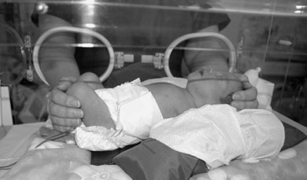
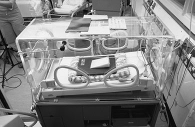
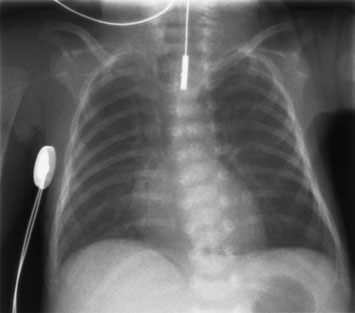
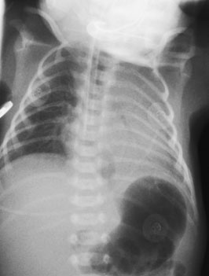

# Rx torace neonatal (nou-născut) anteroposterior (AP) – decubit dorsal

  📷 Radiografie Convențională (Rx)
  <strong>Actualizat:</strong> 2026-09-16
  <strong>Autor:</strong> Departamentul de Radiologie / Referință Clark (Ed. 12)

---

-   __1. Rezumat Clinic & Indicații__

    ---

    === "Indicații Clinice"

        - torace – neonatal;
        - torace – post-neonatal;
        - craniu;
        - sinusuri paranazale (SAF) și spațiul postnazal (PNS);
        - dentare;
        - abdomen;
        - bazin și șolduri;
        - coloană vertebrală pentru scolioză;
        - coloană vertebrală;
        - măsurarea lungimii membrelor inferioare (telemetrie);
        - cot;
        - vârsta osoasă, mână și genunchi;
        - picioare pentru evaluarea talipes;
        - examinare scheletică pentru leziune neaccidentală;
        - examinare scheletică pentru evaluarea sindromului. 390
        - localizarea tuburilor sau cateterelor;
        - hernie diafragmatică suspectată;
        - patologie abdominală suspectată care cauzează dificultăți respiratorii. Incidență anteroposterioară (AP) – decubit dorsal. Se selectează o casetă de 18 × 24 cm, adusă la temperatura corpului. Între sugar și casetă trebuie utilizate cearșafuri de unică folosință. Incubatoarele moderne cu tăvi pentru casetă pot fi utilizate pentru a evita deranjarea sugarului foarte bolnav (vezi mai jos). 391 14 Torace – neonatal. Incidență anteroposterioară (AP) – decubit dorsal

    === "Ghid Național IRIS"

        !!! info "Referință Primară: Ghidul Național IRIS (Ordinul MS 1342/2012)"
            - **Capitol Ghid IRIS:** *Pediatrie — Torace, pulmon, cord*
            - **Grad de Recomandare:** **Grad A**
            - **Nivel de Iradiere Estimată:** `Clasa 1 (Minimă < 0.02 mSv)`

            [:octicons-search-16: Deschide Ghidul IRIS](../../iris.md){ .md-button .md-button--primary } [:material-open-in-new: Aplicația Oficială PWA](https://radiologie-pediatrica.ro/iris/){ .md-button target="_blank" rel="noopener" }

-   __2. Poziționare & Centrare Fascicul__

    ---

    - **Poziție Pacient:**
        Sugar adormit

        - sugarul este poziționat în decubit dorsal pe casetă, cu planul mediosagital ajustat perpendicular pe mijlocul casetei, asigurându-se că capul și toracele sunt drepte, iar umerii și șoldurile sunt la același nivel.
        - capul poate necesita susținere cu săculeți cu nisip pe fiecare parte. Un suport din spumă de 10 grade trebuie plasat sub umeri pentru a evita incidența lordotică, pentru a ridica bărbia și a preveni suprapunerea acesteia peste vârfurile pulmonare.
        - brațele trebuie poziționate de fiecare parte, ușor depărtate de trunchi, pentru a evita includerea lor în câmpul de iradiere și pentru a evita artefactele produse de pliurile cutanate, care pot simula pneumotoraxul.
        - brațele pot fi imobilizate cu benzi Velcro și/sau săculeți cu nisip. Pentru sugarul care necesită menținerea poziționării, poziționarea este similară celei descrise pentru sugarul adormit și poate fi efectuată de un singur asistent, cu următoarele adaptări:
        - brațele trebuie ținute flectate de fiecare parte a capului.
        - brațele nu trebuie extinse complet, deoarece aceasta poate cauza imagini lordotice.
        - Când este necesar, membrele inferioare trebuie ținute împreună și flectate la genunchi.
    - **Punct de Centrare Fascicul:**
        - fără un singur punct de centrare este recomandat.
        - Centrați fasciculul pe linia mediană a casetei.
        - raza centrală este orientată vertical sau înclinată cu five până la 10 grade caudal dacă sugarul este complet întins, pentru a evita proiectarea bărbiei peste vârfurile pulmonare.
        - Trebuie utilizată constant distanța focală-film (DFF) maximă.
        - Deși unele incubatoare au tăvi pentru casetă, plasarea casetei sub sugar este recomandată de rutină, pentru a evita mărirea și modificarea parametrilor de expunere. Incidență anteroposterioară (AP) – decubit dorsal. Alternativă: incidență posteroanterioară (PA) – decubit ventral. Suplimentar: incidență de profil. Radiografiile toracice sunt cele mai frecvent solicitate pe SCBU/NNU, sugarul fiind îngrijit în principal în incubator. Toate solicitările trebuie strict justificate. Achiziția imaginii chiar înainte de inserarea liniilor sau cateterelor trebuie evitată atunci când este adecvată o radiografie efectuată după inserarea liniei. Tehnica de bună calitate este esențială. Gama de diagnostice posibile la radiografia toracică neonatală este destul de limitată, iar patologiile diferite pot avea aspect similar. Corelarea cu informații clinice bune este esențială. Studierea succesiunii radiografiilor efectuate într-o perioadă poate fi necesară pentru interpretarea corectă și, prin urmare, înregistrarea precisă și reproducerea celei mai adecvate expuneri radiografice sunt esențiale pentru efectuarea comparațiilor. Criterii de trimitere
        - dificultăți respiratorii;
        - proces infecțios/inflamator;
        - aspirație de meconiu;
        - boală pulmonară cronică;
        - revărsat pleural (pleurezie)/pneumotorax;
        - poziția cateterelor/tuburilor;
        - suflu cardiac și al siluetei cardiovasculare/cianoză;
        - atrezie esofagiană;
        - anomalie suspectată la ecografia antenatală anterioară;
        - anomalie a cutiei toracice;
        - ca parte a examinării scheletice pentru sindrom/leziune neaccidentală;
        - postoperator. Solicitarea unei radiografii toracice și abdominale, cu centrarea pe torace, este indicată uneori în următoarele cazuri: Torace – neonatal
    - **Distanță Focar-Film (DFF / SID):** 100 cm
    - **Comandă Respiratorie:** Apnee pe durata expunerii (apnee în inspir pentru torace; expir pentru Abdomen/bazin).

-   __3. Parametri Tehnici Expunere__

    ---

    | Parametru Tehnic | Valoare Configurare Generator / Tub |
    |:-----------------|:-------------------------------------|
    | **Tensiune Tub (kV)** | DE CONFIGURAT PE APARAT |
    | **Sarcină / Produs Curent-Timp (mAs)** | Conform AEC / grosimii anatomice |
    | **Distanță Focar-Film (DFF / SID)** | 100 cm |
    | **Grilă Antidifuzoare (Bucky)** | Conform grosimii anatomice (> 10-12 cm cu grilă) |
    | **Dimensiune Focar** | Focar Mic (0.6 mm) |
    | **Camere de Ionizare AEC** | DE CONFIGURAT PE APARAT |
    | **Colimare Fascicul** | Colimare strictă adaptată pe receptor 18 x 24 cm |
    | **Filtrare Tub** | Totală ≥ 2.5 mm Al echivalent (conform Clark: 3.0 mm Al echivalent) |

-   __4. Criterii de Calitate & Reușită Imagine__

    ---

    - Inspir maxim pentru a include eight până la nine coaste posterioare (four până la five coaste anterioare).
    - Absența rotației anatomice (simetrie bilaterală perfectă). Extremitățile mediale ale claviculelor trebuie să se suprapună simetric peste procesele transverse ale coloanei vertebrale sau extremitățile anterioare ale coastelor trebuie să fie echidistante față de coloana vertebrală.
    - fără înclinare sau lordoză. Extremitățile mediale ale claviculelor trebuie să se proiecteze peste vârfurile pulmonare.
    - Colimarea superioară/inferioară trebuie să se extindă de la traheea cervicală la T12/L1, incluzând cupolele diafragmatice.
    - Colimarea pentru incidența de profil trebuie să includă ambii umeri și coastele, dar să nu depășească treimea proximală a humerusurilor.
    - Reproducerea desenului vascular în cele două treimi centrale ale toracelui.
    - Reproducerea traheei și a bronhiilor principale.
    - Reproducerea vizuală clară a contururilor cupolelor diafragmatice și sinusurilor costodiafragmatice.
    - Reproducerea coloanei vertebrale și a structurilor paraspinale.
    - Vizualizarea plămânului retrocardiac și a mediastinului.
    - Reproducerea vizuală clară a contururilor scheletului.
    - Erori de evitat/remedii: în mod clasic, fereastra incubatorului nu trebuie să se suprapună peste torace.
    - Erori de evitat/remedii: toate tuburile și firele străine trebuie repoziționate la distanță de regiunea toracică.
    - Erori de evitat/remedii: expunerea trebuie efectuată în inspir. Urmărirea distensiei complete a abdomenului sugarului, mai degrabă decât a toracelui, evaluează cel mai bine acest aspect. Imaginile în expir mimează boala parenchimatoasă pulmonară.

-   __5. Protecție Radiologică (ALARA)__

    ---

    - Ecranare gonadică cu șorț plumbat dacă gonadele sunt în apropierea fasciculului util (regula ALARA).
    - Colimare precisă la dimensiunea anatomică strict necesară pentru reducerea dozei și a radiației difuze.
    - Verificarea posibilității unei sarcini la pacientele de vârstă fertilă înainte de expunere.

!!! note "Observații Clinice & Tehnice"
    Pregătirea pacientului prin îndepărtarea tuturor accesoriilor radio-opace.

### 🖼️ Imagini

<figure class="protocol-image-card" markdown>

<figcaption><strong>• ca în cazul tuturor radiografiilor, dar în special în activitatea neonatală, unde</strong> — Poziționarea pacientului și centrarea fasciculului conform Clark (Ed. 12)</figcaption>

</figure>

<figure class="protocol-image-card" markdown>

<figcaption><strong>• Efectuarea radiografiei când sugarul plânge trebuie evitată,</strong> — Aspect radiografic / ghid de poziționare conform tratatului Clark (Ed. 12)</figcaption>

</figure>

<figure class="protocol-image-card" markdown>

<figcaption><strong>• Supraexpunerea radiografiilor toracice neonatale duce la pierderea</strong> — Aspect radiografic / ghid de poziționare conform tratatului Clark (Ed. 12)</figcaption>

</figure>

<figure class="protocol-image-card" markdown>

<figcaption><strong>imaginii unei radiografii toracice neonatale normale poziționate corect</strong> — Aspect radiografic / ghid de poziționare conform tratatului Clark (Ed. 12)</figcaption>

</figure>

=== "Ghid Rapid de Execuție"

    1. **Identificarea și verificarea pacientului:** verificare identitate, zonă de examinat, consimțământ conform procedurii și evaluarea posibilității unei sarcini, când este relevantă.
    2. **Pregătire:** îndepărtarea oricăror obiecte radiopace (bijuterii, agrafe, fermoare, proteze, pansamente dense).
    3. **Poziționare precisă:** alinierea receptorului de imagine și a tubului la distanța prescrisă (100 cm).
    4. **Colimare strictă:** adaptarea fasciculului strict la regiunea de diagnostic pentru scăderea iradierii și reducerea radiației difuze.
    5. **Radioprotecție:** verificarea [politicii RX](../radioprotectie.md), cu măsuri distincte pentru pacient, personal și însoțitor.

## Surse de documentare

- [Clark's Positioning in Radiography (Ed. 12), Pagina 405](https://books.google.com/books/about/Clark_s_Positioning_in_Radiography.html?id=Xxu6MwEACAAJ)
