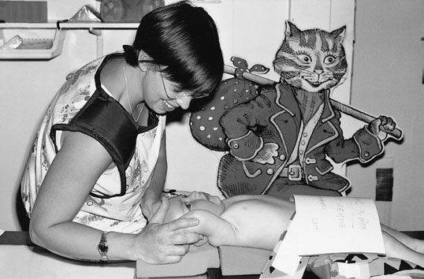
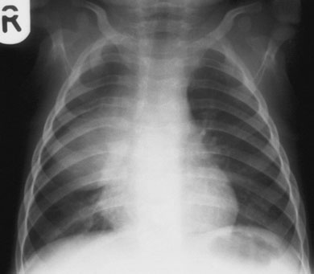
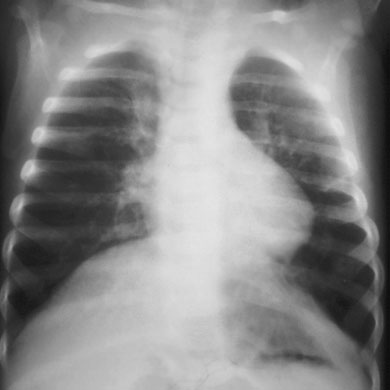

# Rx Torace Pediatric (Post-Neonatal) Antero-Posterior (AP) - Decubit Dorsal

  📷 Radiografie Convențională (Rx)
  <strong>Actualizat:</strong> 2026-09-16
  <strong>Autor:</strong> Departamentul de Radiologie / Referință Clark (Ed. 12)

---

-   __1. Rezumat Clinic & Indicații__

    ---

    === "Indicații Clinice"

        - Special attention este required when imaging baby’s chest. cu toracele being conical în shape, positioning baby Decubit dorsal cu back against casetă results în Lordotică incidență, cu clavicles projected above Vârfuri Pulmonare (Apexuri) și large part de lower lobes superimposed pe abdomenul. Cord și Siluetă Cardiovasculară also appears foreshortened. în correct incidență, anterior rib ends will fie projected inferiorly la posterior rib ends, și clavicles will fie seen superimposed pe lung Vârfuri Pulmonare (Apexuri). This poate fie accomplished either prin leaning baby forward sau prin angling X-ray tube caudally, sau ambele. incidență este often performed ca part de mobile X-ray examination pe children de toate ages. casetă size este selected depending pe size de child.

    === "Ghid Național IRIS"

        !!! info "Referință Primară: Ghidul Național IRIS (Ordinul MS 1342/2012)"
            - **Capitol Ghid IRIS:** *Ghidul Național IRIS*
            - **Grad de Recomandare:** **De verificat pe indicație; fără grad atribuit automat**
            - **Nivel de Iradiere Estimată:** `De verificat pentru examinarea și populația selectate`

            [:octicons-search-16: Deschide Ghidul IRIS](../../iris.md){ .md-button .md-button--primary } [:material-open-in-new: Aplicația Oficială PWA](https://radiologie-pediatrica.ro/iris/){ .md-button target="_blank" rel="noopener" }
-   __2. Poziționare & Centrare Fascicul__

    ---

    - **Poziție Pacient:** • child este poziționat Decubit dorsal pe casetă, cu upper edge poziționat above lung Vârfuri Pulmonare (Apexuri).
• When examining baby, a 15-grade foam pad este poziționat între Torace și caseta (thick end under upper Torace) la avoid Lordotică incidență. small foam pad este also plasat under child’s cap pentru comfort.
• planul mediosagital este ajustat la drept-angles la middle de caseta. la avoid rotație, capul, chest și Bazin (bazin (pelvis)) sunt straight.
• child’s brațe sunt held, cu coate flectat, pe fiecare side de capul.
• suitable appliance, e.g. Bucky band sau Velcro band, este secured over baby’s Abdomen și săculeți cu nisip sunt plasat next la thighs la prevent rotație.
    - **Punct de Centrare Fascicul:** • vertical central fascicul este orientat la drept-angles la middle de caseta la nivelul T8 (mid-Stern).
• pentru babies cu very hyperinflated barrel chest (due la bronchiolitis sau asthma), tubul este also înclinat five la 10 grade caudally la avoid Lordotică incidență.
    - **Distanță Focar-Film (DFF / SID):** 100 cm
    - **Comandă Respiratorie:** Apnee pe durata expunerii (apnee în inspir pentru torace; expir pentru Abdomen/bazin).

-   __3. Parametri Tehnici Expunere__

    ---

    | Parametru Tehnic | Valoare Configurare Generator / Tub |
    |:-----------------|:-------------------------------------|
    | **Tensiune Tub (kV)** | DE CONFIGURAT PE APARAT |
    | **Sarcină / Produs Curent-Timp (mAs)** | Conform AEC / grosime anatomică |
    | **Distanță Focar-Film (DFF / SID)** | 100 cm |
    | **Grilă Antidifuzoare (Bucky)** | Cu grilă antidifuzoare Bucky |
    | **Dimensiune Focar** | Focar Mic (0.6 mm) |
    | **Camere de Ionizare AEC** | Camerele laterale (sau camera centrală funcție de regiune) |
    | **Colimare Fascicul** | Colimare strictă la aria anatomică de interes diagnostic |
    | **Filtrare Tub** | Totală ≥ 2.5 mm Al echivalent (conform Clark: 3.0 mm Al eq.) |

-   __4. Criterii de Calitate & Reușită Imagine__

    ---

    - Erori de evitat / remedii: Tilted, cu clavicles high above lung Vârfuri Pulmonare (Apexuri). This Lordotică incidență results în lower lobes de Torace (Câmpuri Pulmonare) being obscured prin cupole diafragmatice. pneumonie / infiltrate pulmonare și other lung pathology poate 396 fie missed. See poziție de pacient și casetă pentru how la correct this fault. pacient poziționat pentru Antero-posterior (AP) Decubit dorsal chest imagine de Antero-posterior (AP) Decubit dorsal chest cu large drept lobe de thymus R L Very Lordotică poziție de toracele due la pacientul having marked hyperinflation ca result de bronchiolitis. Clavicles sunt well above lung Vârfuri Pulmonare (Apexuri). cupole diafragmatice could obscure basal pneumonie / infiltrate pulmonare. Note that în correctly exposed radiografie, Torace (Câmpuri Pulmonare) sunt fully evidențiat cu anterior rib ends inferior la posterior ends. în incorrectly poziționat radiografie cu excessive lordosis de toracele, rib ends appear la fie pe same level sau poate fie above posterior Coaste (Grilaj Costal)

-   __5. Protecție Radiologică (ALARA)__

    ---

    - Ecranare gonadică cu șorț plumbat dacă gonadele sunt în apropierea fasciculului util (regula ALARA).
    - Colimare precisă la dimensiunea anatomică strict necesară pentru reducerea dozei și a radiației difuze.
    - Verificarea posibilității unei sarcini la pacientele de vârstă fertilă înainte de expunere.

!!! note "Observații Clinice & Tehnice"
    • Care trebuie să fie taken nu la have lung Vârfuri Pulmonare (Apexuri) being obscured prin bărbia.
• Lead-rubber coverage de abdomenul în immediate proximity la fascicul este recommended.

### 🖼️ Imagini

<figure class="protocol-image-card" markdown>

<figcaption><strong>correctly exposed radiografie, Torace (Câmpuri Pulmonare) sunt fully evidențiat cu the</strong> — Poziționare pacient și centrare fascicul conform Clark (Ed. 12)</figcaption>

</figure>

<figure class="protocol-image-card" markdown>

<figcaption><strong>radiografie cu excessive lordosis de toracele, rib ends appear la</strong> — Aspect radiografic / ghid de poziționare conform tratatului Clark (Ed. 12)</figcaption>

</figure>

<figure class="protocol-image-card" markdown>

<figcaption><strong>Figura 3: Aspect radiografic / Poziționare (Clark Ed. 12)</strong> — Aspect radiografic / ghid de poziționare conform tratatului Clark (Ed. 12)</figcaption>

</figure>

=== "Ghid Rapid de Execuție"

    1. **Identificarea și verificarea pacientului:** verificare identitate, zonă de examinat, consimțământ conform procedurii și evaluarea posibilității unei sarcini, când este relevantă.
    2. **Pregătire:** îndepărtarea oricăror obiecte radiopace (bijuterii, agrafe, fermoare, proteze, pansamente dense).
    3. **Poziționare precisă:** alinierea receptorului de imagine și a tubului la distanța prescrisă (100 cm).
    4. **Colimare strictă:** adaptarea fasciculului strict la regiunea de diagnostic pentru scăderea iradierii și reducerea radiației difuze.
    5. **Radioprotecție:** verificarea [politicii RX](../radioprotectie.md), cu măsuri distincte pentru pacient, personal și însoțitor.

## Surse de documentare

- [Clark's Positioning in Radiography (Ed. 12), Pagina 411](../../assets/protocols/sources/Clark___Positioning_in_Radiography__12th_edition.pdf#page=411)
