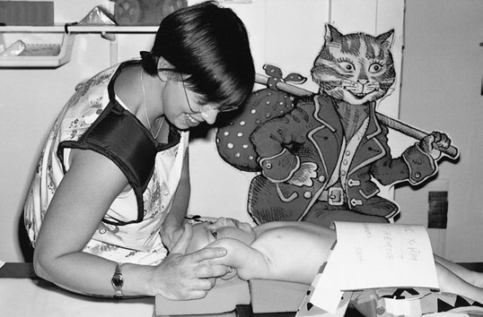
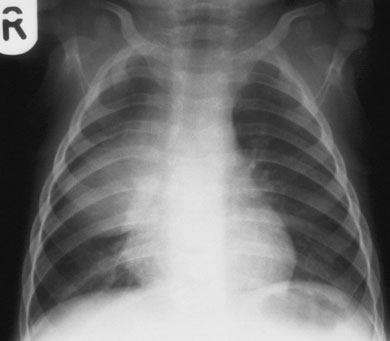
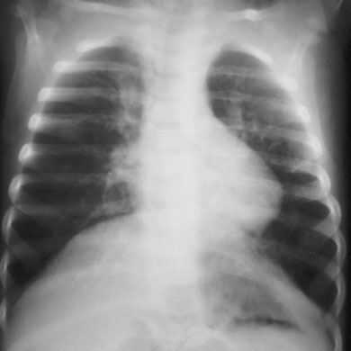

# Rx torace pediatric (post-neonatal) anteroposterior (AP) – decubit dorsal

  📷 Radiografie Convențională (Rx)
  <strong>Actualizat:</strong> 2026-09-16
  <strong>Autor:</strong> Departamentul de Radiologie / Referință Clark (Ed. 12)

---

-   __1. Rezumat Clinic & Indicații__

    ---

    === "Indicații Clinice"

        - Este necesară o atenție specială la efectuarea imagisticii toracelui sugarului. Deoarece toracele are formă conică, poziționarea sugarului în decubit dorsal, cu spatele sprijinit pe casetă, determină o incidență lordotică, cu claviculele proiectate deasupra vârfurilor pulmonare și cu o mare parte a lobilor inferiori suprapusă peste abdomen. Cordul și silueta cardiovasculară apar, de asemenea, scurtate. În incidența corectă, extremitățile anterioare ale coastelor vor fi proiectate inferior față de extremitățile posterioare, iar claviculele vor fi vizibile suprapuse peste vârfurile pulmonare. Acest lucru poate fi realizat fie prin aplecarea sugarului înainte, fie prin înclinarea caudală a tubului radiogen, fie prin ambele metode. Incidența este efectuată frecvent ca parte a examinării radiografice mobile la copii de toate vârstele. Dimensiunea casetei este selectată în funcție de dimensiunea copilului.

    === "Ghid Național IRIS"

        !!! info "Referință Primară: Ghidul Național IRIS (Ordinul MS 1342/2012)"
            - **Capitol Ghid IRIS:** *Pediatrie — Torace, pulmon, cord*
            - **Grad de Recomandare:** **Grad A**
            - **Nivel de Iradiere Estimată:** `Clasa 1 (Minimă < 0.02 mSv)`

            [:octicons-search-16: Deschide Ghidul IRIS](../../iris.md){ .md-button .md-button--primary } [:material-open-in-new: Aplicația Oficială PWA](https://radiologie-pediatrica.ro/iris/){ .md-button target="_blank" rel="noopener" }

-   __2. Poziționare & Centrare Fascicul__

    ---

    - **Poziție Pacient:**
        - copilul este poziționat în decubit dorsal pe casetă, cu marginea superioară poziționată deasupra vârfurilor pulmonare.
        - La examinarea sugarului, un suport din spumă de 15 grade este poziționat între torace și casetă (capătul gros sub toracele superior) pentru a evita incidența lordotică. Un suport mic din spumă este, de asemenea, plasat sub capul copilului pentru confort.
        - planul mediosagital este ajustat perpendicular pe mijlocul casetei. Pentru a evita rotația, capul, toracele și bazinul sunt menținute drepte.
        - brațele copilului sunt ținute, cu coatele flectate, de fiecare parte a capului.
        - un dispozitiv adecvat, de exemplu o bandă Bucky sau o bandă Velcro, este fixat peste abdomenul sugarului, iar săculeții cu nisip sunt plasați lângă coapse pentru a preveni rotația.
    - **Punct de Centrare Fascicul:**
        - fasciculul central vertical este orientat la unghi drept față de mijlocul casetei, la nivelul T8 (mijlocul sternului).
        - Pentru sugarii cu torace în butoi foarte hiperinsuflat (din cauza bronșiolitei sau astmului), tubul este, de asemenea, înclinat cu five până la 10 grade caudal pentru a evita incidența lordotică.
    - **Distanță Focar-Film (DFF / SID):** 100 cm
    - **Comandă Respiratorie:** Apnee pe durata expunerii (apnee în inspir pentru torace; expir pentru Abdomen/bazin).

-   __3. Parametri Tehnici Expunere__

    ---

    | Parametru Tehnic | Valoare Configurare Generator / Tub |
    |:-----------------|:-------------------------------------|
    | **Tensiune Tub (kV)** | DE CONFIGURAT PE APARAT |
    | **Sarcină / Produs Curent-Timp (mAs)** | Conform AEC / grosimii anatomice |
    | **Distanță Focar-Film (DFF / SID)** | 100 cm |
    | **Grilă Antidifuzoare (Bucky)** | Cu grilă antidifuzoare Bucky |
    | **Dimensiune Focar** | Focar Mic (0.6 mm) |
    | **Camere de Ionizare AEC** | Camerele laterale (sau camera centrală, în funcție de regiune) |
    | **Colimare Fascicul** | Colimare strictă la aria anatomică de interes diagnostic |
    | **Filtrare Tub** | Totală ≥ 2.5 mm Al echivalent (conform Clark: 3.0 mm Al echivalent) |

-   __4. Criterii de Calitate & Reușită Imagine__

    ---

    - Erori de evitat / remedii: înclinare, cu claviculele situate mult deasupra vârfurilor pulmonare (apexurilor). Această incidență lordotică face ca lobii inferiori pulmonari să fie mascați de cupolele diafragmatice. Pneumonia / infiltratele pulmonare și alte afecțiuni pulmonare pot trece neobservate. 396 Consultați poziționarea pacientului și a casetei pentru corectarea acestei erori. Pacient poziționat pentru radiografia toracică antero-posterioară (AP) în decubit dorsal. Imagine toracică antero-posterioară (AP) în decubit dorsal, cu lobul drept al timusului mărit. R L Poziție foarte lordotică a toracelui, datorată hiperinflației marcate a pacientului ca urmare a bronșiolitei. Claviculele sunt situate mult deasupra vârfurilor pulmonare (apexurilor). Cupolele diafragmatice ar putea masca pneumonia / infiltratele pulmonare bazale. Observați că, pe radiografia expusă corect, câmpurile pulmonare sunt evidențiate în întregime, cu extremitățile costale anterioare situate inferior față de cele posterioare. Pe radiografia cu poziționare incorectă și lordoză toracică excesivă, extremitățile costale par să fie la același nivel sau pot fi situate deasupra coastelor posterioare (grilajului costal).

-   __5. Protecție Radiologică (ALARA)__

    ---

    - Ecranare gonadică cu șorț plumbat dacă gonadele sunt în apropierea fasciculului util (regula ALARA).
    - Colimare precisă la dimensiunea anatomică strict necesară pentru reducerea dozei și a radiației difuze.
    - Verificarea posibilității unei sarcini la pacientele de vârstă fertilă înainte de expunere.

!!! note "Observații Clinice & Tehnice"
    - Trebuie avut grijă ca vârfurile pulmonare să nu fie mascate de bărbie.
    - Se recomandă acoperirea cu cauciuc plumbat a abdomenului aflat în imediata proximitate a fasciculului.

### 🖼️ Imagini

<figure class="protocol-image-card" markdown>

<figcaption><strong>radiografie expusă corect, câmpurile pulmonare sunt evidențiate complet cu</strong> — Poziționarea pacientului și centrarea fasciculului conform Clark (Ed. 12)</figcaption>

</figure>

<figure class="protocol-image-card" markdown>

<figcaption><strong>radiografie cu lordoză toracică excesivă, extremitățile coastelor apar la</strong> — Aspect radiografic / ghid de poziționare conform tratatului Clark (Ed. 12)</figcaption>

</figure>

<figure class="protocol-image-card" markdown>

<figcaption><strong>Figura 3: Aspect radiografic / Poziționare (Clark Ed. 12)</strong> — Aspect radiografic / ghid de poziționare conform tratatului Clark (Ed. 12)</figcaption>

</figure>

=== "Ghid Rapid de Execuție"

    1. **Identificarea și verificarea pacientului:** verificare identitate, zonă de examinat, consimțământ conform procedurii și evaluarea posibilității unei sarcini, când este relevantă.
    2. **Pregătire:** îndepărtarea oricăror obiecte radiopace (bijuterii, agrafe, fermoare, proteze, pansamente dense).
    3. **Poziționare precisă:** alinierea receptorului de imagine și a tubului la distanța prescrisă (100 cm).
    4. **Colimare strictă:** adaptarea fasciculului strict la regiunea de diagnostic pentru scăderea iradierii și reducerea radiației difuze.
    5. **Radioprotecție:** verificarea [politicii RX](../radioprotectie.md), cu măsuri distincte pentru pacient, personal și însoțitor.

## Surse de documentare

- [Clark's Positioning in Radiography (Ed. 12), Pagina 411](https://books.google.com/books/about/Clark_s_Positioning_in_Radiography.html?id=Xxu6MwEACAAJ)
