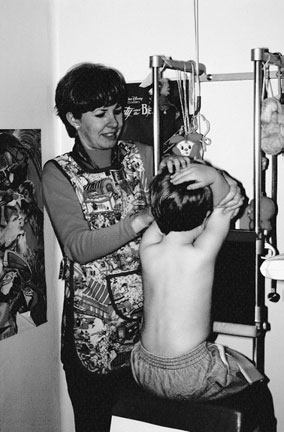
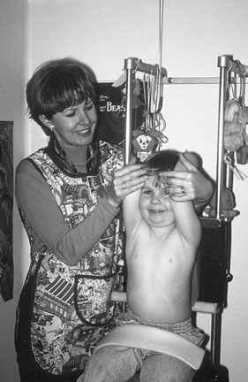
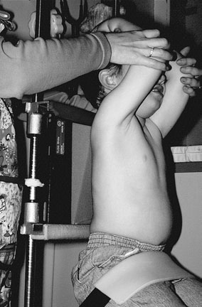
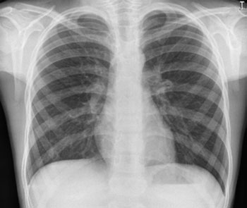
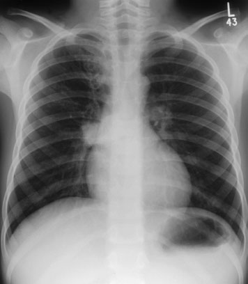
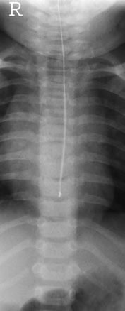

# Rx Torace Pediatric (Post-Neonatal) Postero-Anterior (PA) - Ortostatism

  📷 Radiografie Convențională (Rx)
  <strong>Actualizat:</strong> 2026-09-16
  <strong>Autor:</strong> Departamentul de Radiologie / Referință Clark (Ed. 12)

---

-   __1. Rezumat Clinic & Indicații__

    ---

    === "Indicații Clinice"

        - Chest radiografii sunt nu required routinely pentru simple chest proces infecțios / inflamators, și follow-up chest imagini sunt nu required routinely if there has been good response la treatment, unless initial chest imagine showed lobar pneumonie / infiltrate pulmonare, extensive sublobar pneumonie / infiltrate pulmonare involving several segments, pneumatocoeles, adenopathy sau revărsat pleural (pleurezie).
        - Follow-up radiografii, where indicated, trebuie să nu fie taken în less than three weeks, ca radiological resolution lags behind clinical resolution. Repeat imagini sunt required earlier if there este orice deterioration. Prompt follow-up chest radiografie este required following physiotherapy și antibiotics pentru areas de collapse. R L Coned Antero-posterior (AP) Decubit dorsal chest X-ray la show poziție de pH probe which trebuie să fie la nivelul T7/T8 imagine de normal Postero-anterior (PA) Ortostatism chest imagine de Postero-anterior (PA) Ortostatism chest evidențiind dense drept hilum și RUL bronchiectasis în pacient cu TB

    === "Ghid Național IRIS"

        !!! info "Referință Primară: Ghidul Național IRIS (Ordinul MS 1342/2012)"
            - **Capitol Ghid IRIS:** *Ghidul Național IRIS*
            - **Grad de Recomandare:** **De verificat pe indicație; fără grad atribuit automat**
            - **Nivel de Iradiere Estimată:** `De verificat pentru examinarea și populația selectate`

            [:octicons-search-16: Deschide Ghidul IRIS](../../iris.md){ .md-button .md-button--primary } [:material-open-in-new: Aplicația Oficială PWA](https://radiologie-pediatrica.ro/iris/){ .md-button target="_blank" rel="noopener" }
-   __2. Poziționare & Centrare Fascicul__

    ---

    - **Poziție Pacient:** • child este așezat pe scaun cu their back sprijinit pe casetă, which este sprijinit vertically, cu upper edge de caseta above lung Vârfuri Pulmonare (Apexuri).
• brațele trebuie să fie raised gently, bringing coate forward. brațele trebuie să nu fie extins fully.
• parent sau carer trebuie să hold flectat coate și cap together cu their Degete Mână pe forehead, la prevent child’s chin de la obscuring upper chest.
• holder trebuie să pull gently upwards la prevent child de la slumping forward.
• Place a 15-grade foam wedge behind umerii la prevent child de la adopting Lordotică poziție.
    - **Punct de Centrare Fascicul:** • orizontal central fascicul este înclinat five la ten grade caudally la middle de caseta la nivelul eighth thoracic vertebra, approximately la midpoint de corp de Stern. This este particularly important în children cu hyperinflated chests due la diseases such ca bronchiolitis, which predisposes la Lordotică incidențe.
• câmp de iradiere este collimated la caseta, thus avoiding expunere de eyes, thyroid și etajul abdominal superior.
    - **Distanță Focar-Film (DFF / SID):** 100 cm
    - **Comandă Respiratorie:** Apnee pe durata expunerii (apnee în inspir pentru torace; expir pentru Abdomen/bazin).

-   __3. Parametri Tehnici Expunere__

    ---

    | Parametru Tehnic | Valoare Configurare Generator / Tub |
    |:-----------------|:-------------------------------------|
    | **Tensiune Tub (kV)** | DE CONFIGURAT PE APARAT |
    | **Sarcină / Produs Curent-Timp (mAs)** | Conform AEC / grosime anatomică |
    | **Distanță Focar-Film (DFF / SID)** | 100 cm |
    | **Grilă Antidifuzoare (Bucky)** | Conform grosimii anatomice (> 10-12 cm cu grilă) |
    | **Dimensiune Focar** | Focar Mic (0.6 mm) |
    | **Camere de Ionizare AEC** | DE CONFIGURAT PE APARAT |
    | **Colimare Fascicul** | Colimare strictă la aria anatomică de interes diagnostic |
    | **Filtrare Tub** | Totală ≥ 2.5 mm Al echivalent (conform Clark: 3.0 mm Al eq.) |

-   __4. Criterii de Calitate & Reușită Imagine__

    ---

    - Antero-posterior (AP)/Postero-anterior (PA) incidență:
    - Peak inspiration (six anterior Coaste (Grilaj Costal) (Postero-anterior (PA), 5/6 pentru Antero-posterior (AP)) și nine posterior Coaste (Grilaj Costal) above cupole diafragmatice).
    - Whole chest de la just above lung Vârfuri Pulmonare (Apexuri) pentru include cupole diafragmatice și Coaste (Grilaj Costal).
    - Absența rotației anatomice (simetrie bilaterală perfectă) (medial ends de clavicles sau first Coaste (Grilaj Costal) trebuie să fie echidistant față de coloană vertebrală).
    - fără tilting (clavicles trebuie să overlie lung Vârfuri Pulmonare (Apexuri)). anterior Coaste (Grilaj Costal) trebuie să point downwards.
    - Reproduction de vascular pattern în central two-thirds de Torace (Câmpuri Pulmonare).
    - Reproduction de trachea și proximal bronchi.
    - Visually reproducere netă contururilor de cupole diafragmatice și sinusuri costodiafragmatice.
    - Reproduction de coloană vertebrală și paraspinal structures și visualization de retrocardiac lung și mediastinum.
    - Erori de evitat / remedii: Incorrect densitate optică – needs radiographer experience în assessing size de child și careful expunere charts.
    - Erori de evitat / remedii: Torace tilted backwards (Antero-posterior (AP) incidență), cu clavicles vizualizat high above lung Vârfuri Pulmonare (Apexuri). This Lordotică incidență results în lower lobes de Torace (Câmpuri Pulmonare) being obscured prin cupole diafragmatice. pneumonie / infiltrate pulmonare și other lung pathology poate fie missed. See poziție de pacient și casetă pentru how la correct this fault.
    - Erori de evitat / remedii: Holder’s mâini pe umerii – avoid prin following technique ca described.

-   __5. Protecție Radiologică (ALARA)__

    ---

    - Ecranare gonadică cu șorț plumbat dacă gonadele sunt în apropierea fasciculului util (regula ALARA).
    - Colimare precisă la dimensiunea anatomică strict necesară pentru reducerea dozei și a radiației difuze.
    - Verificarea posibilității unei sarcini la pacientele de vârstă fertilă înainte de expunere.

!!! note "Observații Clinice & Tehnice"
    Pregătirea pacientului prin îndepărtarea tuturor accesoriilor radio-opace.

### 🖼️ Imagini

<figure class="protocol-image-card" markdown>

<figcaption><strong>key la Ortostatism chest radiografie este specifically designed paedi-</strong> — Poziționare pacient și centrare fascicul conform Clark (Ed. 12)</figcaption>

</figure>

<figure class="protocol-image-card" markdown>

<figcaption><strong>poziție de child pentru Postero-anterior (PA) Ortostatism chest radiografie</strong> — Aspect radiografic / ghid de poziționare conform tratatului Clark (Ed. 12)</figcaption>

</figure>

<figure class="protocol-image-card" markdown>

<figcaption><strong>poziție de child pentru Antero-posterior (AP) chest radiografie</strong> — Aspect radiografic / ghid de poziționare conform tratatului Clark (Ed. 12)</figcaption>

</figure>

<figure class="protocol-image-card" markdown>

<figcaption><strong>• Correct interpretation de paediatric chest radiografii requires</strong> — Aspect radiografic / ghid de poziționare conform tratatului Clark (Ed. 12)</figcaption>

</figure>

<figure class="protocol-image-card" markdown>

<figcaption><strong>tilting. radiographer trebuie să watch child’s chest/</strong> — Aspect radiografic / ghid de poziționare conform tratatului Clark (Ed. 12)</figcaption>

</figure>

<figure class="protocol-image-card" markdown>

<figcaption><strong>• Incorrect densitate optică – needs radiographer experience în assess-</strong> — Aspect radiografic / ghid de poziționare conform tratatului Clark (Ed. 12)</figcaption>

</figure>

=== "Ghid Rapid de Execuție"

    1. **Identificarea și verificarea pacientului:** verificare identitate, zonă de examinat, consimțământ conform procedurii și evaluarea posibilității unei sarcini, când este relevantă.
    2. **Pregătire:** îndepărtarea oricăror obiecte radiopace (bijuterii, agrafe, fermoare, proteze, pansamente dense).
    3. **Poziționare precisă:** alinierea receptorului de imagine și a tubului la distanța prescrisă (100 cm).
    4. **Colimare strictă:** adaptarea fasciculului strict la regiunea de diagnostic pentru scăderea iradierii și reducerea radiației difuze.
    5. **Radioprotecție:** verificarea [politicii RX](../radioprotectie.md), cu măsuri distincte pentru pacient, personal și însoțitor.

## Surse de documentare

- [Clark's Positioning in Radiography (Ed. 12), Pagina 409](../../assets/protocols/sources/Clark___Positioning_in_Radiography__12th_edition.pdf#page=409)
