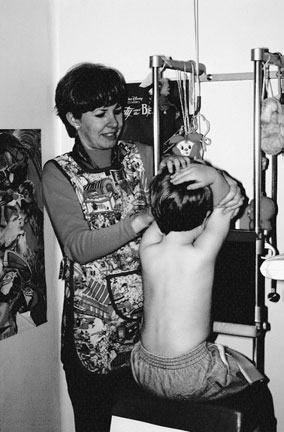
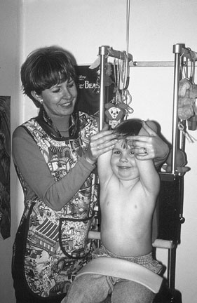
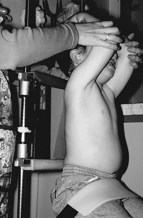
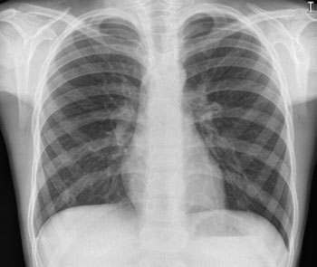
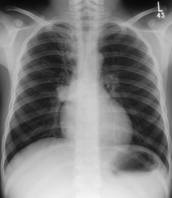
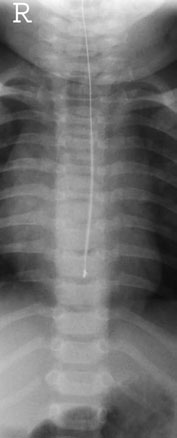

# Rx torace pediatric (post-neonatal) postero-anterior (PA) – ortostatism

  📷 Radiografie Convențională (Rx)
  <strong>Actualizat:</strong> 2026-09-16
  <strong>Autor:</strong> Departamentul de Radiologie / Referință Clark (Ed. 12)

---

-   __1. Rezumat Clinic & Indicații__

    ---

    === "Indicații Clinice"

        - Radiografiile toracice nu sunt necesare de rutină pentru procesele infecțioase/inflamatorii toracice simple, iar imaginile toracice de control nu sunt necesare de rutină dacă a existat un răspuns bun la tratament, cu excepția cazurilor în care imaginea toracică inițială a evidențiat pneumonie/infiltrate lobare, pneumonie/infiltrate sublobare extinse care implică mai multe segmente, pneumatoceluri, adenopatie sau revărsat pleural (pleurezie).
        - Radiografiile de control, atunci când sunt indicate, nu trebuie efectuate la mai puțin de three săptămâni, deoarece rezoluția radiologică rămâne în urma rezoluției clinice. Repetarea imaginilor este necesară mai devreme dacă apare orice deteriorare. Radiografia toracică de control promptă este necesară după fizioterapie și antibiotice pentru zonele de colaps. R L Radiografie toracică conică anteroposterioară (AP), în decubit dorsal, care arată poziția sondei pH, ce trebuie să fie la nivelul T7/T8. Imagine toracică normală posteroanterioară (PA), în ortostatism. Imagine toracică posteroanterioară (PA), în ortostatism, evidențiind hilul drept dens și bronșiectazii în lobul superior drept (RUL) la un pacient cu TB

    === "Ghid Național IRIS"

        !!! info "Referință Primară: Ghidul Național IRIS (Ordinul MS 1342/2012)"
            - **Capitol Ghid IRIS:** *Pediatrie — Torace, pulmon, cord*
            - **Grad de Recomandare:** **Grad A**
            - **Nivel de Iradiere Estimată:** `Clasa 1 (Minimă < 0.02 mSv)`

            [:octicons-search-16: Deschide Ghidul IRIS](../../iris.md){ .md-button .md-button--primary } [:material-open-in-new: Aplicația Oficială PWA](https://radiologie-pediatrica.ro/iris/){ .md-button target="_blank" rel="noopener" }

-   __2. Poziționare & Centrare Fascicul__

    ---

    - **Poziție Pacient:**
        - copilul este așezat pe scaun, cu spatele sprijinit pe casetă, care este susținută vertical, cu marginea superioară a casetei deasupra vârfurilor pulmonare.
        - brațele trebuie ridicate ușor, aducând coatele înainte. Brațele nu trebuie extinse complet.
        - părintele sau însoțitorul trebuie să țină coatele flectate și capul împreună cu degetele mâinii pe frunte, pentru a preveni acoperirea toracelui superior de către bărbia copilului.
        - persoana care ține copilul trebuie să tragă ușor în sus pentru a preveni aplecarea copilului înainte.
        - Plasați o pană de spumă de 15 grade în spatele umerilor pentru a preveni adoptarea unei poziții lordotice.
    - **Punct de Centrare Fascicul:**
        - fasciculul central orizontal este înclinat cu five până la ten grade caudal spre mijlocul casetei, la nivelul celei de-a eighth vertebre toracice, aproximativ la mijlocul corpului sternului. Acest lucru este deosebit de important la copiii cu torace hiperinsuflat din cauza unor boli precum bronșiolita, care predispun la incidențe lordotice.
        - câmpul de iradiere este colimat la dimensiunea casetei, evitând astfel expunerea ochilor, tiroidei și etajului abdominal superior.
    - **Distanță Focar-Film (DFF / SID):** 100 cm
    - **Comandă Respiratorie:** Apnee pe durata expunerii (apnee în inspir pentru torace; expir pentru Abdomen/bazin).

-   __3. Parametri Tehnici Expunere__

    ---

    | Parametru Tehnic | Valoare Configurare Generator / Tub |
    |:-----------------|:-------------------------------------|
    | **Tensiune Tub (kV)** | DE CONFIGURAT PE APARAT |
    | **Sarcină / Produs Curent-Timp (mAs)** | Conform AEC / grosimii anatomice |
    | **Distanță Focar-Film (DFF / SID)** | 100 cm |
    | **Grilă Antidifuzoare (Bucky)** | Conform grosimii anatomice (> 10-12 cm cu grilă) |
    | **Dimensiune Focar** | Focar Mic (0.6 mm) |
    | **Camere de Ionizare AEC** | DE CONFIGURAT PE APARAT |
    | **Colimare Fascicul** | Colimare strictă la aria anatomică de interes diagnostic |
    | **Filtrare Tub** | Totală ≥ 2.5 mm Al echivalent (conform Clark: 3.0 mm Al echivalent) |

-   __4. Criterii de Calitate & Reușită Imagine__

    ---

    - Incidență anteroposterioară (AP)/posteroanterioară (PA):
    - Inspir maxim (six coaste anterioare (posteroanterioră (PA), 5/6 pentru anteroposterioară (AP)) și nine coaste posterioare deasupra cupolelor diafragmatice).
    - Întregul torace, de la imediat deasupra vârfurilor pulmonare, pentru a include cupolele diafragmatice și coastele.
    - Absența rotației anatomice (simetrie bilaterală perfectă) (extremitățile mediale ale claviculelor sau primele coaste trebuie să fie echidistante față de coloana vertebrală).
    - fără înclinare (claviculele trebuie să se proiecteze peste vârfurile pulmonare). Coastele anterioare trebuie să fie orientate în jos.
    - Reproducerea desenului vascular în cele două treimi centrale ale toracelui.
    - Reproducerea traheei și a bronhiilor proximale.
    - Reproducerea vizuală clară a contururilor cupolelor diafragmatice și sinusurilor costodiafragmatice.
    - Reproducerea coloanei vertebrale și a structurilor paraspinale și vizualizarea plămânului retrocardiac și a mediastinului.
    - Erori de evitat / remedii: Densitate optică incorectă – este necesară experiența radiografului în evaluarea dimensiunii copilului și utilizarea atentă a diagramelor de expunere.
    - Erori de evitat / remedii: Torace înclinat posterior (incidență antero-posterioară (AP)), cu claviculele vizualizate mult deasupra vârfurilor pulmonare (apexurilor). Această incidență lordotică are ca rezultat obscurarea lobilor inferiori ai toracelui (câmpurilor pulmonare) de către cupolele diafragmatice. Pneumonia / infiltratele pulmonare și alte afecțiuni pulmonare pot fi omise. Consultați poziția pacientului și caseta pentru modul de corectare a acestui defect.
    - Erori de evitat / remedii: Mâinile însoțitorului pe umerii copilului – evitați acest lucru urmând tehnica descrisă.

-   __5. Protecție Radiologică (ALARA)__

    ---

    - Ecranare gonadică cu șorț plumbat dacă gonadele sunt în apropierea fasciculului util (regula ALARA).
    - Colimare precisă la dimensiunea anatomică strict necesară pentru reducerea dozei și a radiației difuze.
    - Verificarea posibilității unei sarcini la pacientele de vârstă fertilă înainte de expunere.

!!! note "Observații Clinice & Tehnice"
    Pregătirea pacientului prin îndepărtarea tuturor accesoriilor radio-opace.

### 🖼️ Imagini

<figure class="protocol-image-card" markdown>

<figcaption><strong>Elementele-cheie ale radiografiei toracice în ortostatism sunt concepute special pentru copii</strong> — Poziționarea pacientului și centrarea fasciculului conform Clark (Ed. 12)</figcaption>

</figure>

<figure class="protocol-image-card" markdown>

<figcaption><strong>Poziția copilului pentru radiografia toracică postero-anterioară (PA) în ortostatism</strong> — Aspect radiografic / ghid de poziționare conform tratatului Clark (Ed. 12)</figcaption>

</figure>

<figure class="protocol-image-card" markdown>

<figcaption><strong>Poziția copilului pentru radiografia toracică antero-posterioară (AP)</strong> — Aspect radiografic / ghid de poziționare conform tratatului Clark (Ed. 12)</figcaption>

</figure>

<figure class="protocol-image-card" markdown>

<figcaption><strong>• Interpretarea corectă a radiografiilor toracice pediatrice necesită</strong> — Aspect radiografic / ghid de poziționare conform tratatului Clark (Ed. 12)</figcaption>

</figure>

<figure class="protocol-image-card" markdown>

<figcaption><strong>Înclinare. Radiograful trebuie să urmărească toracele copilului/</strong> — Aspect radiografic / ghid de poziționare conform tratatului Clark (Ed. 12)</figcaption>

</figure>

<figure class="protocol-image-card" markdown>

<figcaption><strong>• Densitate optică incorectă – este necesară experiența radiografului în evaluarea</strong> — Aspect radiografic / ghid de poziționare conform tratatului Clark (Ed. 12)</figcaption>

</figure>

=== "Ghid Rapid de Execuție"

    1. **Identificarea și verificarea pacientului:** verificare identitate, zonă de examinat, consimțământ conform procedurii și evaluarea posibilității unei sarcini, când este relevantă.
    2. **Pregătire:** îndepărtarea oricăror obiecte radiopace (bijuterii, agrafe, fermoare, proteze, pansamente dense).
    3. **Poziționare precisă:** alinierea receptorului de imagine și a tubului la distanța prescrisă (100 cm).
    4. **Colimare strictă:** adaptarea fasciculului strict la regiunea de diagnostic pentru scăderea iradierii și reducerea radiației difuze.
    5. **Radioprotecție:** verificarea [politicii RX](../radioprotectie.md), cu măsuri distincte pentru pacient, personal și însoțitor.

## Surse de documentare

- [Clark's Positioning in Radiography (Ed. 12), Pagina 409](https://books.google.com/books/about/Clark_s_Positioning_in_Radiography.html?id=Xxu6MwEACAAJ)
