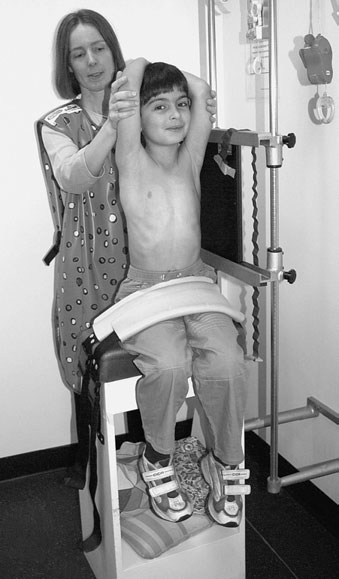
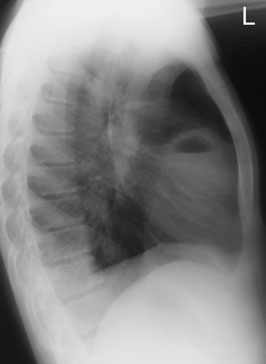
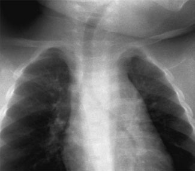
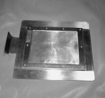

# Rx Torace Pediatric (Post-Neonatal) Profil (Lateral)

  📷 Radiografie Convențională (Rx)
  <strong>Actualizat:</strong> 2026-09-16
  <strong>Autor:</strong> Departamentul de Radiologie / Referință Clark (Ed. 12)

---

-   __1. Rezumat Clinic & Indicații__

    ---

    === "Indicații Clinice"

        - 397 14 Chest – post-neonatal Profil (lateral) This incidență suplimentară este undertaken la locate poziție de inhaled sau swallowed corp străin radiopac, la evaluate middle lobe pathology sau la localize opacities evidențiat pe Postero-anterior (PA)/Antero-posterior (AP) incidență. A 24  30-cm casetă este selected.

    === "Ghid Național IRIS"

        !!! info "Referință Primară: Ghidul Național IRIS (Ordinul MS 1342/2012)"
            - **Capitol Ghid IRIS:** *Ghidul Național IRIS*
            - **Grad de Recomandare:** **De verificat pe indicație; fără grad atribuit automat**
            - **Nivel de Iradiere Estimată:** `De verificat pentru examinarea și populația selectate`

            [:octicons-search-16: Deschide Ghidul IRIS](../../iris.md){ .md-button .md-button--primary } [:material-open-in-new: Aplicația Oficială PWA](https://radiologie-pediatrica.ro/iris/){ .md-button target="_blank" rel="noopener" }
-   __2. Poziționare & Centrare Fascicul__

    ---

    - **Poziție Pacient:** • pacientul este întors la bring side under investigation spre caseta. planul mediosagital este ajustat paralel cu casetă.
• outstretched brațe sunt raised above capul și sprijinit.
• mid-axillary line este coincident cu middle de caseta, și caseta este ajustat pentru include Vârfuri Pulmonare (Apexuri) și inferior lobes.
    - **Punct de Centrare Fascicul:** • Direct raza centrală verticală centrală la drept-angles la middle de caseta în mid-axillary line.
• expunere este made pe peak inspiration.
    - **Distanță Focar-Film (DFF / SID):** 100 cm
    - **Comandă Respiratorie:** expunere este made pe peak inspiration

-   __3. Parametri Tehnici Expunere__

    ---

    | Parametru Tehnic | Valoare Configurare Generator / Tub |
    |:-----------------|:-------------------------------------|
    | **Tensiune Tub (kV)** | 125-140 kV |
    | **Sarcină / Produs Curent-Timp (mAs)** | Conform AEC / grosime anatomică |
    | **Distanță Focar-Film (DFF / SID)** | 100 cm |
    | **Grilă Antidifuzoare (Bucky)** | Conform grosimii anatomice (> 10-12 cm cu grilă) |
    | **Dimensiune Focar** | Focar Mic (0.6 mm) |
    | **Camere de Ionizare AEC** | DE CONFIGURAT PE APARAT |
    | **Colimare Fascicul** | Colimare strictă adaptată pe receptor 24 x 30 cm |
    | **Filtrare Tub** | Totală ≥ 2.5 mm Al echivalent (conform Clark: 3.0 mm Al eq.) |

-   __4. Criterii de Calitate & Reușită Imagine__

    ---

    - Peak inspiration (six anterior Coaste (Grilaj Costal) above cupole diafragmatice).
    - Whole chest de la C7 la L1.
    - Stern și coloană vertebrală la fie included și la fie true Profil (lateral).
    - Visualization de whole trachea și major bronchi.
    - Visually reproducere netă contururilor de whole de ambele domes de cupole diafragmatice.
    - Reproduction de hilar vessels.
    - Reproduction de Stern și thoracic coloană vertebrală. Cincinnati filter device use de this filter device este employed în cases de suspected inhaled corp străin radiopac when Antero-posterior (AP) imagine de toracele este acquired cu child culcat Decubit dorsal. Cincinnati filter este composed de 2mm de aluminium, 0.5mm de copper și 0.4mm de tin inserted into collimator box astfel încât copper layer este spre -X-ray tube. expuneri used sunt în range de 125–140kVp și 10–16mAs, using casetă și grilă system. pe exposed radiografie, bone detail este effaced la considerable grade, allowing părți moi și air interfaces în mediastinum și adjacent lung la fie seen. trachea și proximal bronchial anatomy sunt evidențiat well. CT scout scanogram poate fie considered ca alternative. Careful handling este always advisable în children suspected la have inhaled corp străin radiopac, ca dislodgement poate result în total airway obstruction. R L Child poziție pentru Profil (lateral) incidență de toracele Profil (lateral) chest radiografie evidențiind pulmonary abscess și nivele hidroaerice Cincinnati filter device Coned imagine de Antero-posterior (AP) chest cu Cincinnati filter la show trachea și proximal bronchi

-   __5. Protecție Radiologică (ALARA)__

    ---

    - Ecranare gonadică cu șorț plumbat dacă gonadele sunt în apropierea fasciculului util (regula ALARA).
    - Colimare precisă la dimensiunea anatomică strict necesară pentru reducerea dozei și a radiației difuze.
    - Verificarea posibilității unei sarcini la pacientele de vârstă fertilă înainte de expunere.

!!! note "Observații Clinice & Tehnice"
    Pregătirea pacientului prin îndepărtarea tuturor accesoriilor radio-opace.

### 🖼️ Imagini

<figure class="protocol-image-card" markdown>

<figcaption><strong>pe exposed radiografie, bone detail este effaced la consid-</strong> — Poziționare pacient și centrare fascicul conform Clark (Ed. 12)</figcaption>

</figure>

<figure class="protocol-image-card" markdown>

<figcaption><strong>Profil (lateral) chest radiografie evidențiind pulmonary abscess și nivele hidroaerice</strong> — Aspect radiografic / ghid de poziționare conform tratatului Clark (Ed. 12)</figcaption>

</figure>

<figure class="protocol-image-card" markdown>

<figcaption><strong>Figura 3: Aspect radiografic / Poziționare (Clark Ed. 12)</strong> — Aspect radiografic / ghid de poziționare conform tratatului Clark (Ed. 12)</figcaption>

</figure>

<figure class="protocol-image-card" markdown>

<figcaption><strong>Figura 4: Aspect radiografic / Poziționare (Clark Ed. 12)</strong> — Aspect radiografic / ghid de poziționare conform tratatului Clark (Ed. 12)</figcaption>

</figure>

=== "Ghid Rapid de Execuție"

    1. **Identificarea și verificarea pacientului:** verificare identitate, zonă de examinat, consimțământ conform procedurii și evaluarea posibilității unei sarcini, când este relevantă.
    2. **Pregătire:** îndepărtarea oricăror obiecte radiopace (bijuterii, agrafe, fermoare, proteze, pansamente dense).
    3. **Poziționare precisă:** alinierea receptorului de imagine și a tubului la distanța prescrisă (100 cm).
    4. **Colimare strictă:** adaptarea fasciculului strict la regiunea de diagnostic pentru scăderea iradierii și reducerea radiației difuze.
    5. **Radioprotecție:** verificarea [politicii RX](../radioprotectie.md), cu măsuri distincte pentru pacient, personal și însoțitor.

## Surse de documentare

- [Clark's Positioning in Radiography (Ed. 12), Pagina 412](../../assets/protocols/sources/Clark___Positioning_in_Radiography__12th_edition.pdf#page=412)
